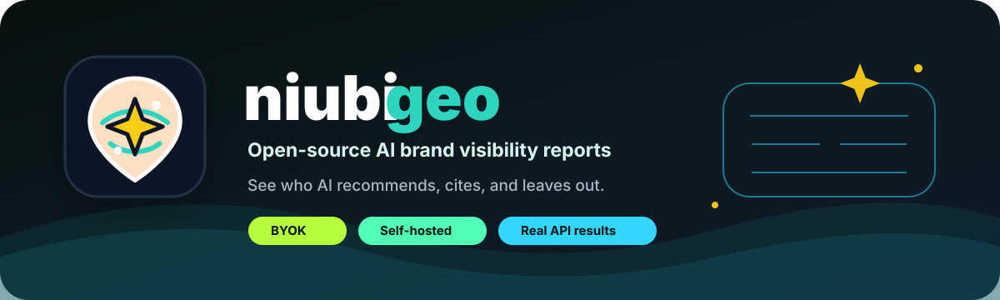
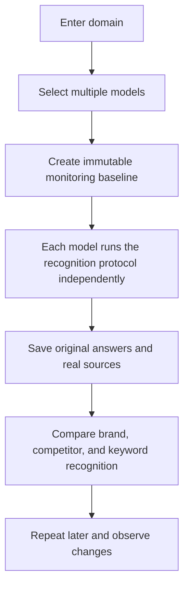

<div align="center">



# NiubiGEO Next

### Enter a domain and see which AIs recognize you, how they understand you, and who else they know.

**This is a preview of the next version, not the current stable documentation.**


[简体中文](./NEXT_PREVIEW.zh-CN.md) · [Current version](./README.md) · [GitHub Issues](https://github.com/Albert-Weasker/niubigeo/issues)

</div>

---

> [!IMPORTANT]
> This document describes the next version of NiubiGEO while it is still in development. The interface, data model, and some capabilities are not released yet, so do not treat this document as a description of the current stable version.

## Why rebuild?

The first Alpha version of NiubiGEO proved one thing: we can call real provider APIs, inspect brand mentions, competitors, and citation sources, and trace conclusions back to the original model answers.

But it still felt too much like an audit tool that first asks users to understand prompts and metrics:

- users need to know what to ask before they can start;
- the relationship between questions, models, and reports is not clear enough;
- results from multiple models can collapse into a complex combined report;
- projects, runs, and monitoring lifecycles are not independent enough;
- the page shows a lot of data, but does not immediately answer "which AIs know me?";
- static tables and charts lack process feedback, making the product feel heavy and passive.

We decided to return to the question users actually care about:

> **When an AI sees my domain, does it know who I am? What does it think I do? Which competitors does it think of?**

## Product definition

NiubiGEO Next is an open-source, self-hostable **AI domain-recognition monitoring tool**.

Users only need to:

1. Enter a domain.
2. Select one or more OpenRouter models.
3. Choose web access or no web access for each model.
4. Create a monitoring baseline.
5. Run it and review each model's independent result.

NiubiGEO uses a fixed, versioned domain-recognition protocol so each model can independently judge:

- whether it recognizes the domain;
- which brand the domain represents;
- what product or service the brand provides;
- which product category the brand belongs to;
- who the main competitors may be;
- which keywords are associated with the target brand;
- which keywords are associated with each competitor;
- which verifiable sources web-enabled models returned for those judgments;
- which details cannot be confirmed.

If a model does not know, NiubiGEO shows that it does not know. If different models disagree, their differences are preserved side by side. If a model provides no sources, NiubiGEO says there are no sources. A description is marked wrong only after user confirmation or external evidence verification.

NiubiGEO will not complete answers on behalf of the model, and it will not invent brands, competitors, keywords, or URLs to make a report look more complete.

## How it works



Each model has its own execution state, original answer, and result. If one model fails, it does not erase data already completed by other models.

```text
Project
├── Domain
├── Selected Models
├── Baselines
└── Runs
    ├── GPT Model Run
    ├── Claude Model Run
    ├── Gemini Model Run
    ├── Sonar Model Run
    └── Cross-model Comparison
```

## What one domain gives you

### 1. Which AIs recognize you

The first screen shows each model's judgment directly:

| Model | Domain recognition | Identified brand | Identified business | Sources |
|---|---|---|---|---|
| Model A | Recognized | Identified | Identified | View sources |
| Model B | Partially recognized | Identified | Incomplete | View evidence |
| Model C | Not recognized | - | - | No sources |
| Model D | Failed | - | - | View error |

`Failed` is not counted as `not recognized`, and `uncertain` is not forced into a negative result.

### 2. How AI understands your business

NiubiGEO shows each model's description side by side instead of merging them into a single "standard answer".

You can see:

- which models give similar product descriptions;
- which models only understand part of the business;
- which models give conflicting, suspicious, or possibly outdated descriptions;
- which capabilities are recognized by only some models.

### 3. Who AI thinks competes with you

Competitors are saved per model:

| Competitor | Model A | Model B | Model C | Model D |
|---|:---:|:---:|:---:|:---:|
| Competitor A | Recognized | Recognized | - | Recognized |
| Competitor B | - | Recognized | - | Recognized |
| Competitor C | Recognized | - | - | - |

This means "which models identified this as a competitor", not NiubiGEO making a subjective market-position judgment.

### 4. Which keywords connect to the brand and competitors

The target brand has its own keyword-recognition map, and each competitor has an independent view with the same structure.

| Keyword | Model A | Model B | Model C | Model D |
|---|:---:|:---:|:---:|:---:|
| Keyword A | Associated | - | Associated | Associated |
| Keyword B | - | Associated | - | Associated |
| Keyword C | Associated | Associated | - | - |

This helps users see:

- which keywords already connect to the target brand;
- which keywords only connect to competitors;
- where models disagree on the same keyword;
- whether those relationships change in later runs.

### 5. Where judgments come from

Sources are saved by model and judgment target:

- URL;
- page title;
- model that supplied the source;
- brand, competitor, or keyword judgment supported by the source;
- corresponding original answer;
- first-seen and last-seen timestamps.

Provider-returned citations are clearly separated from URLs that merely appear in model text. Ordinary search results cannot pretend to be AI citations. When sources are absent, NiubiGEO will not create substitute sources. Non-web models can show their answers, but cannot claim to know which pages were in their training data.

## Fewer reports, clearer reports

The next version no longer tries to generate one long "AI analysis report". The main report answers five questions:

```text
1. Which AIs recognize you?
2. What do they think you do?
3. Who do they think competes with you?
4. Which keywords do they associate with you and your competitors?
5. Which URLs support those judgments?
```

Every conclusion can return to the corresponding model's original answer. Engineering fields, internal IDs, and raw JSON stay out of the main reading path by default.

## Continuous monitoring, not one-time auditing

One answer is only one observation. NiubiGEO Next repeats runs under the same conditions to help users understand:

- whether a model repeatedly moves from "not recognized" to "recognized";
- whether the model's business description changes;
- whether new competitors appear;
- which keyword associations the brand gains or loses;
- which sources start or stop influencing model answers.

Only runs with the same domain, protocol version, model, and web-access mode belong to the same trend. A single change is a new observation, not proof that the model has formed stable recognition.

## Each line represents one model

A trend chart shows one metric at a time:

- target-brand recognition;
- recognition of a specific competitor;
- recognition of a specific target-brand keyword;
- recognition of a specific competitor keyword.

Each line represents one model, and each point represents one valid run from that model.

```text
Failed or unsupported -> Do not draw as 0
No sources            -> Show no sources
Model does not know   -> Record not recognized explicitly
Model is uncertain    -> Preserve uncertainty
```

Click a data point to inspect the model result, original answer, and sources for that run. Different monitoring baselines are not connected into the same line by default.

## A redesigned workbench

The new UI keeps the black, technical visual language, but it is no longer a static data page wearing a dark skin.

### Information structure

```text
Project
├── Overview
├── AI Recognition
├── Competitors
├── Keywords
├── Citation Sources
└── Runs
```

### Dynamic feedback

- Buttons have hover, pressed, loading, success, failure, and disabled states.
- Every click must show feedback within 100ms.
- Pages and drawers use restrained fade and movement.
- Trend lines draw from left to right after real data loads.
- The newest valid data point uses a subtle breathing glow.
- Failed data is not faked as 0 just to keep a curve continuous.
- The system respects `prefers-reduced-motion` and lets users disable nonessential animation.

Animation explains state and how data is formed. It does not hide waiting, errors, or empty data.

## What changes from v0.1.0-alpha?

| v0.1.0-alpha | NiubiGEO Next Preview |
|---|---|
| Focused on one-time domain audits | Built for long-term project monitoring |
| Users confirm or edit test questions | Uses a fixed, versioned domain-recognition protocol |
| Custom keywords and competitors can be entered | Models independently return competitors and keywords from domain recognition |
| Multi-model results mainly enter a combined report | Each model has independent runs and evidence |
| Reports cover many audit metrics | Main report focuses on recognition, business, competitors, keywords, and sources |
| Historical reports are the main unit | Project, Baseline, Run, and Model Run become separate entities |
| Static result display | Comparable trends, drawing animation, and immediate interaction feedback |
| Providers are configured separately | First phase uses OpenRouter to choose multiple models in one place |

Older documentation, articles, and screenshots describe the available `v0.1.0-alpha` at that time. They are not wrong; Next Preview shows the new direction under development.

## Trust boundaries

NiubiGEO Next follows these rules:

1. Tested models receive only the target domain, output language, fixed protocol, and web-access configuration.
2. NiubiGEO does not inject crawled website content into a model and then claim the model "recognizes" the brand.
3. NiubiGEO does not provide one model's answer to another model.
4. NiubiGEO does not invent competitors, keywords, or URLs.
5. If there is no provider citation, NiubiGEO clearly says there is no citation.
6. API answers do not pretend to be results from consumer ChatGPT, Claude, Gemini, or Perplexity web products.
7. One answer does not represent permanent recognition or market ranking.
8. Model failure, model non-recognition, and model uncertainty are separate states.
9. Original answers and historical monitoring baselines cannot be overwritten by later results.
10. Each project's data is isolated by an independent `projectId`.

## Open-source scope

The capabilities described in this preview are planned for Community Edition:

- multi-project management;
- OpenRouter model search and multi-select;
- independent web-access configuration per model;
- versioned domain-recognition protocol;
- immutable monitoring baselines;
- independent runs and results per model;
- cross-model recognition comparison;
- brand, competitor, keyword, and source views;
- historical runs and trends;
- scheduled monitoring;
- original-answer and evidence traceability;
- self-hosting and BYOK;
- English and Simplified Chinese.

Users are responsible for provider API costs from the models they choose and for their own self-hosting infrastructure. NiubiGEO will not treat mock data as real provider results.

## Roadmap

- [x] Multi-project CRUD and isolation
- [x] Draft project persistence, archive, delete, and restore
- [ ] OpenRouter model catalog and multi-select
- [ ] Independent web-access mode per model
- [ ] Domain Recognition Protocol v1
- [ ] Immutable Baseline
- [ ] Run and independent Model Run
- [ ] Brand, business, competitor, keyword, and source extraction
- [ ] Per-model result pages
- [ ] Cross-model comparison
- [ ] Traceable trend charts
- [ ] Scheduled monitoring
- [ ] Legacy data migration and Legacy marking

Roadmap checks mean the item has passed acceptance for the corresponding version, not merely that code, APIs, or designs exist.

## Why keep it open source?

AI's understanding of a brand should not be a black-box score inside a commercial dashboard.

We want every team to be able to:

- run it on their own infrastructure;
- use their own model keys;
- see the real differences between models;
- inspect original answers and sources;
- understand how each trend was produced;
- get "unable to confirm" when evidence is insufficient, instead of a polished but unexplainable score.

## Acknowledgements

Open-source development of NiubiGEO is supported by the following sponsors:

<table>
  <tr>
    <td align="center" width="33%">
      <a href="https://www.niubistar.com/">
        
      </a>
      <br />
      <strong>NiubiStar</strong>
    </td>
    <td align="center" width="33%">
      <a href="https://welight.fyi/">
        
      </a>
      <br />
      <strong>Welight</strong>
    </td>
    <td align="center" width="33%">
      <a href="https://hoolo.cc/">
        
      </a>
      <br />
      <strong>Hoolo</strong>
    </td>
  </tr>
</table>

Sponsors provide testing resources and funding so NiubiGEO can continue evolving as an independent, self-hostable open-source project.

Thanks to everyone in the community who has contributed code, issues, pull requests, test results, articles, and real feedback.

- [NiubiStar](https://www.niubistar.com/)
- [Contributors](https://github.com/Albert-Weasker/niubigeo/graphs/contributors)
- [Issues](https://github.com/Albert-Weasker/niubigeo/issues)
- [Discussions](https://github.com/Albert-Weasker/niubigeo/discussions)

Sponsorship does not change the Community Edition license, evidence boundaries, or report results. The project will not hide unfavorable results or generate favorable conclusions because of sponsorship.

## Current version and preview version

- Current public version: `v0.1.0-alpha`
- This document: `NiubiGEO Next Preview`
- Release status: in development, not released yet
- License: [Apache-2.0](./LICENSE)

---

<div align="center">

### One domain, multiple models, one traceable AI recognition map.

**NiubiGEO Next is under active development.**

[View current version](./README.md) · [简体中文](./NEXT_PREVIEW.zh-CN.md) · [Follow progress](https://github.com/Albert-Weasker/niubigeo) · [Suggest changes](https://github.com/Albert-Weasker/niubigeo/issues)

Open-source development sponsored by [NiubiStar](https://www.niubistar.com/), [Welight](https://welight.fyi/), and [Hoolo](https://hoolo.cc/)

</div>
