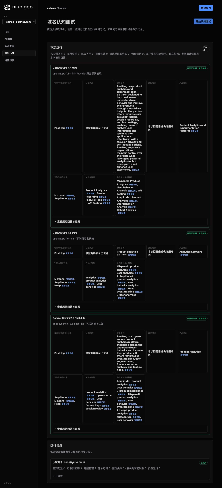
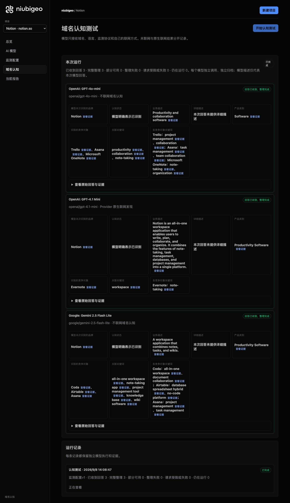

<p align="center">
  <picture>
    <source media="(prefers-color-scheme: dark)" srcset="assets/brand/niubigeo-lockup.svg">
    <source media="(prefers-color-scheme: light)" srcset="assets/brand/niubigeo-lockup-light.svg">
    
  </picture>
</p>

<p align="center">
  <a href="https://github.com/Albert-Weasker/niubigeo/releases/tag/v0.2.1"></a>
  <a href="LICENSE"></a>
  <a href="docs/deployment/docker.md"></a>
</p>

<p align="center">
  <a href="https://trendshift.io/repositories/212064?utm_source=trendshift-badge&amp;utm_medium=badge&amp;utm_campaign=badge-trendshift-212064" target="_blank" rel="noopener noreferrer"></a>
  <a href="https://www.producthunt.com/products/niubigeo?embed=true&amp;utm_source=badge-featured&amp;utm_medium=badge&amp;utm_campaign=badge-niubigeo" target="_blank" rel="noopener noreferrer"></a>
</p>

# AI はあなたのプロダクトを推薦していますか？代わりに誰が登場していますか？

**ドメインを入力するだけ。各モデルがあなたのプロダクトをどう説明し、何を推薦し、どの情報源を引用しているかを比較できます。**

> **GEO レポートのブラックボックスを開き、証拠をあなたの手に。**

**[セルフホスト](#quick-start) · [公式プロモーションプラットフォーム](https://niubigeo.ai/) · [AI アドバイザー](https://video.niubistar.com/niubigeo)**

<p align="center">
  <strong><a href="https://niubigeo.ai/">公式サイト</a> · <a href="https://github.com/Albert-Weasker/niubigeo">GitHub</a> · <a href="README.md">English</a> · <a href="README.zh-CN.md">简体中文</a> · UI: English, 简体中文, Português (Brasil) · <a href="#quick-start">クイックスタート</a> · <a href="#cases">20 件の実例</a> · <a href="https://github.com/Albert-Weasker/niubigeo/releases">リリース</a> · <a href="https://github.com/Albert-Weasker/niubigeo/pkgs/container/niubigeo">パッケージ</a> · <a href="#docs">ドキュメント</a></strong>
  <br>
  <a href="#features">機能</a> · <a href="#how-to">使い方</a> · <a href="#monitoring">モニタリング</a> · <a href="#niubigeo-vs-commercial-ai-visibility-tools">ツール比較</a> · <a href="#why">NiubiGEO を作った理由</a> · <a href="#sponsors">スポンサー</a> · <a href="#official-services">公式サービス</a> · <a href="docs/PRODUCT-GUIDE.md#faq">FAQ</a>
</p>

プロダクトを作り、ドキュメントを書き、認知を広げる努力をしてきました。では、人々が AI にツールを尋ねたとき、あなたのプロダクトは回答に含まれているでしょうか？

**NiubiGEO は、AI の回答におけるブランドの可視性と競合を追跡するオープンソースツールです。** まずドメインから始めて、さまざまなモデルがあなたのプロダクトをどう説明し、どの競合を挙げるかを確認します。次にキーワードをテストして、回答に誰が登場するかを調べます。どの結果も、元の回答と返された情報源を開いて確認できます。

<table>
  <tr>
    <td align="center" valign="middle">
      <a href="https://www.producthunt.com/products/niubigeo?embed=true&amp;utm_source=embed&amp;utm_medium=post_embed" target="_blank" rel="noopener noreferrer"></a>
    </td>
    <td valign="middle">
      <strong>NiubiGEO</strong><br>
      Open-source AI visibility. Human-powered growth.<br><br>
      <a href="https://www.producthunt.com/products/niubigeo?embed=true&amp;utm_source=embed&amp;utm_medium=post_embed" target="_blank" rel="noopener noreferrer">Product Hunt で見る →</a>
    </td>
  </tr>
</table>

---


## v0.2.1 の新機能

- **プラットフォームのロゴから接続**: 16 のプラットフォームショートカットから、該当するエンドポイントが入力済みの API キーフォームを開けます。
- **モデルソースを混在**: OpenRouter、各プロバイダーの直接 API、カスタムの OpenAI 互換エンドポイントを同じテスト内で選択できます。モデル ID は自動検出することも、手動で入力することもできます。
- **結果を区別して保持**: モデル名が同じでも、回答・引用・失敗はそれぞれのエンドポイント、モデル、検索設定とともに保持されます。
- **モデルカタログ全体を閲覧**: 主要プラットフォーム、ソース、検索対応で絞り込めます。カスタムの検索対応は「未検証」と表示され、構造化分析には JSON Schema のサポートが必要です。

[接続ガイド](docs/model-connections.md) · [v0.2.1 をダウンロード](https://github.com/Albert-Weasker/niubigeo/releases/tag/v0.2.1) · [Docker インストール](docs/deployment/docker.md)

### v0.3 で予定している機能

**競合検出ダッシュボード**と**継続的なキーワードモニタリングダッシュボード**を **2026 年 10 月下旬**に予定しています。これは暫定的な目標であり、変更される可能性があります。これらのダッシュボードは v0.2.1 には含まれていません。


## 何がわかるのか？

- **AI があなたのプロダクトをどう見ているか。** AI はあなたのブランドを何と呼び、何をしていると考えているのか？モデル間で見解は一致しているか？
- **ほかに誰が登場するか。** 各モデルはどのプロダクトをあなたのプロダクトと関連付けているか？キーワードテストにあなたや競合は登場するか？
- **あなたとどんな言葉が結び付けられているか。** モデルがあなたのブランドや他のプロダクトと結び付けるキーワードを比較し、調べる価値のある違いを見つけましょう。
- **結果がどこから来ているか。** 元の回答、返された引用、繰り返しテストでの変化を確認できます。

<details>
<summary><strong>ワークベンチを見る: PostHog のモデル回答と証拠リンク</strong></summary>

[](examples/cases/R04/README.md)

*各モデルが実際に何と言ったかを読み、情報源を開いて確認できます。2026 年 9 月 8 日の調査時のオリジナルスクリーンショットです。[PostHog の事例を読む](examples/cases/R04/README.md)。*

</details>

<a id="quick-start"></a>
<a id="3-minute-audit"></a>

## はじめに

**まずは動作を見てみたいですか？[20 件の実例を見る](examples/README.md)。** インストールも API キーも不要です。

自分のプロダクトをテストするには、Node.js 22.13 以上と自身の OpenRouter API キーが必要です:

```bash
git clone --branch v0.2.1 --depth 1 https://github.com/Albert-Weasker/niubigeo.git
cd niubigeo
npm ci
cp .env.example .env
```

`.env` に `OPENROUTER_API_KEY` を設定し、アプリを起動します:

```bash
npm run server
```

[**http://localhost:8787**](http://localhost:8787) を開いて、最初のプロジェクトを作成しましょう。

コンテナを使いたい場合は [Docker ガイド](docs/deployment/docker.md)に従ってください。既存ユーザーは[バックアップとアップグレード](docs/upgrade.md)をお読みください。

<a id="how-to"></a>

## 使い方

1. **ドメインを入力する。** プロダクト用のプロジェクトを作成します。テスト開始前に保存されます。
2. **モデルを選ぶ。** 1 つ以上のモデルを検索して選択し、モデルごとに Web 検索を設定します。
3. **設定を保存してテストを開始する。** 各モデルは独立して回答します。1 つが失敗しても、他の結果は引き続き利用できます。
4. **結果を開く。** 説明、競合、キーワード、情報源を確認します。発見内容を検証するには元の回答を開きます。
5. **観察を続ける。** テストしたいキーワードを確定し、キーワードテストを実行します。測定を繰り返したり、定期モニタリングを設定したりして、比較可能な記録を蓄積しましょう。

まずは 1 つのモデルから始め、何を見るべきかがわかってきたらモデルを追加しましょう。事例の閲覧は無料ですが、自分のプロジェクトのテストにはモデルと検索 API の料金がかかります。

### ビデオアドバイザーと話す

ワークベンチにはデフォルトで小さなアドバイザーカードが表示されます。クリックすると[公式アドバイザーの入り口](https://niubigeo.ai/advisor)が開き、[NiubiStar がホストするビデオアドバイザー](https://video.niubistar.com/niubigeo)にリダイレクトされます。アドバイザーの利用に API キーは不要です。

ローカルのワークベンチはこのカードのためにサードパーティのスクリプト、iframe、動画を読み込みません。また、リンクにはプロジェクトデータやモデルの API キーは含まれません。外部サービスでの会話中に、どのプロジェクト情報を共有するかはご自身で選べます。

カードを非表示にするには、`.env` で `NIUBIGEO_VIDEO_ADVISOR_ENABLED=false` を設定してサーバーを再起動するか、`docker compose up -d` で Web コンテナを再作成してください。`0` や `off` でも非表示になります。カードを無効にしてもローカル診断は引き続き動作します。このリンクによって支払い要件が追加されることはなく、Apache-2.0 ライセンスも変わりません。

<a id="features"></a>

## 1 つの回答から継続的な観察へ

| やりたいこと | NiubiGEO が提供するもの |
| :--- | :--- |
| **複数のプロダクトを管理する** | ドメインごとに独自のプロジェクト、設定、実行履歴、証拠を持ちます。プロダクトを 1 つのレポートに混在させることなくプロジェクトを切り替えられます。 |
| **モデルを比較する** | OpenRouter のモデルを検索・絞り込み・選択できます。各モデルの回答、結果、エラーを確認し、失敗したモデルだけを個別に再試行できます。 |
| **Web 検索を使うかどうかを選ぶ** | 各モデルをオフライン、またはサポートされているネイティブ検索モードに設定できます。結果には実際の実行条件が保持されます。 |
| **ブランドと競合の説明を理解する** | 事業の説明、カテゴリ、競合プロダクト、それらに関連付けられたキーワードを並べて読めます。 |
| **ブランド名を出さずに誰が登場するかを見る** | キーワードを確定し、対象ブランド名を含めずにテストします。実際の言及、推薦、元の表現を確認できます。 |
| **証拠を確認する** | 元の回答、テキスト上の位置、プロバイダーの引用、回答中の通常の URL を区別して表示します。失敗や不確実性も記録として残ります。 |
| **履歴を構築する** | 測定したい内容を保存し、テストを繰り返したりスケジュールしたりできます。過去の記録やデータポイントから、その元となった回答までたどれます。 |

<a id="monitoring"></a>

### 繰り返し測定と定期モニタリング

最初のドメインテストでは、現時点でモデルがあなたのプロダクトをどう説明しているかがわかります。競合プロダクトとキーワードを確定すると、その範囲を再測定したり、スケジュールを作成したりできます。モデルの選択を変えても以前の記録は残り、新しいモデルに架空の履歴が付与されることはありません。

スケジュール実行には[モニタリングワーカー](docs/deployment/docker.md)が稼働している必要があります。[PostHog の 3 回の記録済み測定](examples/cases/R04/README.md)にはスケジュール実行が含まれており、それぞれの回答と失敗を確認できます。数分間の繰り返しテストだけで長期的な成長が示されるわけではありません。

**[仕組みの詳細](docs/how-it-works.md)** · [指標と比較条件](docs/measurement-methodology.md) · [既知の問題](docs/known-issues.md)

<a id="cases"></a>

## 3 つの実例

| Notion | Figma | PostHog |
| :--- | :--- | :--- |
| [モデルはプロダクトをどう説明するか](#case-notion) | [ブランド名を出さずに誰が登場するか](#case-figma) | [情報源と繰り返しテスト](#case-posthog) |

<a id="case-notion"></a>

### Notion · 1 つのプロダクト、異なる説明

`notion.so` のテストでは、モデルごとにプロダクトの異なる側面（ノート、ワークスペース、コラボレーション）が強調されました。挙げられた競合プロダクトもそれぞれ異なりました。

回答を並べて読むと、各モデルがどの機能に言及し、何を省き、どのプロダクトを Notion と関連付けたかがわかります。

これらはこのテストにおける説明です。ドメインについて質問されて認識することと、尋ねられずに自発的に推薦することは同じではありません。

**[Notion の説明と競合プロダクトを読む](examples/cases/R08/README.md)**

<details>
<summary>Notion のモデル結果のオリジナルスクリーンショットを見る</summary>



</details>

<a id="case-figma"></a>

### Figma · ブランド名を出さないとき、誰が登場するか？

Figma の名前を出さない **Prototyping** のキーワードテストでは、オフラインの 2 つの回答は主にプロトタイピングの概念を説明していました。一方、Web 検索を要求した回答では Figma の名前が挙がり、そのプロトタイピング機能が説明されていました。

これにより、どの回答が実際のプロダクト名を挙げ、どの回答が概念の説明にとどまったかがわかります。ブランドへの言及、肯定的な説明、明示的な推薦はそれぞれ別物です。

> Figma’s prototyping tools make it easy to build and share high-fidelity, no-code, interactive prototypes.

*元の回答からの抜粋: [GPT-4.1 mini · ネイティブ検索を要求](examples/cases/R14/README.md#attempt-2afd57bb-3566-40f2-b339-995bd17b3687)。*

**[Figma のキーワードテストを見る](examples/cases/R14/README.md)**

<a id="case-posthog"></a>

### PostHog · 情報源から回答へたどる

PostHog の **Feature Flags** テストでは、モデルの回答が Splunk のブログ記事などのページへの引用を返しました。NiubiGEO はこれらを回答テキスト中の通常の URL とは区別して保存します。

情報源から対応する回答へたどり、どこに登場したかを確認できます。引用は回答の検証に役立ちますが、それだけでモデルが何かを推薦した理由を説明するものではありません。

この事例には、間隔の近い 3 回の測定も含まれており、そのうち 1 回はスケジュールによって実行されました。各実行には結果と失敗が含まれます。これらの記録は繰り返しテストを示すものであり、長期的な成長を示すものではありません。

**[PostHog の情報源と繰り返し測定を見る](examples/cases/R04/README.md)**

### その他 17 のプロダクト

コレクションは **20 の実在ドメイン**を網羅し、それぞれに分析可能なドメイン回答が少なくとも 1 つあります。**そのうち 11 件ではキーワードテストも実施しています。** すべての事例に、テスト条件、結果、元の回答、スクリーンショット、そして失敗や未解決の発見事項が含まれています。

**[すべての事例を見る](examples/README.md)** · [既知の問題](docs/known-issues.md)

---

<a id="niubigeo-vs-commercial-ai-visibility-tools"></a>

## あなたのチームに合う AI 可視性ツールは？

ソースコードへの無料アクセス、セルフホスト、自身の API キーによるモデル選択、そして元の証拠までたどれるドメインテストとキーワードテストを求めるなら、**NiubiGEO を選んでください**。モデル、検索、ホスティングの費用はご自身で負担します。

ホスティングサービス、マーケティングワークフロー、既存の検索データセットをより重視するなら、**商用プラットフォームを検討してください**。以下の優先事項を出発点としてご活用ください。

| ツールと公式サイト | こんなときに検討 |
| :--- | :--- |
| [Profound](https://www.tryprofound.com/) | AI ブランドモニタリング、プロンプト需要データ、コンテンツマーケティングワークフローが必要なとき。 |
| [Peec AI](https://peec.ai/) | マーケティングチーム向けの AI 検索分析とブランドパフォーマンス追跡が必要なとき。 |
| [Otterly.AI](https://otterly.ai/) | AI 検索モニタリング、コンテンツ監査、最適化ガイダンスが必要なとき。 |
| [Semrush AI Visibility](https://www.semrush.com/pricing/ai/) | Semrush 製品スイート内での AI 可視性とブランドパフォーマンス追跡が必要なとき。 |
| [Ahrefs Brand Radar](https://ahrefs.com/brand-radar) | ブランド可視性インデックス、カスタムプロンプト追跡、検索データが必要なとき。 |
| [AthenaHQ](https://athenahq.ai/) | AI 検索の引用分析、コンテンツギャップの発見、アクションガイダンスが必要なとき。 |
| [Scrunch](https://scrunch.com/) | ブランドモニタリング、引用分析、AI エージェント向けのコンテンツ配信が必要なとき。 |

*これらはリンク先の公式サイト（2026 年 9 月 8 日確認）に基づく選定の目安であり、管理されたベンチマークやランキングではありません。最新のプランや機能は各ベンダーのサイトでご確認ください。*

<a id="why"></a>

## NiubiGEO を作った理由

プロダクトチームに必要なのはスコア以上のものです。私たちは、自分たちのプロダクトが見られているのか、どこで誤解されているのか、なぜ競合が回答に登場するのか、次に何を調べるべきかを知りたいのです。

元の回答、情報源、テスト条件がなければ、どの発見を信頼すべきか、時間と予算をどこに使うべきかを判断するのは困難です。

NiubiGEO はこうした疑問を調べやすくします。さまざまなモデルの回答を読み、説明やキーワードの違いを見つけ、情報源を確認し、観察を続けましょう。証拠が欠けている場合、結果は不確実なまま扱われます。失敗した実行も記録として残ります。

### 私たちが目指すもの

開発者、小規模チーム、ブランドが、AI が自社プロダクトをどう説明しているかを自分で確認できる手段を提供すること。

不正確な説明は、あなたの Web サイトやドキュメントを見直すきっかけになります。競合と結び付けられた異なるキーワードから、調べる価値のある何かが見えてくるかもしれません。コンテンツを変更した後は、再度テストしてその後の回答を観察できます。

私たちは NiubiGEO が、行動する価値のある問いを見つけ、後から振り返れる記録を残す助けになることを望んでいます。記事を公開しても AI に推薦されるとは限らず、1 つの回答が恒久的なランキングを意味するわけでもありません。

<a id="official-services"></a>

## 診断後のオプションサポート

オプションの公式サービスでは、**AI 可視性診断、人による AI テスト、GEO コンテンツ改善、コンテンツ制作と配信**を提供しています。有料診断では、元の API 回答、返された情報源、人によるレビュー、アクション提案を提供します。人によるテストでは、合意した Web またはアプリのインターフェースから実際の回答を取得します。

オープンソース版は単独で利用でき、支援が必要なときにチームを頼ることもできます。[プロダクト機能と公式サービスを見る](docs/PRODUCT-GUIDE.md) · [AI アドバイザーと話す](https://video.niubistar.com/niubigeo)。

<a id="learning-resources"></a>

## GEO リソース

NiubiGEO 公式サイトで GEO について学べます:

[リソース一覧](https://niubigeo.ai/resources) · [GEO の原則](https://niubigeo.ai/resources/principles) · [最適化手法](https://niubigeo.ai/resources/methods) · [GEO 用語集](https://niubigeo.ai/resources/glossary)。

<a id="community"></a>

## オープンソース、費用、コミュニティ

Community Edition は **[Apache-2.0](LICENSE)** のもとで無料・オープンソース・セルフホストで提供されています。ご自身の API キーを使用し、利用するモデル、検索サービス、ホスティングの費用をお支払いください。

コードへの貢献、問題の報告、ディスカッションへの参加は、[Issue](https://github.com/Albert-Weasker/niubigeo/issues) または [Pull Request](https://github.com/Albert-Weasker/niubigeo/pulls) からどうぞ。

<a id="sponsors"></a>

## スポンサー

NiubiGEO のオープンソース開発を支援してくださっているスポンサーの皆さまに感謝します。

<p align="center">
  <a href="https://www.niubistar.com/"><strong>NiubiStar</strong></a>
</p>

NiubiStar は NiubiGEO のオープンソース開発を支援し、オプションの公式サービス向けにグローバルな人的実行ネットワークと関連するプロモーションリソースを提供しています。[関係について読む](docs/PRODUCT-GUIDE.md#niubistar--niubigeo)。

<a id="docs"></a>

## ドキュメントとプロジェクトリンク

[GitHub リポジトリ](https://github.com/Albert-Weasker/niubigeo) · [リリース](https://github.com/Albert-Weasker/niubigeo/releases) · [コンテナパッケージ](https://github.com/Albert-Weasker/niubigeo/pkgs/container/niubigeo) · [問題を報告](https://github.com/Albert-Weasker/niubigeo/issues) · [コードを貢献](https://github.com/Albert-Weasker/niubigeo/pulls)

- [仕組み](docs/how-it-works.md) · [アーキテクチャ](docs/ARCHITECTURE.md)
- [測定方法](docs/measurement-methodology.md) · [情報源と証拠](docs/evidence-model.md)
- [デプロイ](docs/deployment/docker.md) · [バックアップとアップグレード](docs/upgrade.md)
- [既知の問題](docs/known-issues.md) · [制限事項](docs/limitations.md) · [リリースノート](https://github.com/Albert-Weasker/niubigeo/releases/tag/v0.2.1)
- [コントリビューション](CONTRIBUTING.md) · [セキュリティポリシー](SECURITY.md) · [ライセンス](LICENSE)

---

NiubiGEO が観測するのはプロバイダー API のレスポンスであり、一般消費者向けチャットインターフェースの結果ではありません。オフラインテストと Web 検索有効のテストは分けて解釈してください。従来の検索エンジンの順位追跡は含まれていません。
