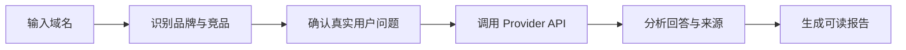

<div align="center">


### AI 会不会推荐你的产品？谁正在抢走你的曝光？

**输入一个域名，看看 AI 是否会推荐你，以及哪些竞争对手更容易出现。**

[English](./README.md) · [快速开始](#3-分钟开始审计) · [Releases](https://github.com/Albert-Weasker/niubigeo/releases) · [Packages](https://github.com/Albert-Weasker/niubigeo/pkgs/container/niubigeo) · [查看对比](#niubigeo-与商业-ai-可见度工具)

<br />


</div>

---

## 你发布了产品，但 AI 知道吗？

越来越多用户不再逐条浏览搜索结果，而是直接询问 AI：

> 有哪些适合我的工具？  
> 这个领域有哪些产品？  
> 谁是某个产品的替代方案？  
> 我应该选择哪一个？

你的官网可能已经被搜索引擎收录，但 AI 仍然可能：

- 想不到你的品牌；
- 误解你的产品定位；
- 只记住一小部分能力；
- 在推荐时优先列出竞争对手；
- 引用第三方页面，却没有引用你的官网。

NiubiGEO 不给你一个难以解释的综合分数。它把问题、回答、竞争对手和引用来源摊开，让你看清 AI 眼中的市场。

## 运行一次审计，你会得到什么

<table>
<tr>
<td width="50%" valign="top">

### AI 怎样理解你

查看不同模型是否认识你的品牌、如何描述你的产品，以及哪些重要能力没有被理解。

</td>
<td width="50%" valign="top">

### 谁正在与你竞争

当用户没有说出你的品牌名时，查看 AI 主动想到哪些产品，并区分已确认竞争对手和疑似相关品牌。

</td>
</tr>
<tr>
<td width="50%" valign="top">

### 你在哪些问题中缺席

找到竞争产品出现、你的产品却没有出现的真实用户问题。

</td>
<td width="50%" valign="top">

### AI 主要参考了什么

查看 AI 引用的官网、社区和第三方来源，并打开支持结论的原始回答。

</td>
</tr>
</table>

**数据来源：**Community Edition 使用你配置的 Provider API 生成结果。每条结论都可以回到对应问题、模型回答和引用来源。

## 一份真正能看懂的 AI 竞争报告

NiubiGEO 不要求你理解复杂的 GEO 指标。报告会直接告诉你：

```text
总结
├── AI 是否认识你的产品
├── AI 如何描述你的品牌
├── 谁是已确认竞争对手
├── 哪些问题更容易出现竞争对手
├── 哪些重要问题没有出现你的品牌
└── 哪些来源支撑了这些判断
```

主报告只保留可读结论。完整 AI 回答默认收起，需要时可以展开查看。

## 为什么开源？

我们希望每个团队都能低成本了解自己在 AI 中的真实表现，并且能够验证每一条结论。

NiubiGEO 让你能够：

- 免费、自托管，并使用自己的 Provider Key；
- 运行前确认所有测试问题；
- 查看每条结论对应的 AI 原始回答；
- 检查品牌、竞争对手和引用来源是如何识别的。

## 3 分钟开始审计

### Docker

```bash
git clone https://github.com/Albert-Weasker/niubigeo.git
cd niubigeo
cp .env.example .env
```

在 `.env` 中至少配置一个 Provider：

```env
OPENROUTER_API_KEY=
OPENAI_API_KEY=
ANTHROPIC_API_KEY=
GEMINI_API_KEY=
PERPLEXITY_API_KEY=
DEEPSEEK_API_KEY=
```

启动：

```bash
docker compose up --build
```

打开 [http://localhost:8787](http://localhost:8787)，输入域名，确认品牌、竞争对手和问题，然后运行审计。

也可以直接拉取已发布镜像：

```bash
docker pull ghcr.io/albert-weasker/niubigeo:v0.1.0-alpha
```

<details>
<summary><strong>使用 Node.js 启动</strong></summary>

NiubiGEO 需要 Node.js 22 或更高版本。

```bash
git clone https://github.com/Albert-Weasker/niubigeo.git
cd niubigeo
cp .env.example .env
npm install
npm run self-check
npm run server
```

</details>

<details>
<summary><strong>使用 CLI</strong></summary>

```bash
npm run audit -- \
  --domain example.com \
  --provider openrouter \
  --models openai/gpt-4o-mini,perplexity/sonar \
  --prompt-count 8
```

指定关键词和用户问题：

```bash
npm run audit -- \
  --domain example.com \
  --keywords "category keyword,buyer intent keyword" \
  --competitors rival.com,other.com \
  --prompts "What are the best tools in this category?|What are the alternatives?"
```

报告默认写入本地 `runs/` 目录。

</details>

## 支持的 Provider

| Provider | 状态 | 使用方式 |
|---|:---:|---|
| OpenRouter | 支持 | 一个 Key 运行多个提供商的模型；支持 OpenRouter 原生 web 插件 |
| OpenAI | 支持 | 使用 OpenAI 官方 Responses API；支持原生 `web_search` |
| Anthropic | 支持 | 使用 Anthropic 官方 Messages API；支持 Claude 原生联网搜索 |
| Google Gemini | 支持 | 使用 Gemini 官方 API；支持 Google Search grounding |
| Perplexity | 支持 | 使用 Sonar 天然联网回答和 Provider 返回引用 |
| DeepSeek | 支持 | 使用 DeepSeek Responses 兼容 API；支持原生 `web_search` |
| OpenAI-compatible API | 支持 | 通过 `OPENAI_COMPATIBLE_BASE_URL` 和 `OPENAI_COMPATIBLE_API_KEY` 接入自定义中转 |

每个 Provider 的具体联网执行路径见 [Provider 原生联网搜索](docs/PROVIDER_NATIVE_SEARCH.zh-CN.md)。

## Packages

Docker 镜像已发布到 GitHub Container Registry：

```bash
docker pull ghcr.io/albert-weasker/niubigeo:v0.1.0-alpha
docker pull ghcr.io/albert-weasker/niubigeo:latest
```

## 中文不是附加功能

NiubiGEO 支持 English 和简体中文。语言选择会同时影响：

- 产品界面；
- 自动生成的监测问题；
- 发送给 Provider 的执行 Prompt；
- 品牌与竞争对手分析；
- 最终报告。

## NiubiGEO 与商业 AI 可见度工具

商业 AI 可见度产品通常适合已经准备好购买 SaaS、托管数据和团队流程的公司。NiubiGEO 适合希望先用开源方式验证问题、控制模型和保留证据的团队。

以下比较基于各产品官网公开信息，最后核对日期为 **2026-09-03**。产品能力会变化，请以对应官网为准。

### NiubiGEO vs Profound

- **选择 Profound：**适合需要托管式企业监测、成熟团队工作流和大规模数据能力的组织。
- **选择 NiubiGEO：**适合希望免费开始、自行部署、自由选择模型并查看原始证据的团队。

[查看 Profound 官网](https://www.tryprofound.com/)

### NiubiGEO vs Peec AI

- **选择 Peec AI：**适合希望开箱即用、持续追踪品牌指标的营销团队。
- **选择 NiubiGEO：**适合不想先购买 SaaS 订阅，并希望控制问题、模型和数据的用户。

[查看 Peec AI 官网](https://peec.ai/)

### NiubiGEO vs Otterly.AI

- **选择 Otterly.AI：**适合需要托管式 AI 搜索监测、定期报告和优化工作流的团队。
- **选择 NiubiGEO：**适合希望用自己的 API Key 快速验证品牌是否被 AI 推荐的团队。

[查看 Otterly.AI 官网](https://otterly.ai/)

### NiubiGEO vs Semrush AI Visibility

- **选择 Semrush：**适合已经使用 Semrush，并希望把 AI 可见度纳入 SEO 与营销数据体系的团队。
- **选择 NiubiGEO：**适合不依赖专有 SEO 数据，只想围绕自己的问题和模型生成可检查报告的用户。

[查看 Semrush AI Visibility](https://www.semrush.com/pricing/ai/)

### NiubiGEO vs Ahrefs Brand Radar

- **选择 Ahrefs：**适合需要大规模关键词、搜索需求和 AI 可见度数据库的 SEO 团队。
- **选择 NiubiGEO：**适合希望自己定义问题、自己运行模型，并从本地报告开始验证的团队。

[查看 Ahrefs Brand Radar](https://ahrefs.com/brand-radar)

### NiubiGEO vs AthenaHQ

- **选择 AthenaHQ：**适合需要完整 GEO 工作流、行动建议和团队协作的组织。
- **选择 NiubiGEO：**适合先把 AI 是否认识品牌、引用哪些来源、竞争对手是谁这些基础事实查清楚的团队。

[查看 AthenaHQ 官网](https://athenahq.ai/)

### NiubiGEO vs Scrunch

- **选择 Scrunch：**适合需要企业级监测、优化建议和面向 AI Agent 的内容交付能力的团队。
- **选择 NiubiGEO：**适合希望先用开源工具完成基础 AI 品牌审计，并保留完整证据链的用户。

[查看 Scrunch 官网](https://scrunch.com/)

<details>
<summary><strong>查看快速比较表</strong></summary>

| 能力 | NiubiGEO | 商业平台 |
|---|:---:|:---:|
| 品牌 AI 可见度 | 支持 | 通常支持 |
| 竞争分析 | 支持 | 通常支持 |
| 引用来源分析 | 支持 | 通常支持 |
| 开源 | 支持 | 通常不提供 |
| 自托管 | 支持 | 通常不提供 |
| 使用自己的 Provider Key | 支持 | 通常不提供 |
| 托管基础设施 | 不提供 | 通常提供 |
| 专有数据集 | 不提供 | 通常提供 |
| 团队工作流 | 计划中 | 通常提供 |

商标和产品名称归各自权利人所有。

</details>

## 它是怎么工作的



1. 输入域名或产品页面；
2. NiubiGEO 识别品牌、别名、类别、关键词和可能的竞争对手；
3. 用户确认或修改即将发送的问题；
4. 系统调用用户配置的真实 Provider API；
5. 分析品牌、竞争对手、推荐语义和 Provider 返回的来源；
6. 生成简短、可读、每个结论都有证据入口的报告。

## 项目状态

NiubiGEO 当前处于 `v0.1.0-alpha`：核心流程可用，接口、数据结构和报告规则仍可能调整。

- [x] 多 Provider API 审计
- [x] 审计前问题确认
- [x] 品牌与竞争对手识别
- [x] 已确认竞品与疑似相关品牌分离
- [x] 相关来源过滤
- [x] 可追溯到原始回答的报告
- [x] English 与简体中文
- [ ] 定时监测
- [ ] 相同条件下的报告对比
- [ ] 报告导出包
- [ ] Provider Plugin SDK
- [ ] 更多 Provider 与兼容端点

## 需要验证真实用户看到的结果？

Community Edition 适合自行运行 API 可见度审计。如果你还需要：

- 不同国家和地区的真人测试；
- ChatGPT、Gemini、Claude、Perplexity 等消费端页面验证；
- 截图、来源和完整证据交付；
- 针对竞争差距制定并执行 GEO 优化方案；

可以了解 **NiubiGEO Managed Service，由 NiubiStar 全球用户网络提供支持。**

<details>
<summary><strong>查看数据来源与结果边界</strong></summary>

- Community Edition 使用 Provider API，不模拟消费端网页结果；
- API 与消费端产品的回答可能不同；
- 引用仅来自 Provider 返回或回答中真实存在的来源；
- OpenRouter 可以调用不同提供商的模型，但结果仍标记为 OpenRouter API；
- Provider Key 不能混用，例如 OpenAI Key 只调用 OpenAI，Gemini Key 只调用 Gemini；
- 没有 Provider Key，就不生成 AI 可见度结果；
- 核心审计流程不使用 Mock 数据冒充真实回答；
- 模型回答具有随机性，单次结果不代表永久排名；
- 真人地区测试和消费端网页验证属于独立服务。

</details>

<details>
<summary><strong>查看安全与许可证说明</strong></summary>

不要提交 Provider Key、客户报告、私密 Prompt 或包含敏感信息的运行数据。安全问题请按照 [SECURITY.md](./SECURITY.md) 私下报告。

NiubiGEO 使用 [Apache-2.0](./LICENSE) 许可证。

</details>

## 参与贡献

欢迎贡献新的 Provider、实体识别规则、来源过滤规则、报告语言和文档。

- 阅读 [CONTRIBUTING.md](./CONTRIBUTING.md)
- 提交 Bug：[Issues](https://github.com/Albert-Weasker/niubigeo/issues)
- 讨论功能：[Discussions](https://github.com/Albert-Weasker/niubigeo/discussions)

## 贡献者

感谢所有参与建设 NiubiGEO 的贡献者。

<p>
  <a href="https://github.com/Albert-Weasker">
    
    <br />
    <sub><strong>Albert-Weasker</strong></sub>
  </a>
</p>

完整贡献者记录见 [GitHub Contributors](https://github.com/Albert-Weasker/niubigeo/graphs/contributors)。

---

<div align="center">

**输入一个域名，看看 AI 是否会在关键问题里推荐你的产品。**

[开始使用](#3-分钟开始审计) · [提交 Issue](https://github.com/Albert-Weasker/niubigeo/issues) · [查看英文文档](./README.md)

Built by [NiubiStar](https://www.niubistar.com/)

</div>
