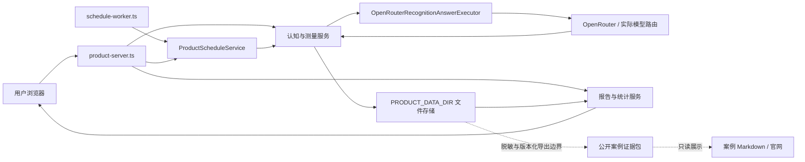
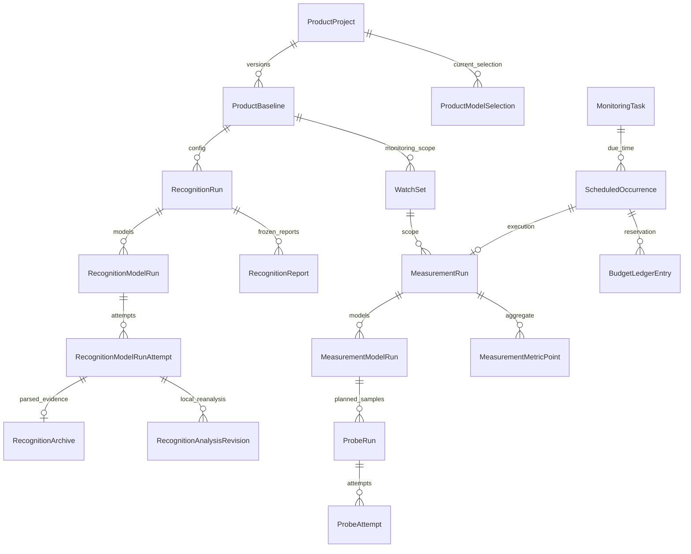
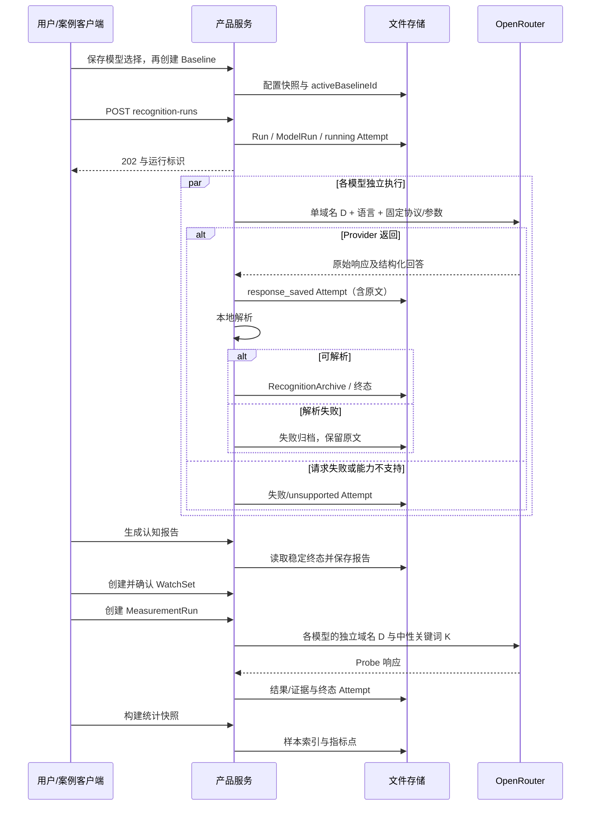

# 当前产品架构

适用对象：Phase 6 工作树中的 `src/product`；拟发布版本 **v0.2.0-rc.1，UNPUBLISHED（未发布）**。本页是源码说明，不是发布、容器运行或真实模型验收报告。核对基点为 `18c41528a1a7cee8562a6ddc10e59021487962e6`，但当前产品包含未提交修改，不能用该 HEAD 单独重建本页描述的产品。

继续复用本仓库的 `docs/ARCHITECTURE.md`，不另建大小写不同的入口。此前的 AuditPlan 架构原样保存在 [Legacy 架构](legacy/ARCHITECTURE-pre-product-v2.md)。旧设计稿、旧 CLI 与当前产品可以同时存在；判断现行能力应从本页链接的服务入口和源码开始。

## 系统边界

NiubiGEO 记录 Provider API 的回答及其证据。当前产品执行器只走 OpenRouter；仓库中存在其他 Provider 适配器，不表示新产品界面已开放对应直连入口。

我们公开的是本次回答及其证据，无法据此读出模型内部的思考过程，也不能保证再次运行得到完全相同的答案。



实线对应当前产品依赖。虚线表示 Phase 6 公开交付边界，不是产品服务内置的导出 HTTP API；[案例客户端](../examples/lib/client.mjs)、[隔离产品会话](../examples/lib/product-session.ts) 和 [公开导出](../examples/lib/export.mjs) 复用现有服务。案例执行器在隔离 PRODUCT_DATA_DIR 中注入累计预算包装器，网站/Markdown 读取公开导出。新装工作台不会自动导入公开案例。[R02](../examples/cases/R02/README.md) 保存了本轮实际 D/K 回答、三次测量及解析失败。[研究计划](../examples/study-plan.json) 的 20 个案例已执行到终态；运行结束不表示每个回答均有效，覆盖与失败见各例证据索引。

## 入口与职责

| 模块 | 实际职责与源码 |
| --- | --- |
| HTTP 服务 | [product-server.ts](../src/product/product-server.ts)：Node HTTP、依赖装配、页面和静态资源、路由分派 |
| 项目 | [project-service.ts](../src/product/projects/project-service.ts)：域名规范化、重复域名约束、项目归档/软删除/恢复/清理 |
| 配置 | [baseline-service.ts](../src/product/configuration/baseline-service.ts)、[model-selection-service.ts](../src/product/configuration/model-selection-service.ts)：模型选择与不可变配置快照 |
| 域名认知 | [recognition-service.ts](../src/product/recognition/recognition-service.ts)：D 请求、Attempt、响应归档、解析、重试和本地重新分析 |
| 认知报告 | [report-service.ts](../src/product/reports/report-service.ts)：终态认知运行的固定来源快照、字段证据完整性、竞品和关键词分组 |
| 待测范围 | [watchset-service.ts](../src/product/measurements/watchset-service.ts)：从已存报告提议对象/关键词，生成和确认 WatchSet 版本 |
| 持续测量 | [measurement-service.ts](../src/product/measurements/measurement-service.ts)：D/K 探针计划、执行与探针级重试 |
| 统计 | [measurement-stats.ts](../src/product/measurements/measurement-stats.ts)：按模型/对象/词/运行生成指标点与样本索引，不调用模型 |
| 调度 | [schedule-service.ts](../src/product/scheduling/schedule-service.ts)、[schedule-worker.ts](../src/product/scheduling/schedule-worker.ts)：Cron 计算、到期记录、任务锁、测量派发与终态对账 |
| 界面 | [product-phase4-app.ts](../src/ui/product-phase4-app.ts) 为认知/报告；[product-phase5-app.ts](../src/ui/product-phase5-app.ts) 为测量/图表/任务 |

默认页面为 `/`，持续测量为 `/?view=measurements`。当前没有任意路径的 SPA 回退；不要将 `/projects/...` 等推测地址写成可用深链。其他查询参数的读取以对应界面代码为准。

## 数据关系



`WatchSet` 内嵌 `WatchObject[]`、`WatchKeyword[]` 和 D/K 协议快照；`MeasurementStatsSnapshot` 内嵌指标点。实体关系图中的包含关系不代表数据库外键或跨文件事务。

配置快照保存规范化域名、模型路由/显示名/搜索能力、语言、协议、分析版本与 `configHash`。修改模型选择不会直接修改已有 Baseline；创建新 Baseline 后必须确认对应 WatchSet。相同配置 Hash 已存在时创建返回冲突，并非自动重新启用历史 Baseline。

## 两条执行路径



认知服务先保存完整响应，再解析。测量服务目前先写 Probe 证据/解析结果，最后写含原始响应的终态 Attempt，存在进程中断时原文尚未落盘的窗口。这两条路径不能统称为“所有响应都已先归档”。

D 只发送规范化域名，不发送项目的品牌名、别名、竞品、网站抓取内容或其他模型输出。K 只发送一个词、语言和固定中性协议；监测对象用于响应后的本地精确匹配。更多输入和样本规则见 [原理](how-it-works.md) 与 [测量方法](measurement-methodology.md)。

## 存储与可变性

[env.ts](../src/config/env.ts) 中的数据根目录优先级：

```text
PRODUCT_DATA_DIR
  否则 MONITORING_DATA_DIR/product-v2
  否则 data/product-v2（相对进程工作目录）
```

完整数据根目录的主要结构：

```text
product-v2/
  locks/<domain-hash>.lock
  projects/<projectId>/
    project.json
    model-selections.json
    baselines/<baselineId>.json
    recognition-runs/<runId>/
      run.json
      reports/<reportId>.json
      model-runs/<modelRunId>/
        model-run.json
        attempts/<attemptId>.json
        recognition-archives/<attemptId>.json
        analysis-revisions/<attemptId>/<revisionId>.json
    measurements/
      watch-sets/<watchSetId>.json
      runs/<runId>/
        run.json
        model-runs/<modelRunId>/
          model-run.json
          probe-runs/<probeId>.json
          attempts/<probeId>/<attemptId>.json
          results/<probeId>.json
          evidence/<probeId>.json
      stats/<snapshotId>.json
    schedules/
      tasks/<taskId>.json
      occurrences/<task-and-time-hash>.json
      ledger/<entryId>.json
      locks/<task-hash>.lock
```

来源：[项目存储](../src/product/projects/project-store.ts)、[配置存储](../src/product/configuration/configuration-store.ts)、[认知存储](../src/product/recognition/recognition-store.ts)、[测量存储](../src/product/measurements/measurement-store.ts)、[调度存储](../src/product/scheduling/schedule-store.ts)。

JSON 写入通常使用临时文件加 rename，保证单文件替换；不是跨文件事务、数据库日志或防篡改存储。项目、模型选择、运行状态、任务、Occurrence 和 Ledger 会更新。Baseline 的业务内容通过新版本保存，WatchSet 的 active/retired 状态会更新。重试追加 Attempt；认知分析修订另存。测量的 `results/<probeId>.json` 和 `evidence/<probeId>.json` 则会被重试覆盖，不能宣称逐 Attempt 的派生证据都不可变。备份必须覆盖整个数据根目录。

## Markdown 案例导出

正常产品 UI、执行 API、报告和图表保持不变。阅读案例不经过产品 API，也不要求启动第二个服务。

[examples/cli.mjs](../examples/cli.mjs) 的 plan、validate、replay、export 命令读取或复核既有归档；[export.mjs](../examples/lib/export.mjs) 将记录、字段位置和来源分组写成脱敏证据及双语 Markdown。[文档生成器](../scripts/render-release-readme.mjs) 只读已有公共证据、原台账和语义复核，整理四组演示、20 页正文与问题索引，不调用执行器、不更新原始 Run/Attempt。

`examples/cases/R01..R20/README*.md` 是案例正文的唯一交付位置；`public-evidence.json`、`evidence-index.json` 和原图片以相对链接提供证据。`website/` 为保留的历史静态预览源码，不是必需组件，见 [归档说明](../website/README.md)。推理仅在用户另行选择 live 执行时发生。

## 实际 HTTP API

以下从各 `*-http.ts` 文件核对。记 `P=/api/projects/:projectId`、`R=P/recognition-runs/:runId`、`M=P/measurement-runs/:runId`。这是路由记法，复制请求时需替换标识。

| 方法与路径 | 用途/副作用 |
| --- | --- |
| `GET /health` | 仅返回服务存活，不检查磁盘、Key、路由或模型 |
| `GET /assets/...` | 从工作目录下 assets 提供静态文件 |
| `GET /api/provider-models` | 查询 OpenRouter 模型目录，可能访问外网；不发推理 |
| `GET/POST /api/projects` | 列表/创建草稿；列表可用 includeArchived、includeDeleted |
| `GET/PATCH/DELETE P` | 读取/编辑/软删除；GET 可用 includeDeleted |
| `POST P/archive`、`POST P/restore`、`DELETE P/purge` | 归档、恢复、永久清理已删除项目 |
| `GET/PUT P/models` | 模型选择；PUT 的 selections 包含 modelId、webSearchMode |
| `GET P/monitoring-configuration` | 当前配置状态 |
| `GET/POST P/baselines`、`GET P/baselines/:baselineId` | 配置版本列表、创建、读取 |
| `GET/POST P/recognition-runs`、`GET R` | 认知列表/付费执行/读取；POST 可选 modelIds，幂等键来自 Idempotency-Key 请求头 |
| `GET R/model-runs/:modelRunId` | 模型状态、所有尝试、归档与本地分析修订 |
| `GET R/model-runs/:modelRunId/attempts/:attemptId` | 指定认知尝试及其归档 |
| `POST R/model-runs/:modelRunId/retry` | 重新请求，可能收费 |
| `POST R/model-runs/:modelRunId/attempts/:attemptId/reanalyze` | 本地重解析已保存回答，不调用模型 |
| `GET/POST R/reports`、`GET R/reports/:reportId` | 列表/本地生成/读取固定报告 |
| `GET R/reports/:reportId/model-runs/:modelRunId` | 固定报告中的模型观察 |
| `GET P/watch-sets/suggestion` | 从已生成报告提议范围 |
| `GET/POST P/watch-sets`、`GET P/watch-sets/:watchSetId` | 列表/生成草稿/读取；POST 可传 objectIds、keywordIds、repetitions |
| `POST P/watch-sets/:watchSetId/confirm` | 启用范围、停用旧范围 |
| `GET/POST P/measurement-runs`、`GET M` | 测量列表/付费执行/读取；POST 的 modelIds、idempotencyKey、budget 在 JSON 正文中 |
| `POST P/measurement-runs/new-models` | 仅请求历史 modelScope 中从未出现的已选模型 |
| `GET M/model-runs/:modelRunId/probes/:probeId` | 探针、尝试、结果和引用 |
| `POST M/model-runs/:modelRunId/probes/:probeId/retry` | 重新请求失败/不支持/预算阻塞探针，可能收费 |
| `POST P/measurement-stats`、`GET P/measurement-stats/:snapshotId` | 本地构建/读取统计快照 |
| `GET P/measurement-stats/:snapshotId/points/:pointId/samples` | 分子、分母与排除样本下钻 |
| `GET/POST P/monitoring-tasks`、`GET/PATCH/DELETE P/monitoring-tasks/:taskId` | 调度任务管理；创建即 active |
| `POST P/monitoring-tasks/preview` | 使用正文 rule 预览下三次时间，不执行 |
| `POST P/monitoring-tasks/:taskId/pause` 或 `resume` | 暂停/恢复未来执行 |
| `GET P/monitoring-tasks/:taskId/preview` 或 `occurrences` | 任务时间预览/历史到期记录 |
| `POST /api/scheduler/due` | 全项目到期扫描，可能发起收费调用 |

项目路由先于兜底处理器完成范围校验，各 Store 读取时核对所保存的父级 ID；项目 ID 还经过路径段检查。这是本地项目组织边界，**不等于用户认证、授权或租户安全隔离**。当前产品服务没有登录、访问控制和内置 TLS；不能直接作为公开多用户服务。更深层 ID 与文件系统访问也不应视为已经完成安全审计。

## 报告、图表与版本

认知报告读取每个 ModelRun 的 `currentAttemptId` 及同 Attempt 的原始归档；保存 `sourceAttemptMap`、源记录 Hash、协议/配置/报告版本。连续两次读取得到相同来源状态后生成，最多尝试三个读取周期。报告读取不重新推理，也不会自动采用本地重新分析的最新 Revision。这与认知详情页优先展示最新 AnalysisRevision 的行为不同。

测量统计读取全部已有测量 Run，不先删除 partial/failed Run；每个指标自行选择分母。指标点附带样本及排除原因。界面按模型、搜索配置和探针指纹分组，时间是运行开始时间而非报告生成或截图时间。首样本策略、缓存、断线与范围变化的实际缺口见 [测量方法](measurement-methodology.md) 和 [限制](limitations.md)，不能将旧 Workbench 的“每日最后完整运行”规则套入此页面。

## 调度与并发

worker 默认每 60 秒调用一次 `runDue()`，位置参数可设置轮询秒数，最少 10 秒。HTTP 服务本身没有自动定时循环。日期由 `cron-parser` 按任务 timezone 计算，支持 daily、weekly、monthly、custom。

调度先用文件锁串行保护单任务，再以任务 ID 与计划 UTC 时间建立唯一 Occurrence，然后调用相同的测量服务。已启动的 Occurrence 在后续扫描中读取 Run 终态并对账；Occurrence 为 completed 也可能对应 partial/failed Run，应同时看 reason 和 Run 状态。

目前锁和唯一文件提供部分防重能力，不能承诺宕机后恰好一次执行：运行并非持久队列，旧锁没有租约恢复；跳过/预算阻塞分支不推进 nextRunAt，错过时间的处理也未完整实现 skip 语义。任务保存 watchSetId，但执行时测量服务取当前范围，尚缺任务范围一致性校验。详细风险与费用限制见 [限制](limitations.md)。

## 归档、删除与 Legacy

默认项目列表不显示 archived/deleted；数据仍在原项目目录。restore 重新检查域名冲突，purge 只允许对已软删除项目执行并永久移除整棵项目目录。运行启动没有完整的归档状态禁用检查，删除也不会取消已在内存执行的请求；需要先停任务并等待在途请求结束。

当前产品不自动读取旧 `runs/`、`data/projects/`，也不挂载旧 AuditPlan API。旧 `src/server.ts` 和 `src/cli.ts` 的相关命令不能替代本页入口。没有经过验收的自动 Legacy 迁移工具；保留原数据，按 [升级与恢复](upgrade.md) 处理。容器入口、资源和卷以 [Docker 部署](deployment/docker.md) 为准。
