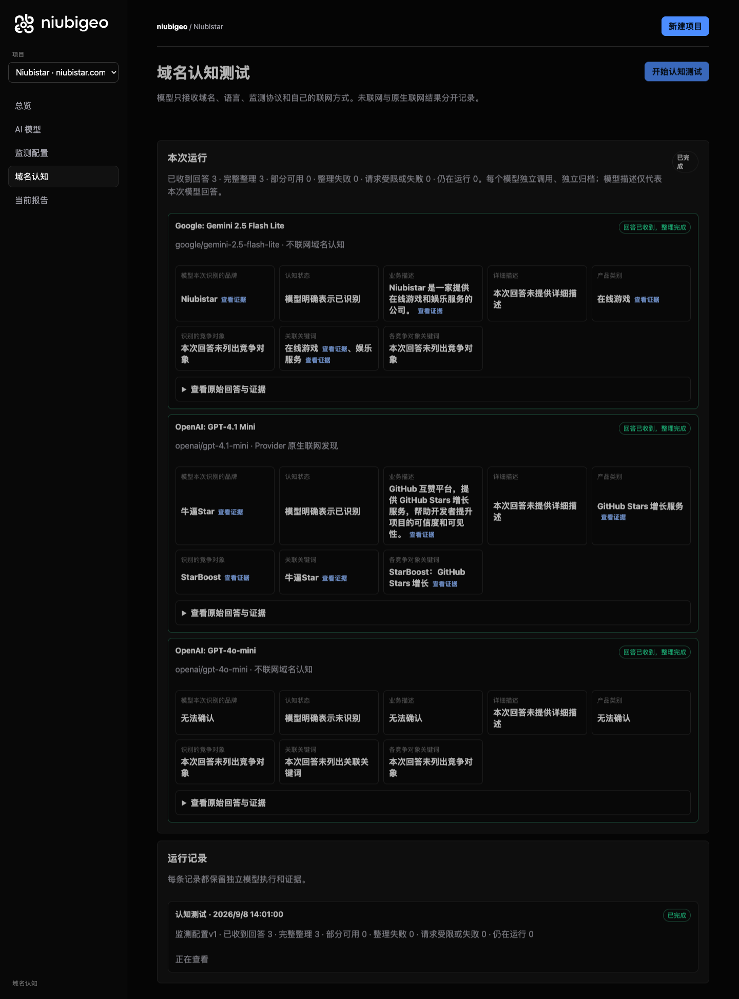
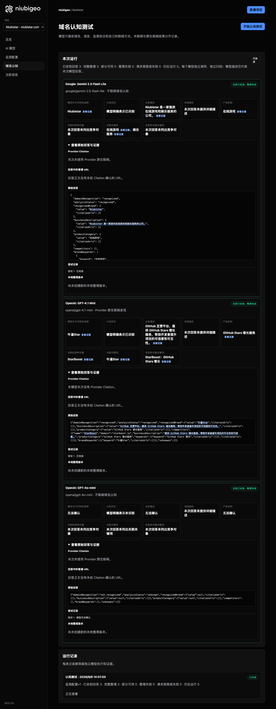

# R01 · niubistar.com

[English](./README.md) · [全部案例](../../README.zh-CN.md)

## 本次实际结果

一个模型描述为游戏娱乐，另一个描述为 GitHub 增长，第三个未识别。

初始 D：3/3 条当前回答可分析；测量 D：3/3 条首次回答可分析；K：0/0 条首次回答可分析。这些是回答覆盖计数，不是认识率或产品指标分母。

执行状态: **执行完成**.



R01 · niubistar.com · D · 3 条归档尝试 · openai/gpt-4o-mini（off）、google/gemini-2.5-flash-lite（off）、openai/gpt-4.1-mini（provider_native） · 2026-09-08T06:01:00.294Z 至 2026-09-08T06:01:00.294Z。保留原始失败状态。 截图时间: 2026-09-08T07:18:48.774Z.

## 测试条件

输入域名: niubistar.com. 回答语言: zh.

协议: D = domain-recognition/v1; K = keyword-discovery/v1.

D 只接收域名、语言、固定协议与模型配置。K 只接收已冻结的中性关键词。分类标签不发送给模型。

- openai/gpt-4o-mini · off
- google/gemini-2.5-flash-lite · off
- openai/gpt-4.1-mini · provider_native

## 各模型的描述

### Google: Gemini 2.5 Flash Lite

**运行时间:** 2026-09-08T06:01:00.294Z

domainRecognition: recognized · analysisStatus: recognized · localAnalysis: complete.

Attempt: 8e05a5ef-6cb5-4844-949d-3fcf87e34e9d · completed · executionMode: unverified.

品牌: Niubistar

业务: Niubistar 是一家提供在线游戏和娱乐服务的公司。

原文位置: UTF-16 [191, 219) · [打开完整回答](#attempt-8e05a5ef-6cb5-4844-949d-3fcf87e34e9d)

类别: 在线游戏

目标关键词: 在线游戏, 娱乐服务

竞争对象:

本次未列出竞争对象；这不表示现实中没有。

无法确认: —


<a id="attempt-8e05a5ef-6cb5-4844-949d-3fcf87e34e9d"></a>

<details><summary>查看模型原始回答</summary>

<pre>{
  "domainRecognition": "recognized",
  "analysisStatus": "recognized",
  "recognizedBrand": {
    "value": "Niubistar",
    "citationUrls": []
  },
  "businessDescription": {
    "value": "Niubistar 是一家提供在线游戏和娱乐服务的公司。",
    "citationUrls": []
  },
  "productCategory": {
    "value": "在线游戏",
    "citationUrls": []
  },
  "competitors": [],
  "brandKeywords": [
    {
      "keyword": "在线游戏",
      "citationUrls": []
    },
    {
      "keyword": "娱乐服务",
      "citationUrls": []
    }
  ],
  "unknowns": []
}</pre>

</details>

SHA-256: `45bf42296b7f6a3014399cd000d93ec518d851502a64cf0b0839b03549711942`

[原始回答、字段位置与尝试记录](./public-evidence.json) · SHA-256: `45bf42296b7f6a3014399cd000d93ec518d851502a64cf0b0839b03549711942`

<details><summary>关键词与原文位置</summary>

| 归属 | 关键词 | 原文 / UTF-16 位置 |
|---|---|---|
| Niubistar | 在线游戏 | 在线游戏 [206, 210) |
| Niubistar | 娱乐服务 | 娱乐服务 [211, 215) |

</details>

#### Provider 引用

此 Attempt 未归档此类来源。

#### 搜索检索结果

此 Attempt 未归档此类来源。

#### 回答中的链接（非 Provider 引用）

此 Attempt 未归档正文 URL。

### OpenAI: GPT-4.1 Mini

**运行时间:** 2026-09-08T06:01:00.294Z

domainRecognition: recognized · analysisStatus: recognized · localAnalysis: complete.

Attempt: 0aec67ab-66c8-4f9a-976e-0cffe244f51c · completed · executionMode: native.

品牌: 牛逼Star

业务: GitHub 互赞平台，提供 GitHub Stars 增长服务，帮助开发者提升项目的可信度和可见性。

原文位置: UTF-16 [151, 202) · [打开完整回答](#attempt-0aec67ab-66c8-4f9a-976e-0cffe244f51c)

类别: GitHub Stars 增长服务

目标关键词: 牛逼Star

竞争对象:

- StarBoost · starboost.io: 提供 GitHub Stars 增长服务，帮助开发者提升项目的可见性和可信度。. 关键词: GitHub Stars 增长

无法确认: —


<a id="attempt-0aec67ab-66c8-4f9a-976e-0cffe244f51c"></a>

<details><summary>查看模型原始回答</summary>

<pre>{"domainRecognition":"recognized","analysisStatus":"recognized","recognizedBrand":{"value":"牛逼Star","citationUrls":[]},"businessDescription":{"value":"GitHub 互赞平台，提供 GitHub Stars 增长服务，帮助开发者提升项目的可信度和可见性。","citationUrls":[]},"productCategory":{"value":"GitHub Stars 增长服务","citationUrls":[]},"competitors":[{"name":"StarBoost","domain":"starboost.io","businessDescription":"提供 GitHub Stars 增长服务，帮助开发者提升项目的可见性和可信度。","productCategory":"GitHub Stars 增长服务","keywords":[{"keyword":"GitHub Stars 增长","citationUrls":[]}],"citationUrls":[]}],"brandKeywords":[{"keyword":"牛逼Star","citationUrls":[]}],"unknowns":[]}</pre>

</details>

SHA-256: `91a6d0f45787317356affb6ae40e599232f7b986faf91f080c7cf200e60c5ffb`

[原始回答、字段位置与尝试记录](./public-evidence.json) · SHA-256: `91a6d0f45787317356affb6ae40e599232f7b986faf91f080c7cf200e60c5ffb`

<details><summary>关键词与原文位置</summary>

| 归属 | 关键词 | 原文 / UTF-16 位置 |
|---|---|---|
| 牛逼Star | 牛逼Star | 牛逼Star [92, 98) |
| StarBoost | GitHub Stars 增长 | GitHub Stars 增长 [166, 181) |

</details>

#### Provider 引用

此 Attempt 未归档此类来源。

#### 搜索检索结果

此 Attempt 未归档此类来源。

#### 回答中的链接（非 Provider 引用）

此 Attempt 未归档正文 URL。

### OpenAI: GPT-4o-mini

**运行时间:** 2026-09-08T06:01:00.294Z

domainRecognition: not_recognized · analysisStatus: unknown · localAnalysis: complete.

Attempt: 25b2cd1e-350e-4bbe-ae0f-dd6a7357d096 · unknown · executionMode: unverified.

品牌: —

业务: —

类别: —

目标关键词: 本次未列出

竞争对象:

本次未列出竞争对象；这不表示现实中没有。

无法确认: —


<a id="attempt-25b2cd1e-350e-4bbe-ae0f-dd6a7357d096"></a>

<details><summary>查看模型原始回答</summary>

<pre>{"domainRecognition":"not_recognized","analysisStatus":"unknown","recognizedBrand":{"value":null,"citationUrls":[]},"businessDescription":{"value":null,"citationUrls":[]},"productCategory":{"value":null,"citationUrls":[]},"competitors":[],"brandKeywords":[],"unknowns":[]}</pre>

</details>

SHA-256: `d83d1d59cfce83148236d8abd30efd376c4e7e89689a70b402bee72b9da5901a`

[原始回答、字段位置与尝试记录](./public-evidence.json) · SHA-256: `d83d1d59cfce83148236d8abd30efd376c4e7e89689a70b402bee72b9da5901a`

#### Provider 引用

此 Attempt 未归档此类来源。

#### 搜索检索结果

此 Attempt 未归档此类来源。

#### 回答中的链接（非 Provider 引用）

此 Attempt 未归档正文 URL。

## 中性关键词测试

关键词未执行：冻结筛选未得到合格词。逐词来源及排除记录见 public-evidence.json 的 archiveContext.keywordManifest；没有补词或重测。

K valid 仅指首次 Attempt 的回答可分析，不是产品指标分母。各指标使用归档统计点的 samples、included 和 judgment；后续成功重试不替换此覆盖计数。

筛选记录、原文位置和排除理由见证据文件。每个同条件回答同时观察目标和其他实体，不把离线与联网差异解释为模型优劣。

## 重复观察

1 次归档测量运行；数量不表示全部成功。只比较相同模型、语言、搜索与指纹条件。短期重复不代表长期趋势或因果效果。

- Run 00d942a5-5155-42df-a79e-e1488f005048: completed

- D 6b23fd71-ac1e-4b00-b03f-3a15360319ed · openai/gpt-4.1-mini · domainRecognition: recognized · analysisStatus: recognized · firstAttemptId: 43b92502-c357-4666-a0e7-380e0704e8e6 · resultAttemptId: 43b92502-c357-4666-a0e7-380e0704e8e6
- D d8b7072d-a2c2-47c9-9bf9-da0502a1c08b · openai/gpt-4o-mini · domainRecognition: not_recognized · analysisStatus: unknown · firstAttemptId: 6f7493e2-3af9-47ed-990e-d1bcb15ca393 · resultAttemptId: 6f7493e2-3af9-47ed-990e-d1bcb15ca393
- D c2129e79-e3af-4513-9869-14f09f8fd4f0 · google/gemini-2.5-flash-lite · domainRecognition: recognized · analysisStatus: recognized · firstAttemptId: f361c1b5-8d6d-4ed4-a429-98dab92790c9 · resultAttemptId: f361c1b5-8d6d-4ed4-a429-98dab92790c9

## 产品截图



R01 · niubistar.com · D · 3 条归档尝试 · openai/gpt-4o-mini（off）、google/gemini-2.5-flash-lite（off）、openai/gpt-4.1-mini（provider_native） · 2026-09-08T06:01:00.294Z 至 2026-09-08T06:01:00.294Z。保留原始失败状态。

截图时间: 2026-09-08T07:18:49.069Z.

## 复核与重新测量

[案例配置](./case.json) · [证据索引](./evidence-index.json) · [公开证据包](./public-evidence.json)

SHA-256: `f6dd7e5d80631531fc92cc7f6019c4d386e6ddea45b2967be0c4b27d3212b576`

历史案例费用（非本轮文档费用）: USD 0.02845500 · 6 次调用 · 20974 Token.

[导出源码](../../../examples/lib/export.mjs) · [候选版本与未发布状态](../../../docs/releases/v0.2.0-rc.1.md)

```bash
npm run examples:plan -- --case R01
npm run examples:replay -- --case R01 --evidence examples/cases/R01/public-evidence.json
```

重新测量会收费：必须使用独立产品服务、冻结计划和显式 live 授权。阅读或导出不调用模型。

## 限制与披露

NiubiStar 为 NiubiGEO 开源开发提供赞助。本例使用公开的共同测试规则，实际结果与失败均保留。

模型描述不是已核实的市场事实。来源存在不证明页面内容正确，也不说明为何推荐。未知、缺失、解析失败与请求失败保持区分。可据此调查业务误述或来源内容，但不能断言差距由某次优化造成。

