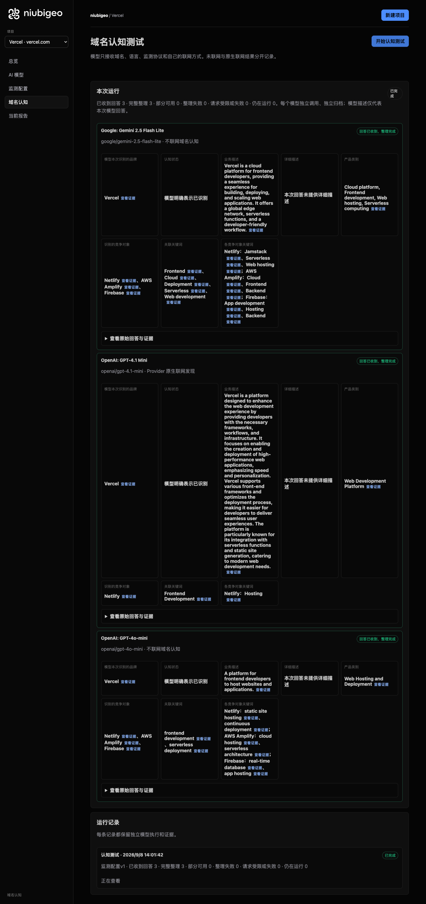
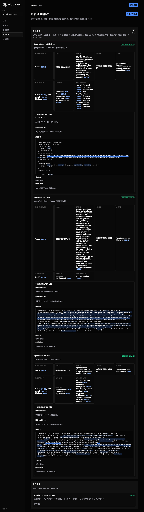
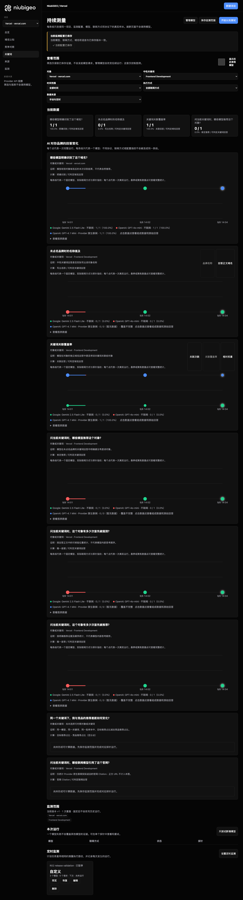
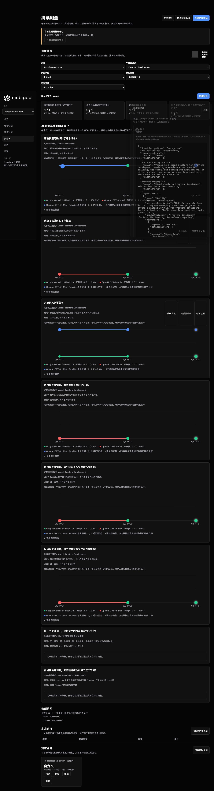

# R02 · vercel.com

[English](./README.md) · [全部案例](../../README.zh-CN.md)

## 本次实际结果

均描述前端部署；三轮关键词观察中保留三条解析失败。

初始 D：3/3 条当前回答可分析；测量 D：9/9 条首次回答可分析；K：6/9 条首次回答可分析。这些是回答覆盖计数，不是认识率或产品指标分母。

执行状态: **部分完成**.



R02 · vercel.com · D · 3 条归档尝试 · openai/gpt-4o-mini（off）、google/gemini-2.5-flash-lite（off）、openai/gpt-4.1-mini（provider_native） · 2026-09-08T06:01:42.187Z 至 2026-09-08T06:01:42.187Z。保留原始失败状态。 截图时间: 2026-09-08T07:18:49.519Z.

## 测试条件

输入域名: vercel.com. 回答语言: en.

协议: D = domain-recognition/v1; K = keyword-discovery/v1.

D 只接收域名、语言、固定协议与模型配置。K 只接收已冻结的中性关键词。分类标签不发送给模型。

- openai/gpt-4o-mini · off
- google/gemini-2.5-flash-lite · off
- openai/gpt-4.1-mini · provider_native

## 各模型的描述

### Google: Gemini 2.5 Flash Lite

**运行时间:** 2026-09-08T06:01:42.187Z

domainRecognition: recognized · analysisStatus: recognized · localAnalysis: complete.

Attempt: 3ea7fabd-ebb6-429e-a2c1-4b449f84774d · completed · executionMode: unverified.

品牌: Vercel

业务: Vercel is a cloud platform for frontend developers, providing a seamless experience for building, deploying, and scaling web applications. It offers a global edge network, serverless functions, and a developer-friendly workflow.

原文位置: UTF-16 [188, 416) · [打开完整回答](#attempt-3ea7fabd-ebb6-429e-a2c1-4b449f84774d)

类别: Cloud platform, Frontend development, Web hosting, Serverless computing

目标关键词: Frontend, Cloud, Deployment, Serverless, Web development

竞争对象:

- Netlify · netlify.com: Netlify is a platform for building and deploying modern web projects. It offers a unified workflow for frontend developers, including hosting, CI/CD, serverless functions, and a global CDN.. 关键词: Jamstack, Serverless, Web hosting
- AWS Amplify · aws.amazon.com/amplify/: AWS Amplify is a set of tools and services that enables frontend and mobile developers to build scalable full-stack applications, powered by AWS.. 关键词: Cloud, Frontend, Backend
- Firebase · firebase.google.com: Firebase is a platform developed by Google for building web and mobile applications. It provides a suite of tools for app development, including hosting, databases, authentication, and analytics.. 关键词: App development, Hosting, Backend

无法确认: —


<a id="attempt-3ea7fabd-ebb6-429e-a2c1-4b449f84774d"></a>

<details><summary>查看模型原始回答</summary>

<pre>{
  "domainRecognition": "recognized",
  "analysisStatus": "recognized",
  "recognizedBrand": {
    "value": "Vercel",
    "citationUrls": []
  },
  "businessDescription": {
    "value": "Vercel is a cloud platform for frontend developers, providing a seamless experience for building, deploying, and scaling web applications. It offers a global edge network, serverless functions, and a developer-friendly workflow.",
    "citationUrls": []
  },
  "productCategory": {
    "value": "Cloud platform, Frontend development, Web hosting, Serverless computing",
    "citationUrls": []
  },
  "competitors": [
    {
      "name": "Netlify",
      "domain": "netlify.com",
      "businessDescription": "Netlify is a platform for building and deploying modern web projects. It offers a unified workflow for frontend developers, including hosting, CI/CD, serverless functions, and a global CDN.",
      "productCategory": "Frontend development platform, Web hosting, Serverless computing",
      "keywords": [
        {
          "keyword": "Jamstack",
          "citationUrls": []
        },
        {
          "keyword": "Serverless",
          "citationUrls": []
        },
        {
          "keyword": "Web hosting",
          "citationUrls": []
        }
      ],
      "citationUrls": []
    },
    {
      "name": "AWS Amplify",
      "domain": "aws.amazon.com/amplify/",
      "businessDescription": "AWS Amplify is a set of tools and services that enables frontend and mobile developers to build scalable full-stack applications, powered by AWS.",
      "productCategory": "Cloud platform, Frontend development, Mobile development",
      "keywords": [
        {
          "keyword": "Cloud",
          "citationUrls": []
        },
        {
          "keyword": "Frontend",
          "citationUrls": []
        },
        {
          "keyword": "Backend",
          "citationUrls": []
        }
      ],
      "citationUrls": []
    },
    {
      "name": "Firebase",
      "domain": "firebase.google.com",
      "businessDescription": "Firebase is a platform developed by Google for building web and mobile applications. It provides a suite of tools for app development, including hosting, databases, authentication, and analytics.",
      "productCategory": "App development platform, Web hosting, Backend services",
      "keywords": [
        {
          "keyword": "App development",
          "citationUrls": []
        },
        {
          "keyword": "Hosting",
          "citationUrls": []
        },
        {
          "keyword": "Backend",
          "citationUrls": []
        }
      ],
      "citationUrls": []
    }
  ],
  "brandKeywords": [
    {
      "keyword": "Frontend",
      "citationUrls": []
    },
    {
      "keyword": "Cloud",
      "citationUrls": []
    },
    {
      "keyword": "Deployment",
      "citationUrls": []
    },
    {
      "keyword": "Serverless",
      "citationUrls": []
    },
    {
      "keyword": "Web development",
      "citationUrls": []
    }
  ],
  "unknowns": []
}</pre>

</details>

SHA-256: `1194b50f511a1e5adda57e5767fa0f5177b5e189597a4c136d234a300ca86974`

[原始回答、字段位置与尝试记录](./public-evidence.json) · SHA-256: `1194b50f511a1e5adda57e5767fa0f5177b5e189597a4c136d234a300ca86974`

<details><summary>关键词与原文位置</summary>

| 归属 | 关键词 | 原文 / UTF-16 位置 |
|---|---|---|
| Vercel | Frontend | Frontend [500, 508) |
| Vercel | Cloud | Cloud [484, 489) |
| Vercel | Deployment | Deployment [2819, 2829) |
| Vercel | Serverless | Serverless [535, 545) |
| Vercel | Web development | Web development [2957, 2972) |
| Netlify | Jamstack | Jamstack [1034, 1042) |
| Netlify | Serverless | Serverless [535, 545) |
| Netlify | Web hosting | Web hosting [522, 533) |
| AWS Amplify | Cloud | Cloud [484, 489) |
| AWS Amplify | Frontend | Frontend [500, 508) |
| AWS Amplify | Backend | Backend [1852, 1859) |
| Firebase | App development | App development [2267, 2282) |
| Firebase | Hosting | Hosting [2467, 2474) |
| Firebase | Backend | Backend [1852, 1859) |

</details>

#### Provider 引用

此 Attempt 未归档此类来源。

#### 搜索检索结果

此 Attempt 未归档此类来源。

#### 回答中的链接（非 Provider 引用）

此 Attempt 未归档正文 URL。

### OpenAI: GPT-4.1 Mini

**运行时间:** 2026-09-08T06:01:42.187Z

domainRecognition: recognized · analysisStatus: recognized · localAnalysis: complete.

Attempt: 3f309cc7-3627-421b-a865-aa03a874d826 · completed · executionMode: native.

品牌: Vercel

业务: Vercel is a platform designed to enhance the web development experience by providing developers with the necessary frameworks, workflows, and infrastructure. It focuses on enabling the creation and deployment of high-performance web applications, emphasizing speed and personalization. Vercel supports various front-end frameworks and optimizes the deployment process, making it easier for developers to deliver seamless user experiences. The platform is particularly known for its integration with serverless functions and static site generation, catering to modern web development needs.

原文位置: UTF-16 [151, 740) · [打开完整回答](#attempt-3f309cc7-3627-421b-a865-aa03a874d826)

类别: Web Development Platform

目标关键词: Frontend Development

竞争对象:

- Netlify · netlify.com: Netlify is a cloud platform that provides hosting and serverless backend services for web applications and static websites. It offers continuous deployment from Git repositories, a global content delivery network, and serverless functions, enabling developers to build and deploy modern web projects efficiently.. 关键词: Hosting

无法确认: —


<a id="attempt-3f309cc7-3627-421b-a865-aa03a874d826"></a>

<details><summary>查看模型原始回答</summary>

<pre>{"domainRecognition":"recognized","analysisStatus":"recognized","recognizedBrand":{"value":"Vercel","citationUrls":[]},"businessDescription":{"value":"Vercel is a platform designed to enhance the web development experience by providing developers with the necessary frameworks, workflows, and infrastructure. It focuses on enabling the creation and deployment of high-performance web applications, emphasizing speed and personalization. Vercel supports various front-end frameworks and optimizes the deployment process, making it easier for developers to deliver seamless user experiences. The platform is particularly known for its integration with serverless functions and static site generation, catering to modern web development needs.","citationUrls":[]},"productCategory":{"value":"Web Development Platform","citationUrls":[]},"competitors":[{"name":"Netlify","domain":"netlify.com","businessDescription":"Netlify is a cloud platform that provides hosting and serverless backend services for web applications and static websites. It offers continuous deployment from Git repositories, a global content delivery network, and serverless functions, enabling developers to build and deploy modern web projects efficiently.","productCategory":"Web Development Platform","keywords":[{"keyword":"Hosting","citationUrls":[]}],"citationUrls":[]}],"brandKeywords":[{"keyword":"Frontend Development","citationUrls":[]}],"unknowns":[]}</pre>

</details>

SHA-256: `7d16ab080125d1611779730d88093e810fa8a2b595ea31851b74e1315327a021`

[原始回答、字段位置与尝试记录](./public-evidence.json) · SHA-256: `7d16ab080125d1611779730d88093e810fa8a2b595ea31851b74e1315327a021`

<details><summary>关键词与原文位置</summary>

| 归属 | 关键词 | 原文 / UTF-16 位置 |
|---|---|---|
| Vercel | Frontend Development | Frontend Development [1374, 1394) |
| Netlify | Hosting | Hosting [1296, 1303) |

</details>

#### Provider 引用

此 Attempt 未归档此类来源。

#### 搜索检索结果

此 Attempt 未归档此类来源。

#### 回答中的链接（非 Provider 引用）

此 Attempt 未归档正文 URL。

### OpenAI: GPT-4o-mini

**运行时间:** 2026-09-08T06:01:42.187Z

domainRecognition: recognized · analysisStatus: recognized · localAnalysis: complete.

Attempt: 1d78e06f-2a7d-408b-a97c-1142e48434aa · completed · executionMode: unverified.

品牌: Vercel

业务: A platform for frontend developers to host websites and applications.

原文位置: UTF-16 [151, 220) · [打开完整回答](#attempt-1d78e06f-2a7d-408b-a97c-1142e48434aa)

类别: Web Hosting and Deployment

目标关键词: frontend development, serverless deployment

竞争对象:

- Netlify · netlify.com: A platform for deploying and hosting static websites and applications.. 关键词: static site hosting, continuous deployment
- AWS Amplify · aws.amazon.com/amplify: A set of tools and services for building scalable mobile and web applications.. 关键词: cloud hosting, serverless architecture
- Firebase · firebase.google.com: A platform for building mobile and web applications, providing backend services.. 关键词: real-time database, app hosting

无法确认: —


<a id="attempt-1d78e06f-2a7d-408b-a97c-1142e48434aa"></a>

<details><summary>查看模型原始回答</summary>

<pre>{"domainRecognition":"recognized","analysisStatus":"recognized","recognizedBrand":{"value":"Vercel","citationUrls":[]},"businessDescription":{"value":"A platform for frontend developers to host websites and applications.","citationUrls":[]},"productCategory":{"value":"Web Hosting and Deployment","citationUrls":[]},"competitors":[{"name":"Netlify","domain":"netlify.com","businessDescription":"A platform for deploying and hosting static websites and applications.","productCategory":"Web Hosting and Deployment","keywords":[{"keyword":"static site hosting","citationUrls":[]},{"keyword":"continuous deployment","citationUrls":[]}],"citationUrls":[]},{"name":"AWS Amplify","domain":"aws.amazon.com/amplify","businessDescription":"A set of tools and services for building scalable mobile and web applications.","productCategory":"Cloud Services","keywords":[{"keyword":"cloud hosting","citationUrls":[]},{"keyword":"serverless architecture","citationUrls":[]}],"citationUrls":[]},{"name":"Firebase","domain":"firebase.google.com","businessDescription":"A platform for building mobile and web applications, providing backend services.","productCategory":"Mobile and Web Development","keywords":[{"keyword":"real-time database","citationUrls":[]},{"keyword":"app hosting","citationUrls":[]}],"citationUrls":[]}],"brandKeywords":[{"keyword":"frontend development","citationUrls":[]},{"keyword":"serverless deployment","citationUrls":[]}],"unknowns":[]}</pre>

</details>

SHA-256: `85e8ee03818e2c8f80b11a090fd9db22508c2944e69080817400c2c027bcf14b`

[原始回答、字段位置与尝试记录](./public-evidence.json) · SHA-256: `85e8ee03818e2c8f80b11a090fd9db22508c2944e69080817400c2c027bcf14b`

<details><summary>关键词与原文位置</summary>

| 归属 | 关键词 | 原文 / UTF-16 位置 |
|---|---|---|
| Vercel | frontend development | frontend development [1339, 1359) |
| Vercel | serverless deployment | serverless deployment [1392, 1413) |
| Netlify | static site hosting | static site hosting [538, 557) |
| Netlify | continuous deployment | continuous deployment [590, 611) |
| AWS Amplify | cloud hosting | cloud hosting [870, 883) |
| AWS Amplify | serverless architecture | serverless architecture [916, 939) |
| Firebase | real-time database | real-time database [1206, 1224) |
| Firebase | app hosting | app hosting [1257, 1268) |

</details>

#### Provider 引用

此 Attempt 未归档此类来源。

#### 搜索检索结果

此 Attempt 未归档此类来源。

#### 回答中的链接（非 Provider 引用）

此 Attempt 未归档正文 URL。

## 中性关键词测试

Frontend Development

K valid 仅指首次 Attempt 的回答可分析，不是产品指标分母。各指标使用归档统计点的 samples、included 和 judgment；后续成功重试不替换此覆盖计数。

筛选记录、原文位置和排除理由见证据文件。每个同条件回答同时观察目标和其他实体，不把离线与联网差异解释为模型优劣。

### Frontend Development · google/gemini-2.5-flash-lite

keywordId: watch-keyword-6af2b440204ecd379022aa62 · runId: 07cb5c01-7756-4a97-a4fb-1d70a3792c2f · probeId: 5ff003cd-d6e9-4767-8737-4693ec3dd4d0

off · completed · firstAttemptId: be8d5234-f5fa-4880-a384-68edcd013f53

analysisStatus: completed · resultAttemptId: be8d5234-f5fa-4880-a384-68edcd013f53

- mentionJudgment: adjudicable
- recommendationJudgment: adjudicable

- Frontend Development: mentioned · mention: Frontend Development · recommendation: — · attemptId: be8d5234-f5fa-4880-a384-68edcd013f53

无法确认: —

[实际请求与原文证据](./public-evidence.json)

#### Attempt be8d5234-f5fa-4880-a384-68edcd013f53

completed · 时间: 2026-09-08T06:02:03.502Z · 首次 Attempt

requestedSearch: off · used: false · executionMode: unverified

finish_reason: stop

<a id="attempt-be8d5234-f5fa-4880-a384-68edcd013f53"></a>

<details><summary>查看模型原始回答</summary>

<pre>{
  "analysisStatus": "completed",
  "mentions": [
    {
      "name": "Frontend Development",
      "domain": null,
      "recommendation": "mentioned",
      "mentionQuote": "Frontend Development",
      "recommendationQuote": null,
      "firstMentionOffset": 0,
      "firstRecommendationOffset": null,
      "firstMentionState": "unique",
      "firstRecommendationState": "none"
    }
  ],
  "unknowns": []
}</pre>

</details>

SHA-256: `c4419356320b9943bf6b7580f6253cd84c9e1ca49c2b67e49f09081d473adff9`

#### Provider 引用

此 Attempt 未归档此类来源。

#### 搜索检索结果

此 Attempt 未归档此类来源。

#### 回答中的链接（非 Provider 引用）

此 Attempt 未归档正文 URL。

### Frontend Development · openai/gpt-4o-mini

keywordId: watch-keyword-6af2b440204ecd379022aa62 · runId: 07cb5c01-7756-4a97-a4fb-1d70a3792c2f · probeId: 1cdbbb79-48e4-4df2-b4a4-b0c5629f7e5b

off · completed · firstAttemptId: cbcb0beb-1a2f-4b3f-9c98-864e87d1a720

analysisStatus: completed · resultAttemptId: cbcb0beb-1a2f-4b3f-9c98-864e87d1a720

- mentionJudgment: adjudicable
- recommendationJudgment: adjudicable

- Frontend Development: mentioned · mention: Frontend Development is a crucial aspect of web development. · recommendation: — · attemptId: cbcb0beb-1a2f-4b3f-9c98-864e87d1a720

无法确认: —

[实际请求与原文证据](./public-evidence.json)

#### Attempt cbcb0beb-1a2f-4b3f-9c98-864e87d1a720

completed · 时间: 2026-09-08T06:02:00.163Z · 首次 Attempt

requestedSearch: off · used: false · executionMode: unverified

finish_reason: stop

<a id="attempt-cbcb0beb-1a2f-4b3f-9c98-864e87d1a720"></a>

<details><summary>查看模型原始回答</summary>

<pre>{"analysisStatus":"completed","mentions":[{"name":"Frontend Development","domain":null,"recommendation":"mentioned","mentionQuote":"Frontend Development is a crucial aspect of web development.","recommendationQuote":null,"firstMentionOffset":0,"firstRecommendationOffset":null,"firstMentionState":"unique","firstRecommendationState":"none"}],"unknowns":[]}</pre>

</details>

SHA-256: `21e4c2c4f3743ef36803acb9964536f91cd1975fd26c724cf3908994e032ea59`

#### Provider 引用

此 Attempt 未归档此类来源。

#### 搜索检索结果

此 Attempt 未归档此类来源。

#### 回答中的链接（非 Provider 引用）

此 Attempt 未归档正文 URL。

### Frontend Development · openai/gpt-4.1-mini

keywordId: watch-keyword-6af2b440204ecd379022aa62 · runId: 07cb5c01-7756-4a97-a4fb-1d70a3792c2f · probeId: e981e3e9-555a-4ad9-9c9a-5300c07213e3

provider_native · failed · firstAttemptId: 027a9e28-7bba-4b7a-a0d1-1dc9acda3fc3

analysisStatus: analysis_failed · resultAttemptId: 027a9e28-7bba-4b7a-a0d1-1dc9acda3fc3

- mentionJudgment: unknown
- recommendationJudgment: unknown


无法确认: Unterminated string in JSON at position 4387 (line 1 column 4388)

[实际请求与原文证据](./public-evidence.json)

#### Attempt 027a9e28-7bba-4b7a-a0d1-1dc9acda3fc3

analysis_failed · 时间: 2026-09-08T06:01:57.968Z · 首次 Attempt

requestedSearch: provider_native · used: true · executionMode: native

OpenRouter metadata confirmed provider-native web search.

错误: analysis_failed · Unterminated string in JSON at position 4387 (line 1 column 4388)

finish_reason: stop

<a id="attempt-027a9e28-7bba-4b7a-a0d1-1dc9acda3fc3"></a>

<details><summary>查看模型原始回答</summary>

<pre>{"analysisStatus":"completed","mentions":[{"name":"React","domain":"reactjs.org","recommendation":"positive","mentionQuote":"\"React remains the world’s most popular frontend library for building dynamic user interfaces.\"","recommendationQuote":"\"React remains the world’s most popular frontend library for building dynamic user interfaces.\"","firstMentionOffset":0,"firstRecommendationOffset":0,"firstMentionState":"unique","firstRecommendationState":"unique"},{"name":"Vue.js","domain":"vuejs.org","recommendation":"positive","mentionQuote":"\"Vue continues its rise due to developer-friendly architecture and fast learning curve.\"","recommendationQuote":"\"Vue continues its rise due to developer-friendly architecture and fast learning curve.\"","firstMentionOffset":0,"firstRecommendationOffset":0,"firstMentionState":"unique","firstRecommendationState":"unique"},{"name":"Angular","domain":"angular.io","recommendation":"positive","mentionQuote":"\"Enterprise-level framework with TypeScript, dependency injection, and state management built-in.\"","recommendationQuote":"\"Enterprise-level framework with TypeScript, dependency injection, and state management built-in.\"","firstMentionOffset":0,"firstRecommendationOffset":0,"firstMentionState":"unique","firstRecommendationState":"unique"},{"name":"Svelte","domain":"svelte.dev","recommendation":"positive","mentionQuote":"\"Svelte and SvelteKit are worth serious consideration. Less boilerplate, faster builds, smaller bundles. Genuinely enjoyable to work with.\"","recommendationQuote":"\"Svelte and SvelteKit are worth serious consideration. Less boilerplate, faster builds, smaller bundles. Genuinely enjoyable to work with.\"","firstMentionOffset":0,"firstRecommendationOffset":0,"firstMentionState":"unique","firstRecommendationState":"unique"},{"name":"Next.js","domain":"nextjs.org","recommendation":"positive","mentionQuote":"\"Next.js is the most popular React framework for SSR, SSG, and full-stack development.\"","recommendationQuote":"\"Next.js is the most popular React framework for SSR, SSG, and full-stack development.\"","firstMentionOffset":0,"firstRecommendationOffset":0,"firstMentionState":"unique","firstRecommendationState":"unique"},{"name":"Tailwind CSS","domain":"tailwindcss.com","recommendation":"positive","mentionQuote":"\"Tailwind CSS is a utility-first CSS framework for rapid UI development.\"","recommendationQuote":"\"Tailwind CSS is a utility-first CSS framework for rapid UI development.\"","firstMentionOffset":0,"firstRecommendationOffset":0,"firstMentionState":"unique","firstRecommendationState":"unique"},{"name":"shadcn/ui","domain":"github.com/shadcn/ui","recommendation":"positive","mentionQuote":"\"shadcn/ui is beautifully-designed, accessible components and a code distribution platform.\"","recommendationQuote":"\"shadcn/ui is beautifully-designed, accessible components and a code distribution platform.\"","firstMentionOffset":0,"firstRecommendationOffset":0,"firstMentionState":"unique","firstRecommendationState":"unique"},{"name":"MUI","domain":"mui.com","recommendation":"positive","mentionQuote":"\"MUI is a comprehensive suite of free UI tools to help you ship new features faster.\"","recommendationQuote":"\"MUI is a comprehensive suite of free UI tools to help you ship new features faster.\"","firstMentionOffset":0,"firstRecommendationOffset":0,"firstMentionState":"unique","firstRecommendationState":"unique"},{"name":"Semantic UI React","domain":"react.semantic-ui.com","recommendation":"positive","mentionQuote":"\"Semantic UI React provides React components.\"","recommendationQuote":"\"Semantic UI React provides React components.\"","firstMentionOffset":0,"firstRecommendationOffset":0,"firstMentionState":"unique","firstRecommendationState":"unique"},{"name":"Chakra UI","domain":"chakra-ui.com","recommendation":"positive","mentionQuote":"\"Chakra UI is a component system for building products with speed.\"","recommendationQuote":"\"Chakra UI is a component system for building products with speed.\"","firstMentionOffset":0,"firstRecommendationOffset":0,"firstMentionState":"unique","firstRecommendationState":"unique"},{"name":"Bootstrap","domain":"getbootstrap.com","recommendation":"positive","mentionQuote":"\"Bootstrap is the most popular HTML, CSS, and JavaScript framework for developing responsive, mobile-first websites.\"","recommendation</pre>

</details>

SHA-256: `d76aec4fb046d6d9d3221380478b0472007723709fb929a1d8c3e0382f857c28`

#### Provider 引用

此 Attempt 未归档此类来源。

#### 搜索检索结果

此 Attempt 未归档此类来源。

#### 回答中的链接（非 Provider 引用）

此 Attempt 未归档正文 URL。

### Frontend Development · openai/gpt-4o-mini

keywordId: watch-keyword-6af2b440204ecd379022aa62 · runId: 7fa563e8-49d8-4fc7-827d-8211be751850 · probeId: 0d96d8a7-bb6c-4e96-958e-6337e6fddf3e

off · completed · firstAttemptId: 12d47fd4-0e9b-459b-a27f-314da6c86ca6

analysisStatus: completed · resultAttemptId: 12d47fd4-0e9b-459b-a27f-314da6c86ca6

- mentionJudgment: adjudicable
- recommendationJudgment: adjudicable

- Frontend Development: mentioned · mention: Frontend Development is a crucial aspect of web development. · recommendation: — · attemptId: 12d47fd4-0e9b-459b-a27f-314da6c86ca6

无法确认: —

[实际请求与原文证据](./public-evidence.json)

#### Attempt 12d47fd4-0e9b-459b-a27f-314da6c86ca6

completed · 时间: 2026-09-08T06:02:18.414Z · 首次 Attempt

requestedSearch: off · used: false · executionMode: unverified

finish_reason: stop

<a id="attempt-12d47fd4-0e9b-459b-a27f-314da6c86ca6"></a>

<details><summary>查看模型原始回答</summary>

<pre>{"analysisStatus":"completed","mentions":[{"name":"Frontend Development","domain":null,"recommendation":"mentioned","mentionQuote":"Frontend Development is a crucial aspect of web development.","recommendationQuote":null,"firstMentionOffset":0,"firstRecommendationOffset":null,"firstMentionState":"unique","firstRecommendationState":"none"}],"unknowns":[]}</pre>

</details>

SHA-256: `21e4c2c4f3743ef36803acb9964536f91cd1975fd26c724cf3908994e032ea59`

#### Provider 引用

此 Attempt 未归档此类来源。

#### 搜索检索结果

此 Attempt 未归档此类来源。

#### 回答中的链接（非 Provider 引用）

此 Attempt 未归档正文 URL。

### Frontend Development · openai/gpt-4.1-mini

keywordId: watch-keyword-6af2b440204ecd379022aa62 · runId: 7fa563e8-49d8-4fc7-827d-8211be751850 · probeId: 83eae328-7e7e-46e8-96a0-262b3f75e032

provider_native · failed · firstAttemptId: e847731b-ed41-455c-801a-03f4e75598ae

analysisStatus: analysis_failed · resultAttemptId: e847731b-ed41-455c-801a-03f4e75598ae

- mentionJudgment: unknown
- recommendationJudgment: unknown


无法确认: Unterminated string in JSON at position 4384 (line 1 column 4385)

[实际请求与原文证据](./public-evidence.json)

#### Attempt e847731b-ed41-455c-801a-03f4e75598ae

analysis_failed · 时间: 2026-09-08T06:02:22.580Z · 首次 Attempt

requestedSearch: provider_native · used: true · executionMode: native

OpenRouter metadata confirmed provider-native web search.

错误: analysis_failed · Unterminated string in JSON at position 4384 (line 1 column 4385)

finish_reason: stop

<a id="attempt-e847731b-ed41-455c-801a-03f4e75598ae"></a>

<details><summary>查看模型原始回答</summary>

<pre>{"analysisStatus":"completed","mentions":[{"name":"React","domain":"reactjs.org","recommendation":"positive","mentionQuote":"\"React remains the world’s most popular frontend library for building dynamic user interfaces.\"","recommendationQuote":"\"React remains the world’s most popular frontend library for building dynamic user interfaces.\"","firstMentionOffset":0,"firstRecommendationOffset":0,"firstMentionState":"unique","firstRecommendationState":"unique"},{"name":"Vue.js","domain":"vuejs.org","recommendation":"positive","mentionQuote":"\"Vue continues its rise due to developer-friendly architecture and fast learning curve.\"","recommendationQuote":"\"Vue continues its rise due to developer-friendly architecture and fast learning curve.\"","firstMentionOffset":0,"firstRecommendationOffset":0,"firstMentionState":"unique","firstRecommendationState":"unique"},{"name":"Angular","domain":"angular.io","recommendation":"positive","mentionQuote":"\"Enterprise-level framework with TypeScript, dependency injection, and state management built-in.\"","recommendationQuote":"\"Enterprise-level framework with TypeScript, dependency injection, and state management built-in.\"","firstMentionOffset":0,"firstRecommendationOffset":0,"firstMentionState":"unique","firstRecommendationState":"unique"},{"name":"Svelte","domain":"svelte.dev","recommendation":"positive","mentionQuote":"\"Svelte and SvelteKit are worth serious consideration. Less boilerplate, faster builds, smaller bundles. Genuinely enjoyable to work with.\"","recommendationQuote":"\"Svelte and SvelteKit are worth serious consideration. Less boilerplate, faster builds, smaller bundles. Genuinely enjoyable to work with.\"","firstMentionOffset":0,"firstRecommendationOffset":0,"firstMentionState":"unique","firstRecommendationState":"unique"},{"name":"Next.js","domain":"nextjs.org","recommendation":"positive","mentionQuote":"\"Next.js is the most popular React framework for SSR, SSG, and full-stack development.\"","recommendationQuote":"\"Next.js is the most popular React framework for SSR, SSG, and full-stack development.\"","firstMentionOffset":0,"firstRecommendationOffset":0,"firstMentionState":"unique","firstRecommendationState":"unique"},{"name":"Tailwind CSS","domain":"tailwindcss.com","recommendation":"positive","mentionQuote":"\"Tailwind CSS is a utility-first CSS framework for rapid UI development.\"","recommendationQuote":"\"Tailwind CSS is a utility-first CSS framework for rapid UI development.\"","firstMentionOffset":0,"firstRecommendationOffset":0,"firstMentionState":"unique","firstRecommendationState":"unique"},{"name":"shadcn/ui","domain":"github.com/shadcn/ui","recommendation":"positive","mentionQuote":"\"shadcn/ui is a collection of beautifully-designed, accessible components and a code distribution platform.\"","recommendationQuote":"\"shadcn/ui is a collection of beautifully-designed, accessible components and a code distribution platform.\"","firstMentionOffset":0,"firstRecommendationOffset":0,"firstMentionState":"unique","firstRecommendationState":"unique"},{"name":"MUI","domain":"mui.com","recommendation":"positive","mentionQuote":"\"MUI is a comprehensive suite of free UI tools to help you ship new features faster.\"","recommendationQuote":"\"MUI is a comprehensive suite of free UI tools to help you ship new features faster.\"","firstMentionOffset":0,"firstRecommendationOffset":0,"firstMentionState":"unique","firstRecommendationState":"unique"},{"name":"Semantic UI React","domain":"react.semantic-ui.com","recommendation":"positive","mentionQuote":"\"Semantic UI React provides React components.\"","recommendationQuote":"\"Semantic UI React provides React components.\"","firstMentionOffset":0,"firstRecommendationOffset":0,"firstMentionState":"unique","firstRecommendationState":"unique"},{"name":"Chakra UI","domain":"chakra-ui.com","recommendation":"positive","mentionQuote":"\"Chakra UI is a component system for building products with speed.\"","recommendationQuote":"\"Chakra UI is a component system for building products with speed.\"","firstMentionOffset":0,"firstRecommendationOffset":0,"firstMentionState":"unique","firstRecommendationState":"unique"},{"name":"Bootstrap","domain":"getbootstrap.com","recommendation":"positive","mentionQuote":"\"Bootstrap is the most popular HTML, CSS, and JavaScript framework for developing responsive, mobile</pre>

</details>

SHA-256: `e28f6793827d5dd65cfdae31983bb0ebb251e7f24988fe3e09e1e7596242bf96`

#### Provider 引用

此 Attempt 未归档此类来源。

#### 搜索检索结果

此 Attempt 未归档此类来源。

#### 回答中的链接（非 Provider 引用）

此 Attempt 未归档正文 URL。

### Frontend Development · google/gemini-2.5-flash-lite

keywordId: watch-keyword-6af2b440204ecd379022aa62 · runId: 7fa563e8-49d8-4fc7-827d-8211be751850 · probeId: a8a48ffe-0a7e-43ad-8ee0-d1240b25f9cb

off · completed · firstAttemptId: 96db102f-5723-4d3c-8ba2-a37c3f9f8c70

analysisStatus: completed · resultAttemptId: 96db102f-5723-4d3c-8ba2-a37c3f9f8c70

- mentionJudgment: adjudicable
- recommendationJudgment: adjudicable

- Frontend Development: mentioned · mention: Frontend Development · recommendation: — · attemptId: 96db102f-5723-4d3c-8ba2-a37c3f9f8c70

无法确认: —

[实际请求与原文证据](./public-evidence.json)

#### Attempt 96db102f-5723-4d3c-8ba2-a37c3f9f8c70

completed · 时间: 2026-09-08T06:02:15.394Z · 首次 Attempt

requestedSearch: off · used: false · executionMode: unverified

finish_reason: stop

<a id="attempt-96db102f-5723-4d3c-8ba2-a37c3f9f8c70"></a>

<details><summary>查看模型原始回答</summary>

<pre>{
  "analysisStatus": "completed",
  "mentions": [
    {
      "name": "Frontend Development",
      "domain": null,
      "recommendation": "mentioned",
      "mentionQuote": "Frontend Development",
      "recommendationQuote": null,
      "firstMentionOffset": 0,
      "firstRecommendationOffset": null,
      "firstMentionState": "unique",
      "firstRecommendationState": "none"
    }
  ],
  "unknowns": []
}</pre>

</details>

SHA-256: `c4419356320b9943bf6b7580f6253cd84c9e1ca49c2b67e49f09081d473adff9`

#### Provider 引用

此 Attempt 未归档此类来源。

#### 搜索检索结果

此 Attempt 未归档此类来源。

#### 回答中的链接（非 Provider 引用）

此 Attempt 未归档正文 URL。

### Frontend Development · openai/gpt-4o-mini

keywordId: watch-keyword-6af2b440204ecd379022aa62 · runId: 8664bb78-863f-4d58-946a-4418cc461445 · probeId: a74e9004-8313-4901-9277-e60888b87aa0

off · completed · firstAttemptId: 48aad923-e494-468c-b6e8-c3c409bfd171

analysisStatus: completed · resultAttemptId: 48aad923-e494-468c-b6e8-c3c409bfd171

- mentionJudgment: adjudicable
- recommendationJudgment: adjudicable

- Frontend Development: mentioned · mention: Frontend Development is a crucial aspect of web development. · recommendation: — · attemptId: 48aad923-e494-468c-b6e8-c3c409bfd171

无法确认: —

[实际请求与原文证据](./public-evidence.json)

#### Attempt 48aad923-e494-468c-b6e8-c3c409bfd171

completed · 时间: 2026-09-08T06:04:53.251Z · 首次 Attempt

requestedSearch: off · used: false · executionMode: unverified

finish_reason: stop

<a id="attempt-48aad923-e494-468c-b6e8-c3c409bfd171"></a>

<details><summary>查看模型原始回答</summary>

<pre>{"analysisStatus":"completed","mentions":[{"name":"Frontend Development","domain":null,"recommendation":"mentioned","mentionQuote":"Frontend Development is a crucial aspect of web development.","recommendationQuote":null,"firstMentionOffset":0,"firstRecommendationOffset":null,"firstMentionState":"unique","firstRecommendationState":"none"}],"unknowns":[]}</pre>

</details>

SHA-256: `21e4c2c4f3743ef36803acb9964536f91cd1975fd26c724cf3908994e032ea59`

#### Provider 引用

此 Attempt 未归档此类来源。

#### 搜索检索结果

此 Attempt 未归档此类来源。

#### 回答中的链接（非 Provider 引用）

此 Attempt 未归档正文 URL。

### Frontend Development · google/gemini-2.5-flash-lite

keywordId: watch-keyword-6af2b440204ecd379022aa62 · runId: 8664bb78-863f-4d58-946a-4418cc461445 · probeId: 68460ba0-cba8-415a-92f7-91cb0beaaf05

off · completed · firstAttemptId: 791f2355-eb01-4212-a9fb-3cce5a8cf007

analysisStatus: completed · resultAttemptId: 791f2355-eb01-4212-a9fb-3cce5a8cf007

- mentionJudgment: adjudicable
- recommendationJudgment: adjudicable

- Frontend Development: mentioned · mention: Frontend Development · recommendation: — · attemptId: 791f2355-eb01-4212-a9fb-3cce5a8cf007

无法确认: —

[实际请求与原文证据](./public-evidence.json)

#### Attempt 791f2355-eb01-4212-a9fb-3cce5a8cf007

completed · 时间: 2026-09-08T06:04:47.762Z · 首次 Attempt

requestedSearch: off · used: false · executionMode: unverified

finish_reason: stop

<a id="attempt-791f2355-eb01-4212-a9fb-3cce5a8cf007"></a>

<details><summary>查看模型原始回答</summary>

<pre>{
  "analysisStatus": "completed",
  "mentions": [
    {
      "name": "Frontend Development",
      "domain": null,
      "recommendation": "mentioned",
      "mentionQuote": "Frontend Development",
      "recommendationQuote": null,
      "firstMentionOffset": 0,
      "firstRecommendationOffset": null,
      "firstMentionState": "unique",
      "firstRecommendationState": "none"
    }
  ],
  "unknowns": []
}</pre>

</details>

SHA-256: `c4419356320b9943bf6b7580f6253cd84c9e1ca49c2b67e49f09081d473adff9`

#### Provider 引用

此 Attempt 未归档此类来源。

#### 搜索检索结果

此 Attempt 未归档此类来源。

#### 回答中的链接（非 Provider 引用）

此 Attempt 未归档正文 URL。

### Frontend Development · openai/gpt-4.1-mini

keywordId: watch-keyword-6af2b440204ecd379022aa62 · runId: 8664bb78-863f-4d58-946a-4418cc461445 · probeId: 1c1fcfac-3899-41bc-9246-15a74cf4cdc8

provider_native · failed · firstAttemptId: edad1b8e-c9aa-47e9-8d1c-930f4aac72f3

analysisStatus: analysis_failed · resultAttemptId: edad1b8e-c9aa-47e9-8d1c-930f4aac72f3

- mentionJudgment: unknown
- recommendationJudgment: unknown


无法确认: Unterminated string in JSON at position 4396 (line 1 column 4397)

[实际请求与原文证据](./public-evidence.json)

#### Attempt edad1b8e-c9aa-47e9-8d1c-930f4aac72f3

analysis_failed · 时间: 2026-09-08T06:04:51.042Z · 首次 Attempt

requestedSearch: provider_native · used: true · executionMode: native

OpenRouter metadata confirmed provider-native web search.

错误: analysis_failed · Unterminated string in JSON at position 4396 (line 1 column 4397)

finish_reason: stop

<a id="attempt-edad1b8e-c9aa-47e9-8d1c-930f4aac72f3"></a>

<details><summary>查看模型原始回答</summary>

<pre>{"analysisStatus":"completed","mentions":[{"name":"React","domain":"reactjs.org","recommendation":"positive","mentionQuote":"\"React remains the world’s most popular frontend library for building dynamic user interfaces.\"","recommendationQuote":"\"React remains the world’s most popular frontend library for building dynamic user interfaces.\"","firstMentionOffset":0,"firstRecommendationOffset":0,"firstMentionState":"unique","firstRecommendationState":"unique"},{"name":"Vue.js","domain":"vuejs.org","recommendation":"positive","mentionQuote":"\"Vue continues its rise due to developer-friendly architecture and fast learning curve.\"","recommendationQuote":"\"Vue continues its rise due to developer-friendly architecture and fast learning curve.\"","firstMentionOffset":0,"firstRecommendationOffset":0,"firstMentionState":"unique","firstRecommendationState":"unique"},{"name":"Angular","domain":"angular.io","recommendation":"positive","mentionQuote":"\"Enterprise-level framework with TypeScript, dependency injection, and state management built-in.\"","recommendationQuote":"\"Enterprise-level framework with TypeScript, dependency injection, and state management built-in.\"","firstMentionOffset":0,"firstRecommendationOffset":0,"firstMentionState":"unique","firstRecommendationState":"unique"},{"name":"Svelte","domain":"svelte.dev","recommendation":"positive","mentionQuote":"\"Svelte and SvelteKit are worth serious consideration. Less boilerplate, faster builds, smaller bundles.\"","recommendationQuote":"\"Svelte and SvelteKit are worth serious consideration. Less boilerplate, faster builds, smaller bundles.\"","firstMentionOffset":0,"firstRecommendationOffset":0,"firstMentionState":"unique","firstRecommendationState":"unique"},{"name":"Next.js","domain":"nextjs.org","recommendation":"positive","mentionQuote":"\"Next.js is the most popular React framework for SSR, SSG, and full-stack development.\"","recommendationQuote":"\"Next.js is the most popular React framework for SSR, SSG, and full-stack development.\"","firstMentionOffset":0,"firstRecommendationOffset":0,"firstMentionState":"unique","firstRecommendationState":"unique"},{"name":"Tailwind CSS","domain":"tailwindcss.com","recommendation":"positive","mentionQuote":"\"Tailwind CSS is a utility-first CSS framework for rapid UI development.\"","recommendationQuote":"\"Tailwind CSS is a utility-first CSS framework for rapid UI development.\"","firstMentionOffset":0,"firstRecommendationOffset":0,"firstMentionState":"unique","firstRecommendationState":"unique"},{"name":"shadcn/ui","domain":"github.com/shadcn/ui","recommendation":"positive","mentionQuote":"\"shadcn/ui is a collection of beautifully-designed, accessible components and a code distribution platform.\"","recommendationQuote":"\"shadcn/ui is a collection of beautifully-designed, accessible components and a code distribution platform.\"","firstMentionOffset":0,"firstRecommendationOffset":0,"firstMentionState":"unique","firstRecommendationState":"unique"},{"name":"MUI","domain":"mui.com","recommendation":"positive","mentionQuote":"\"MUI is a comprehensive suite of free UI tools to help you ship new features faster.\"","recommendationQuote":"\"MUI is a comprehensive suite of free UI tools to help you ship new features faster.\"","firstMentionOffset":0,"firstRecommendationOffset":0,"firstMentionState":"unique","firstRecommendationState":"unique"},{"name":"Semantic UI React","domain":"react.semantic-ui.com","recommendation":"positive","mentionQuote":"\"Semantic UI React provides React components.\"","recommendationQuote":"\"Semantic UI React provides React components.\"","firstMentionOffset":0,"firstRecommendationOffset":0,"firstMentionState":"unique","firstRecommendationState":"unique"},{"name":"Chakra UI","domain":"chakra-ui.com","recommendation":"positive","mentionQuote":"\"Chakra UI is a component system for building products with speed.\"","recommendationQuote":"\"Chakra UI is a component system for building products with speed.\"","firstMentionOffset":0,"firstRecommendationOffset":0,"firstMentionState":"unique","firstRecommendationState":"unique"},{"name":"Bootstrap","domain":"getbootstrap.com","recommendation":"positive","mentionQuote":"\"Bootstrap is the most popular HTML, CSS, and JavaScript framework for developing responsive, mobile-first websites.\"","recommendationQuote":"\"Bootstrap is the most popular HTML,</pre>

</details>

SHA-256: `8ea61418528f2ab1f8bc2bbb8c8a2e6f38bc32ecd24cdbc85365e71d2b0c990a`

#### Provider 引用

此 Attempt 未归档此类来源。

#### 搜索检索结果

此 Attempt 未归档此类来源。

#### 回答中的链接（非 Provider 引用）

此 Attempt 未归档正文 URL。

## 重复观察

3 次归档测量运行；数量不表示全部成功。只比较相同模型、语言、搜索与指纹条件。短期重复不代表长期趋势或因果效果。

- Run 07cb5c01-7756-4a97-a4fb-1d70a3792c2f: partial
- Run 7fa563e8-49d8-4fc7-827d-8211be751850: partial
- Run 8664bb78-863f-4d58-946a-4418cc461445: partial

- D 4e8f7b60-2a2f-4c34-85a7-dec41394db62 · google/gemini-2.5-flash-lite · domainRecognition: recognized · analysisStatus: recognized · firstAttemptId: 37c41145-de67-4f60-a640-22b49efbb890 · resultAttemptId: 37c41145-de67-4f60-a640-22b49efbb890
- D a1564c6b-1f37-46bb-bfd7-f4ca414bded7 · openai/gpt-4o-mini · domainRecognition: recognized · analysisStatus: recognized · firstAttemptId: eb197f10-e24f-4311-8285-8053a3da774d · resultAttemptId: eb197f10-e24f-4311-8285-8053a3da774d
- D 377f8d2a-3ea5-4076-9282-5e5742e53832 · openai/gpt-4.1-mini · domainRecognition: recognized · analysisStatus: recognized · firstAttemptId: da8fa86e-8b81-4bd0-a86f-258cdd807963 · resultAttemptId: da8fa86e-8b81-4bd0-a86f-258cdd807963
- D ea47db84-e07d-4de3-b95b-df9a91801f46 · openai/gpt-4o-mini · domainRecognition: recognized · analysisStatus: recognized · firstAttemptId: 8a479e68-8bfc-4ae9-9bb0-c64d176517c7 · resultAttemptId: 8a479e68-8bfc-4ae9-9bb0-c64d176517c7
- D 8acbc4a2-0c2c-40c2-9c6d-e9ca0e84f061 · openai/gpt-4.1-mini · domainRecognition: recognized · analysisStatus: recognized · firstAttemptId: f4aff0ba-89f8-48ed-b806-546927f0de8c · resultAttemptId: f4aff0ba-89f8-48ed-b806-546927f0de8c
- D 3870fff6-f30b-4bbb-9f03-ef86cd5dc501 · google/gemini-2.5-flash-lite · domainRecognition: recognized · analysisStatus: recognized · firstAttemptId: 46dbedc9-459d-4f5d-99ce-ced9cb14a6cd · resultAttemptId: 46dbedc9-459d-4f5d-99ce-ced9cb14a6cd
- D 930b51ee-0ec1-4fd9-bdfd-9736c79a03a7 · openai/gpt-4o-mini · domainRecognition: recognized · analysisStatus: recognized · firstAttemptId: 4d69ec1c-f33f-4e82-93be-d3f128864f4f · resultAttemptId: 4d69ec1c-f33f-4e82-93be-d3f128864f4f
- D ecba83b6-692f-49e2-a3d6-ed03aa9661c8 · google/gemini-2.5-flash-lite · domainRecognition: recognized · analysisStatus: recognized · firstAttemptId: 571f7773-1af5-4a51-b503-a6b7b3ee4254 · resultAttemptId: 571f7773-1af5-4a51-b503-a6b7b3ee4254
- D 7fdb1aba-5116-490b-8f63-b192f73c9f8f · openai/gpt-4.1-mini · domainRecognition: recognized · analysisStatus: recognized · firstAttemptId: a03c64c6-164b-454e-8283-3040cc40bb48 · resultAttemptId: a03c64c6-164b-454e-8283-3040cc40bb48

### 调度归档

收集时任务状态（历史快照）: active

最终任务归档状态: paused · nextRunAt: — · updatedAt: 2026-09-08T06:05:02.803Z

product-data/projects/63bdc2d8-2f1d-48d1-9aca-ac944b47fb49/schedules/tasks/3d2cd7fe-2df3-4752-8794-e7813a144936.json · SHA-256: `991c8a8cb0e9639ce45123ed7fbdb182308ec1bc19dbc30afe104778b94b7d50`

- Occurrence 6dd64f39-9553-4732-bb57-0619d2bc8c66: completed · reason: run_partial_or_failed · runId: 8664bb78-863f-4d58-946a-4418cc461445 · scheduledFor: 2026-09-08T06:03:00.000Z

Occurrence completed 表示调度记录结束；关联 Run 的 partial/failed 仍是部分失败或失败。

## 产品截图



R02 · vercel.com · D · 3 条归档尝试 · openai/gpt-4o-mini（off）、google/gemini-2.5-flash-lite（off）、openai/gpt-4.1-mini（provider_native） · 2026-09-08T06:01:42.187Z 至 2026-09-08T06:01:42.187Z。保留原始失败状态。

截图时间: 2026-09-08T07:18:49.917Z.



R02 · vercel.com · D/K · 18 条归档尝试 · openai/gpt-4o-mini（off）、google/gemini-2.5-flash-lite（off）、openai/gpt-4.1-mini（provider_native） · 2026-09-08T06:01:54.266Z 至 2026-09-08T06:04:51.042Z。保留原始失败状态。

截图时间: 2026-09-08T07:18:54.520Z.



R02 · vercel.com · D/K · 18 条归档尝试 · openai/gpt-4o-mini（off）、google/gemini-2.5-flash-lite（off）、openai/gpt-4.1-mini（provider_native） · 2026-09-08T06:01:54.266Z 至 2026-09-08T06:04:51.042Z。保留原始失败状态。

截图时间: 2026-09-08T07:18:56.217Z.

## 复核与重新测量

[案例配置](./case.json) · [证据索引](./evidence-index.json) · [公开证据包](./public-evidence.json)

SHA-256: `9dfb542106e61a68ed376e73df3fc967fb9f6eb60fc79b19b1e99757916f0928`

历史案例费用（非本轮文档费用）: USD 0.10424000 · 21 次调用 · 76758 Token.

[导出源码](../../../examples/lib/export.mjs) · [候选版本与未发布状态](../../../docs/releases/v0.2.0-rc.1.md)

```bash
npm run examples:plan -- --case R02
npm run examples:replay -- --case R02 --evidence examples/cases/R02/public-evidence.json
```

重新测量会收费：必须使用独立产品服务、冻结计划和显式 live 授权。阅读或导出不调用模型。

## 限制与披露

仅作公开产品观察；收录不表示合作或背书关系。

模型描述不是已核实的市场事实。来源存在不证明页面内容正确，也不说明为何推荐。未知、缺失、解析失败与请求失败保持区分。可据此调查业务误述或来源内容，但不能断言差距由某次优化造成。

- Run 07cb5c01-7756-4a97-a4fb-1d70a3792c2f: partial
- Run 7fa563e8-49d8-4fc7-827d-8211be751850: partial
- Run 8664bb78-863f-4d58-946a-4418cc461445: partial
- Probe e981e3e9-555a-4ad9-9c9a-5300c07213e3: failed; first attempt analysis_failed
- Probe e981e3e9-555a-4ad9-9c9a-5300c07213e3: missing or failed analysis
- Probe 83eae328-7e7e-46e8-96a0-262b3f75e032: failed; first attempt analysis_failed
- Probe 83eae328-7e7e-46e8-96a0-262b3f75e032: missing or failed analysis
- Probe 1c1fcfac-3899-41bc-9246-15a74cf4cdc8: failed; first attempt analysis_failed
- Probe 1c1fcfac-3899-41bc-9246-15a74cf4cdc8: missing or failed analysis
- Attempt 027a9e28-7bba-4b7a-a0d1-1dc9acda3fc3: analysis_failed; Unterminated string in JSON at position 4387 (line 1 column 4388)
- Attempt e847731b-ed41-455c-801a-03f4e75598ae: analysis_failed; Unterminated string in JSON at position 4384 (line 1 column 4385)
- Attempt edad1b8e-c9aa-47e9-8d1c-930f4aac72f3: analysis_failed; Unterminated string in JSON at position 4396 (line 1 column 4397)
- Occurrence 6dd64f39-9553-4732-bb57-0619d2bc8c66: completed; run_partial_or_failed
