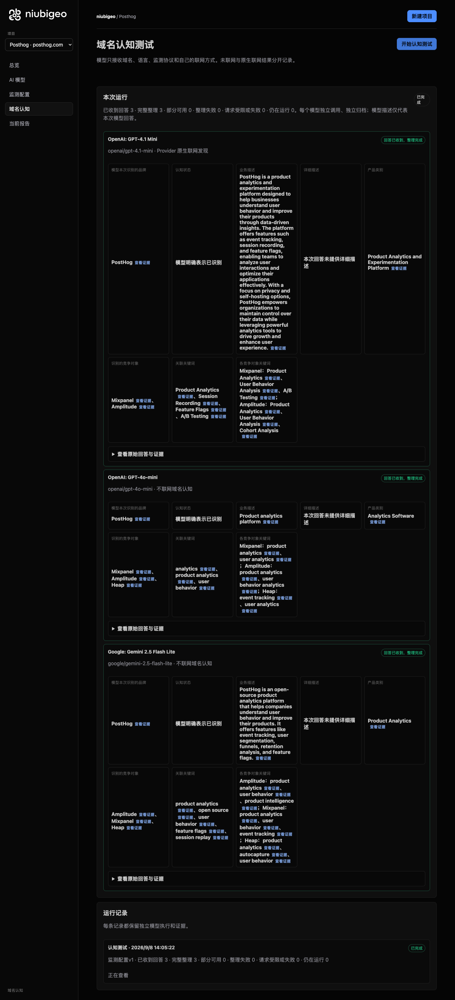
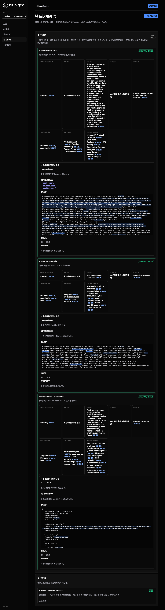
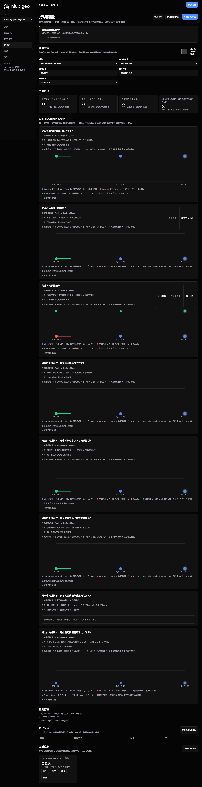
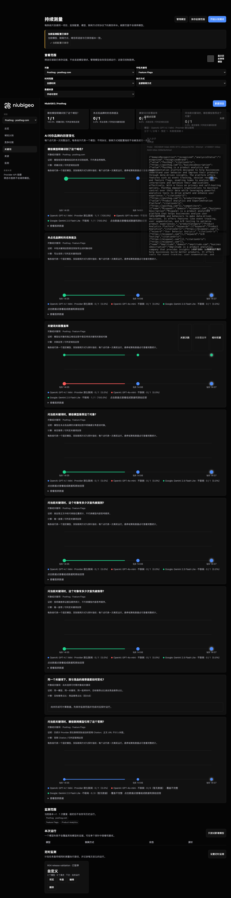

# R04 · posthog.com

[简体中文](./README.zh-CN.md) · [All cases](../../README.md)

## Observed result

Feature Flags answers returned actual citations; all three repeats remain partial.

Initial D: 3/3 analyzable current answers. Measurement D: 9/9 analyzable first answers. K: 15/18 analyzable first answers. These are answer-coverage counts, not recognition rates or product metric denominators.

Execution status: **partial**.



R04 · posthog.com · D · 3 archived attempts · openai/gpt-4o-mini (off), google/gemini-2.5-flash-lite (off), openai/gpt-4.1-mini (provider_native) · 2026-09-08T06:05:22.972Z to 2026-09-08T06:05:22.972Z. Original failures remain visible. Captured: 2026-09-08T07:18:57.709Z.

## Conditions

Input domain: posthog.com. Answer language: en.

Protocols: D = domain-recognition/v1; K = keyword-discovery/v1.

D receives the domain, language, fixed protocol and model settings. K receives a frozen neutral keyword. Browsing categories are not sent to models.

- openai/gpt-4o-mini · off
- google/gemini-2.5-flash-lite · off
- openai/gpt-4.1-mini · provider_native

## Model observations

### OpenAI: GPT-4.1 Mini

**Observed at:** 2026-09-08T06:05:22.972Z

domainRecognition: recognized · analysisStatus: recognized · localAnalysis: complete.

Attempt: a609edab-52e1-42ca-b4f0-dfabe1e86cfe · completed · executionMode: native.

Brand: PostHog

Business: PostHog is a product analytics and experimentation platform designed to help businesses understand user behavior and improve their products through data-driven insights. The platform offers features such as event tracking, session recording, and feature flags, enabling teams to analyze user interactions and optimize their applications effectively. With a focus on privacy and self-hosting options, PostHog empowers organizations to maintain control over their data while leveraging powerful analytics tools to drive growth and enhance user experience.

Original span: UTF-16 [173, 726) · [Full answer](#attempt-a609edab-52e1-42ca-b4f0-dfabe1e86cfe)

Category: Product Analytics and Experimentation Platform

Brand keywords: Product Analytics, Session Recording, Feature Flags, A/B Testing

Competitors named by this model:

- Mixpanel · mixpanel.com: Mixpanel is a product analytics platform that helps businesses analyze user interactions and behaviors to make data-driven decisions. It offers features like event tracking, user segmentation, and A/B testing to optimize product experiences.. Keywords: Product Analytics, User Behavior Analysis, A/B Testing
- Amplitude · amplitude.com: Amplitude is a product analytics platform that enables businesses to understand user behavior and product usage. It provides tools for event tracking, user segmentation, and cohort analysis to inform product decisions.. Keywords: Product Analytics, User Behavior Analysis, Cohort Analysis

Uncertain: —


<a id="attempt-a609edab-52e1-42ca-b4f0-dfabe1e86cfe"></a>

<details><summary>Read the original answer</summary>

<pre>{"domainRecognition":"recognized","analysisStatus":"recognized","recognizedBrand":{"value":"PostHog","citationUrls":["https://posthog.com"]},"businessDescription":{"value":"PostHog is a product analytics and experimentation platform designed to help businesses understand user behavior and improve their products through data-driven insights. The platform offers features such as event tracking, session recording, and feature flags, enabling teams to analyze user interactions and optimize their applications effectively. With a focus on privacy and self-hosting options, PostHog empowers organizations to maintain control over their data while leveraging powerful analytics tools to drive growth and enhance user experience.","citationUrls":["https://posthog.com"]},"productCategory":{"value":"Product Analytics and Experimentation Platform","citationUrls":["https://posthog.com"]},"competitors":[{"name":"Mixpanel","domain":"mixpanel.com","businessDescription":"Mixpanel is a product analytics platform that helps businesses analyze user interactions and behaviors to make data-driven decisions. It offers features like event tracking, user segmentation, and A/B testing to optimize product experiences.","productCategory":"Product Analytics Platform","keywords":[{"keyword":"Product Analytics","citationUrls":["https://mixpanel.com"]},{"keyword":"User Behavior Analysis","citationUrls":["https://mixpanel.com"]},{"keyword":"A/B Testing","citationUrls":["https://mixpanel.com"]}],"citationUrls":["https://mixpanel.com"]},{"name":"Amplitude","domain":"amplitude.com","businessDescription":"Amplitude is a product analytics platform that enables businesses to understand user behavior and product usage. It provides tools for event tracking, user segmentation, and cohort analysis to inform product decisions.","productCategory":"Product Analytics Platform","keywords":[{"keyword":"Product Analytics","citationUrls":["https://amplitude.com"]},{"keyword":"User Behavior Analysis","citationUrls":["https://amplitude.com"]},{"keyword":"Cohort Analysis","citationUrls":["https://amplitude.com"]}],"citationUrls":["https://amplitude.com"]}],"brandKeywords":[{"keyword":"Product Analytics","citationUrls":["https://posthog.com"]},{"keyword":"Session Recording","citationUrls":["https://posthog.com"]},{"keyword":"Feature Flags","citationUrls":["https://posthog.com"]},{"keyword":"A/B Testing","citationUrls":["https://posthog.com"]}],"unknowns":[]}</pre>

</details>

SHA-256: `9e6170e9ebd812cf49dda728f04d145646c5d8fa8059f10bdf13ac9653b6dced`

[Answer, field offsets and attempts](./public-evidence.json) · SHA-256: `9e6170e9ebd812cf49dda728f04d145646c5d8fa8059f10bdf13ac9653b6dced`

<details><summary>Keyword provenance and original spans</summary>

| Owner | Keyword | Original text / UTF-16 span |
|---|---|---|
| PostHog | Product Analytics | Product Analytics [796, 813) |
| PostHog | Session Recording | Session Recording [2237, 2254) |
| PostHog | Feature Flags | Feature Flags [2308, 2321) |
| PostHog | A/B Testing | A/B Testing [1428, 1439) |
| Mixpanel | Product Analytics | Product Analytics [796, 813) |
| Mixpanel | User Behavior Analysis | User Behavior Analysis [1351, 1373) |
| Mixpanel | A/B Testing | A/B Testing [1428, 1439) |
| Amplitude | Product Analytics | Product Analytics [796, 813) |
| Amplitude | User Behavior Analysis | User Behavior Analysis [1351, 1373) |
| Amplitude | Cohort Analysis | Cohort Analysis [2034, 2049) |

</details>

#### Provider citations

No sources of this type were archived for this attempt.

#### Search retrieval results

No sources of this type were archived for this attempt.

#### Links in the answer (not Provider citations)

- [https://posthog.com/](<https://posthog.com/>)
- [https://mixpanel.com/](<https://mixpanel.com/>)
- [https://amplitude.com/](<https://amplitude.com/>)

### OpenAI: GPT-4o-mini

**Observed at:** 2026-09-08T06:05:22.972Z

domainRecognition: recognized · analysisStatus: recognized · localAnalysis: complete.

Attempt: f1d3ac60-7c35-4438-8dfa-88ce46748d2b · completed · executionMode: unverified.

Brand: PostHog

Business: Product analytics platform

Original span: UTF-16 [152, 178) · [Full answer](#attempt-f1d3ac60-7c35-4438-8dfa-88ce46748d2b)

Category: Analytics Software

Brand keywords: analytics, product analytics, user behavior

Competitors named by this model:

- Mixpanel · mixpanel.com: Product analytics platform. Keywords: product analytics, user analytics
- Amplitude · amplitude.com: Product analytics platform. Keywords: product analytics, user behavior analytics
- Heap · heap.io: Product analytics platform. Keywords: event tracking, user analytics

Uncertain: —


<a id="attempt-f1d3ac60-7c35-4438-8dfa-88ce46748d2b"></a>

<details><summary>Read the original answer</summary>

<pre>{"domainRecognition":"recognized","analysisStatus":"recognized","recognizedBrand":{"value":"PostHog","citationUrls":[]},"businessDescription":{"value":"Product analytics platform","citationUrls":[]},"productCategory":{"value":"Analytics Software","citationUrls":[]},"competitors":[{"name":"Mixpanel","domain":"mixpanel.com","businessDescription":"Product analytics platform","productCategory":"Analytics Software","keywords":[{"keyword":"product analytics","citationUrls":[]},{"keyword":"user analytics","citationUrls":[]}],"citationUrls":[]},{"name":"Amplitude","domain":"amplitude.com","businessDescription":"Product analytics platform","productCategory":"Analytics Software","keywords":[{"keyword":"product analytics","citationUrls":[]},{"keyword":"user behavior analytics","citationUrls":[]}],"citationUrls":[]},{"name":"Heap","domain":"heap.io","businessDescription":"Product analytics platform","productCategory":"Analytics Software","keywords":[{"keyword":"event tracking","citationUrls":[]},{"keyword":"user analytics","citationUrls":[]}],"citationUrls":[]}],"brandKeywords":[{"keyword":"analytics","citationUrls":[]},{"keyword":"product analytics","citationUrls":[]},{"keyword":"user behavior","citationUrls":[]}],"unknowns":[]}</pre>

</details>

SHA-256: `ed46b4807cee05444f61edad41b3edefb79c1e7e79acd91701da106d82d7ed20`

[Answer, field offsets and attempts](./public-evidence.json) · SHA-256: `ed46b4807cee05444f61edad41b3edefb79c1e7e79acd91701da106d82d7ed20`

<details><summary>Keyword provenance and original spans</summary>

| Owner | Keyword | Original text / UTF-16 span |
|---|---|---|
| PostHog | analytics | analytics [160, 169) |
| PostHog | product analytics | product analytics [438, 455) |
| PostHog | user behavior | user behavior [752, 765) |
| Mixpanel | product analytics | product analytics [438, 455) |
| Mixpanel | user analytics | user analytics [488, 502) |
| Amplitude | product analytics | product analytics [438, 455) |
| Amplitude | user behavior analytics | user behavior analytics [752, 775) |
| Heap | event tracking | event tracking [964, 978) |
| Heap | user analytics | user analytics [488, 502) |

</details>

#### Provider citations

No sources of this type were archived for this attempt.

#### Search retrieval results

No sources of this type were archived for this attempt.

#### Links in the answer (not Provider citations)

No answer URLs were archived for this attempt.

### Google: Gemini 2.5 Flash Lite

**Observed at:** 2026-09-08T06:05:22.972Z

domainRecognition: recognized · analysisStatus: recognized · localAnalysis: complete.

Attempt: 1158265c-5d55-47a5-aee5-30555cb7b52f · completed · executionMode: unverified.

Brand: PostHog

Business: PostHog is an open-source product analytics platform that helps companies understand user behavior and improve their products. It offers features like event tracking, user segmentation, funnels, retention analysis, and feature flags.

Original span: UTF-16 [189, 422) · [Full answer](#attempt-1158265c-5d55-47a5-aee5-30555cb7b52f)

Category: Product Analytics

Brand keywords: product analytics, open source, user behavior, feature flags, session replay

Competitors named by this model:

- Amplitude · amplitude.com: Amplitude is a product intelligence platform that helps companies understand user behavior, measure product performance, and make data-driven decisions.. Keywords: product analytics, user behavior, product intelligence
- Mixpanel · mixpanel.com: Mixpanel is a product analytics platform that provides tools for understanding user behavior, tracking events, and analyzing product engagement.. Keywords: product analytics, user behavior, event tracking
- Heap · heap.io: Heap is an event analytics platform that automatically captures user interactions, allowing businesses to analyze product usage and user behavior without manual instrumentation.. Keywords: product analytics, autocapture, user behavior

Uncertain: —


<a id="attempt-1158265c-5d55-47a5-aee5-30555cb7b52f"></a>

<details><summary>Read the original answer</summary>

<pre>{
  "domainRecognition": "recognized",
  "analysisStatus": "recognized",
  "recognizedBrand": {
    "value": "PostHog",
    "citationUrls": []
  },
  "businessDescription": {
    "value": "PostHog is an open-source product analytics platform that helps companies understand user behavior and improve their products. It offers features like event tracking, user segmentation, funnels, retention analysis, and feature flags.",
    "citationUrls": []
  },
  "productCategory": {
    "value": "Product Analytics",
    "citationUrls": []
  },
  "competitors": [
    {
      "name": "Amplitude",
      "domain": "amplitude.com",
      "businessDescription": "Amplitude is a product intelligence platform that helps companies understand user behavior, measure product performance, and make data-driven decisions.",
      "productCategory": "Product Analytics",
      "keywords": [
        {
          "keyword": "product analytics",
          "citationUrls": []
        },
        {
          "keyword": "user behavior",
          "citationUrls": []
        },
        {
          "keyword": "product intelligence",
          "citationUrls": []
        }
      ],
      "citationUrls": []
    },
    {
      "name": "Mixpanel",
      "domain": "mixpanel.com",
      "businessDescription": "Mixpanel is a product analytics platform that provides tools for understanding user behavior, tracking events, and analyzing product engagement.",
      "productCategory": "Product Analytics",
      "keywords": [
        {
          "keyword": "product analytics",
          "citationUrls": []
        },
        {
          "keyword": "user behavior",
          "citationUrls": []
        },
        {
          "keyword": "event tracking",
          "citationUrls": []
        }
      ],
      "citationUrls": []
    },
    {
      "name": "Heap",
      "domain": "heap.io",
      "businessDescription": "Heap is an event analytics platform that automatically captures user interactions, allowing businesses to analyze product usage and user behavior without manual instrumentation.",
      "productCategory": "Product Analytics",
      "keywords": [
        {
          "keyword": "product analytics",
          "citationUrls": []
        },
        {
          "keyword": "autocapture",
          "citationUrls": []
        },
        {
          "keyword": "user behavior",
          "citationUrls": []
        }
      ],
      "citationUrls": []
    }
  ],
  "brandKeywords": [
    {
      "keyword": "product analytics",
      "citationUrls": []
    },
    {
      "keyword": "open source",
      "citationUrls": []
    },
    {
      "keyword": "user behavior",
      "citationUrls": []
    },
    {
      "keyword": "feature flags",
      "citationUrls": []
    },
    {
      "keyword": "session replay",
      "citationUrls": []
    }
  ],
  "unknowns": []
}</pre>

</details>

SHA-256: `832c31b553e53d29222fe9b7209c9fbdc3fb235e481327f7dc5f4e5b9225b8d2`

[Answer, field offsets and attempts](./public-evidence.json) · SHA-256: `832c31b553e53d29222fe9b7209c9fbdc3fb235e481327f7dc5f4e5b9225b8d2`

<details><summary>Keyword provenance and original spans</summary>

| Owner | Keyword | Original text / UTF-16 span |
|---|---|---|
| PostHog | product analytics | product analytics [215, 232) |
| PostHog | open source | open source [2567, 2578) |
| PostHog | user behavior | user behavior [274, 287) |
| PostHog | feature flags | feature flags [408, 421) |
| PostHog | session replay | session replay [2781, 2795) |
| Amplitude | product analytics | product analytics [215, 232) |
| Amplitude | user behavior | user behavior [274, 287) |
| Amplitude | product intelligence | product intelligence [668, 688) |
| Mixpanel | product analytics | product analytics [215, 232) |
| Mixpanel | user behavior | user behavior [274, 287) |
| Mixpanel | event tracking | event tracking [340, 354) |
| Heap | product analytics | product analytics [215, 232) |
| Heap | autocapture | autocapture [2260, 2271) |
| Heap | user behavior | user behavior [274, 287) |

</details>

#### Provider citations

No sources of this type were archived for this attempt.

#### Search retrieval results

No sources of this type were archived for this attempt.

#### Links in the answer (not Provider citations)

No answer URLs were archived for this attempt.

## Neutral keyword tests

Product Analytics, Feature Flags

K valid counts analyzable first-attempt answers only, not product metric denominators. Inspect archived metric samples, included flags and judgments. A later successful retry does not replace this coverage count.

Selection records, exact quotes and exclusions are in the evidence file. Each answer observes the target and other entities under the same conditions; offline and online differences are not model rankings.

### Feature Flags · openai/gpt-4.1-mini

keywordId: watch-keyword-058bb884e2e3e12f02113bfd · runId: 942c0129-c245-4a00-9810-3f8bcde4d518 · probeId: 709486f7-b0c9-4c0a-87ba-5e897d236e23

provider_native · completed · firstAttemptId: 663cd025-b886-462e-bc6e-a0847a1d32ac

analysisStatus: completed · resultAttemptId: 663cd025-b886-462e-bc6e-a0847a1d32ac

- mentionJudgment: adjudicable
- recommendationJudgment: adjudicable

- Feature Flags: mentioned · mention: Feature flags are a powerful way to fine-tune your control over which features are enabled within a software deployment. ([splunk.com](https://www.splunk.com/en_us/blog/learn/feature-flags.html?utm_source=openai)) · recommendation: — · attemptId: 663cd025-b886-462e-bc6e-a0847a1d32ac

Uncertain: —

[Actual request and answer evidence](./public-evidence.json)

#### Attempt 663cd025-b886-462e-bc6e-a0847a1d32ac

completed · Observed at: 2026-09-08T06:05:43.739Z · First attempt

requestedSearch: provider_native · used: true · executionMode: native

OpenRouter metadata confirmed provider-native web search.

finish_reason: stop

<a id="attempt-663cd025-b886-462e-bc6e-a0847a1d32ac"></a>

<details><summary>Read the original answer</summary>

<pre>{"analysisStatus":"completed","mentions":[{"name":"Feature Flags","domain":null,"recommendation":"mentioned","mentionQuote":"Feature flags are a powerful way to fine-tune your control over which features are enabled within a software deployment. ([splunk.com](https://www.splunk.com/en_us/blog/learn/feature-flags.html?utm_source=openai))","recommendationQuote":null,"firstMentionOffset":0,"firstRecommendationOffset":0,"firstMentionState":"unique","firstRecommendationState":"none"}],"unknowns":[]}</pre>

</details>

SHA-256: `a51cb73372d6bd05df42cc0e8a82352786b4447a619eb17cde246a7d058e5b56`

#### Provider citations

- When and Why To Adopt Feature Flags &#124; Splunk: [https://www.splunk.com/en_us/blog/learn/feature-flags.html?utm_source=openai](<https://www.splunk.com/en_us/blog/learn/feature-flags.html?utm_source=openai>) · `choices[0].message.annotations[0].url_citation.url`

#### Search retrieval results

No sources of this type were archived for this attempt.

#### Links in the answer (not Provider citations)

- [https://www.splunk.com/en_us/blog/learn/feature-flags.html?utm_source=openai](<https://www.splunk.com/en_us/blog/learn/feature-flags.html?utm_source=openai>)

### Product Analytics · openai/gpt-4.1-mini

keywordId: watch-keyword-532e310d54beebe2356227d4 · runId: 942c0129-c245-4a00-9810-3f8bcde4d518 · probeId: d85e30b0-0dd7-46d9-900c-7c0cb22273e4

provider_native · failed · firstAttemptId: 829eb19d-0fb0-4d0d-9055-1a7e62188ffd

analysisStatus: analysis_failed · resultAttemptId: 829eb19d-0fb0-4d0d-9055-1a7e62188ffd

- mentionJudgment: unknown
- recommendationJudgment: unknown


Uncertain: Unterminated string in JSON at position 4368 (line 1 column 4369)

[Actual request and answer evidence](./public-evidence.json)

#### Attempt 829eb19d-0fb0-4d0d-9055-1a7e62188ffd

analysis_failed · Observed at: 2026-09-08T06:05:50.138Z · First attempt

requestedSearch: provider_native · used: true · executionMode: native

OpenRouter metadata confirmed provider-native web search.

Error: analysis_failed · Unterminated string in JSON at position 4368 (line 1 column 4369)

finish_reason: stop

<a id="attempt-829eb19d-0fb0-4d0d-9055-1a7e62188ffd"></a>

<details><summary>Read the original answer</summary>

<pre>{"analysisStatus":"completed","mentions":[{"name":"Pendo","domain":"pendo.io","recommendation":"positive","mentionQuote":"Pendo's analytics tool that instantly tracks what drives user engagement, retention, and product success—no manual event tagging needed.","recommendationQuote":"Pendo has been a huge win for us in this time when every dollar counts and efficiency is super important. It’s made collaboration more grounded in tangible objectives and results, and it provides metrics that define what ‘better’ really means.","firstMentionOffset":0,"firstRecommendationOffset":0,"firstMentionState":"unique","firstRecommendationState":"unique"},{"name":"Amplitude","domain":"amplitude.com","recommendation":"positive","mentionQuote":"Amplitude is a powerful product intelligence platform that will empower your product managers to self-serve and, in turn, allow you to make better and faster product decisions.","recommendationQuote":"Product intelligence is not simply reporting numbers. It’s about helping the business make measurably better decisions.","firstMentionOffset":0,"firstRecommendationOffset":0,"firstMentionState":"unique","firstRecommendationState":"unique"},{"name":"Whatfix","domain":"whatfix.com","recommendation":"positive","mentionQuote":"Whatfix Product Analytics goes beyond traditional dashboards by analyzing every user journey to reveal the ‘why’ behind the data. Pinpoint friction, fix issues faster, and deliver targeted in-app experiences that boost adoption and retention.","recommendationQuote":"Our Insights Agent analyzes user behavior and application events in real time, delivering clear explanations and tailored recommendations so your team can move faster, smarter, and with confidence.","firstMentionOffset":0,"firstRecommendationOffset":0,"firstMentionState":"unique","firstRecommendationState":"unique"},{"name":"Google Analytics","domain":"analytics.google.com","recommendation":"positive","mentionQuote":"Google Analytics is our overall pick for product analytics in 2026.","recommendationQuote":"Google Analytics is our #1 pick for product analytics for enterprises in 2026.","firstMentionOffset":0,"firstRecommendationOffset":0,"firstMentionState":"unique","firstRecommendationState":"unique"},{"name":"LogRocket","domain":"logrocket.com","recommendation":"positive","mentionQuote":"LogRocket is our overall pick for product analytics in 2026.","recommendationQuote":"LogRocket is our #1 pick for product analytics for enterprises in 2026.","firstMentionOffset":0,"firstRecommendationOffset":0,"firstMentionState":"unique","firstRecommendationState":"unique"},{"name":"Mixpanel","domain":"mixpanel.com","recommendation":"positive","mentionQuote":"Mixpanel is our overall pick for product analytics in 2026.","recommendationQuote":"Mixpanel is our #1 pick for product analytics for enterprises in 2026.","firstMentionOffset":0,"firstRecommendationOffset":0,"firstMentionState":"unique","firstRecommendationState":"unique"},{"name":"PostHog","domain":"posthog.com","recommendation":"positive","mentionQuote":"PostHog is our overall pick for product analytics in 2026.","recommendationQuote":"PostHog is our #1 pick for product analytics for enterprises in 2026.","firstMentionOffset":0,"firstRecommendationOffset":0,"firstMentionState":"unique","firstRecommendationState":"unique"},{"name":"Heap","domain":"heap.io","recommendation":"positive","mentionQuote":"Heap is our overall pick for product analytics in 2026.","recommendationQuote":"Heap is our #1 pick for product analytics for enterprises in 2026.","firstMentionOffset":0,"firstRecommendationOffset":0,"firstMentionState":"unique","firstRecommendationState":"unique"},{"name":"ChurnZero","domain":"churnzero.com","recommendation":"positive","mentionQuote":"ChurnZero is our overall pick for product analytics in 2026.","recommendationQuote":"ChurnZero is our #1 pick for product analytics for enterprises in 2026.","firstMentionOffset":0,"firstRecommendationOffset":0,"firstMentionState":"unique","firstRecommendationState":"unique"},{"name":"mParticle","domain":"mparticle.com","recommendation":"positive","mentionQuote":"mParticle is our overall pick for product analytics in 2026.","recommendationQuote":"mParticle is our #1 pick for product analytics for enterprises in 2026.","firstMentionOffset":0,"firstRecommendationOffset":0,"firstMentionState":"unique","</pre>

</details>

SHA-256: `307ab966b57764ddc7f8a252ba9a8009d2d407f736761cb36dd16736f5bf9d98`

#### Provider citations

No sources of this type were archived for this attempt.

#### Search retrieval results

No sources of this type were archived for this attempt.

#### Links in the answer (not Provider citations)

No answer URLs were archived for this attempt.

### Feature Flags · openai/gpt-4o-mini

keywordId: watch-keyword-058bb884e2e3e12f02113bfd · runId: 942c0129-c245-4a00-9810-3f8bcde4d518 · probeId: 6d6ceff5-1d01-4ec4-9632-ec3f825def67

off · completed · firstAttemptId: 4e691257-96e7-4dc2-867f-39a149f0ab76

analysisStatus: completed · resultAttemptId: 4e691257-96e7-4dc2-867f-39a149f0ab76

- mentionJudgment: adjudicable
- recommendationJudgment: adjudicable

- Feature Flags: mentioned · mention: Feature Flags are a powerful tool for managing software features and deployments. · recommendation: — · attemptId: 4e691257-96e7-4dc2-867f-39a149f0ab76

Uncertain: —

[Actual request and answer evidence](./public-evidence.json)

#### Attempt 4e691257-96e7-4dc2-867f-39a149f0ab76

completed · Observed at: 2026-09-08T06:05:35.479Z · First attempt

requestedSearch: off · used: false · executionMode: unverified

finish_reason: stop

<a id="attempt-4e691257-96e7-4dc2-867f-39a149f0ab76"></a>

<details><summary>Read the original answer</summary>

<pre>{"analysisStatus":"completed","mentions":[{"name":"Feature Flags","domain":null,"recommendation":"mentioned","mentionQuote":"Feature Flags are a powerful tool for managing software features and deployments.","recommendationQuote":null,"firstMentionOffset":0,"firstRecommendationOffset":null,"firstMentionState":"unique","firstRecommendationState":"none"}],"unknowns":[]}</pre>

</details>

SHA-256: `50f2c358be54909aed7f990b6d7d8b096d50c5c27806912a4769d684eb826cb2`

#### Provider citations

No sources of this type were archived for this attempt.

#### Search retrieval results

No sources of this type were archived for this attempt.

#### Links in the answer (not Provider citations)

No answer URLs were archived for this attempt.

### Product Analytics · openai/gpt-4o-mini

keywordId: watch-keyword-532e310d54beebe2356227d4 · runId: 942c0129-c245-4a00-9810-3f8bcde4d518 · probeId: 5ab15ac9-aa9d-48ed-9e93-8cc13958e0f2

off · completed · firstAttemptId: 6b06afab-4ad5-454b-9c58-6b0119d45276

analysisStatus: completed · resultAttemptId: 6b06afab-4ad5-454b-9c58-6b0119d45276

- mentionJudgment: adjudicable
- recommendationJudgment: adjudicable

- Product Analytics: mentioned · mention: Product Analytics is a crucial aspect of understanding user behavior and improving product performance. · recommendation: — · attemptId: 6b06afab-4ad5-454b-9c58-6b0119d45276

Uncertain: —

[Actual request and answer evidence](./public-evidence.json)

#### Attempt 6b06afab-4ad5-454b-9c58-6b0119d45276

completed · Observed at: 2026-09-08T06:05:47.503Z · First attempt

requestedSearch: off · used: false · executionMode: unverified

finish_reason: stop

<a id="attempt-6b06afab-4ad5-454b-9c58-6b0119d45276"></a>

<details><summary>Read the original answer</summary>

<pre>{"analysisStatus":"completed","mentions":[{"name":"Product Analytics","domain":null,"recommendation":"mentioned","mentionQuote":"Product Analytics is a crucial aspect of understanding user behavior and improving product performance.","recommendationQuote":null,"firstMentionOffset":0,"firstRecommendationOffset":null,"firstMentionState":"unique","firstRecommendationState":"none"}],"unknowns":[]}</pre>

</details>

SHA-256: `640b72a178649ee1457cab4da0a4176b38539500ae8d976f18de144f5e8da382`

#### Provider citations

No sources of this type were archived for this attempt.

#### Search retrieval results

No sources of this type were archived for this attempt.

#### Links in the answer (not Provider citations)

No answer URLs were archived for this attempt.

### Feature Flags · google/gemini-2.5-flash-lite

keywordId: watch-keyword-058bb884e2e3e12f02113bfd · runId: 942c0129-c245-4a00-9810-3f8bcde4d518 · probeId: 4ebc113e-b3f7-4a98-96b2-0d9e0702dae0

off · completed · firstAttemptId: c8c49cee-00b8-4fa3-9df8-0f9a0dcdcd8e

analysisStatus: completed · resultAttemptId: c8c49cee-00b8-4fa3-9df8-0f9a0dcdcd8e

- mentionJudgment: adjudicable
- recommendationJudgment: adjudicable

- Feature Flags: mentioned · mention: Feature Flags · recommendation: — · attemptId: c8c49cee-00b8-4fa3-9df8-0f9a0dcdcd8e

Uncertain: —

[Actual request and answer evidence](./public-evidence.json)

#### Attempt c8c49cee-00b8-4fa3-9df8-0f9a0dcdcd8e

completed · Observed at: 2026-09-08T06:05:46.397Z · First attempt

requestedSearch: off · used: false · executionMode: unverified

finish_reason: stop

<a id="attempt-c8c49cee-00b8-4fa3-9df8-0f9a0dcdcd8e"></a>

<details><summary>Read the original answer</summary>

<pre>{
  "analysisStatus": "completed",
  "mentions": [
    {
      "name": "Feature Flags",
      "domain": null,
      "recommendation": "mentioned",
      "mentionQuote": "Feature Flags",
      "recommendationQuote": null,
      "firstMentionOffset": 0,
      "firstRecommendationOffset": null,
      "firstMentionState": "unique",
      "firstRecommendationState": "none"
    }
  ],
  "unknowns": []
}</pre>

</details>

SHA-256: `6d346060e85b092bba46e1684aa09c57db313bfc948da3d3e0e27ba0da25cf2e`

#### Provider citations

No sources of this type were archived for this attempt.

#### Search retrieval results

No sources of this type were archived for this attempt.

#### Links in the answer (not Provider citations)

No answer URLs were archived for this attempt.

### Product Analytics · google/gemini-2.5-flash-lite

keywordId: watch-keyword-532e310d54beebe2356227d4 · runId: 942c0129-c245-4a00-9810-3f8bcde4d518 · probeId: 1c0fa6b5-f29f-44d1-8898-050b3a7c7cb6

off · completed · firstAttemptId: 966350ea-f392-4fb0-8998-d108009cbe1b

analysisStatus: completed · resultAttemptId: 966350ea-f392-4fb0-8998-d108009cbe1b

- mentionJudgment: adjudicable
- recommendationJudgment: adjudicable

- Product Analytics: mentioned · mention: Product Analytics · recommendation: — · attemptId: 966350ea-f392-4fb0-8998-d108009cbe1b

Uncertain: —

[Actual request and answer evidence](./public-evidence.json)

#### Attempt 966350ea-f392-4fb0-8998-d108009cbe1b

completed · Observed at: 2026-09-08T06:05:51.531Z · First attempt

requestedSearch: off · used: false · executionMode: unverified

finish_reason: stop

<a id="attempt-966350ea-f392-4fb0-8998-d108009cbe1b"></a>

<details><summary>Read the original answer</summary>

<pre>{
  "analysisStatus": "completed",
  "mentions": [
    {
      "name": "Product Analytics",
      "domain": null,
      "recommendation": "mentioned",
      "mentionQuote": "Product Analytics",
      "recommendationQuote": null,
      "firstMentionOffset": 0,
      "firstRecommendationOffset": null,
      "firstMentionState": "unique",
      "firstRecommendationState": "none"
    }
  ],
  "unknowns": []
}</pre>

</details>

SHA-256: `848c0ad989bb26d0ecb5bfc9f319d02a19ae0e817ad211a7278db240872fd70b`

#### Provider citations

No sources of this type were archived for this attempt.

#### Search retrieval results

No sources of this type were archived for this attempt.

#### Links in the answer (not Provider citations)

No answer URLs were archived for this attempt.

### Feature Flags · openai/gpt-4o-mini

keywordId: watch-keyword-058bb884e2e3e12f02113bfd · runId: 71466c93-74d0-4807-9a42-64bdb7cabc78 · probeId: a85cda5a-2526-4938-b13b-ad1aab33c1e8

off · completed · firstAttemptId: 623918b4-6fdb-4fa9-bf5c-1edf43465d9d

analysisStatus: completed · resultAttemptId: 623918b4-6fdb-4fa9-bf5c-1edf43465d9d

- mentionJudgment: adjudicable
- recommendationJudgment: adjudicable

- Feature Flags: mentioned · mention: Feature Flags are a powerful tool for managing software releases and enabling continuous delivery. · recommendation: — · attemptId: 623918b4-6fdb-4fa9-bf5c-1edf43465d9d

Uncertain: —

[Actual request and answer evidence](./public-evidence.json)

#### Attempt 623918b4-6fdb-4fa9-bf5c-1edf43465d9d

completed · Observed at: 2026-09-08T06:06:03.272Z · First attempt

requestedSearch: off · used: false · executionMode: unverified

finish_reason: stop

<a id="attempt-623918b4-6fdb-4fa9-bf5c-1edf43465d9d"></a>

<details><summary>Read the original answer</summary>

<pre>{"analysisStatus":"completed","mentions":[{"name":"Feature Flags","domain":null,"recommendation":"mentioned","mentionQuote":"Feature Flags are a powerful tool for managing software releases and enabling continuous delivery.","recommendationQuote":null,"firstMentionOffset":0,"firstRecommendationOffset":null,"firstMentionState":"unique","firstRecommendationState":"none"}],"unknowns":[]}</pre>

</details>

SHA-256: `f2fe6c878b421a4105640e5d988e502294061dd241854e42ce6c1221bcde8a4b`

#### Provider citations

No sources of this type were archived for this attempt.

#### Search retrieval results

No sources of this type were archived for this attempt.

#### Links in the answer (not Provider citations)

No answer URLs were archived for this attempt.

### Product Analytics · openai/gpt-4o-mini

keywordId: watch-keyword-532e310d54beebe2356227d4 · runId: 71466c93-74d0-4807-9a42-64bdb7cabc78 · probeId: c7b9f38d-0d97-4a22-86b7-d7ddeba000a8

off · completed · firstAttemptId: dac3b40f-b75a-44b8-a2db-1f9d41fae7d5

analysisStatus: completed · resultAttemptId: dac3b40f-b75a-44b8-a2db-1f9d41fae7d5

- mentionJudgment: adjudicable
- recommendationJudgment: adjudicable

- Product Analytics: mentioned · mention: Product Analytics is a crucial aspect of understanding user behavior and improving product performance. · recommendation: — · attemptId: dac3b40f-b75a-44b8-a2db-1f9d41fae7d5

Uncertain: —

[Actual request and answer evidence](./public-evidence.json)

#### Attempt dac3b40f-b75a-44b8-a2db-1f9d41fae7d5

completed · Observed at: 2026-09-08T06:06:11.725Z · First attempt

requestedSearch: off · used: false · executionMode: unverified

finish_reason: stop

<a id="attempt-dac3b40f-b75a-44b8-a2db-1f9d41fae7d5"></a>

<details><summary>Read the original answer</summary>

<pre>{"analysisStatus":"completed","mentions":[{"name":"Product Analytics","domain":null,"recommendation":"mentioned","mentionQuote":"Product Analytics is a crucial aspect of understanding user behavior and improving product performance.","recommendationQuote":null,"firstMentionOffset":0,"firstRecommendationOffset":null,"firstMentionState":"unique","firstRecommendationState":"none"}],"unknowns":[]}</pre>

</details>

SHA-256: `640b72a178649ee1457cab4da0a4176b38539500ae8d976f18de144f5e8da382`

#### Provider citations

No sources of this type were archived for this attempt.

#### Search retrieval results

No sources of this type were archived for this attempt.

#### Links in the answer (not Provider citations)

No answer URLs were archived for this attempt.

### Feature Flags · google/gemini-2.5-flash-lite

keywordId: watch-keyword-058bb884e2e3e12f02113bfd · runId: 71466c93-74d0-4807-9a42-64bdb7cabc78 · probeId: c1edcab9-f83b-42c8-b74b-e753a325284c

off · completed · firstAttemptId: b817cb8a-d2c6-4b16-aa54-dd2d6a8e2156

analysisStatus: completed · resultAttemptId: b817cb8a-d2c6-4b16-aa54-dd2d6a8e2156

- mentionJudgment: adjudicable
- recommendationJudgment: adjudicable

- Feature Flags: mentioned · mention: Feature Flags · recommendation: — · attemptId: b817cb8a-d2c6-4b16-aa54-dd2d6a8e2156

Uncertain: —

[Actual request and answer evidence](./public-evidence.json)

#### Attempt b817cb8a-d2c6-4b16-aa54-dd2d6a8e2156

completed · Observed at: 2026-09-08T06:06:10.644Z · First attempt

requestedSearch: off · used: false · executionMode: unverified

finish_reason: stop

<a id="attempt-b817cb8a-d2c6-4b16-aa54-dd2d6a8e2156"></a>

<details><summary>Read the original answer</summary>

<pre>{
  "analysisStatus": "completed",
  "mentions": [
    {
      "name": "Feature Flags",
      "domain": null,
      "recommendation": "mentioned",
      "mentionQuote": "Feature Flags",
      "recommendationQuote": null,
      "firstMentionOffset": 0,
      "firstRecommendationOffset": null,
      "firstMentionState": "unique",
      "firstRecommendationState": "none"
    }
  ],
  "unknowns": []
}</pre>

</details>

SHA-256: `6d346060e85b092bba46e1684aa09c57db313bfc948da3d3e0e27ba0da25cf2e`

#### Provider citations

No sources of this type were archived for this attempt.

#### Search retrieval results

No sources of this type were archived for this attempt.

#### Links in the answer (not Provider citations)

No answer URLs were archived for this attempt.

### Product Analytics · google/gemini-2.5-flash-lite

keywordId: watch-keyword-532e310d54beebe2356227d4 · runId: 71466c93-74d0-4807-9a42-64bdb7cabc78 · probeId: 996c82f3-42df-4322-bd6a-252bc2f90ba4

off · completed · firstAttemptId: 71774913-d59f-47dc-b509-794f6a4f802a

analysisStatus: completed · resultAttemptId: 71774913-d59f-47dc-b509-794f6a4f802a

- mentionJudgment: adjudicable
- recommendationJudgment: adjudicable

- Product Analytics: mentioned · mention: Product Analytics · recommendation: — · attemptId: 71774913-d59f-47dc-b509-794f6a4f802a

Uncertain: —

[Actual request and answer evidence](./public-evidence.json)

#### Attempt 71774913-d59f-47dc-b509-794f6a4f802a

completed · Observed at: 2026-09-08T06:06:16.275Z · First attempt

requestedSearch: off · used: false · executionMode: unverified

finish_reason: stop

<a id="attempt-71774913-d59f-47dc-b509-794f6a4f802a"></a>

<details><summary>Read the original answer</summary>

<pre>{
  "analysisStatus": "completed",
  "mentions": [
    {
      "name": "Product Analytics",
      "domain": null,
      "recommendation": "mentioned",
      "mentionQuote": "Product Analytics",
      "recommendationQuote": null,
      "firstMentionOffset": 0,
      "firstRecommendationOffset": null,
      "firstMentionState": "unique",
      "firstRecommendationState": "none"
    }
  ],
  "unknowns": []
}</pre>

</details>

SHA-256: `848c0ad989bb26d0ecb5bfc9f319d02a19ae0e817ad211a7278db240872fd70b`

#### Provider citations

No sources of this type were archived for this attempt.

#### Search retrieval results

No sources of this type were archived for this attempt.

#### Links in the answer (not Provider citations)

No answer URLs were archived for this attempt.

### Feature Flags · openai/gpt-4.1-mini

keywordId: watch-keyword-058bb884e2e3e12f02113bfd · runId: 71466c93-74d0-4807-9a42-64bdb7cabc78 · probeId: dfbba462-d4b5-4144-8d69-96f8bc01d08f

provider_native · completed · firstAttemptId: ea947928-ca00-4b1b-b044-8f4fc6c87e78

analysisStatus: completed · resultAttemptId: ea947928-ca00-4b1b-b044-8f4fc6c87e78

- mentionJudgment: adjudicable
- recommendationJudgment: adjudicable

- Feature Flags: mentioned · mention: Feature flags are a powerful way to fine-tune your control over which features are enabled within a software deployment. ([splunk.com](https://www.splunk.com/en_us/blog/learn/feature-flags.html?utm_source=openai)) · recommendation: — · attemptId: ea947928-ca00-4b1b-b044-8f4fc6c87e78

Uncertain: —

[Actual request and answer evidence](./public-evidence.json)

#### Attempt ea947928-ca00-4b1b-b044-8f4fc6c87e78

completed · Observed at: 2026-09-08T06:06:07.723Z · First attempt

requestedSearch: provider_native · used: true · executionMode: native

OpenRouter metadata confirmed provider-native web search.

finish_reason: stop

<a id="attempt-ea947928-ca00-4b1b-b044-8f4fc6c87e78"></a>

<details><summary>Read the original answer</summary>

<pre>{"analysisStatus":"completed","mentions":[{"name":"Feature Flags","domain":null,"recommendation":"mentioned","mentionQuote":"Feature flags are a powerful way to fine-tune your control over which features are enabled within a software deployment. ([splunk.com](https://www.splunk.com/en_us/blog/learn/feature-flags.html?utm_source=openai))","recommendationQuote":null,"firstMentionOffset":0,"firstRecommendationOffset":0,"firstMentionState":"unique","firstRecommendationState":"none"}],"unknowns":[]}</pre>

</details>

SHA-256: `a51cb73372d6bd05df42cc0e8a82352786b4447a619eb17cde246a7d058e5b56`

#### Provider citations

- When and Why To Adopt Feature Flags &#124; Splunk: [https://www.splunk.com/en_us/blog/learn/feature-flags.html?utm_source=openai](<https://www.splunk.com/en_us/blog/learn/feature-flags.html?utm_source=openai>) · `choices[0].message.annotations[0].url_citation.url`

#### Search retrieval results

No sources of this type were archived for this attempt.

#### Links in the answer (not Provider citations)

- [https://www.splunk.com/en_us/blog/learn/feature-flags.html?utm_source=openai](<https://www.splunk.com/en_us/blog/learn/feature-flags.html?utm_source=openai>)

### Product Analytics · openai/gpt-4.1-mini

keywordId: watch-keyword-532e310d54beebe2356227d4 · runId: 71466c93-74d0-4807-9a42-64bdb7cabc78 · probeId: 2713f3dd-9000-4378-8f92-36c029d3dae3

provider_native · failed · firstAttemptId: 8371777c-b23e-4b35-b46d-1e02a0d6b58b

analysisStatus: analysis_failed · resultAttemptId: 8371777c-b23e-4b35-b46d-1e02a0d6b58b

- mentionJudgment: unknown
- recommendationJudgment: unknown


Uncertain: Unexpected end of JSON input

[Actual request and answer evidence](./public-evidence.json)

#### Attempt 8371777c-b23e-4b35-b46d-1e02a0d6b58b

analysis_failed · Observed at: 2026-09-08T06:06:14.198Z · First attempt

requestedSearch: provider_native · used: true · executionMode: native

OpenRouter metadata confirmed provider-native web search.

Error: analysis_failed · Unexpected end of JSON input

finish_reason: stop

<a id="attempt-8371777c-b23e-4b35-b46d-1e02a0d6b58b"></a>

<details><summary>Read the original answer</summary>

<pre>{"analysisStatus":"completed","mentions":[{"name":"Pendo","domain":"pendo.io","recommendation":"positive","mentionQuote":"Pendo's analytics tool that instantly tracks what drives user engagement, retention, and product success—no manual event tagging needed.","recommendationQuote":"Pendo has been a huge win for us in this time when every dollar counts and efficiency is super important. It’s made collaboration more grounded in tangible objectives and results, and it provides metrics that define what ‘better’ really means.","firstMentionOffset":0,"firstRecommendationOffset":0,"firstMentionState":"unique","firstRecommendationState":"unique"},{"name":"Amplitude","domain":"amplitude.com","recommendation":"positive","mentionQuote":"Amplitude is a powerful product intelligence platform that will empower your product managers to self-serve and, in turn, allow you to make better and faster product decisions.","recommendationQuote":"Amplitude is a powerful product intelligence platform that will empower your product managers to self-serve and, in turn, allow you to make better and faster product decisions.","firstMentionOffset":0,"firstRecommendationOffset":0,"firstMentionState":"unique","firstRecommendationState":"unique"},{"name":"Mixpanel","domain":"mixpanel.com","recommendation":"positive","mentionQuote":"Mixpanel is a powerful product analytics tool that helps you convert, engage, and retain more users. Build funnels, see top user flows, create cohorts, and more with just a few clicks.","recommendationQuote":"Mixpanel is a powerful product analytics tool that helps you convert, engage, and retain more users. Build funnels, see top user flows, create cohorts, and more with just a few clicks.","firstMentionOffset":0,"firstRecommendationOffset":0,"firstMentionState":"unique","firstRecommendationState":"unique"},{"name":"PostHog","domain":"posthog.com","recommendation":"positive","mentionQuote":"PostHog is an open-source product analytics for developers. It helps engineers understand their product usage, automate events, and user data collection.","recommendationQuote":"PostHog is an open-source product analytics for developers. It helps engineers understand their product usage, automate events, and user data collection.","firstMentionOffset":0,"firstRecommendationOffset":0,"firstMentionState":"unique","firstRecommendationState":"unique"},{"name":"Heap","domain":"heap.io","recommendation":"positive","mentionQuote":"Heap is the only digital insights platform that gives you complete understanding of your customers’ digital journeys, so you can quickly improve conversion, retention, and customer delight.","recommendationQuote":"Heap is the only digital insights platform that gives you complete understanding of your customers’ digital journeys, so you can quickly improve conversion, retention, and customer delight.","firstMentionOffset":0,"firstRecommendationOffset":0,"firstMentionState":"unique","firstRecommendationState":"unique"},{"name":"LogRocket","domain":"logrocket.com","recommendation":"positive","mentionQuote":"LogRocket is a frontend monitoring and product analytics platform that combines high-fidelity session replay with technical telemetry to fix bugs and optimize UX.","recommendationQuote":"LogRocket is a frontend monitoring and product analytics platform that combines high-fidelity session replay with technical telemetry to fix bugs and optimize UX.","firstMentionOffset":0,"firstRecommendationOffset":0,"firstMentionState":"unique","firstRecommendationState":"unique"},{"name":"Whatfix","domain":"whatfix.com","recommendation":"positive","mentionQuote":"Whatfix Product Analytics goes beyond traditional dashboards by analyzing every user journey to reveal the ‘why’ behind the data. Pinpoint friction, fix issues faster, and deliver targeted in-app experiences that boost adoption and retention.","recommendationQuote":"Whatfix Product Analytics goes beyond traditional dashboards by analyzing every user journey to reveal the ‘why’ behind the data. Pinpoint friction, fix issues faster, and deliver targeted in-app experiences that boost adoption and retention.","firstMentionOffset":0,"firstRecommendationOffset":0,"firstMentionState":"unique","firstRecommendationState":"unique"},{"name":"Countly","domain":"count.ly","recommendation":"positive","mentionQuote":"Countly is an analytics platform to understand and enhance customer journeys in web, desktop and mobile applications. On-premise or in the Cloud.","recommendationQuote":"Countly is an analytics platform to understand and enhance customer journeys in web, desktop and mobile applications. On-premise or in the Cloud.","firstMentionOffset":</pre>

</details>

SHA-256: `4f79cefc23f91a03c719ac21b593d4f32d650fb324438739c5e022b3fd0b3576`

#### Provider citations

No sources of this type were archived for this attempt.

#### Search retrieval results

No sources of this type were archived for this attempt.

#### Links in the answer (not Provider citations)

No answer URLs were archived for this attempt.

### Feature Flags · openai/gpt-4o-mini

keywordId: watch-keyword-058bb884e2e3e12f02113bfd · runId: a99ba9b6-00fb-49e3-9f15-14a3faed91ae · probeId: 56894622-d030-4778-bf3c-5a9b70cca4e5

off · completed · firstAttemptId: d30e5a9f-4e39-46c4-8781-634e88b00262

analysisStatus: completed · resultAttemptId: d30e5a9f-4e39-46c4-8781-634e88b00262

- mentionJudgment: adjudicable
- recommendationJudgment: adjudicable

- Feature Flags: mentioned · mention: Feature Flags are a powerful tool for managing software features and deployments. · recommendation: — · attemptId: d30e5a9f-4e39-46c4-8781-634e88b00262

Uncertain: —

[Actual request and answer evidence](./public-evidence.json)

#### Attempt d30e5a9f-4e39-46c4-8781-634e88b00262

completed · Observed at: 2026-09-08T06:07:08.722Z · First attempt

requestedSearch: off · used: false · executionMode: unverified

finish_reason: stop

<a id="attempt-d30e5a9f-4e39-46c4-8781-634e88b00262"></a>

<details><summary>Read the original answer</summary>

<pre>{"analysisStatus":"completed","mentions":[{"name":"Feature Flags","domain":null,"recommendation":"mentioned","mentionQuote":"Feature Flags are a powerful tool for managing software features and deployments.","recommendationQuote":null,"firstMentionOffset":0,"firstRecommendationOffset":null,"firstMentionState":"unique","firstRecommendationState":"none"}],"unknowns":[]}</pre>

</details>

SHA-256: `50f2c358be54909aed7f990b6d7d8b096d50c5c27806912a4769d684eb826cb2`

#### Provider citations

No sources of this type were archived for this attempt.

#### Search retrieval results

No sources of this type were archived for this attempt.

#### Links in the answer (not Provider citations)

No answer URLs were archived for this attempt.

### Product Analytics · openai/gpt-4o-mini

keywordId: watch-keyword-532e310d54beebe2356227d4 · runId: a99ba9b6-00fb-49e3-9f15-14a3faed91ae · probeId: 082d6c76-971c-4b96-abd9-10272232c88f

off · completed · firstAttemptId: 21572d72-609f-40ec-9162-fad31d65ceb3

analysisStatus: completed · resultAttemptId: 21572d72-609f-40ec-9162-fad31d65ceb3

- mentionJudgment: adjudicable
- recommendationJudgment: adjudicable

- Product Analytics: mentioned · mention: Product Analytics is a crucial aspect of understanding user behavior and improving product performance. · recommendation: — · attemptId: 21572d72-609f-40ec-9162-fad31d65ceb3

Uncertain: —

[Actual request and answer evidence](./public-evidence.json)

#### Attempt 21572d72-609f-40ec-9162-fad31d65ceb3

completed · Observed at: 2026-09-08T06:07:13.141Z · First attempt

requestedSearch: off · used: false · executionMode: unverified

finish_reason: stop

<a id="attempt-21572d72-609f-40ec-9162-fad31d65ceb3"></a>

<details><summary>Read the original answer</summary>

<pre>{"analysisStatus":"completed","mentions":[{"name":"Product Analytics","domain":null,"recommendation":"mentioned","mentionQuote":"Product Analytics is a crucial aspect of understanding user behavior and improving product performance.","recommendationQuote":null,"firstMentionOffset":0,"firstRecommendationOffset":null,"firstMentionState":"unique","firstRecommendationState":"none"}],"unknowns":[]}</pre>

</details>

SHA-256: `640b72a178649ee1457cab4da0a4176b38539500ae8d976f18de144f5e8da382`

#### Provider citations

No sources of this type were archived for this attempt.

#### Search retrieval results

No sources of this type were archived for this attempt.

#### Links in the answer (not Provider citations)

No answer URLs were archived for this attempt.

### Feature Flags · google/gemini-2.5-flash-lite

keywordId: watch-keyword-058bb884e2e3e12f02113bfd · runId: a99ba9b6-00fb-49e3-9f15-14a3faed91ae · probeId: ec46bc50-687c-43c0-a2a6-6743bf216885

off · completed · firstAttemptId: 42d9ffa7-f744-49fa-a869-c0e2e508720a

analysisStatus: completed · resultAttemptId: 42d9ffa7-f744-49fa-a869-c0e2e508720a

- mentionJudgment: adjudicable
- recommendationJudgment: adjudicable

- Feature Flags: mentioned · mention: Feature Flags · recommendation: — · attemptId: 42d9ffa7-f744-49fa-a869-c0e2e508720a

Uncertain: —

[Actual request and answer evidence](./public-evidence.json)

#### Attempt 42d9ffa7-f744-49fa-a869-c0e2e508720a

completed · Observed at: 2026-09-08T06:07:02.778Z · First attempt

requestedSearch: off · used: false · executionMode: unverified

finish_reason: stop

<a id="attempt-42d9ffa7-f744-49fa-a869-c0e2e508720a"></a>

<details><summary>Read the original answer</summary>

<pre>{
  "analysisStatus": "completed",
  "mentions": [
    {
      "name": "Feature Flags",
      "domain": null,
      "recommendation": "mentioned",
      "mentionQuote": "Feature Flags",
      "recommendationQuote": null,
      "firstMentionOffset": 0,
      "firstRecommendationOffset": null,
      "firstMentionState": "unique",
      "firstRecommendationState": "none"
    }
  ],
  "unknowns": []
}</pre>

</details>

SHA-256: `6d346060e85b092bba46e1684aa09c57db313bfc948da3d3e0e27ba0da25cf2e`

#### Provider citations

No sources of this type were archived for this attempt.

#### Search retrieval results

No sources of this type were archived for this attempt.

#### Links in the answer (not Provider citations)

No answer URLs were archived for this attempt.

### Product Analytics · google/gemini-2.5-flash-lite

keywordId: watch-keyword-532e310d54beebe2356227d4 · runId: a99ba9b6-00fb-49e3-9f15-14a3faed91ae · probeId: 9dfc6241-3c2b-437d-a8b0-9f0557bc501e

off · completed · firstAttemptId: 8a5eeec8-32e5-461f-8040-9c67d9c56507

analysisStatus: completed · resultAttemptId: 8a5eeec8-32e5-461f-8040-9c67d9c56507

- mentionJudgment: adjudicable
- recommendationJudgment: adjudicable

- Product Analytics: mentioned · mention: Product Analytics · recommendation: — · attemptId: 8a5eeec8-32e5-461f-8040-9c67d9c56507

Uncertain: —

[Actual request and answer evidence](./public-evidence.json)

#### Attempt 8a5eeec8-32e5-461f-8040-9c67d9c56507

completed · Observed at: 2026-09-08T06:07:09.628Z · First attempt

requestedSearch: off · used: false · executionMode: unverified

finish_reason: stop

<a id="attempt-8a5eeec8-32e5-461f-8040-9c67d9c56507"></a>

<details><summary>Read the original answer</summary>

<pre>{
  "analysisStatus": "completed",
  "mentions": [
    {
      "name": "Product Analytics",
      "domain": null,
      "recommendation": "mentioned",
      "mentionQuote": "Product Analytics",
      "recommendationQuote": null,
      "firstMentionOffset": 0,
      "firstRecommendationOffset": null,
      "firstMentionState": "unique",
      "firstRecommendationState": "none"
    }
  ],
  "unknowns": []
}</pre>

</details>

SHA-256: `848c0ad989bb26d0ecb5bfc9f319d02a19ae0e817ad211a7278db240872fd70b`

#### Provider citations

No sources of this type were archived for this attempt.

#### Search retrieval results

No sources of this type were archived for this attempt.

#### Links in the answer (not Provider citations)

No answer URLs were archived for this attempt.

### Feature Flags · openai/gpt-4.1-mini

keywordId: watch-keyword-058bb884e2e3e12f02113bfd · runId: a99ba9b6-00fb-49e3-9f15-14a3faed91ae · probeId: 87e02919-a3e5-42ce-b2da-bae153456de0

provider_native · completed · firstAttemptId: 58019048-c5a6-4b67-af85-c23f0d7450b0

analysisStatus: completed · resultAttemptId: 58019048-c5a6-4b67-af85-c23f0d7450b0

- mentionJudgment: adjudicable
- recommendationJudgment: adjudicable

- Feature Flags: mentioned · mention: Feature flags are a runtime switch in code that turns a piece of functionality on or off without redeploying. ([glossary.deployment.to](https://glossary.deployment.to/feature-flag/?utm_source=openai)) · recommendation: — · attemptId: 58019048-c5a6-4b67-af85-c23f0d7450b0

Uncertain: —

[Actual request and answer evidence](./public-evidence.json)

#### Attempt 58019048-c5a6-4b67-af85-c23f0d7450b0

completed · Observed at: 2026-09-08T06:07:06.429Z · First attempt

requestedSearch: provider_native · used: true · executionMode: native

OpenRouter metadata confirmed provider-native web search.

finish_reason: stop

<a id="attempt-58019048-c5a6-4b67-af85-c23f0d7450b0"></a>

<details><summary>Read the original answer</summary>

<pre>{"analysisStatus":"completed","mentions":[{"name":"Feature Flags","domain":null,"recommendation":"mentioned","mentionQuote":"Feature flags are a runtime switch in code that turns a piece of functionality on or off without redeploying. ([glossary.deployment.to](https://glossary.deployment.to/feature-flag/?utm_source=openai))","recommendationQuote":null,"firstMentionOffset":0,"firstRecommendationOffset":0,"firstMentionState":"unique","firstRecommendationState":"none"}],"unknowns":[]}</pre>

</details>

SHA-256: `9ff4986b91f6ddf9cf910513b7ec8819746ccc826ff48eb30de7e25d027f0462`

#### Provider citations

- What is a feature flag? Meaning + example - deployment.to: [https://glossary.deployment.to/feature-flag/?utm_source=openai](<https://glossary.deployment.to/feature-flag/?utm_source=openai>) · `choices[0].message.annotations[0].url_citation.url`

#### Search retrieval results

No sources of this type were archived for this attempt.

#### Links in the answer (not Provider citations)

- [https://glossary.deployment.to/feature-flag/?utm_source=openai](<https://glossary.deployment.to/feature-flag/?utm_source=openai>)

### Product Analytics · openai/gpt-4.1-mini

keywordId: watch-keyword-532e310d54beebe2356227d4 · runId: a99ba9b6-00fb-49e3-9f15-14a3faed91ae · probeId: 96ab1562-739a-4dac-8b68-982d788e10c9

provider_native · failed · firstAttemptId: e2716c84-de3a-491a-83cb-6f63765dd862

analysisStatus: analysis_failed · resultAttemptId: e2716c84-de3a-491a-83cb-6f63765dd862

- mentionJudgment: unknown
- recommendationJudgment: unknown


Uncertain: Unterminated string in JSON at position 4535 (line 1 column 4536)

[Actual request and answer evidence](./public-evidence.json)

#### Attempt e2716c84-de3a-491a-83cb-6f63765dd862

analysis_failed · Observed at: 2026-09-08T06:07:12.056Z · First attempt

requestedSearch: provider_native · used: true · executionMode: native

OpenRouter metadata confirmed provider-native web search.

Error: analysis_failed · Unterminated string in JSON at position 4535 (line 1 column 4536)

finish_reason: stop

<a id="attempt-e2716c84-de3a-491a-83cb-6f63765dd862"></a>

<details><summary>Read the original answer</summary>

<pre>{"analysisStatus":"completed","mentions":[{"name":"Pendo","domain":"pendo.io","recommendation":"positive","mentionQuote":"Pendo's analytics tool that instantly tracks what drives user engagement, retention, and product success—no manual event tagging needed.","recommendationQuote":"Pendo has been a huge win for us in this time when every dollar counts and efficiency is super important. It’s made collaboration more grounded in tangible objectives and results, and it provides metrics that define what ‘better’ really means.","firstMentionOffset":0,"firstRecommendationOffset":0,"firstMentionState":"unique","firstRecommendationState":"unique"},{"name":"Google Analytics","domain":"analytics.google.com","recommendation":"positive","mentionQuote":"Google Analytics is our overall pick for product analytics in 2026.","recommendationQuote":"Google Analytics is our overall pick for product analytics in 2026.","firstMentionOffset":0,"firstRecommendationOffset":0,"firstMentionState":"unique","firstRecommendationState":"unique"},{"name":"Firebase Analytics","domain":"firebase.google.com/products/analytics","recommendation":"positive","mentionQuote":"Firebase Analytics is our free pick for product analytics in 2026.","recommendationQuote":"Firebase Analytics is our free pick for product analytics in 2026.","firstMentionOffset":0,"firstRecommendationOffset":0,"firstMentionState":"unique","firstRecommendationState":"unique"},{"name":"Amplitude","domain":"amplitude.com","recommendation":"positive","mentionQuote":"Amplitude is a powerful product intelligence platform that will empower your product managers to self-serve and, in turn, allow you to make better and faster product decisions.","recommendationQuote":"Amplitude is a powerful product intelligence platform that will empower your product managers to self-serve and, in turn, allow you to make better and faster product decisions.","firstMentionOffset":0,"firstRecommendationOffset":0,"firstMentionState":"unique","firstRecommendationState":"unique"},{"name":"Mixpanel","domain":"mixpanel.com","recommendation":"positive","mentionQuote":"Mixpanel is our solid pick for product analytics in 2026.","recommendationQuote":"Mixpanel is our solid pick for product analytics in 2026.","firstMentionOffset":0,"firstRecommendationOffset":0,"firstMentionState":"unique","firstRecommendationState":"unique"},{"name":"PostHog","domain":"posthog.com","recommendation":"positive","mentionQuote":"PostHog is our solid pick for product analytics in 2026.","recommendationQuote":"PostHog is our solid pick for product analytics in 2026.","firstMentionOffset":0,"firstRecommendationOffset":0,"firstMentionState":"unique","firstRecommendationState":"unique"},{"name":"LogRocket","domain":"logrocket.com","recommendation":"positive","mentionQuote":"LogRocket is our most affordable pick for product analytics in 2026.","recommendationQuote":"LogRocket is our most affordable pick for product analytics in 2026.","firstMentionOffset":0,"firstRecommendationOffset":0,"firstMentionState":"unique","firstRecommendationState":"unique"},{"name":"ChurnZero","domain":"churnzero.com","recommendation":"positive","mentionQuote":"ChurnZero is our community favorite pick for product analytics in 2026.","recommendationQuote":"ChurnZero is our community favorite pick for product analytics in 2026.","firstMentionOffset":0,"firstRecommendationOffset":0,"firstMentionState":"unique","firstRecommendationState":"unique"},{"name":"mParticle","domain":"www.mparticle.com","recommendation":"positive","mentionQuote":"mParticle is a product analytics platform that connects directly to your data warehouse to provide actionable insights across the entire customer journey.","recommendationQuote":"mParticle is a product analytics platform that connects directly to your data warehouse to provide actionable insights across the entire customer journey.","firstMentionOffset":0,"firstRecommendationOffset":0,"firstMentionState":"unique","firstRecommendationState":"unique"},{"name":"Heap","domain":"heap.io","recommendation":"positive","mentionQuote":"Heap is the only digital insights platform that gives you complete understanding of your customers’ digital journeys, so you can quickly improve conversion, retention, and customer delight.","recommendationQuote":"Heap is the only digital insights platform that gives you complete understanding of your customers’ digital journeys, so you can quickly improve conversion, retention, and customer delight.","firstMentionOffset":0,"firstRecommendationOffset</pre>

</details>

SHA-256: `7407f11da9400f5b8d3a07c0e8de39d938ade3b4f3b1fca619ecc9b7c01271fe`

#### Provider citations

No sources of this type were archived for this attempt.

#### Search retrieval results

No sources of this type were archived for this attempt.

#### Links in the answer (not Provider citations)

No answer URLs were archived for this attempt.

## Repeated observations

3 archived measurement runs; this count does not imply all succeeded. Compare only identical model, language, search and fingerprint conditions. Short repeats do not establish a long-term trend or a causal effect.

- Run 942c0129-c245-4a00-9810-3f8bcde4d518: partial
- Run 71466c93-74d0-4807-9a42-64bdb7cabc78: partial
- Run a99ba9b6-00fb-49e3-9f15-14a3faed91ae: partial

- D 4924864f-0dab-4595-977c-afeeaecfb765 · openai/gpt-4.1-mini · domainRecognition: recognized · analysisStatus: recognized · firstAttemptId: e1488831-b6ea-4dd3-b6ee-588afda4b4ad · resultAttemptId: e1488831-b6ea-4dd3-b6ee-588afda4b4ad
- D 374fe0ec-52f1-4f41-bada-a0f09c37409a · openai/gpt-4o-mini · domainRecognition: recognized · analysisStatus: recognized · firstAttemptId: 4cf7045c-8e37-49fb-94c0-d52bd7186109 · resultAttemptId: 4cf7045c-8e37-49fb-94c0-d52bd7186109
- D 5bc305f1-028b-4092-8673-26347ae5d9b5 · google/gemini-2.5-flash-lite · domainRecognition: recognized · analysisStatus: recognized · firstAttemptId: a1dd1769-1aa2-472d-9b54-27864bfbedca · resultAttemptId: a1dd1769-1aa2-472d-9b54-27864bfbedca
- D 048ceb56-7933-458a-9610-69c8f9932ab7 · openai/gpt-4o-mini · domainRecognition: recognized · analysisStatus: recognized · firstAttemptId: 2f256c93-88e3-403e-a478-00e0b04fb08a · resultAttemptId: 2f256c93-88e3-403e-a478-00e0b04fb08a
- D 98933c48-b6e8-40af-a28c-da5315557ff0 · google/gemini-2.5-flash-lite · domainRecognition: recognized · analysisStatus: recognized · firstAttemptId: d7824db9-8fea-4a4f-8a48-1cb063f8887c · resultAttemptId: d7824db9-8fea-4a4f-8a48-1cb063f8887c
- D 5361fa95-e877-4424-8f25-cf4cb06786cc · openai/gpt-4.1-mini · domainRecognition: recognized · analysisStatus: recognized · firstAttemptId: af1dd88f-7e2c-4fb8-9429-8aa80cbcae86 · resultAttemptId: af1dd88f-7e2c-4fb8-9429-8aa80cbcae86
- D 5d447242-3122-42e7-9bfa-2f9c5363a8bd · openai/gpt-4o-mini · domainRecognition: recognized · analysisStatus: recognized · firstAttemptId: c5d5f99f-0ed7-4a62-b173-19e09ad9d851 · resultAttemptId: c5d5f99f-0ed7-4a62-b173-19e09ad9d851
- D 4bd9b598-3650-45ad-a669-03dbe6b55df4 · google/gemini-2.5-flash-lite · domainRecognition: recognized · analysisStatus: recognized · firstAttemptId: d45926fe-1290-4bdf-9b7c-243746ce3f31 · resultAttemptId: d45926fe-1290-4bdf-9b7c-243746ce3f31
- D c04a2dec-2c22-4b65-9268-220870e475ca · openai/gpt-4.1-mini · domainRecognition: recognized · analysisStatus: recognized · firstAttemptId: 88abb312-90da-4a0b-9782-8dc864c08fa3 · resultAttemptId: 88abb312-90da-4a0b-9782-8dc864c08fa3

### Schedule archive

Task status at collection (historical snapshot): active

Final archived task status: paused · nextRunAt: — · updatedAt: 2026-09-08T06:07:24.138Z

product-data/projects/b4b79062-5865-4b82-8d3a-dd16d5dc68cd/schedules/tasks/f711adc1-1c20-4f71-981e-5af0e7d2c475.json · SHA-256: `ded6cd12c3e62866497b38e7c8019cc63629c173bf45890f13ee2347f450fbea`

- Occurrence c00d21b0-076d-4ac4-a0bd-941670509b57: completed · reason: run_partial_or_failed · runId: a99ba9b6-00fb-49e3-9f15-14a3faed91ae · scheduledFor: 2026-09-08T06:07:00.000Z

Occurrence completed means scheduling finished; a linked partial/failed run remains partial or failed.

## Product screenshots



R04 · posthog.com · D · 3 archived attempts · openai/gpt-4o-mini (off), google/gemini-2.5-flash-lite (off), openai/gpt-4.1-mini (provider_native) · 2026-09-08T06:05:22.972Z to 2026-09-08T06:05:22.972Z. Original failures remain visible.

Captured: 2026-09-08T07:18:58.029Z.



R04 · posthog.com · D/K · 27 archived attempts · openai/gpt-4o-mini (off), google/gemini-2.5-flash-lite (off), openai/gpt-4.1-mini (provider_native) · 2026-09-08T06:05:33.040Z to 2026-09-08T06:07:12.056Z. Original failures remain visible.

Captured: 2026-09-08T07:18:58.461Z.



R04 · posthog.com · D/K · 27 archived attempts · openai/gpt-4o-mini (off), google/gemini-2.5-flash-lite (off), openai/gpt-4.1-mini (provider_native) · 2026-09-08T06:05:33.040Z to 2026-09-08T06:07:12.056Z. Original failures remain visible.

Captured: 2026-09-08T07:19:00.202Z.

## Inspect or remeasure

[Case configuration](./case.json) · [Evidence index](./evidence-index.json) · [Public evidence bundle](./public-evidence.json)

SHA-256: `ea36fddd9c9cea5ec76b3839ec6e7662453d68ee9a4f62cc5d96c3d7ee8b4174`

Historical case cost (not this documentation update): USD 0.14683270 · 30 calls · 106147 Token.

[Export source](../../../examples/lib/export.mjs) · [Candidate provenance and unpublished status](../../../docs/releases/v0.2.0-rc.1.md)

```bash
npm run examples:plan -- --case R04
npm run examples:replay -- --case R04 --evidence examples/cases/R04/public-evidence.json
```

Remeasurement incurs costs and requires an isolated product service, a frozen plan and explicit live authorization. Reading and exporting do not call models.

## Limits and disclosure

This is a public-product observation. Inclusion does not imply a partnership or endorsement.

Model descriptions are not verified market facts. A returned source does not establish that its content is correct or caused a recommendation. Unknown, missing, analysis failure and request failure remain separate. Use the evidence to investigate descriptions or sources, not to assert optimization caused a difference.

- Run 942c0129-c245-4a00-9810-3f8bcde4d518: partial
- Run 71466c93-74d0-4807-9a42-64bdb7cabc78: partial
- Run a99ba9b6-00fb-49e3-9f15-14a3faed91ae: partial
- Probe d85e30b0-0dd7-46d9-900c-7c0cb22273e4: failed; first attempt analysis_failed
- Probe d85e30b0-0dd7-46d9-900c-7c0cb22273e4: missing or failed analysis
- Probe 2713f3dd-9000-4378-8f92-36c029d3dae3: failed; first attempt analysis_failed
- Probe 2713f3dd-9000-4378-8f92-36c029d3dae3: missing or failed analysis
- Probe 96ab1562-739a-4dac-8b68-982d788e10c9: failed; first attempt analysis_failed
- Probe 96ab1562-739a-4dac-8b68-982d788e10c9: missing or failed analysis
- Attempt 829eb19d-0fb0-4d0d-9055-1a7e62188ffd: analysis_failed; Unterminated string in JSON at position 4368 (line 1 column 4369)
- Attempt 8371777c-b23e-4b35-b46d-1e02a0d6b58b: analysis_failed; Unexpected end of JSON input
- Attempt e2716c84-de3a-491a-83cb-6f63765dd862: analysis_failed; Unterminated string in JSON at position 4535 (line 1 column 4536)
- Occurrence c00d21b0-076d-4ac4-a0bd-941670509b57: completed; run_partial_or_failed
