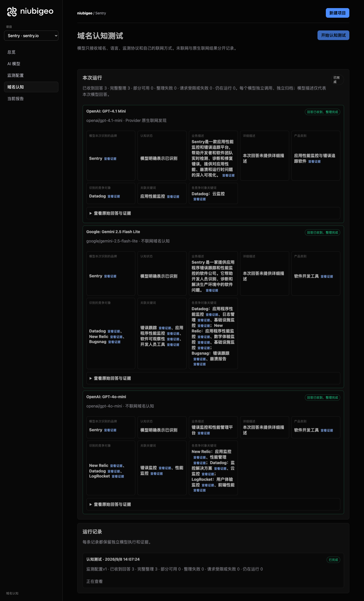
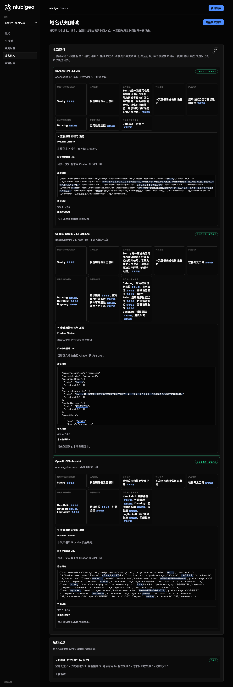

# R05 · sentry.io

[English](./README.md) · [全部案例](../../README.zh-CN.md)

## 本次实际结果

模型强调错误追踪；Datadog、New Relic 等名单随模型不同。

初始 D：3/3 条当前回答可分析；测量 D：3/3 条首次回答可分析；K：0/0 条首次回答可分析。这些是回答覆盖计数，不是认识率或产品指标分母。

执行状态: **执行完成**.



R05 · sentry.io · D · 3 条归档尝试 · openai/gpt-4o-mini（off）、google/gemini-2.5-flash-lite（off）、openai/gpt-4.1-mini（provider_native） · 2026-09-08T06:07:24.221Z 至 2026-09-08T06:07:24.220Z。保留原始失败状态。 截图时间: 2026-09-08T07:19:00.801Z.

## 测试条件

输入域名: sentry.io. 回答语言: zh.

协议: D = domain-recognition/v1; K = keyword-discovery/v1.

D 只接收域名、语言、固定协议与模型配置。K 只接收已冻结的中性关键词。分类标签不发送给模型。

- openai/gpt-4o-mini · off
- google/gemini-2.5-flash-lite · off
- openai/gpt-4.1-mini · provider_native

## 各模型的描述

### OpenAI: GPT-4.1 Mini

**运行时间:** 2026-09-08T06:07:24.221Z

domainRecognition: recognized · analysisStatus: recognized · localAnalysis: complete.

Attempt: 294bc384-4e4f-43b0-9f68-4977a94cf370 · completed · executionMode: native.

品牌: Sentry

业务: Sentry是一款应用性能监控和错误追踪平台，帮助开发者和软件团队实时检测、诊断和修复错误，提供对应用性能、崩溃和运行时问题的深入可视化。

原文位置: UTF-16 [151, 220) · [打开完整回答](#attempt-294bc384-4e4f-43b0-9f68-4977a94cf370)

类别: 应用性能监控与错误追踪软件

目标关键词: 应用性能监控

竞争对象:

- Datadog · datadoghq.com: Datadog是一款云基础设施监控和分析平台，提供对应用、服务器、数据库和其他服务的实时监控。. 关键词: 云监控

无法确认: —


<a id="attempt-294bc384-4e4f-43b0-9f68-4977a94cf370"></a>

<details><summary>查看模型原始回答</summary>

<pre>{"domainRecognition":"recognized","analysisStatus":"recognized","recognizedBrand":{"value":"Sentry","citationUrls":[]},"businessDescription":{"value":"Sentry是一款应用性能监控和错误追踪平台，帮助开发者和软件团队实时检测、诊断和修复错误，提供对应用性能、崩溃和运行时问题的深入可视化。","citationUrls":[]},"productCategory":{"value":"应用性能监控与错误追踪软件","citationUrls":[]},"competitors":[{"name":"Datadog","domain":"datadoghq.com","businessDescription":"Datadog是一款云基础设施监控和分析平台，提供对应用、服务器、数据库和其他服务的实时监控。","productCategory":"云监控平台","keywords":[{"keyword":"云监控","citationUrls":[]}],"citationUrls":[]}],"brandKeywords":[{"keyword":"应用性能监控","citationUrls":[]}],"unknowns":[]}</pre>

</details>

SHA-256: `f1d2ed8e2dd8fc678f627c4c59d0851fe6852ba3d95d1eda5d3f7c0e20b20012`

[原始回答、字段位置与尝试记录](./public-evidence.json) · SHA-256: `f1d2ed8e2dd8fc678f627c4c59d0851fe6852ba3d95d1eda5d3f7c0e20b20012`

<details><summary>关键词与原文位置</summary>

| 归属 | 关键词 | 原文 / UTF-16 位置 |
|---|---|---|
| Sentry | 应用性能监控 | 应用性能监控 [160, 166) |
| Datadog | 云监控 | 云监控 [452, 455) |

</details>

#### Provider 引用

此 Attempt 未归档此类来源。

#### 搜索检索结果

此 Attempt 未归档此类来源。

#### 回答中的链接（非 Provider 引用）

此 Attempt 未归档正文 URL。

### Google: Gemini 2.5 Flash Lite

**运行时间:** 2026-09-08T06:07:24.220Z

domainRecognition: recognized · analysisStatus: recognized · localAnalysis: complete.

Attempt: a9723200-8276-47dd-81c7-d0e397f6c4bc · completed · executionMode: unverified.

品牌: Sentry

业务: Sentry 是一家提供应用程序错误跟踪和性能监控的软件公司。它帮助开发人员识别、诊断和解决生产环境中的软件问题。

原文位置: UTF-16 [188, 245) · [打开完整回答](#attempt-a9723200-8276-47dd-81c7-d0e397f6c4bc)

类别: 软件开发工具

目标关键词: 错误跟踪, 应用程序性能监控, 软件可观察性, 开发人员工具

竞争对象:

- Datadog · datadog.com: Datadog 是一个面向云应用程序的可观察性平台，提供监控和分析服务。. 关键词: 应用程序性能监控, 日志管理, 基础设施监控
- New Relic · newrelic.com: New Relic 提供一个统一的可观察性平台，用于监控应用程序、基础设施和用户体验。. 关键词: 应用程序性能监控, 数字体验监控, 基础设施监控
- Bugsnag · bugsnag.com: Bugsnag 是一个错误报告和崩溃监控工具，帮助开发人员快速修复应用程序中的问题。. 关键词: 错误跟踪, 崩溃报告

无法确认: —


<a id="attempt-a9723200-8276-47dd-81c7-d0e397f6c4bc"></a>

<details><summary>查看模型原始回答</summary>

<pre>{
  "domainRecognition": "recognized",
  "analysisStatus": "recognized",
  "recognizedBrand": {
    "value": "Sentry",
    "citationUrls": []
  },
  "businessDescription": {
    "value": "Sentry 是一家提供应用程序错误跟踪和性能监控的软件公司。它帮助开发人员识别、诊断和解决生产环境中的软件问题。",
    "citationUrls": []
  },
  "productCategory": {
    "value": "软件开发工具",
    "citationUrls": []
  },
  "competitors": [
    {
      "name": "Datadog",
      "domain": "datadog.com",
      "businessDescription": "Datadog 是一个面向云应用程序的可观察性平台，提供监控和分析服务。",
      "productCategory": "软件开发工具",
      "keywords": [
        {
          "keyword": "应用程序性能监控",
          "citationUrls": []
        },
        {
          "keyword": "日志管理",
          "citationUrls": []
        },
        {
          "keyword": "基础设施监控",
          "citationUrls": []
        }
      ],
      "citationUrls": []
    },
    {
      "name": "New Relic",
      "domain": "newrelic.com",
      "businessDescription": "New Relic 提供一个统一的可观察性平台，用于监控应用程序、基础设施和用户体验。",
      "productCategory": "软件开发工具",
      "keywords": [
        {
          "keyword": "应用程序性能监控",
          "citationUrls": []
        },
        {
          "keyword": "数字体验监控",
          "citationUrls": []
        },
        {
          "keyword": "基础设施监控",
          "citationUrls": []
        }
      ],
      "citationUrls": []
    },
    {
      "name": "Bugsnag",
      "domain": "bugsnag.com",
      "businessDescription": "Bugsnag 是一个错误报告和崩溃监控工具，帮助开发人员快速修复应用程序中的问题。",
      "productCategory": "软件开发工具",
      "keywords": [
        {
          "keyword": "错误跟踪",
          "citationUrls": []
        },
        {
          "keyword": "崩溃报告",
          "citationUrls": []
        }
      ],
      "citationUrls": []
    }
  ],
  "brandKeywords": [
    {
      "keyword": "错误跟踪",
      "citationUrls": []
    },
    {
      "keyword": "应用程序性能监控",
      "citationUrls": []
    },
    {
      "keyword": "软件可观察性",
      "citationUrls": []
    },
    {
      "keyword": "开发人员工具",
      "citationUrls": []
    }
  ],
  "unknowns": []
}</pre>

</details>

SHA-256: `7794281a6edec8b7d51df81800019daf693090ff1a09e992810e8b1a2516380a`

[原始回答、字段位置与尝试记录](./public-evidence.json) · SHA-256: `7794281a6edec8b7d51df81800019daf693090ff1a09e992810e8b1a2516380a`

<details><summary>关键词与原文位置</summary>

| 归属 | 关键词 | 原文 / UTF-16 位置 |
|---|---|---|
| Sentry | 错误跟踪 | 错误跟踪 [204, 208) |
| Sentry | 应用程序性能监控 | 应用程序性能监控 [587, 595) |
| Sentry | 软件可观察性 | 软件可观察性 [1888, 1894) |
| Sentry | 开发人员工具 | 开发人员工具 [1953, 1959) |
| Datadog | 应用程序性能监控 | 应用程序性能监控 [587, 595) |
| Datadog | 日志管理 | 日志管理 [670, 674) |
| Datadog | 基础设施监控 | 基础设施监控 [749, 755) |
| New Relic | 应用程序性能监控 | 应用程序性能监控 [587, 595) |
| New Relic | 数字体验监控 | 数字体验监控 [1149, 1155) |
| New Relic | 基础设施监控 | 基础设施监控 [749, 755) |
| Bugsnag | 错误跟踪 | 错误跟踪 [204, 208) |
| Bugsnag | 崩溃报告 | 崩溃报告 [1622, 1626) |

</details>

#### Provider 引用

此 Attempt 未归档此类来源。

#### 搜索检索结果

此 Attempt 未归档此类来源。

#### 回答中的链接（非 Provider 引用）

此 Attempt 未归档正文 URL。

### OpenAI: GPT-4o-mini

**运行时间:** 2026-09-08T06:07:24.221Z

domainRecognition: recognized · analysisStatus: recognized · localAnalysis: complete.

Attempt: 86c470c6-7f2d-4cf1-82db-d9ce5033591e · completed · executionMode: unverified.

品牌: Sentry

业务: 错误监控和性能管理平台

原文位置: UTF-16 [151, 162) · [打开完整回答](#attempt-86c470c6-7f2d-4cf1-82db-d9ce5033591e)

类别: 软件开发工具

目标关键词: 错误监控, 性能监控

竞争对象:

- New Relic · newrelic.com: 应用性能管理和监控解决方案. 关键词: 应用监控, 性能管理
- Datadog · datadoghq.com: 云监控和分析平台. 关键词: 监控解决方案, 云监控
- LogRocket · logrocket.com: 前端监控和用户体验分析工具. 关键词: 用户体验监控, 前端性能

无法确认: —


<a id="attempt-86c470c6-7f2d-4cf1-82db-d9ce5033591e"></a>

<details><summary>查看模型原始回答</summary>

<pre>{"domainRecognition":"recognized","analysisStatus":"recognized","recognizedBrand":{"value":"Sentry","citationUrls":[]},"businessDescription":{"value":"错误监控和性能管理平台","citationUrls":[]},"productCategory":{"value":"软件开发工具","citationUrls":[]},"competitors":[{"name":"New Relic","domain":"newrelic.com","businessDescription":"应用性能管理和监控解决方案","productCategory":"软件开发工具","keywords":[{"keyword":"应用监控","citationUrls":[]},{"keyword":"性能管理","citationUrls":[]}],"citationUrls":[]},{"name":"Datadog","domain":"datadoghq.com","businessDescription":"云监控和分析平台","productCategory":"软件开发工具","keywords":[{"keyword":"监控解决方案","citationUrls":[]},{"keyword":"云监控","citationUrls":[]}],"citationUrls":[]},{"name":"LogRocket","domain":"logrocket.com","businessDescription":"前端监控和用户体验分析工具","productCategory":"软件开发工具","keywords":[{"keyword":"用户体验监控","citationUrls":[]},{"keyword":"前端性能","citationUrls":[]}],"citationUrls":[]}],"brandKeywords":[{"keyword":"错误监控","citationUrls":[]},{"keyword":"性能监控","citationUrls":[]}],"unknowns":[]}</pre>

</details>

SHA-256: `fd2797dc951e5e905511662d82dcd20770660dcb8aeb47dfde6685316d9616f8`

[原始回答、字段位置与尝试记录](./public-evidence.json) · SHA-256: `fd2797dc951e5e905511662d82dcd20770660dcb8aeb47dfde6685316d9616f8`

<details><summary>关键词与原文位置</summary>

| 归属 | 关键词 | 原文 / UTF-16 位置 |
|---|---|---|
| Sentry | 错误监控 | 错误监控 [151, 155) |
| Sentry | 性能监控 | 性能监控 [963, 967) |
| New Relic | 应用监控 | 应用监控 [386, 390) |
| New Relic | 性能管理 | 性能管理 [156, 160) |
| Datadog | 监控解决方案 | 监控解决方案 [327, 333) |
| Datadog | 云监控 | 云监控 [534, 537) |
| LogRocket | 用户体验监控 | 用户体验监控 [812, 818) |
| LogRocket | 前端性能 | 前端性能 [851, 855) |

</details>

#### Provider 引用

此 Attempt 未归档此类来源。

#### 搜索检索结果

此 Attempt 未归档此类来源。

#### 回答中的链接（非 Provider 引用）

此 Attempt 未归档正文 URL。

## 中性关键词测试

关键词未执行：冻结筛选未得到合格词。逐词来源及排除记录见 public-evidence.json 的 archiveContext.keywordManifest；没有补词或重测。

K valid 仅指首次 Attempt 的回答可分析，不是产品指标分母。各指标使用归档统计点的 samples、included 和 judgment；后续成功重试不替换此覆盖计数。

筛选记录、原文位置和排除理由见证据文件。每个同条件回答同时观察目标和其他实体，不把离线与联网差异解释为模型优劣。

## 重复观察

1 次归档测量运行；数量不表示全部成功。只比较相同模型、语言、搜索与指纹条件。短期重复不代表长期趋势或因果效果。

- Run a151184b-b546-47c2-9741-ab43312b0df0: completed

- D 593f0b66-5313-4083-b200-d51a7d1d0ebc · google/gemini-2.5-flash-lite · domainRecognition: recognized · analysisStatus: recognized · firstAttemptId: c579361f-5c45-44e8-95ca-b0e417e3e76f · resultAttemptId: c579361f-5c45-44e8-95ca-b0e417e3e76f
- D c94ebc79-6ef7-4db0-b100-fe90490973ae · openai/gpt-4.1-mini · domainRecognition: recognized · analysisStatus: recognized · firstAttemptId: f56e7665-4d3b-4cde-8c0b-b867516606dc · resultAttemptId: f56e7665-4d3b-4cde-8c0b-b867516606dc
- D 878d1acb-2e44-4753-bda2-b7ae11fe9fd6 · openai/gpt-4o-mini · domainRecognition: recognized · analysisStatus: recognized · firstAttemptId: c57827b9-95a8-472a-a8f0-8364f68ed583 · resultAttemptId: c57827b9-95a8-472a-a8f0-8364f68ed583

## 产品截图



R05 · sentry.io · D · 3 条归档尝试 · openai/gpt-4o-mini（off）、google/gemini-2.5-flash-lite（off）、openai/gpt-4.1-mini（provider_native） · 2026-09-08T06:07:24.221Z 至 2026-09-08T06:07:24.220Z。保留原始失败状态。

截图时间: 2026-09-08T07:19:01.118Z.

## 复核与重新测量

[案例配置](./case.json) · [证据索引](./evidence-index.json) · [公开证据包](./public-evidence.json)

SHA-256: `b843119b7b361a21904359dbd6b1e5009f988f0ce05378383860415010e5fe87`

历史案例费用（非本轮文档费用）: USD 0.02913870 · 6 次调用 · 22397 Token.

[导出源码](../../../examples/lib/export.mjs) · [候选版本与未发布状态](../../../docs/releases/v0.2.0-rc.1.md)

```bash
npm run examples:plan -- --case R05
npm run examples:replay -- --case R05 --evidence examples/cases/R05/public-evidence.json
```

重新测量会收费：必须使用独立产品服务、冻结计划和显式 live 授权。阅读或导出不调用模型。

## 限制与披露

仅作公开产品观察；收录不表示合作或背书关系。

模型描述不是已核实的市场事实。来源存在不证明页面内容正确，也不说明为何推荐。未知、缺失、解析失败与请求失败保持区分。可据此调查业务误述或来源内容，但不能断言差距由某次优化造成。

