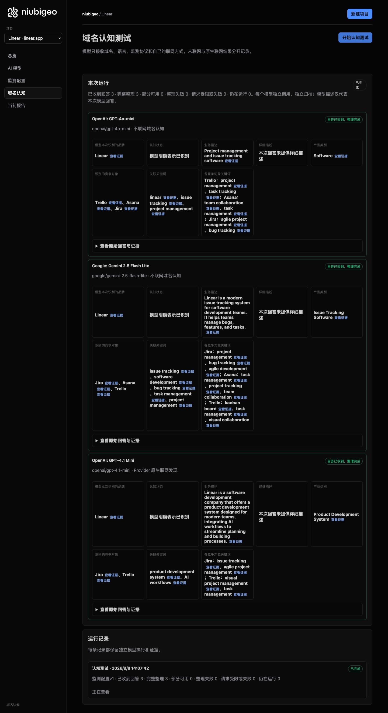
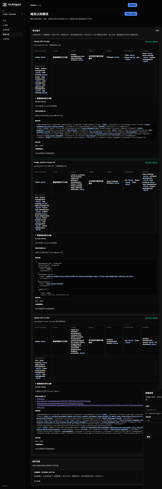
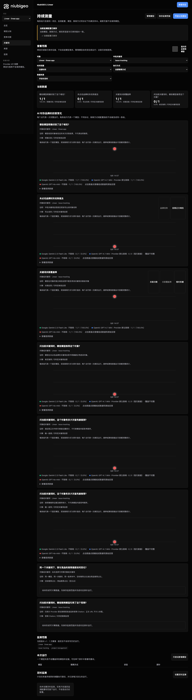

# R06 · linear.app

[简体中文](./README.zh-CN.md) · [All cases](../../README.md)

## Observed result

Descriptions ranged from issue tracking to product development; one first-place field conflicts.

Initial D: 3/3 analyzable current answers. Measurement D: 3/3 analyzable first answers. K: 4/6 analyzable first answers. These are answer-coverage counts, not recognition rates or product metric denominators.

Execution status: **partial**.

**These metrics have consistency conflicts and are excluded from ranking comparisons.** Original values remain unchanged; no winner or tie is inferred.

- [firstMentionState · 287f13f8-d88d-4573-96b5-680db90273b8](../../../docs/known-issues.md#conflict-287f13f8-d88d-4573-96b5-680db90273b8-firstmentionstate)



R06 · linear.app · D · 3 archived attempts · openai/gpt-4o-mini (off), google/gemini-2.5-flash-lite (off), openai/gpt-4.1-mini (provider_native) · 2026-09-08T06:07:42.434Z to 2026-09-08T06:07:42.434Z. Original failures remain visible. Captured: 2026-09-08T07:19:01.575Z.

## Conditions

Input domain: linear.app. Answer language: en.

Protocols: D = domain-recognition/v1; K = keyword-discovery/v1.

D receives the domain, language, fixed protocol and model settings. K receives a frozen neutral keyword. Browsing categories are not sent to models.

- openai/gpt-4o-mini · off
- google/gemini-2.5-flash-lite · off
- openai/gpt-4.1-mini · provider_native

## Model observations

### OpenAI: GPT-4o-mini

**Observed at:** 2026-09-08T06:07:42.434Z

domainRecognition: recognized · analysisStatus: recognized · localAnalysis: complete.

Attempt: 47bfcee9-1e5a-43c1-ab3b-cc80d871a24e · completed · executionMode: unverified.

Brand: Linear

Business: Project management and issue tracking software

Original span: UTF-16 [151, 197) · [Full answer](#attempt-47bfcee9-1e5a-43c1-ab3b-cc80d871a24e)

Category: Software

Brand keywords: linear, issue tracking, project management

Competitors named by this model:

- Trello · trello.com: Project management tool. Keywords: project management, task tracking
- Asana · asana.com: Work management platform. Keywords: team collaboration, task management
- Jira · jira.com: Issue and project tracking software. Keywords: agile project management, bug tracking

Uncertain: —


<a id="attempt-47bfcee9-1e5a-43c1-ab3b-cc80d871a24e"></a>

<details><summary>Read the original answer</summary>

<pre>{"domainRecognition":"recognized","analysisStatus":"recognized","recognizedBrand":{"value":"Linear","citationUrls":[]},"businessDescription":{"value":"Project management and issue tracking software","citationUrls":[]},"productCategory":{"value":"Software","citationUrls":[]},"competitors":[{"name":"Trello","domain":"trello.com","businessDescription":"Project management tool","productCategory":"Software","keywords":[{"keyword":"project management","citationUrls":[]},{"keyword":"task tracking","citationUrls":[]}],"citationUrls":[]},{"name":"Asana","domain":"asana.com","businessDescription":"Work management platform","productCategory":"Software","keywords":[{"keyword":"team collaboration","citationUrls":[]},{"keyword":"task management","citationUrls":[]}],"citationUrls":[]},{"name":"Jira","domain":"jira.com","businessDescription":"Issue and project tracking software","productCategory":"Software","keywords":[{"keyword":"agile project management","citationUrls":[]},{"keyword":"bug tracking","citationUrls":[]}],"citationUrls":[]}],"brandKeywords":[{"keyword":"linear","citationUrls":[]},{"keyword":"issue tracking","citationUrls":[]},{"keyword":"project management","citationUrls":[]}],"unknowns":[]}</pre>

</details>

SHA-256: `aa28fb1a703dc570bea55756cf0ce6d737ebb23d70d264a8a18bc3c2f30214f3`

[Answer, field offsets and attempts](./public-evidence.json) · SHA-256: `aa28fb1a703dc570bea55756cf0ce6d737ebb23d70d264a8a18bc3c2f30214f3`

<details><summary>Keyword provenance and original spans</summary>

| Owner | Keyword | Original text / UTF-16 span |
|---|---|---|
| Linear | linear | linear [1069, 1075) |
| Linear | issue tracking | issue tracking [174, 188) |
| Linear | project management | project management [430, 448) |
| Trello | project management | project management [430, 448) |
| Trello | task tracking | task tracking [481, 494) |
| Asana | team collaboration | team collaboration [674, 692) |
| Asana | task management | task management [725, 740) |
| Jira | agile project management | agile project management [929, 953) |
| Jira | bug tracking | bug tracking [986, 998) |

</details>

#### Provider citations

No sources of this type were archived for this attempt.

#### Search retrieval results

No sources of this type were archived for this attempt.

#### Links in the answer (not Provider citations)

No answer URLs were archived for this attempt.

### Google: Gemini 2.5 Flash Lite

**Observed at:** 2026-09-08T06:07:42.434Z

domainRecognition: recognized · analysisStatus: recognized · localAnalysis: complete.

Attempt: a101e85c-22cc-4385-bf1b-a38d79ef2d5a · completed · executionMode: unverified.

Brand: Linear

Business: Linear is a modern issue tracking system for software development teams. It helps teams manage bugs, features, and tasks.

Original span: UTF-16 [188, 309) · [Full answer](#attempt-a101e85c-22cc-4385-bf1b-a38d79ef2d5a)

Category: Issue Tracking Software

Brand keywords: issue tracking, software development, bug tracking, task management, project management

Competitors named by this model:

- Jira · atlassian.com/software/jira: Jira is a popular software development tool used for issue tracking and project management.. Keywords: project management, bug tracking, agile development
- Asana · asana.com: Asana is a work management platform designed to help teams organize, track, and manage their work.. Keywords: task management, project tracking, team collaboration
- Trello · trello.com: Trello is a visual collaboration tool that organizes your projects into boards.. Keywords: kanban board, task management, visual collaboration

Uncertain: —


<a id="attempt-a101e85c-22cc-4385-bf1b-a38d79ef2d5a"></a>

<details><summary>Read the original answer</summary>

<pre>{
  "domainRecognition": "recognized",
  "analysisStatus": "recognized",
  "recognizedBrand": {
    "value": "Linear",
    "citationUrls": []
  },
  "businessDescription": {
    "value": "Linear is a modern issue tracking system for software development teams. It helps teams manage bugs, features, and tasks.",
    "citationUrls": []
  },
  "productCategory": {
    "value": "Issue Tracking Software",
    "citationUrls": []
  },
  "competitors": [
    {
      "name": "Jira",
      "domain": "atlassian.com/software/jira",
      "businessDescription": "Jira is a popular software development tool used for issue tracking and project management.",
      "productCategory": "Issue Tracking Software",
      "keywords": [
        {
          "keyword": "project management",
          "citationUrls": []
        },
        {
          "keyword": "bug tracking",
          "citationUrls": []
        },
        {
          "keyword": "agile development",
          "citationUrls": []
        }
      ],
      "citationUrls": []
    },
    {
      "name": "Asana",
      "domain": "asana.com",
      "businessDescription": "Asana is a work management platform designed to help teams organize, track, and manage their work.",
      "productCategory": "Work Management Software",
      "keywords": [
        {
          "keyword": "task management",
          "citationUrls": []
        },
        {
          "keyword": "project tracking",
          "citationUrls": []
        },
        {
          "keyword": "team collaboration",
          "citationUrls": []
        }
      ],
      "citationUrls": []
    },
    {
      "name": "Trello",
      "domain": "trello.com",
      "businessDescription": "Trello is a visual collaboration tool that organizes your projects into boards.",
      "productCategory": "Project Management Software",
      "keywords": [
        {
          "keyword": "kanban board",
          "citationUrls": []
        },
        {
          "keyword": "task management",
          "citationUrls": []
        },
        {
          "keyword": "visual collaboration",
          "citationUrls": []
        }
      ],
      "citationUrls": []
    }
  ],
  "brandKeywords": [
    {
      "keyword": "issue tracking",
      "citationUrls": []
    },
    {
      "keyword": "software development",
      "citationUrls": []
    },
    {
      "keyword": "bug tracking",
      "citationUrls": []
    },
    {
      "keyword": "task management",
      "citationUrls": []
    },
    {
      "keyword": "project management",
      "citationUrls": []
    }
  ],
  "unknowns": []
}</pre>

</details>

SHA-256: `bfcc261faefd99dd890dbd6569e2724bf60b44ae3d455b162defdbd1f28baf2a`

[Answer, field offsets and attempts](./public-evidence.json) · SHA-256: `bfcc261faefd99dd890dbd6569e2724bf60b44ae3d455b162defdbd1f28baf2a`

<details><summary>Keyword provenance and original spans</summary>

| Owner | Keyword | Original text / UTF-16 span |
|---|---|---|
| Linear | issue tracking | issue tracking [207, 221) |
| Linear | software development | software development [233, 253) |
| Linear | bug tracking | bug tracking [846, 858) |
| Linear | task management | task management [1327, 1342) |
| Linear | project management | project management [627, 645) |
| Jira | project management | project management [627, 645) |
| Jira | bug tracking | bug tracking [846, 858) |
| Jira | agile development | agile development [933, 950) |
| Asana | task management | task management [1327, 1342) |
| Asana | project tracking | project tracking [1417, 1433) |
| Asana | team collaboration | team collaboration [1508, 1526) |
| Trello | kanban board | kanban board [1889, 1901) |
| Trello | task management | task management [1327, 1342) |
| Trello | visual collaboration | visual collaboration [1711, 1731) |

</details>

#### Provider citations

No sources of this type were archived for this attempt.

#### Search retrieval results

No sources of this type were archived for this attempt.

#### Links in the answer (not Provider citations)

No answer URLs were archived for this attempt.

### OpenAI: GPT-4.1 Mini

**Observed at:** 2026-09-08T06:07:42.434Z

domainRecognition: recognized · analysisStatus: recognized · localAnalysis: complete.

Attempt: 89d111d1-1e60-4630-b670-3994e89fb81c · completed · executionMode: native.

Brand: Linear

Business: Linear is a software development company that offers a product development system designed for modern teams, integrating AI workflows to streamline planning and building processes.

Original span: UTF-16 [171, 351) · [Full answer](#attempt-89d111d1-1e60-4630-b670-3994e89fb81c)

Category: Product Development System

Brand keywords: product development system, AI workflows

Competitors named by this model:

- Jira · atlassian.com/software/jira: Jira is a project management tool developed by Atlassian, widely used for issue tracking and agile project management.. Keywords: issue tracking, agile project management
- Trello · trello.com: Trello is a web-based project management application that uses boards, lists, and cards to help teams organize and prioritize projects.. Keywords: visual project management, task management

Uncertain: —


<a id="attempt-89d111d1-1e60-4630-b670-3994e89fb81c"></a>

<details><summary>Read the original answer</summary>

<pre>{"domainRecognition":"recognized","analysisStatus":"recognized","recognizedBrand":{"value":"Linear","citationUrls":["https://linear.app"]},"businessDescription":{"value":"Linear is a software development company that offers a product development system designed for modern teams, integrating AI workflows to streamline planning and building processes.","citationUrls":["https://linear.app"]},"productCategory":{"value":"Product Development System","citationUrls":["https://linear.app"]},"competitors":[{"name":"Jira","domain":"atlassian.com/software/jira","businessDescription":"Jira is a project management tool developed by Atlassian, widely used for issue tracking and agile project management.","productCategory":"Project Management Tool","keywords":[{"keyword":"issue tracking","citationUrls":["https://www.atlassian.com/software/jira"]},{"keyword":"agile project management","citationUrls":["https://www.atlassian.com/software/jira"]}],"citationUrls":["https://www.atlassian.com/software/jira"]},{"name":"Trello","domain":"trello.com","businessDescription":"Trello is a web-based project management application that uses boards, lists, and cards to help teams organize and prioritize projects.","productCategory":"Project Management Tool","keywords":[{"keyword":"visual project management","citationUrls":["https://trello.com"]},{"keyword":"task management","citationUrls":["https://trello.com"]}],"citationUrls":["https://trello.com"]}],"brandKeywords":[{"keyword":"product development system","citationUrls":["https://linear.app"]},{"keyword":"AI workflows","citationUrls":["https://linear.app"]}],"unknowns":[]}</pre>

</details>

SHA-256: `d53beeb17fb659bf7befceb0ace548861fc9d2e4f99f41982143a1fc12a207e9`

[Answer, field offsets and attempts](./public-evidence.json) · SHA-256: `d53beeb17fb659bf7befceb0ace548861fc9d2e4f99f41982143a1fc12a207e9`

<details><summary>Keyword provenance and original spans</summary>

| Owner | Keyword | Original text / UTF-16 span |
|---|---|---|
| Linear | product development system | product development system [226, 252) |
| Linear | AI workflows | AI workflows [292, 304) |
| Jira | issue tracking | issue tracking [653, 667) |
| Jira | agile project management | agile project management [672, 696) |
| Trello | visual project management | visual project management [1269, 1294) |
| Trello | task management | task management [1347, 1362) |

</details>

#### Provider citations

No sources of this type were archived for this attempt.

#### Search retrieval results

No sources of this type were archived for this attempt.

#### Links in the answer (not Provider citations)

- [https://linear.app/](<https://linear.app/>)
- [https://www.atlassian.com/software/jira%22]%7D,%7B%22keyword%22:%22agile](<https://www.atlassian.com/software/jira%22]%7D,%7B%22keyword%22:%22agile>)
- [https://www.atlassian.com/software/jira%22]%7D],%22citationUrls%22:[%22https://www.atlassian.com/software/jira%22]%7D,%7B%22name%22:%22Trello%22,%22domain%22:%22trello.com%22,%22businessDescription%22:%22Trello](<https://www.atlassian.com/software/jira%22]%7D],%22citationUrls%22:[%22https://www.atlassian.com/software/jira%22]%7D,%7B%22name%22:%22Trello%22,%22domain%22:%22trello.com%22,%22businessDescription%22:%22Trello>)
- [https://trello.com/](<https://trello.com/>)

## Neutral keyword tests

issue tracking, project management

K valid counts analyzable first-attempt answers only, not product metric denominators. Inspect archived metric samples, included flags and judgments. A later successful retry does not replace this coverage count.

Selection records, exact quotes and exclusions are in the evidence file. Each answer observes the target and other entities under the same conditions; offline and online differences are not model rankings.

### issue tracking · google/gemini-2.5-flash-lite

keywordId: watch-keyword-d7e3bf0565dc504f10528f58 · runId: 0d98ccde-b6eb-4a7f-954f-56f1c6d88da5 · probeId: 287f13f8-d88d-4573-96b5-680db90273b8

off · completed · firstAttemptId: d9643825-5216-4e70-8c96-a1223c00d06f

analysisStatus: completed · resultAttemptId: d9643825-5216-4e70-8c96-a1223c00d06f

- mentionJudgment: adjudicable
- recommendationJudgment: adjudicable

**This answer has conflicting unique-first judgments; do not use it for rankings.** [Evidence](../../../docs/known-issues.md)

- Jira: mentioned · mention: Jira is a popular issue tracking tool. · recommendation: — · attemptId: d9643825-5216-4e70-8c96-a1223c00d06f
- Asana: mentioned · mention: Asana can also be used for issue tracking. · recommendation: — · attemptId: d9643825-5216-4e70-8c96-a1223c00d06f
- Trello: mentioned · mention: Trello offers a visual approach to issue tracking. · recommendation: — · attemptId: d9643825-5216-4e70-8c96-a1223c00d06f

Uncertain: —

[Actual request and answer evidence](./public-evidence.json)

#### Attempt d9643825-5216-4e70-8c96-a1223c00d06f

completed · Observed at: 2026-09-08T06:07:58.805Z · First attempt

requestedSearch: off · used: false · executionMode: unverified

finish_reason: stop

<a id="attempt-d9643825-5216-4e70-8c96-a1223c00d06f"></a>

<details><summary>Read the original answer</summary>

<pre>{
  "analysisStatus": "completed",
  "mentions": [
    {
      "name": "Jira",
      "domain": null,
      "recommendation": "mentioned",
      "mentionQuote": "Jira is a popular issue tracking tool.",
      "recommendationQuote": null,
      "firstMentionOffset": 0,
      "firstRecommendationOffset": null,
      "firstMentionState": "unique",
      "firstRecommendationState": "none"
    },
    {
      "name": "Asana",
      "domain": null,
      "recommendation": "mentioned",
      "mentionQuote": "Asana can also be used for issue tracking.",
      "recommendationQuote": null,
      "firstMentionOffset": 26,
      "firstRecommendationOffset": null,
      "firstMentionState": "unique",
      "firstRecommendationState": "none"
    },
    {
      "name": "Trello",
      "domain": null,
      "recommendation": "mentioned",
      "mentionQuote": "Trello offers a visual approach to issue tracking.",
      "recommendationQuote": null,
      "firstMentionOffset": 57,
      "firstRecommendationOffset": null,
      "firstMentionState": "unique",
      "firstRecommendationState": "none"
    }
  ],
  "unknowns": []
}</pre>

</details>

SHA-256: `b58b70abf5cfcae028be7e4ea8916349c781b3389defcc75500630c65e986690`

#### Provider citations

No sources of this type were archived for this attempt.

#### Search retrieval results

No sources of this type were archived for this attempt.

#### Links in the answer (not Provider citations)

No answer URLs were archived for this attempt.

### project management · google/gemini-2.5-flash-lite

keywordId: watch-keyword-34ac6cdd31527c053eba65a6 · runId: 0d98ccde-b6eb-4a7f-954f-56f1c6d88da5 · probeId: 7b572ae5-fa3e-456c-b73d-2b1af3464807

off · completed · firstAttemptId: 754b0601-3a5b-428c-9b34-358d2c59e12b

analysisStatus: completed · resultAttemptId: 754b0601-3a5b-428c-9b34-358d2c59e12b

- mentionJudgment: adjudicable
- recommendationJudgment: adjudicable

- project management: mentioned · mention: project management · recommendation: — · attemptId: 754b0601-3a5b-428c-9b34-358d2c59e12b

Uncertain: —

[Actual request and answer evidence](./public-evidence.json)

#### Attempt 754b0601-3a5b-428c-9b34-358d2c59e12b

completed · Observed at: 2026-09-08T06:08:08.863Z · First attempt

requestedSearch: off · used: false · executionMode: unverified

finish_reason: stop

<a id="attempt-754b0601-3a5b-428c-9b34-358d2c59e12b"></a>

<details><summary>Read the original answer</summary>

<pre>{
  "analysisStatus": "completed",
  "mentions": [
    {
      "name": "project management",
      "domain": null,
      "recommendation": "mentioned",
      "mentionQuote": "project management",
      "recommendationQuote": null,
      "firstMentionOffset": 0,
      "firstRecommendationOffset": null,
      "firstMentionState": "unique",
      "firstRecommendationState": "none"
    }
  ],
  "unknowns": []
}</pre>

</details>

SHA-256: `818f216c1db45aa219c4934c4a9957066745f0369e25586cf084b8b53b529957`

#### Provider citations

No sources of this type were archived for this attempt.

#### Search retrieval results

No sources of this type were archived for this attempt.

#### Links in the answer (not Provider citations)

No answer URLs were archived for this attempt.

### issue tracking · openai/gpt-4.1-mini

keywordId: watch-keyword-d7e3bf0565dc504f10528f58 · runId: 0d98ccde-b6eb-4a7f-954f-56f1c6d88da5 · probeId: cbd79312-cf49-4cd6-9308-fb2b67986a59

provider_native · failed · firstAttemptId: 07fc78c7-84b0-4c05-bdea-bf2d6aece1bc

analysisStatus: analysis_failed · resultAttemptId: 07fc78c7-84b0-4c05-bdea-bf2d6aece1bc

- mentionJudgment: unknown
- recommendationJudgment: unknown


Uncertain: Unterminated string in JSON at position 3665 (line 1 column 3666)

[Actual request and answer evidence](./public-evidence.json)

#### Attempt 07fc78c7-84b0-4c05-bdea-bf2d6aece1bc

analysis_failed · Observed at: 2026-09-08T06:07:56.141Z · First attempt

requestedSearch: provider_native · used: true · executionMode: native

OpenRouter metadata confirmed provider-native web search.

Error: analysis_failed · Unterminated string in JSON at position 3665 (line 1 column 3666)

finish_reason: stop

<a id="attempt-07fc78c7-84b0-4c05-bdea-bf2d6aece1bc"></a>

<details><summary>Read the original answer</summary>

<pre>{"analysisStatus":"completed","mentions":[{"name":"Limin","domain":"limin.dev","recommendation":"uncertain","mentionQuote":"Limin — Focused issue tracking","recommendationQuote":"Limin is a real-time workspace for teams building software.","firstMentionOffset":0,"firstRecommendationOffset":0,"firstMentionState":"unique","firstRecommendationState":"unique"},{"name":"BugLane","domain":"buglane.org","recommendation":"uncertain","mentionQuote":"BugLane - Modern Issue Tracking &amp; Bug Tracking Software for Teams","recommendationQuote":"BugLane is a modern issue tracking platform built for agile teams.","firstMentionOffset":0,"firstRecommendationOffset":0,"firstMentionState":"unique","firstRecommendationState":"unique"},{"name":"Issuely","domain":"issuely.in","recommendation":"uncertain","mentionQuote":"Issuely — Free Bug Tracker, Support Ticket System &amp; Issue Tracker","recommendationQuote":"Issuely is a free, all-in-one platform for bug tracking, customer support ticketing, and agile sprint management.","firstMentionOffset":0,"firstRecommendationOffset":0,"firstMentionState":"unique","firstRecommendationState":"unique"},{"name":"Epsilon3","domain":"epsilon3.io","recommendation":"uncertain","mentionQuote":"Epsilon3 - Issue &amp; Non-Conformance (NCR) Tracking Software","recommendationQuote":"Epsilon3 enables innovative teams to handle the unexpected with confidence through rapid issue assessment, triage, and resolution.","firstMentionOffset":0,"firstRecommendationOffset":0,"firstMentionState":"unique","firstRecommendationState":"unique"},{"name":"Adminitrac","domain":"adminitrac.com","recommendation":"uncertain","mentionQuote":"Adminitrac - The next generation issue tracking software.","recommendationQuote":"Adminitrac is an issue and defect tracking software designed to transform your workflow.","firstMentionOffset":0,"firstRecommendationOffset":0,"firstMentionState":"unique","firstRecommendationState":"unique"},{"name":"issueboard","domain":"issueboard.dev","recommendation":"uncertain","mentionQuote":"issueboard — Issue tracking for the whole team, not just the devs","recommendationQuote":"issueboard is a fast, minimal issue tracker for tech product teams where support agents and product managers are first-class users alongside developers.","firstMentionOffset":0,"firstRecommendationOffset":0,"firstMentionState":"unique","firstRecommendationState":"unique"},{"name":"Radial","domain":"radial.build","recommendation":"uncertain","mentionQuote":"The fast, CLI-first issue tracker — Radial","recommendationQuote":"Radial is a fast, CLI-first issue tracker built for how teams ship now.","firstMentionOffset":0,"firstRecommendationOffset":0,"firstMentionState":"unique","firstRecommendationState":"unique"},{"name":"Bugshelf","domain":"bugshelf.com","recommendation":"uncertain","mentionQuote":"Bugshelf: issue tracking for the rest of us","recommendationQuote":"Bugshelf is an unbloated and easy to use issue and bug tracking software, spiced with ajax, tags and realtime awareness.","firstMentionOffset":0,"firstRecommendationOffset":0,"firstMentionState":"unique","firstRecommendationState":"unique"},{"name":"Sifter","domain":"sifterapp.com","recommendation":"uncertain","mentionQuote":"A Simple Bug and Issue Tracker - Sifter","recommendationQuote":"Sifter is a simple bug and issue tracker designed to help software and site development teams focus on doing what matters.","firstMentionOffset":0,"firstRecommendationOffset":0,"firstMentionState":"unique","firstRecommendationState":"unique"},{"name":"IssueZen","domain":"issuezen.com","recommendation":"uncertain","mentionQuote":"IssueZen — Issue tracking for developers who give a</pre>

</details>

SHA-256: `81a841273c999ba4cf2666f3a3ee431ab37fd916960da6f4e6dc89407f830638`

#### Provider citations

No sources of this type were archived for this attempt.

#### Search retrieval results

No sources of this type were archived for this attempt.

#### Links in the answer (not Provider citations)

No answer URLs were archived for this attempt.

### project management · openai/gpt-4.1-mini

keywordId: watch-keyword-34ac6cdd31527c053eba65a6 · runId: 0d98ccde-b6eb-4a7f-954f-56f1c6d88da5 · probeId: cb3c1360-2cee-4304-ae32-927e816f5a80

provider_native · failed · firstAttemptId: d22fbf31-dfdd-414b-9841-480f56f184c9

analysisStatus: analysis_failed · resultAttemptId: d22fbf31-dfdd-414b-9841-480f56f184c9

- mentionJudgment: unknown
- recommendationJudgment: unknown


Uncertain: Unterminated string in JSON at position 4590 (line 1 column 4591)

[Actual request and answer evidence](./public-evidence.json)

#### Attempt d22fbf31-dfdd-414b-9841-480f56f184c9

analysis_failed · Observed at: 2026-09-08T06:08:07.525Z · First attempt

requestedSearch: provider_native · used: true · executionMode: native

OpenRouter metadata confirmed provider-native web search.

Error: analysis_failed · Unterminated string in JSON at position 4590 (line 1 column 4591)

finish_reason: stop

<a id="attempt-d22fbf31-dfdd-414b-9841-480f56f184c9"></a>

<details><summary>Read the original answer</summary>

<pre>{"analysisStatus":"completed","mentions":[{"name":"OpenProject","domain":"openproject.org","recommendation":"uncertain","mentionQuote":"OpenProject is the leading free and open source project management software.","recommendationQuote":"OpenProject is the leading free and open source project management software.","firstMentionOffset":0,"firstRecommendationOffset":0,"firstMentionState":"unique","firstRecommendationState":"unique"},{"name":"ProjectManager","domain":"projectmanager.com","recommendation":"uncertain","mentionQuote":"ProjectManager is a feature-rich, online platform for project planning, resource management and AI-powered analysis.","recommendationQuote":"ProjectManager is a feature-rich, online platform for project planning, resource management and AI-powered analysis.","firstMentionOffset":0,"firstRecommendationOffset":0,"firstMentionState":"unique","firstRecommendationState":"unique"},{"name":"Plane","domain":"plane.so","recommendation":"uncertain","mentionQuote":"Plane brings projects, docs, and AI-powered workflows into one unified workspace so teams and agents can plan, execute, and stay aligned.","recommendationQuote":"Plane brings projects, docs, and AI-powered workflows into one unified workspace so teams and agents can plan, execute, and stay aligned.","firstMentionOffset":0,"firstRecommendationOffset":0,"firstMentionState":"unique","firstRecommendationState":"unique"},{"name":"Breeze","domain":"breeze.pm","recommendation":"uncertain","mentionQuote":"Breeze helps teams organize tasks, plan projects, and collaborate without the complexity of traditional project management software.","recommendationQuote":"Breeze helps teams organize tasks, plan projects, and collaborate without the complexity of traditional project management software.","firstMentionOffset":0,"firstRecommendationOffset":0,"firstMentionState":"unique","firstRecommendationState":"unique"},{"name":"Smartsheet","domain":"smartsheet.com","recommendation":"uncertain","mentionQuote":"Smartsheet gives teams a centralized workspace to plan, track, and deliver projects with confidence.","recommendationQuote":"Smartsheet gives teams a centralized workspace to plan, track, and deliver projects with confidence.","firstMentionOffset":0,"firstRecommendationOffset":0,"firstMentionState":"unique","firstRecommendationState":"unique"},{"name":"Microsoft Project","domain":"microsoft.com","recommendation":"uncertain","mentionQuote":"Project for the web is becoming part of Microsoft Planner. Continue enjoying the features you know and love under a new name.","recommendationQuote":"Project for the web is becoming part of Microsoft Planner. Continue enjoying the features you know and love under a new name.","firstMentionOffset":0,"firstRecommendationOffset":0,"firstMentionState":"unique","firstRecommendationState":"unique"},{"name":"Projul","domain":"projul.com","recommendation":"uncertain","mentionQuote":"Projul is the construction software trusted by 5,000+ contractors to simplify workflows, slash costs, and win more bids.","recommendationQuote":"Projul is the construction software trusted by 5,000+ contractors to simplify workflows, slash costs, and win more bids.","firstMentionOffset":0,"firstRecommendationOffset":0,"firstMentionState":"unique","firstRecommendationState":"unique"},{"name":"Mastt","domain":"mastt.com","recommendation":"uncertain","mentionQuote":"Mastt pairs world-class project software with agentic AI for every team member — freeing industry from manual work to deliver the future with confidence.","recommendationQuote":"Mastt pairs world-class project software with agentic AI for every team member — freeing industry from manual work to deliver the future with confidence.","firstMentionOffset":0,"firstRecommendationOffset":0,"firstMentionState":"unique","firstRecommendationState":"unique"},{"name":"ATELITH","domain":"atelith.com","recommendation":"uncertain","mentionQuote":"ATELITH is architecture project management software built for architects and project managers.","recommendationQuote":"ATELITH is architecture project management software built for architects and project managers.","firstMentionOffset":0,"firstRecommendationOffset":0,"firstMentionState":"unique","firstRecommendationState":"unique"},{"name":"Project Insight","domain":"projectinsight.com","recommendation":"uncertain","mentionQuote":"Project Insight helps PMOs build a complete project data backbone they need for trustworthy portfolio reporting, forecasting, decision-making, and AI analysis.","recommendationQuote":"Project Insight helps PMOs build a complete</pre>

</details>

SHA-256: `fe84279c16edb730f4bb37ce7fc323141e908e52daa8168f79a66f6622d4729b`

#### Provider citations

No sources of this type were archived for this attempt.

#### Search retrieval results

No sources of this type were archived for this attempt.

#### Links in the answer (not Provider citations)

No answer URLs were archived for this attempt.

### issue tracking · openai/gpt-4o-mini

keywordId: watch-keyword-d7e3bf0565dc504f10528f58 · runId: 0d98ccde-b6eb-4a7f-954f-56f1c6d88da5 · probeId: 583a5754-ac23-4d0b-b326-5f4ec1de48be

off · completed · firstAttemptId: 3c985d8d-ca81-455f-b3e4-91798754122c

analysisStatus: completed · resultAttemptId: 3c985d8d-ca81-455f-b3e4-91798754122c

- mentionJudgment: adjudicable
- recommendationJudgment: adjudicable

- issue tracking software: mentioned · mention: There are various issue tracking software available in the market. · recommendation: — · attemptId: 3c985d8d-ca81-455f-b3e4-91798754122c

Uncertain: —

[Actual request and answer evidence](./public-evidence.json)

#### Attempt 3c985d8d-ca81-455f-b3e4-91798754122c

completed · Observed at: 2026-09-08T06:08:01.567Z · First attempt

requestedSearch: off · used: false · executionMode: unverified

finish_reason: stop

<a id="attempt-3c985d8d-ca81-455f-b3e4-91798754122c"></a>

<details><summary>Read the original answer</summary>

<pre>{"analysisStatus":"completed","mentions":[{"name":"issue tracking software","domain":null,"recommendation":"mentioned","mentionQuote":"There are various issue tracking software available in the market.","recommendationQuote":null,"firstMentionOffset":0,"firstRecommendationOffset":null,"firstMentionState":"unique","firstRecommendationState":"none"}],"unknowns":[]}</pre>

</details>

SHA-256: `45140be5342a6913be417e6694b9323d11446b442d4ff6c7c8d0f3ec49795faa`

#### Provider citations

No sources of this type were archived for this attempt.

#### Search retrieval results

No sources of this type were archived for this attempt.

#### Links in the answer (not Provider citations)

No answer URLs were archived for this attempt.

### project management · openai/gpt-4o-mini

keywordId: watch-keyword-34ac6cdd31527c053eba65a6 · runId: 0d98ccde-b6eb-4a7f-954f-56f1c6d88da5 · probeId: cfbc1ab5-1bb4-45c5-b705-6fd5143fb4b3

off · completed · firstAttemptId: 7d918d87-1f51-408d-9193-deeccd1c2cec

analysisStatus: completed · resultAttemptId: 7d918d87-1f51-408d-9193-deeccd1c2cec

- mentionJudgment: adjudicable
- recommendationJudgment: adjudicable

- Trello: positive · mention: Trello is a popular project management tool. · recommendation: I recommend using Trello for its user-friendly interface. · attemptId: 7d918d87-1f51-408d-9193-deeccd1c2cec
- Asana: positive · mention: Asana is another effective project management software. · recommendation: Asana is great for team collaboration and task tracking. · attemptId: 7d918d87-1f51-408d-9193-deeccd1c2cec
- Microsoft Project: mentioned · mention: Microsoft Project is a traditional project management tool. · recommendation: — · attemptId: 7d918d87-1f51-408d-9193-deeccd1c2cec
- Basecamp: mentioned · mention: Basecamp offers a simple approach to project management. · recommendation: — · attemptId: 7d918d87-1f51-408d-9193-deeccd1c2cec

Uncertain: —

[Actual request and answer evidence](./public-evidence.json)

#### Attempt 7d918d87-1f51-408d-9193-deeccd1c2cec

completed · Observed at: 2026-09-08T06:08:09.982Z · First attempt

requestedSearch: off · used: false · executionMode: unverified

finish_reason: stop

<a id="attempt-7d918d87-1f51-408d-9193-deeccd1c2cec"></a>

<details><summary>Read the original answer</summary>

<pre>{"analysisStatus":"completed","mentions":[{"name":"Trello","domain":null,"recommendation":"positive","mentionQuote":"Trello is a popular project management tool.","recommendationQuote":"I recommend using Trello for its user-friendly interface.","firstMentionOffset":0,"firstRecommendationOffset":66,"firstMentionState":"unique","firstRecommendationState":"unique"},{"name":"Asana","domain":null,"recommendation":"positive","mentionQuote":"Asana is another effective project management software.","recommendationQuote":"Asana is great for team collaboration and task tracking.","firstMentionOffset":66,"firstRecommendationOffset":134,"firstMentionState":"tied","firstRecommendationState":"tied"},{"name":"Microsoft Project","domain":null,"recommendation":"mentioned","mentionQuote":"Microsoft Project is a traditional project management tool.","recommendationQuote":null,"firstMentionOffset":134,"firstRecommendationOffset":null,"firstMentionState":"tied","firstRecommendationState":"none"},{"name":"Basecamp","domain":null,"recommendation":"mentioned","mentionQuote":"Basecamp offers a simple approach to project management.","recommendationQuote":null,"firstMentionOffset":134,"firstRecommendationOffset":null,"firstMentionState":"tied","firstRecommendationState":"none"}],"unknowns":[] }</pre>

</details>

SHA-256: `fdbbf37e9e6111b178572d446acba6edf840033f46cf7ad00d552eff9dace477`

#### Provider citations

No sources of this type were archived for this attempt.

#### Search retrieval results

No sources of this type were archived for this attempt.

#### Links in the answer (not Provider citations)

No answer URLs were archived for this attempt.

## Repeated observations

1 archived measurement runs; this count does not imply all succeeded. Compare only identical model, language, search and fingerprint conditions. Short repeats do not establish a long-term trend or a causal effect.

- Run 0d98ccde-b6eb-4a7f-954f-56f1c6d88da5: partial

- D 09e787b8-cb0e-4f55-a7b5-fc25922f1072 · google/gemini-2.5-flash-lite · domainRecognition: recognized · analysisStatus: recognized · firstAttemptId: f5802e68-3a9d-43f8-87df-c9c576d7ebc1 · resultAttemptId: f5802e68-3a9d-43f8-87df-c9c576d7ebc1
- D dcb6a47f-96d2-41e8-8806-b0fa5ab83640 · openai/gpt-4.1-mini · domainRecognition: recognized · analysisStatus: recognized · firstAttemptId: 7ff4f24f-607c-44a3-95e4-41b70be0b17e · resultAttemptId: 7ff4f24f-607c-44a3-95e4-41b70be0b17e
- D d948636e-1e98-47be-96e4-e5397d4b5f5c · openai/gpt-4o-mini · domainRecognition: recognized · analysisStatus: recognized · firstAttemptId: d93024c0-1382-4fea-89de-ad4dc5d45ce1 · resultAttemptId: d93024c0-1382-4fea-89de-ad4dc5d45ce1

## Product screenshots



R06 · linear.app · D · 3 archived attempts · openai/gpt-4o-mini (off), google/gemini-2.5-flash-lite (off), openai/gpt-4.1-mini (provider_native) · 2026-09-08T06:07:42.434Z to 2026-09-08T06:07:42.434Z. Original failures remain visible.

Captured: 2026-09-08T07:19:01.909Z.

<details><summary>Historical display: rankings were not validated</summary>

Rankings shown at capture time were not validated. The original image and hash are retained; the image cannot establish a winner.



R06 · linear.app · D/K · 9 archived attempts · openai/gpt-4o-mini (off), google/gemini-2.5-flash-lite (off), openai/gpt-4.1-mini (provider_native) · 2026-09-08T06:07:51.528Z to 2026-09-08T06:08:09.982Z. Original failures remain visible.

Captured: 2026-09-08T07:19:02.215Z.

</details>

## Inspect or remeasure

[Case configuration](./case.json) · [Evidence index](./evidence-index.json) · [Public evidence bundle](./public-evidence.json)

SHA-256: `f4d1f253679d07d9d1df0ec509931b569dd4ce24612334d87baeb709fa81d94c`

Historical case cost (not this documentation update): USD 0.05989980 · 12 calls · 43829 Token.

[Export source](../../../examples/lib/export.mjs) · [Candidate provenance and unpublished status](../../../docs/releases/v0.2.0-rc.1.md)

```bash
npm run examples:plan -- --case R06
npm run examples:replay -- --case R06 --evidence examples/cases/R06/public-evidence.json
```

Remeasurement incurs costs and requires an isolated product service, a frozen plan and explicit live authorization. Reading and exporting do not call models.

## Limits and disclosure

This is a public-product observation. Inclusion does not imply a partnership or endorsement.

Model descriptions are not verified market facts. A returned source does not establish that its content is correct or caused a recommendation. Unknown, missing, analysis failure and request failure remain separate. Use the evidence to investigate descriptions or sources, not to assert optimization caused a difference.

- Run 0d98ccde-b6eb-4a7f-954f-56f1c6d88da5: partial
- Probe cbd79312-cf49-4cd6-9308-fb2b67986a59: failed; first attempt analysis_failed
- Probe cbd79312-cf49-4cd6-9308-fb2b67986a59: missing or failed analysis
- Probe cb3c1360-2cee-4304-ae32-927e816f5a80: failed; first attempt analysis_failed
- Probe cb3c1360-2cee-4304-ae32-927e816f5a80: missing or failed analysis
- Attempt 07fc78c7-84b0-4c05-bdea-bf2d6aece1bc: analysis_failed; Unterminated string in JSON at position 3665 (line 1 column 3666)
- Attempt d22fbf31-dfdd-414b-9841-480f56f184c9: analysis_failed; Unterminated string in JSON at position 4590 (line 1 column 4591)
