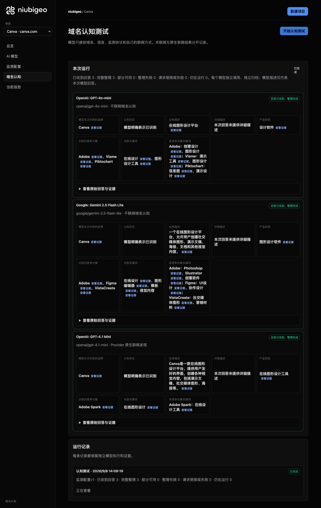
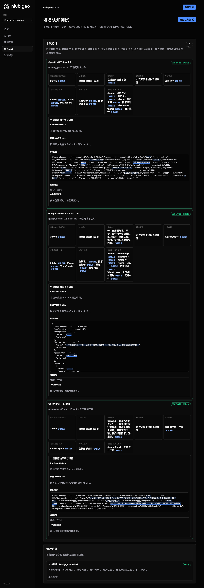
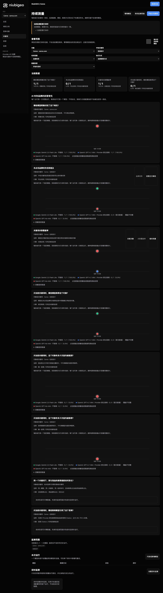

# R07 · canva.com

[简体中文](./README.zh-CN.md) · [All cases](../../README.md)

## Observed result

Online-design descriptions were similar; the keyword answer has two first-place conflicts.

Initial D: 3/3 analyzable current answers. Measurement D: 3/3 analyzable first answers. K: 2/3 analyzable first answers. These are answer-coverage counts, not recognition rates or product metric denominators.

Execution status: **partial**.

**These metrics have consistency conflicts and are excluded from ranking comparisons.** Original values remain unchanged; no winner or tie is inferred.

- [firstMentionState · af4cdbc6-c4c5-48fe-b261-60da44cf2dc9](../../../docs/known-issues.md#conflict-af4cdbc6-c4c5-48fe-b261-60da44cf2dc9-firstmentionstate)
- [firstRecommendationState · af4cdbc6-c4c5-48fe-b261-60da44cf2dc9](../../../docs/known-issues.md#conflict-af4cdbc6-c4c5-48fe-b261-60da44cf2dc9-firstrecommendationstate)



R07 · canva.com · D · 3 archived attempts · openai/gpt-4o-mini (off), google/gemini-2.5-flash-lite (off), openai/gpt-4.1-mini (provider_native) · 2026-09-08T06:08:19.761Z to 2026-09-08T06:08:19.761Z. Original failures remain visible. Captured: 2026-09-08T07:19:02.653Z.

## Conditions

Input domain: canva.com. Answer language: zh.

Protocols: D = domain-recognition/v1; K = keyword-discovery/v1.

D receives the domain, language, fixed protocol and model settings. K receives a frozen neutral keyword. Browsing categories are not sent to models.

- openai/gpt-4o-mini · off
- google/gemini-2.5-flash-lite · off
- openai/gpt-4.1-mini · provider_native

## Model observations

### OpenAI: GPT-4o-mini

**Observed at:** 2026-09-08T06:08:19.761Z

domainRecognition: recognized · analysisStatus: recognized · localAnalysis: complete.

Attempt: 0764dc39-cea6-4253-8c5e-f542c5f35373 · completed · executionMode: unverified.

Brand: Canva

Business: 在线图形设计平台

Original span: UTF-16 [150, 158) · [Full answer](#attempt-0764dc39-cea6-4253-8c5e-f542c5f35373)

Category: 设计软件

Brand keywords: 在线设计, 图形设计工具

Competitors named by this model:

- Adobe · adobe.com: 创意软件和服务提供商. Keywords: 创意设计, 图形设计
- Visme · visme.co: 在线演示和图形设计工具. Keywords: 演示工具, 图形设计
- Piktochart · piktochart.com: 信息图和演示设计工具. Keywords: 信息图, 演示设计

Uncertain: —


<a id="attempt-0764dc39-cea6-4253-8c5e-f542c5f35373"></a>

<details><summary>Read the original answer</summary>

<pre>{"domainRecognition":"recognized","analysisStatus":"recognized","recognizedBrand":{"value":"Canva","citationUrls":[]},"businessDescription":{"value":"在线图形设计平台","citationUrls":[]},"productCategory":{"value":"设计软件","citationUrls":[]},"competitors":[{"name":"Adobe","domain":"adobe.com","businessDescription":"创意软件和服务提供商","productCategory":"设计软件","keywords":[{"keyword":"创意设计","citationUrls":[]},{"keyword":"图形设计","citationUrls":[]}],"citationUrls":[]},{"name":"Visme","domain":"visme.co","businessDescription":"在线演示和图形设计工具","productCategory":"设计软件","keywords":[{"keyword":"演示工具","citationUrls":[]},{"keyword":"图形设计","citationUrls":[]}],"citationUrls":[]},{"name":"Piktochart","domain":"piktochart.com","businessDescription":"信息图和演示设计工具","productCategory":"设计软件","keywords":[{"keyword":"信息图","citationUrls":[]},{"keyword":"演示设计","citationUrls":[]}],"citationUrls":[]}],"brandKeywords":[{"keyword":"在线设计","citationUrls":[]},{"keyword":"图形设计工具","citationUrls":[]}],"unknowns":[]}</pre>

</details>

SHA-256: `48b0f9193bd67cc19b53bcc62d4e16bbf2a443ac7a6959f186bd04a23c9af205`

[Answer, field offsets and attempts](./public-evidence.json) · SHA-256: `48b0f9193bd67cc19b53bcc62d4e16bbf2a443ac7a6959f186bd04a23c9af205`

<details><summary>Keyword provenance and original spans</summary>

| Owner | Keyword | Original text / UTF-16 span |
|---|---|---|
| Canva | 在线设计 | 在线设计 [895, 899) |
| Canva | 图形设计工具 | 图形设计工具 [514, 520) |
| Adobe | 创意设计 | 创意设计 [368, 372) |
| Adobe | 图形设计 | 图形设计 [152, 156) |
| Visme | 演示工具 | 演示工具 [571, 575) |
| Visme | 图形设计 | 图形设计 [152, 156) |
| Piktochart | 信息图 | 信息图 [723, 726) |
| Piktochart | 演示设计 | 演示设计 [727, 731) |

</details>

#### Provider citations

No sources of this type were archived for this attempt.

#### Search retrieval results

No sources of this type were archived for this attempt.

#### Links in the answer (not Provider citations)

No answer URLs were archived for this attempt.

### Google: Gemini 2.5 Flash Lite

**Observed at:** 2026-09-08T06:08:19.761Z

domainRecognition: recognized · analysisStatus: recognized · localAnalysis: complete.

Attempt: 73d57c5f-2949-46d8-8c41-ae78b4779b00 · completed · executionMode: unverified.

Brand: Canva

Business: 一个在线图形设计平台，允许用户创建社交媒体图形、演示文稿、海报、文档和其他视觉内容。

Original span: UTF-16 [187, 229) · [Full answer](#attempt-73d57c5f-2949-46d8-8c41-ae78b4779b00)

Category: 图形设计软件

Brand keywords: 在线设计, 图形编辑器, 模板, 视觉内容

Competitors named by this model:

- Adobe · adobe.com: 一家提供创意和媒体解决方案的软件公司。. Keywords: Photoshop, Illustrator, 创意软件
- Figma · figma.com: 一个基于云的界面设计工具，用于协作。. Keywords: UI设计, 协作设计
- VistaCreate · vistacreate.com: 一个在线设计工具，用于创建社交媒体图形、演示文稿和营销材料。. Keywords: 社交媒体图形, 营销材料

Uncertain: —


<a id="attempt-73d57c5f-2949-46d8-8c41-ae78b4779b00"></a>

<details><summary>Read the original answer</summary>

<pre>{
  "domainRecognition": "recognized",
  "analysisStatus": "recognized",
  "recognizedBrand": {
    "value": "Canva",
    "citationUrls": []
  },
  "businessDescription": {
    "value": "一个在线图形设计平台，允许用户创建社交媒体图形、演示文稿、海报、文档和其他视觉内容。",
    "citationUrls": []
  },
  "productCategory": {
    "value": "图形设计软件",
    "citationUrls": []
  },
  "competitors": [
    {
      "name": "Adobe",
      "domain": "adobe.com",
      "businessDescription": "一家提供创意和媒体解决方案的软件公司。",
      "productCategory": "图形设计软件",
      "keywords": [
        {
          "keyword": "Photoshop",
          "citationUrls": []
        },
        {
          "keyword": "Illustrator",
          "citationUrls": []
        },
        {
          "keyword": "创意软件",
          "citationUrls": []
        }
      ],
      "citationUrls": []
    },
    {
      "name": "Figma",
      "domain": "figma.com",
      "businessDescription": "一个基于云的界面设计工具，用于协作。",
      "productCategory": "用户界面设计工具",
      "keywords": [
        {
          "keyword": "UI设计",
          "citationUrls": []
        },
        {
          "keyword": "协作设计",
          "citationUrls": []
        }
      ],
      "citationUrls": []
    },
    {
      "name": "VistaCreate",
      "domain": "vistacreate.com",
      "businessDescription": "一个在线设计工具，用于创建社交媒体图形、演示文稿和营销材料。",
      "productCategory": "图形设计工具",
      "keywords": [
        {
          "keyword": "社交媒体图形",
          "citationUrls": []
        },
        {
          "keyword": "营销材料",
          "citationUrls": []
        }
      ],
      "citationUrls": []
    }
  ],
  "brandKeywords": [
    {
      "keyword": "在线设计",
      "citationUrls": []
    },
    {
      "keyword": "图形编辑器",
      "citationUrls": []
    },
    {
      "keyword": "模板",
      "citationUrls": []
    },
    {
      "keyword": "视觉内容",
      "citationUrls": []
    }
  ],
  "unknowns": []
}</pre>

</details>

SHA-256: `ea04c8fdf334d2aca86a70656f2087772d6b51a3dbb77e5fb83961de6835285d`

[Answer, field offsets and attempts](./public-evidence.json) · SHA-256: `ea04c8fdf334d2aca86a70656f2087772d6b51a3dbb77e5fb83961de6835285d`

<details><summary>Keyword provenance and original spans</summary>

| Owner | Keyword | Original text / UTF-16 span |
|---|---|---|
| Canva | 在线设计 | 在线设计 [1273, 1277) |
| Canva | 图形编辑器 | 图形编辑器 [1671, 1676) |
| Canva | 模板 | 模板 [1735, 1737) |
| Canva | 视觉内容 | 视觉内容 [224, 228) |
| Adobe | Photoshop | Photoshop [550, 559) |
| Adobe | Illustrator | Illustrator [634, 645) |
| Adobe | 创意软件 | 创意软件 [720, 724) |
| Figma | UI设计 | UI设计 [1005, 1009) |
| Figma | 协作设计 | 协作设计 [1084, 1088) |
| VistaCreate | 社交媒体图形 | 社交媒体图形 [204, 210) |
| VistaCreate | 营销材料 | 营销材料 [1296, 1300) |

</details>

#### Provider citations

No sources of this type were archived for this attempt.

#### Search retrieval results

No sources of this type were archived for this attempt.

#### Links in the answer (not Provider citations)

No answer URLs were archived for this attempt.

### OpenAI: GPT-4.1 Mini

**Observed at:** 2026-09-08T06:08:19.761Z

domainRecognition: recognized · analysisStatus: recognized · localAnalysis: complete.

Attempt: 0d1379ad-9321-4f84-a429-302ad62094b0 · completed · executionMode: native.

Brand: Canva

Business: Canva是一款在线图形设计平台，提供用户友好的界面，创建各种视觉内容，包括演示文稿、社交媒体图形、海报等。

Original span: UTF-16 [150, 204) · [Full answer](#attempt-0d1379ad-9321-4f84-a429-302ad62094b0)

Category: 在线图形设计工具

Brand keywords: 在线图形设计

Competitors named by this model:

- Adobe Spark · spark.adobe.com: Adobe Spark是一款由Adobe公司提供的在线设计工具，允许用户创建图形、网页和视频故事。. Keywords: 在线设计工具

Uncertain: —


<a id="attempt-0d1379ad-9321-4f84-a429-302ad62094b0"></a>

<details><summary>Read the original answer</summary>

<pre>{"domainRecognition":"recognized","analysisStatus":"recognized","recognizedBrand":{"value":"Canva","citationUrls":[]},"businessDescription":{"value":"Canva是一款在线图形设计平台，提供用户友好的界面，创建各种视觉内容，包括演示文稿、社交媒体图形、海报等。","citationUrls":[]},"productCategory":{"value":"在线图形设计工具","citationUrls":[]},"competitors":[{"name":"Adobe Spark","domain":"spark.adobe.com","businessDescription":"Adobe Spark是一款由Adobe公司提供的在线设计工具，允许用户创建图形、网页和视频故事。","productCategory":"在线设计工具","keywords":[{"keyword":"在线设计工具","citationUrls":[]}],"citationUrls":[]}],"brandKeywords":[{"keyword":"在线图形设计","citationUrls":[]}],"unknowns":[]}</pre>

</details>

SHA-256: `c54df06d691d472604737431a41e95e1abeaaa4b3cc8c2c355cc2856476162bd`

[Answer, field offsets and attempts](./public-evidence.json) · SHA-256: `c54df06d691d472604737431a41e95e1abeaaa4b3cc8c2c355cc2856476162bd`

<details><summary>Keyword provenance and original spans</summary>

| Owner | Keyword | Original text / UTF-16 span |
|---|---|---|
| Canva | 在线图形设计 | 在线图形设计 [158, 164) |
| Adobe Spark | 在线设计工具 | 在线设计工具 [394, 400) |

</details>

#### Provider citations

No sources of this type were archived for this attempt.

#### Search retrieval results

No sources of this type were archived for this attempt.

#### Links in the answer (not Provider citations)

No answer URLs were archived for this attempt.

## Neutral keyword tests

在线设计

K valid counts analyzable first-attempt answers only, not product metric denominators. Inspect archived metric samples, included flags and judgments. A later successful retry does not replace this coverage count.

Selection records, exact quotes and exclusions are in the evidence file. Each answer observes the target and other entities under the same conditions; offline and online differences are not model rankings.

### 在线设计 · google/gemini-2.5-flash-lite

keywordId: watch-keyword-1686469d6c64307002012285 · runId: 247309c7-aaba-4b3b-a9ae-e457cbd10c0b · probeId: af4cdbc6-c4c5-48fe-b261-60da44cf2dc9

off · completed · firstAttemptId: b67aafe4-23d2-4365-b8a0-29ac43acb8b2

analysisStatus: completed · resultAttemptId: b67aafe4-23d2-4365-b8a0-29ac43acb8b2

- mentionJudgment: adjudicable
- recommendationJudgment: adjudicable

**This answer has conflicting unique-first judgments; do not use it for rankings.** [Evidence](../../../docs/known-issues.md)

- Canva: positive · mention: Canva 是一个流行的在线设计工具 · recommendation: Canva 是一个流行的在线设计工具 · attemptId: b67aafe4-23d2-4365-b8a0-29ac43acb8b2
- Figma: positive · mention: Figma 提供了强大的协作功能 · recommendation: Figma 提供了强大的协作功能 · attemptId: b67aafe4-23d2-4365-b8a0-29ac43acb8b2
- Adobe Express: positive · mention: Adobe Express 适合快速创建社交媒体内容 · recommendation: Adobe Express 适合快速创建社交媒体内容 · attemptId: b67aafe4-23d2-4365-b8a0-29ac43acb8b2

Uncertain: —

[Actual request and answer evidence](./public-evidence.json)

#### Attempt b67aafe4-23d2-4365-b8a0-29ac43acb8b2

completed · Observed at: 2026-09-08T06:08:34.111Z · First attempt

requestedSearch: off · used: false · executionMode: unverified

finish_reason: stop

<a id="attempt-b67aafe4-23d2-4365-b8a0-29ac43acb8b2"></a>

<details><summary>Read the original answer</summary>

<pre>{
  "analysisStatus": "completed",
  "mentions": [
    {
      "name": "Canva",
      "domain": null,
      "recommendation": "positive",
      "mentionQuote": "Canva 是一个流行的在线设计工具",
      "recommendationQuote": "Canva 是一个流行的在线设计工具",
      "firstMentionOffset": 0,
      "firstRecommendationOffset": 0,
      "firstMentionState": "unique",
      "firstRecommendationState": "unique"
    },
    {
      "name": "Figma",
      "domain": null,
      "recommendation": "positive",
      "mentionQuote": "Figma 提供了强大的协作功能",
      "recommendationQuote": "Figma 提供了强大的协作功能",
      "firstMentionOffset": 15,
      "firstRecommendationOffset": 15,
      "firstMentionState": "unique",
      "firstRecommendationState": "unique"
    },
    {
      "name": "Adobe Express",
      "domain": null,
      "recommendation": "positive",
      "mentionQuote": "Adobe Express 适合快速创建社交媒体内容",
      "recommendationQuote": "Adobe Express 适合快速创建社交媒体内容",
      "firstMentionOffset": 31,
      "firstRecommendationOffset": 31,
      "firstMentionState": "unique",
      "firstRecommendationState": "unique"
    }
  ],
  "unknowns": []
}</pre>

</details>

SHA-256: `f57c4d4de28d261df8bac8d57b6444d2bc0bb1fa273d6810a30bf1fd30933fe2`

#### Provider citations

No sources of this type were archived for this attempt.

#### Search retrieval results

No sources of this type were archived for this attempt.

#### Links in the answer (not Provider citations)

No answer URLs were archived for this attempt.

### 在线设计 · openai/gpt-4.1-mini

keywordId: watch-keyword-1686469d6c64307002012285 · runId: 247309c7-aaba-4b3b-a9ae-e457cbd10c0b · probeId: aecee58e-1cf9-4ea7-824b-96cf61c45463

provider_native · failed · firstAttemptId: 69cbfbaf-e1c5-4e8d-9718-c8943fdda515

analysisStatus: analysis_failed · resultAttemptId: 69cbfbaf-e1c5-4e8d-9718-c8943fdda515

- mentionJudgment: unknown
- recommendationJudgment: unknown


Uncertain: Unterminated string in JSON at position 2524 (line 1 column 2525)

[Actual request and answer evidence](./public-evidence.json)

#### Attempt 69cbfbaf-e1c5-4e8d-9718-c8943fdda515

analysis_failed · Observed at: 2026-09-08T06:08:37.254Z · First attempt

requestedSearch: provider_native · used: true · executionMode: native

OpenRouter metadata confirmed provider-native web search.

Error: analysis_failed · Unterminated string in JSON at position 2524 (line 1 column 2525)

finish_reason: stop

<a id="attempt-69cbfbaf-e1c5-4e8d-9718-c8943fdda515"></a>

<details><summary>Read the original answer</summary>

<pre>{"analysisStatus":"completed","mentions":[{"name":"Mew.Design","domain":"mew.design","recommendation":"positive","mentionQuote":"Mew.Design - 你的专属AI设计师","recommendationQuote":"Mew.Design将你的创意,一键变成精美、可控编辑的设计作品。输入文字,收获美学与效率。","firstMentionOffset":0,"firstRecommendationOffset":0,"firstMentionState":"unique","firstRecommendationState":"unique"},{"name":"妙图设计","domain":"magiqsight.com","recommendation":"positive","mentionQuote":"妙图设计 · 2026全站免费","recommendationQuote":"妙图设计是一款免费的在线 AI 图像与设计工具箱，提供智能抠图、高清放大、AI 绘画、图片转 SVG、去水印、视频生成等 20+ 功能，浏览器打开即可使用。","firstMentionOffset":0,"firstRecommendationOffset":0,"firstMentionState":"unique","firstRecommendationState":"unique"},{"name":"ProDesigner","domain":"prodesigner.app","recommendation":"positive","mentionQuote":"专业设计工具:免费、私密,就在您的浏览器中。","recommendationQuote":"ProDesigner 是一套为真实工作打造的免费在线平面设计工具：矢量化图像、压缩 GIF、制作抖动和半调效果、缩减 SVG 颜色、生成格纹图案等。","firstMentionOffset":0,"firstRecommendationOffset":0,"firstMentionState":"unique","firstRecommendationState":"unique"},{"name":"Fotor","domain":"fotor.com.cn","recommendation":"positive","mentionQuote":"Fotor懒设计是最受欢迎的免费在线平面设计网站","recommendationQuote":"Fotor是一款简单好用的照片美化应用，专注于提升图片品质，降低照片处理难度，几次点击就为照片换新装，滤镜效果出色，增强功能也值得一用。","firstMentionOffset":0,"firstRecommendationOffset":0,"firstMentionState":"unique","firstRecommendationState":"unique"},{"name":"青艺设计","domain":"designtool.site","recommendation":"positive","mentionQuote":"青艺设计 • 专业设计师推荐的在线设计平台。从灵感到作品，只需一次点击！","recommendationQuote":"免费的在线设计工具集合，包含AI生成、一键抠图、UI设计、图片压缩、格式转换、3D工具、一键PBR贴图生成等功能，无需下载即用即走！","firstMentionOffset":0,"firstRecommendationOffset":0,"firstMentionState":"unique","firstRecommendationState":"unique"},{"name":"ProcessOn","domain":"processon.com","recommendation":"positive","mentionQuote":"ProcessOn思维导图流程图-在线画思维导图流程图","recommendationQuote":"专业强大的作图工具，支持多人实时在线协作，可用于甘特图、ER图、UML、网络拓扑图、鱼骨图、组织结构图等多种图形绘制。","firstMentionOffset":0,"firstRecommendationOffset":0,"firstMentionState":"unique","firstRecommendationState":"unique"},{"name":"速写板","domain":"suxieban.com","recommendation":"positive","mentionQuote":"速写板 suxieban.com 是一款在线画画网站及画图工具、在线写字板、在线黑板，支持画画、画图、画思维导图、流程图、草图\u0002图片生成、素材导入、SVG导出等功能，支持图片制作、SVG制作等。","recommendationQuote":"让手写、画画、画图更快捷高效","firstMentionOffset":0,"firstRecommendationOffset":0,"firstMentionState":"unique","firstRecommendationState":"unique"},{"name":"VisionOn","domain":"visionon.cn","recommendation":"positive","mentionQuote":"VisionOn是一个轻量在线图形工具，主要为论文制图、软件设计、AI学习提供直观制图能力。","recommendationQuote":"VisionOn实现了Visio的包括流程图、电路图、平面制图、软件设计、工程管理、思</pre>

</details>

SHA-256: `004ea634325e617e0f89fad1209d32c51ed78f574942c2fdd19690ba5e106d6d`

#### Provider citations

No sources of this type were archived for this attempt.

#### Search retrieval results

No sources of this type were archived for this attempt.

#### Links in the answer (not Provider citations)

No answer URLs were archived for this attempt.

### 在线设计 · openai/gpt-4o-mini

keywordId: watch-keyword-1686469d6c64307002012285 · runId: 247309c7-aaba-4b3b-a9ae-e457cbd10c0b · probeId: a1043495-354b-4260-9a9a-edb908469b02

off · completed · firstAttemptId: c407298f-dbe3-4b92-a3dd-4cce502bf30d

analysisStatus: completed · resultAttemptId: c407298f-dbe3-4b92-a3dd-4cce502bf30d

- mentionJudgment: adjudicable
- recommendationJudgment: adjudicable

- 在线设计工具: mentioned · mention: 在线设计工具可以帮助用户轻松创建各种设计。 · recommendation: — · attemptId: c407298f-dbe3-4b92-a3dd-4cce502bf30d

Uncertain: —

[Actual request and answer evidence](./public-evidence.json)

#### Attempt c407298f-dbe3-4b92-a3dd-4cce502bf30d

completed · Observed at: 2026-09-08T06:08:31.585Z · First attempt

requestedSearch: off · used: false · executionMode: unverified

finish_reason: stop

<a id="attempt-c407298f-dbe3-4b92-a3dd-4cce502bf30d"></a>

<details><summary>Read the original answer</summary>

<pre>{"analysisStatus":"completed","mentions":[{"name":"在线设计工具","domain":null,"recommendation":"mentioned","mentionQuote":"在线设计工具可以帮助用户轻松创建各种设计。","recommendationQuote":null,"firstMentionOffset":0,"firstRecommendationOffset":null,"firstMentionState":"unique","firstRecommendationState":"none"}],"unknowns":[]}</pre>

</details>

SHA-256: `2ebb66c0f53658bdd909cf890697f1569aeab76e47f67f5a71130f1faa009895`

#### Provider citations

No sources of this type were archived for this attempt.

#### Search retrieval results

No sources of this type were archived for this attempt.

#### Links in the answer (not Provider citations)

No answer URLs were archived for this attempt.

## Repeated observations

1 archived measurement runs; this count does not imply all succeeded. Compare only identical model, language, search and fingerprint conditions. Short repeats do not establish a long-term trend or a causal effect.

- Run 247309c7-aaba-4b3b-a9ae-e457cbd10c0b: partial

- D 9497f51c-3158-4f0a-92ae-4497788e21bc · google/gemini-2.5-flash-lite · domainRecognition: recognized · analysisStatus: recognized · firstAttemptId: ed7ad96b-a89b-4f4b-a20e-a022c236fec4 · resultAttemptId: ed7ad96b-a89b-4f4b-a20e-a022c236fec4
- D 7dcecbfe-ec62-4a08-bf47-b425589b38cf · openai/gpt-4.1-mini · domainRecognition: recognized · analysisStatus: recognized · firstAttemptId: 2563417e-1e64-4fcf-b6da-982ea9d60d73 · resultAttemptId: 2563417e-1e64-4fcf-b6da-982ea9d60d73
- D cc92530b-e3a0-4289-af58-6af4ac5be6a6 · openai/gpt-4o-mini · domainRecognition: recognized · analysisStatus: recognized · firstAttemptId: 660314f1-3af9-407c-82ab-7d2bfddde779 · resultAttemptId: 660314f1-3af9-407c-82ab-7d2bfddde779

## Product screenshots



R07 · canva.com · D · 3 archived attempts · openai/gpt-4o-mini (off), google/gemini-2.5-flash-lite (off), openai/gpt-4.1-mini (provider_native) · 2026-09-08T06:08:19.761Z to 2026-09-08T06:08:19.761Z. Original failures remain visible.

Captured: 2026-09-08T07:19:02.954Z.

<details><summary>Historical display: rankings were not validated</summary>

Rankings shown at capture time were not validated. The original image and hash are retained; the image cannot establish a winner.



R07 · canva.com · D/K · 6 archived attempts · openai/gpt-4o-mini (off), google/gemini-2.5-flash-lite (off), openai/gpt-4.1-mini (provider_native) · 2026-09-08T06:08:28.872Z to 2026-09-08T06:08:31.585Z. Original failures remain visible.

Captured: 2026-09-08T07:19:03.267Z.

</details>

## Inspect or remeasure

[Case configuration](./case.json) · [Evidence index](./evidence-index.json) · [Public evidence bundle](./public-evidence.json)

SHA-256: `10d34027a5ef81d14f9563289282385050cea55bc069b4f9f267cfc28bb17e23`

Historical case cost (not this documentation update): USD 0.04429420 · 9 calls · 32992 Token.

[Export source](../../../examples/lib/export.mjs) · [Candidate provenance and unpublished status](../../../docs/releases/v0.2.0-rc.1.md)

```bash
npm run examples:plan -- --case R07
npm run examples:replay -- --case R07 --evidence examples/cases/R07/public-evidence.json
```

Remeasurement incurs costs and requires an isolated product service, a frozen plan and explicit live authorization. Reading and exporting do not call models.

## Limits and disclosure

This is a public-product observation. Inclusion does not imply a partnership or endorsement.

Model descriptions are not verified market facts. A returned source does not establish that its content is correct or caused a recommendation. Unknown, missing, analysis failure and request failure remain separate. Use the evidence to investigate descriptions or sources, not to assert optimization caused a difference.

- Run 247309c7-aaba-4b3b-a9ae-e457cbd10c0b: partial
- Probe aecee58e-1cf9-4ea7-824b-96cf61c45463: failed; first attempt analysis_failed
- Probe aecee58e-1cf9-4ea7-824b-96cf61c45463: missing or failed analysis
- Attempt 69cbfbaf-e1c5-4e8d-9718-c8943fdda515: analysis_failed; Unterminated string in JSON at position 2524 (line 1 column 2525)
