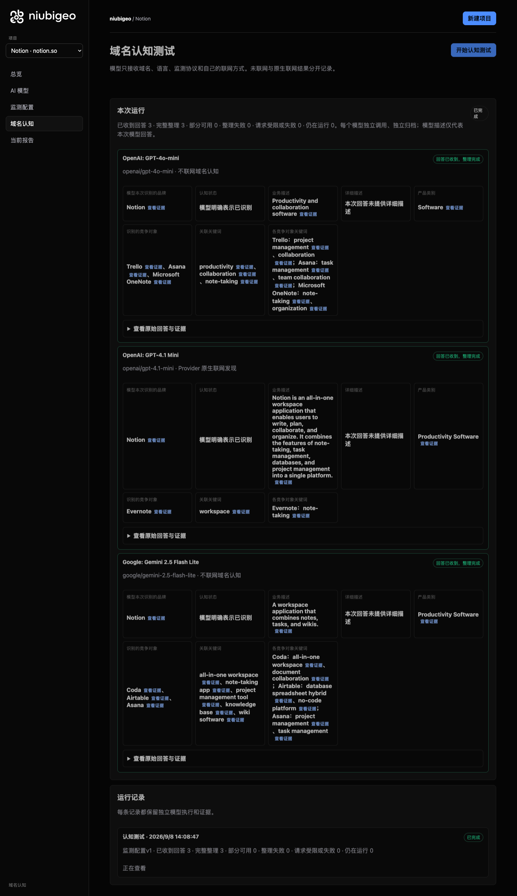
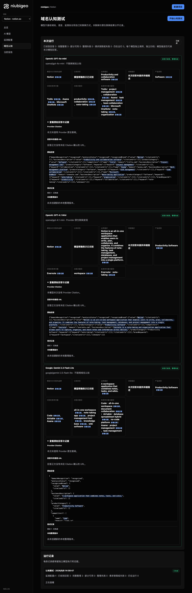

# R08 · notion.so

[简体中文](./README.zh-CN.md) · [All cases](../../README.md)

## Observed result

Models emphasized notes, workspace and collaboration, naming different competitors.

Initial D: 3/3 analyzable current answers. Measurement D: 3/3 analyzable first answers. K: 0/0 analyzable first answers. These are answer-coverage counts, not recognition rates or product metric denominators.

Execution status: **completed**.



R08 · notion.so · D · 3 archived attempts · openai/gpt-4o-mini (off), google/gemini-2.5-flash-lite (off), openai/gpt-4.1-mini (provider_native) · 2026-09-08T06:08:47.032Z to 2026-09-08T06:08:47.032Z. Original failures remain visible. Captured: 2026-09-08T07:19:03.686Z.

## Conditions

Input domain: notion.so. Answer language: en.

Protocols: D = domain-recognition/v1; K = keyword-discovery/v1.

D receives the domain, language, fixed protocol and model settings. K receives a frozen neutral keyword. Browsing categories are not sent to models.

- openai/gpt-4o-mini · off
- google/gemini-2.5-flash-lite · off
- openai/gpt-4.1-mini · provider_native

## Model observations

### OpenAI: GPT-4o-mini

**Observed at:** 2026-09-08T06:08:47.032Z

domainRecognition: recognized · analysisStatus: recognized · localAnalysis: complete.

Attempt: 3c35cb4a-751a-4dd1-ab90-6627c65e1003 · completed · executionMode: unverified.

Brand: Notion

Business: Productivity and collaboration software

Original span: UTF-16 [151, 190) · [Full answer](#attempt-3c35cb4a-751a-4dd1-ab90-6627c65e1003)

Category: Software

Brand keywords: productivity, collaboration, note-taking

Competitors named by this model:

- Trello · trello.com: Project management tool. Keywords: project management, collaboration
- Asana · asana.com: Work management platform. Keywords: task management, team collaboration
- Microsoft OneNote · onenote.com: Note-taking application. Keywords: note-taking, organization

Uncertain: —


<a id="attempt-3c35cb4a-751a-4dd1-ab90-6627c65e1003"></a>

<details><summary>Read the original answer</summary>

<pre>{"domainRecognition":"recognized","analysisStatus":"recognized","recognizedBrand":{"value":"Notion","citationUrls":[]},"businessDescription":{"value":"Productivity and collaboration software","citationUrls":[]},"productCategory":{"value":"Software","citationUrls":[]},"competitors":[{"name":"Trello","domain":"trello.com","businessDescription":"Project management tool","productCategory":"Software","keywords":[{"keyword":"project management","citationUrls":[]},{"keyword":"collaboration","citationUrls":[]}],"citationUrls":[]},{"name":"Asana","domain":"asana.com","businessDescription":"Work management platform","productCategory":"Software","keywords":[{"keyword":"task management","citationUrls":[]},{"keyword":"team collaboration","citationUrls":[]}],"citationUrls":[]},{"name":"Microsoft OneNote","domain":"onenote.com","businessDescription":"Note-taking application","productCategory":"Software","keywords":[{"keyword":"note-taking","citationUrls":[]},{"keyword":"organization","citationUrls":[]}],"citationUrls":[]}],"brandKeywords":[{"keyword":"productivity","citationUrls":[]},{"keyword":"collaboration","citationUrls":[]},{"keyword":"note-taking","citationUrls":[]}],"unknowns":[]}</pre>

</details>

SHA-256: `74f7f1a89f2f11ff058535752100786ad44c4e8cab546fdb18875c24ade89e02`

[Answer, field offsets and attempts](./public-evidence.json) · SHA-256: `74f7f1a89f2f11ff058535752100786ad44c4e8cab546fdb18875c24ade89e02`

<details><summary>Keyword provenance and original spans</summary>

| Owner | Keyword | Original text / UTF-16 span |
|---|---|---|
| Notion | productivity | productivity [1053, 1065) |
| Notion | collaboration | collaboration [168, 181) |
| Notion | note-taking | note-taking [926, 937) |
| Trello | project management | project management [423, 441) |
| Trello | collaboration | collaboration [168, 181) |
| Asana | task management | task management [667, 682) |
| Asana | team collaboration | team collaboration [715, 733) |
| Microsoft OneNote | note-taking | note-taking [926, 937) |
| Microsoft OneNote | organization | organization [970, 982) |

</details>

#### Provider citations

No sources of this type were archived for this attempt.

#### Search retrieval results

No sources of this type were archived for this attempt.

#### Links in the answer (not Provider citations)

No answer URLs were archived for this attempt.

### OpenAI: GPT-4.1 Mini

**Observed at:** 2026-09-08T06:08:47.032Z

domainRecognition: recognized · analysisStatus: recognized · localAnalysis: complete.

Attempt: f1293f91-2524-4227-a31e-15267148099d · completed · executionMode: native.

Brand: Notion

Business: Notion is an all-in-one workspace application that enables users to write, plan, collaborate, and organize. It combines the features of note-taking, task management, databases, and project management into a single platform.

Original span: UTF-16 [151, 374) · [Full answer](#attempt-f1293f91-2524-4227-a31e-15267148099d)

Category: Productivity Software

Brand keywords: workspace

Competitors named by this model:

- Evernote · evernote.com: Evernote is a note-taking and organization application that allows users to capture, organize, and share notes and information across devices.. Keywords: note-taking

Uncertain: —


<a id="attempt-f1293f91-2524-4227-a31e-15267148099d"></a>

<details><summary>Read the original answer</summary>

<pre>{"domainRecognition":"recognized","analysisStatus":"recognized","recognizedBrand":{"value":"Notion","citationUrls":[]},"businessDescription":{"value":"Notion is an all-in-one workspace application that enables users to write, plan, collaborate, and organize. It combines the features of note-taking, task management, databases, and project management into a single platform.","citationUrls":[]},"productCategory":{"value":"Productivity Software","citationUrls":[]},"competitors":[{"name":"Evernote","domain":"evernote.com","businessDescription":"Evernote is a note-taking and organization application that allows users to capture, organize, and share notes and information across devices.","productCategory":"Productivity Software","keywords":[{"keyword":"note-taking","citationUrls":[]}],"citationUrls":[]}],"brandKeywords":[{"keyword":"workspace","citationUrls":[]}],"unknowns":[]}</pre>

</details>

SHA-256: `7319df29e09348437d953c1f73dc86063118db854dda989289f96e33c9779878`

[Answer, field offsets and attempts](./public-evidence.json) · SHA-256: `7319df29e09348437d953c1f73dc86063118db854dda989289f96e33c9779878`

<details><summary>Keyword provenance and original spans</summary>

| Owner | Keyword | Original text / UTF-16 span |
|---|---|---|
| Notion | workspace | workspace [175, 184) |
| Evernote | note-taking | note-taking [287, 298) |

</details>

#### Provider citations

No sources of this type were archived for this attempt.

#### Search retrieval results

No sources of this type were archived for this attempt.

#### Links in the answer (not Provider citations)

No answer URLs were archived for this attempt.

### Google: Gemini 2.5 Flash Lite

**Observed at:** 2026-09-08T06:08:47.032Z

domainRecognition: recognized · analysisStatus: recognized · localAnalysis: complete.

Attempt: 1639e0b2-4ebe-4329-9991-2b75481fc0c1 · completed · executionMode: unverified.

Brand: Notion

Business: A workspace application that combines notes, tasks, and wikis.

Original span: UTF-16 [188, 250) · [Full answer](#attempt-1639e0b2-4ebe-4329-9991-2b75481fc0c1)

Category: Productivity Software

Brand keywords: all-in-one workspace, note-taking app, project management tool, knowledge base, wiki software

Competitors named by this model:

- Coda · coda.io: A new doc that blends documents, spreadsheets, and apps into a single workspace.. Keywords: all-in-one workspace, document collaboration
- Airtable · airtable.com: A cloud collaboration service software company that combines the capabilities of a spreadsheet with a database.. Keywords: database spreadsheet hybrid, no-code platform
- Asana · asana.com: A work management platform that helps teams organize, track, and manage their work.. Keywords: project management, task management

Uncertain: —


<a id="attempt-1639e0b2-4ebe-4329-9991-2b75481fc0c1"></a>

<details><summary>Read the original answer</summary>

<pre>{
  "domainRecognition": "recognized",
  "analysisStatus": "recognized",
  "recognizedBrand": {
    "value": "Notion",
    "citationUrls": []
  },
  "businessDescription": {
    "value": "A workspace application that combines notes, tasks, and wikis.",
    "citationUrls": []
  },
  "productCategory": {
    "value": "Productivity Software",
    "citationUrls": []
  },
  "competitors": [
    {
      "name": "Coda",
      "domain": "coda.io",
      "businessDescription": "A new doc that blends documents, spreadsheets, and apps into a single workspace.",
      "productCategory": "Productivity Software",
      "keywords": [
        {
          "keyword": "all-in-one workspace",
          "citationUrls": []
        },
        {
          "keyword": "document collaboration",
          "citationUrls": []
        }
      ],
      "citationUrls": []
    },
    {
      "name": "Airtable",
      "domain": "airtable.com",
      "businessDescription": "A cloud collaboration service software company that combines the capabilities of a spreadsheet with a database.",
      "productCategory": "Productivity Software",
      "keywords": [
        {
          "keyword": "database spreadsheet hybrid",
          "citationUrls": []
        },
        {
          "keyword": "no-code platform",
          "citationUrls": []
        }
      ],
      "citationUrls": []
    },
    {
      "name": "Asana",
      "domain": "asana.com",
      "businessDescription": "A work management platform that helps teams organize, track, and manage their work.",
      "productCategory": "Productivity Software",
      "keywords": [
        {
          "keyword": "project management",
          "citationUrls": []
        },
        {
          "keyword": "task management",
          "citationUrls": []
        }
      ],
      "citationUrls": []
    }
  ],
  "brandKeywords": [
    {
      "keyword": "all-in-one workspace",
      "citationUrls": []
    },
    {
      "keyword": "note-taking app",
      "citationUrls": []
    },
    {
      "keyword": "project management tool",
      "citationUrls": []
    },
    {
      "keyword": "knowledge base",
      "citationUrls": []
    },
    {
      "keyword": "wiki software",
      "citationUrls": []
    }
  ],
  "unknowns": []
}</pre>

</details>

SHA-256: `40acc094650331eab8fd3e08d55dae3c4151481003cc052ea008aa58deb1af3d`

[Answer, field offsets and attempts](./public-evidence.json) · SHA-256: `40acc094650331eab8fd3e08d55dae3c4151481003cc052ea008aa58deb1af3d`

<details><summary>Keyword provenance and original spans</summary>

| Owner | Keyword | Original text / UTF-16 span |
|---|---|---|
| Notion | all-in-one workspace | all-in-one workspace [659, 679) |
| Notion | note-taking app | note-taking app [1965, 1980) |
| Notion | project management tool | project management tool [2039, 2062) |
| Notion | knowledge base | knowledge base [2121, 2135) |
| Notion | wiki software | wiki software [2194, 2207) |
| Coda | all-in-one workspace | all-in-one workspace [659, 679) |
| Coda | document collaboration | document collaboration [754, 776) |
| Airtable | database spreadsheet hybrid | database spreadsheet hybrid [1169, 1196) |
| Airtable | no-code platform | no-code platform [1271, 1287) |
| Asana | project management | project management [1646, 1664) |
| Asana | task management | task management [1739, 1754) |

</details>

#### Provider citations

No sources of this type were archived for this attempt.

#### Search retrieval results

No sources of this type were archived for this attempt.

#### Links in the answer (not Provider citations)

No answer URLs were archived for this attempt.

## Neutral keyword tests

Keyword tests were not run: the frozen selection yielded no eligible terms. Sources and exclusions remain in archiveContext.keywordManifest in public-evidence.json; no terms or runs were added.

K valid counts analyzable first-attempt answers only, not product metric denominators. Inspect archived metric samples, included flags and judgments. A later successful retry does not replace this coverage count.

Selection records, exact quotes and exclusions are in the evidence file. Each answer observes the target and other entities under the same conditions; offline and online differences are not model rankings.

## Repeated observations

1 archived measurement runs; this count does not imply all succeeded. Compare only identical model, language, search and fingerprint conditions. Short repeats do not establish a long-term trend or a causal effect.

- Run fbcc59bd-7150-4b44-968e-6410ebcd198f: completed

- D f03689f7-7809-42b0-ba94-0f9e9aa0f3c6 · openai/gpt-4.1-mini · domainRecognition: recognized · analysisStatus: recognized · firstAttemptId: 706b1b9d-2633-4703-9744-084b6d6981d0 · resultAttemptId: 706b1b9d-2633-4703-9744-084b6d6981d0
- D 64356f48-bf8c-4786-8702-60fb1b6e3eda · openai/gpt-4o-mini · domainRecognition: recognized · analysisStatus: recognized · firstAttemptId: a3a5fc66-910b-4685-93e9-60bb2991c02a · resultAttemptId: a3a5fc66-910b-4685-93e9-60bb2991c02a
- D 5a180f50-7681-4461-ad8c-a8dfa84f9b6e · google/gemini-2.5-flash-lite · domainRecognition: recognized · analysisStatus: recognized · firstAttemptId: a99f7e42-2dca-4055-a54b-4dc60cf49be4 · resultAttemptId: a99f7e42-2dca-4055-a54b-4dc60cf49be4

## Product screenshots



R08 · notion.so · D · 3 archived attempts · openai/gpt-4o-mini (off), google/gemini-2.5-flash-lite (off), openai/gpt-4.1-mini (provider_native) · 2026-09-08T06:08:47.032Z to 2026-09-08T06:08:47.032Z. Original failures remain visible.

Captured: 2026-09-08T07:19:04.005Z.

## Inspect or remeasure

[Case configuration](./case.json) · [Evidence index](./evidence-index.json) · [Public evidence bundle](./public-evidence.json)

SHA-256: `fae3309168c20799c1f4c97de962f8634885f3532614d0c5aa77370c9a75d33f`

Historical case cost (not this documentation update): USD 0.02895870 · 6 calls · 22097 Token.

[Export source](../../../examples/lib/export.mjs) · [Candidate provenance and unpublished status](../../../docs/releases/v0.2.0-rc.1.md)

```bash
npm run examples:plan -- --case R08
npm run examples:replay -- --case R08 --evidence examples/cases/R08/public-evidence.json
```

Remeasurement incurs costs and requires an isolated product service, a frozen plan and explicit live authorization. Reading and exporting do not call models.

## Limits and disclosure

This is a public-product observation. Inclusion does not imply a partnership or endorsement.

Model descriptions are not verified market facts. A returned source does not establish that its content is correct or caused a recommendation. Unknown, missing, analysis failure and request failure remain separate. Use the evidence to investigate descriptions or sources, not to assert optimization caused a difference.

