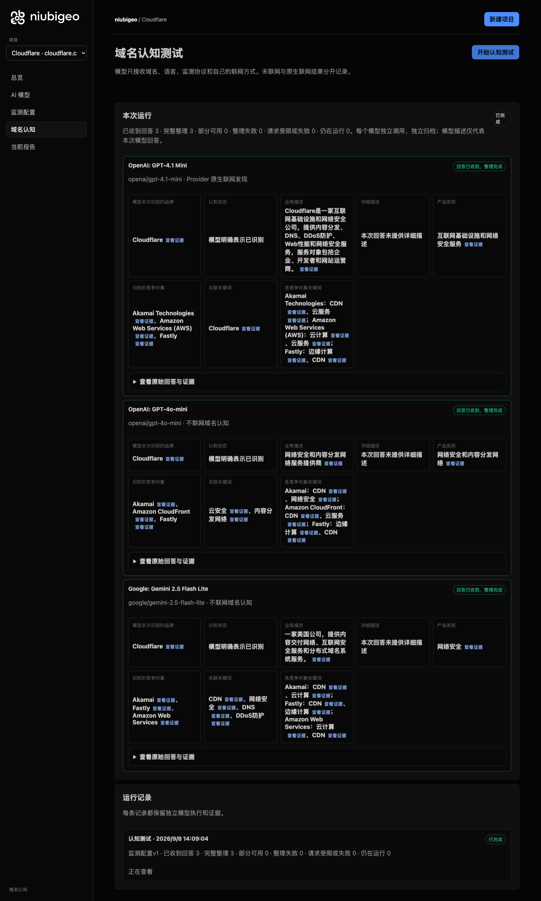
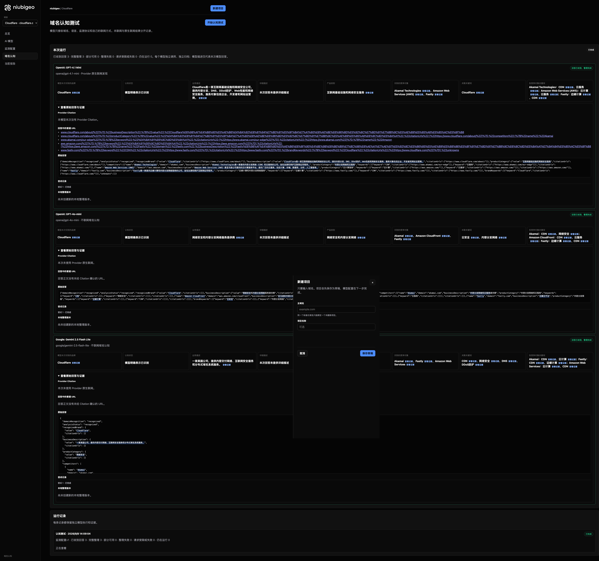

# R09 · cloudflare.com

[English](./README.md) · [全部案例](../../README.zh-CN.md)

## 本次实际结果

模型强调 CDN 与安全；AWS 相关名称未统一为同一实体。

初始 D：3/3 条当前回答可分析；测量 D：3/3 条首次回答可分析；K：0/0 条首次回答可分析。这些是回答覆盖计数，不是认识率或产品指标分母。

执行状态: **执行完成**.



R09 · cloudflare.com · D · 3 条归档尝试 · openai/gpt-4o-mini（off）、google/gemini-2.5-flash-lite（off）、openai/gpt-4.1-mini（provider_native） · 2026-09-08T06:09:04.252Z 至 2026-09-08T06:09:04.252Z。保留原始失败状态。 截图时间: 2026-09-08T07:19:04.477Z.

## 测试条件

输入域名: cloudflare.com. 回答语言: zh.

协议: D = domain-recognition/v1; K = keyword-discovery/v1.

D 只接收域名、语言、固定协议与模型配置。K 只接收已冻结的中性关键词。分类标签不发送给模型。

- openai/gpt-4o-mini · off
- google/gemini-2.5-flash-lite · off
- openai/gpt-4.1-mini · provider_native

## 各模型的描述

### OpenAI: GPT-4.1 Mini

**运行时间:** 2026-09-08T06:09:04.252Z

domainRecognition: recognized · analysisStatus: recognized · localAnalysis: complete.

Attempt: 679410aa-1184-46da-b78d-85e1b5c39fb2 · completed · executionMode: native.

品牌: Cloudflare

业务: Cloudflare是一家互联网基础设施和网络安全公司，提供内容分发、DNS、DDoS防护、Web性能和网络安全服务，服务对象包括企业、开发者和网站运营商。

原文位置: UTF-16 [190, 268) · [打开完整回答](#attempt-679410aa-1184-46da-b78d-85e1b5c39fb2)

类别: 互联网基础设施和网络安全服务

目标关键词: Cloudflare

竞争对象:

- Akamai Technologies · akamai.com: Akamai Technologies是一家提供内容分发网络（CDN）和云服务的公司，旨在加速和保护互联网应用程序。. 关键词: CDN, 云服务
- Amazon Web Services (AWS) · aws.amazon.com: Amazon Web Services（AWS）是亚马逊公司提供的云计算服务平台，提供广泛的云服务，包括计算、存储、数据库、分析、人工智能等。. 关键词: 云计算, 云服务
- Fastly · fastly.com: Fastly是一家提供边缘计算和内容分发网络服务的公司，旨在加速和保护互联网应用程序。. 关键词: 边缘计算, CDN

无法确认: —


<a id="attempt-679410aa-1184-46da-b78d-85e1b5c39fb2"></a>

<details><summary>查看模型原始回答</summary>

<pre>{"domainRecognition":"recognized","analysisStatus":"recognized","recognizedBrand":{"value":"Cloudflare","citationUrls":["https://www.cloudflare.com/about/"]},"businessDescription":{"value":"Cloudflare是一家互联网基础设施和网络安全公司，提供内容分发、DNS、DDoS防护、Web性能和网络安全服务，服务对象包括企业、开发者和网站运营商。","citationUrls":["https://www.cloudflare.com/about/"]},"productCategory":{"value":"互联网基础设施和网络安全服务","citationUrls":["https://www.cloudflare.com/about/"]},"competitors":[{"name":"Akamai Technologies","domain":"akamai.com","businessDescription":"Akamai Technologies是一家提供内容分发网络（CDN）和云服务的公司，旨在加速和保护互联网应用程序。","productCategory":"内容分发网络和云服务","keywords":[{"keyword":"CDN","citationUrls":["https://www.akamai.com/our-edge"]},{"keyword":"云服务","citationUrls":["https://www.akamai.com/our-edge"]}],"citationUrls":["https://www.akamai.com/"]},{"name":"Amazon Web Services (AWS)","domain":"aws.amazon.com","businessDescription":"Amazon Web Services（AWS）是亚马逊公司提供的云计算服务平台，提供广泛的云服务，包括计算、存储、数据库、分析、人工智能等。","productCategory":"云计算服务","keywords":[{"keyword":"云计算","citationUrls":["https://aws.amazon.com/"]},{"keyword":"云服务","citationUrls":["https://aws.amazon.com/"]}],"citationUrls":["https://aws.amazon.com/"]},{"name":"Fastly","domain":"fastly.com","businessDescription":"Fastly是一家提供边缘计算和内容分发网络服务的公司，旨在加速和保护互联网应用程序。","productCategory":"边缘计算和内容分发网络服务","keywords":[{"keyword":"边缘计算","citationUrls":["https://www.fastly.com/"]},{"keyword":"CDN","citationUrls":["https://www.fastly.com/"]}],"citationUrls":["https://www.fastly.com/"]}],"brandKeywords":[{"keyword":"Cloudflare","citationUrls":["https://www.cloudflare.com/"]}],"unknowns":[]}</pre>

</details>

SHA-256: `05edc5c29b47276c27cda9637da0b204af0920129b7ca5f56411e9b5ff75f7fd`

[原始回答、字段位置与尝试记录](./public-evidence.json) · SHA-256: `05edc5c29b47276c27cda9637da0b204af0920129b7ca5f56411e9b5ff75f7fd`

<details><summary>关键词与原文位置</summary>

| 归属 | 关键词 | 原文 / UTF-16 位置 |
|---|---|---|
| Cloudflare | Cloudflare | Cloudflare [92, 102) |
| Akamai Technologies | CDN | CDN [543, 546) |
| Akamai Technologies | 云服务 | 云服务 [548, 551) |
| Amazon Web Services (AWS) | 云计算 | 云计算 [916, 919) |
| Amazon Web Services (AWS) | 云服务 | 云服务 [548, 551) |
| Fastly | 边缘计算 | 边缘计算 [1234, 1238) |
| Fastly | CDN | CDN [543, 546) |

</details>

#### Provider 引用

此 Attempt 未归档此类来源。

#### 搜索检索结果

此 Attempt 未归档此类来源。

#### 回答中的链接（非 Provider 引用）

- [https://www.cloudflare.com/about/%22]%7D,%22businessDescription%22:%7B%22value%22:%22Cloudflare%E6%98%AF%E4%B8%80%E5%AE%B6%E4%BA%92%E8%81%94%E7%BD%91%E5%9F%BA%E7%A1%80%E8%AE%BE%E6%96%BD%E5%92%8C%E7%BD%91%E7%BB%9C%E5%AE%89%E5%85%A8%E5%85%AC%E5%8F%B8](<https://www.cloudflare.com/about/%22]%7D,%22businessDescription%22:%7B%22value%22:%22Cloudflare%E6%98%AF%E4%B8%80%E5%AE%B6%E4%BA%92%E8%81%94%E7%BD%91%E5%9F%BA%E7%A1%80%E8%AE%BE%E6%96%BD%E5%92%8C%E7%BD%91%E7%BB%9C%E5%AE%89%E5%85%A8%E5%85%AC%E5%8F%B8>)
- [https://www.cloudflare.com/about/%22]%7D,%22productCategory%22:%7B%22value%22:%22%E4%BA%92%E8%81%94%E7%BD%91%E5%9F%BA%E7%A1%80%E8%AE%BE%E6%96%BD%E5%92%8C%E7%BD%91%E7%BB%9C%E5%AE%89%E5%85%A8%E6%9C%8D%E5%8A%A1%22,%22citationUrls%22:[%22https://www.cloudflare.com/about/%22]%7D,%22competitors%22:[%7B%22name%22:%22Akamai](<https://www.cloudflare.com/about/%22]%7D,%22productCategory%22:%7B%22value%22:%22%E4%BA%92%E8%81%94%E7%BD%91%E5%9F%BA%E7%A1%80%E8%AE%BE%E6%96%BD%E5%92%8C%E7%BD%91%E7%BB%9C%E5%AE%89%E5%85%A8%E6%9C%8D%E5%8A%A1%22,%22citationUrls%22:[%22https://www.cloudflare.com/about/%22]%7D,%22competitors%22:[%7B%22name%22:%22Akamai>)
- [https://www.akamai.com/our-edge%22]%7D,%7B%22keyword%22:%22%E4%BA%91%E6%9C%8D%E5%8A%A1%22,%22citationUrls%22:[%22https://www.akamai.com/our-edge%22]%7D],%22citationUrls%22:[%22https://www.akamai.com/%22]%7D,%7B%22name%22:%22Amazon](<https://www.akamai.com/our-edge%22]%7D,%7B%22keyword%22:%22%E4%BA%91%E6%9C%8D%E5%8A%A1%22,%22citationUrls%22:[%22https://www.akamai.com/our-edge%22]%7D],%22citationUrls%22:[%22https://www.akamai.com/%22]%7D,%7B%22name%22:%22Amazon>)
- [https://aws.amazon.com/%22]%7D,%7B%22keyword%22:%22%E4%BA%91%E6%9C%8D%E5%8A%A1%22,%22citationUrls%22:[%22https://aws.amazon.com/%22]%7D],%22citationUrls%22:[%22https://aws.amazon.com/%22]%7D,%7B%22name%22:%22Fastly%22,%22domain%22:%22fastly.com%22,%22businessDescription%22:%22Fastly%E6%98%AF%E4%B8%80%E5%AE%B6%E6%8F%90%E4%BE%9B%E8%BE%B9%E7%BC%98%E8%AE%A1%E7%AE%97%E5%92%8C%E5%86%85%E5%AE%B9%E5%88%86%E5%8F%91%E7%BD%91%E7%BB%9C%E6%9C%8D%E5%8A%A1%E7%9A%84%E5%85%AC%E5%8F%B8](<https://aws.amazon.com/%22]%7D,%7B%22keyword%22:%22%E4%BA%91%E6%9C%8D%E5%8A%A1%22,%22citationUrls%22:[%22https://aws.amazon.com/%22]%7D],%22citationUrls%22:[%22https://aws.amazon.com/%22]%7D,%7B%22name%22:%22Fastly%22,%22domain%22:%22fastly.com%22,%22businessDescription%22:%22Fastly%E6%98%AF%E4%B8%80%E5%AE%B6%E6%8F%90%E4%BE%9B%E8%BE%B9%E7%BC%98%E8%AE%A1%E7%AE%97%E5%92%8C%E5%86%85%E5%AE%B9%E5%88%86%E5%8F%91%E7%BD%91%E7%BB%9C%E6%9C%8D%E5%8A%A1%E7%9A%84%E5%85%AC%E5%8F%B8>)
- [https://www.fastly.com/%22]%7D,%7B%22keyword%22:%22CDN%22,%22citationUrls%22:[%22https://www.fastly.com/%22]%7D],%22citationUrls%22:[%22https://www.fastly.com/%22]%7D],%22brandKeywords%22:[%7B%22keyword%22:%22Cloudflare%22,%22citationUrls%22:[%22https://www.cloudflare.com/%22]%7D],%22unknowns](<https://www.fastly.com/%22]%7D,%7B%22keyword%22:%22CDN%22,%22citationUrls%22:[%22https://www.fastly.com/%22]%7D],%22citationUrls%22:[%22https://www.fastly.com/%22]%7D],%22brandKeywords%22:[%7B%22keyword%22:%22Cloudflare%22,%22citationUrls%22:[%22https://www.cloudflare.com/%22]%7D],%22unknowns>)

### OpenAI: GPT-4o-mini

**运行时间:** 2026-09-08T06:09:04.252Z

domainRecognition: recognized · analysisStatus: recognized · localAnalysis: complete.

Attempt: e7a48c0b-f8ac-4798-98d0-422e8be7b50d · completed · executionMode: unverified.

品牌: Cloudflare

业务: 网络安全和内容分发网络服务提供商

原文位置: UTF-16 [155, 171) · [打开完整回答](#attempt-e7a48c0b-f8ac-4798-98d0-422e8be7b50d)

类别: 网络安全和内容分发网络

目标关键词: 云安全, 内容分发网络

竞争对象:

- Akamai · akamai.com: 内容分发网络和云服务提供商. 关键词: CDN, 网络安全
- Amazon CloudFront · aws.amazon.com/cloudfront: 亚马逊的内容分发网络服务. 关键词: CDN, 云服务
- Fastly · fastly.com: 边缘云平台. 关键词: 边缘计算, CDN

无法确认: —


<a id="attempt-e7a48c0b-f8ac-4798-98d0-422e8be7b50d"></a>

<details><summary>查看模型原始回答</summary>

<pre>{"domainRecognition":"recognized","analysisStatus":"recognized","recognizedBrand":{"value":"Cloudflare","citationUrls":[]},"businessDescription":{"value":"网络安全和内容分发网络服务提供商","citationUrls":[]},"productCategory":{"value":"网络安全和内容分发网络","citationUrls":[]},"competitors":[{"name":"Akamai","domain":"akamai.com","businessDescription":"内容分发网络和云服务提供商","productCategory":"内容分发网络和云服务","keywords":[{"keyword":"CDN","citationUrls":[]},{"keyword":"网络安全","citationUrls":[]}],"citationUrls":[]},{"name":"Amazon CloudFront","domain":"aws.amazon.com/cloudfront","businessDescription":"亚马逊的内容分发网络服务","productCategory":"内容分发网络","keywords":[{"keyword":"CDN","citationUrls":[]},{"keyword":"云服务","citationUrls":[]}],"citationUrls":[]},{"name":"Fastly","domain":"fastly.com","businessDescription":"边缘云平台","productCategory":"内容分发网络","keywords":[{"keyword":"边缘计算","citationUrls":[]},{"keyword":"CDN","citationUrls":[]}],"citationUrls":[]}],"brandKeywords":[{"keyword":"云安全","citationUrls":[]},{"keyword":"内容分发网络","citationUrls":[]}],"unknowns":[]}</pre>

</details>

SHA-256: `8864a880c2143504cc6b5083fc7ea626d1e1c54f3b34b2e4d51f7cd972d38142`

[原始回答、字段位置与尝试记录](./public-evidence.json) · SHA-256: `8864a880c2143504cc6b5083fc7ea626d1e1c54f3b34b2e4d51f7cd972d38142`

<details><summary>关键词与原文位置</summary>

| 归属 | 关键词 | 原文 / UTF-16 位置 |
|---|---|---|
| Cloudflare | 云安全 | 云安全 [944, 947) |
| Cloudflare | 内容分发网络 | 内容分发网络 [160, 166) |
| Akamai | CDN | CDN [399, 402) |
| Akamai | 网络安全 | 网络安全 [155, 159) |
| Amazon CloudFront | CDN | CDN [399, 402) |
| Amazon CloudFront | 云服务 | 云服务 [336, 339) |
| Fastly | 边缘计算 | 边缘计算 [833, 837) |
| Fastly | CDN | CDN [399, 402) |

</details>

#### Provider 引用

此 Attempt 未归档此类来源。

#### 搜索检索结果

此 Attempt 未归档此类来源。

#### 回答中的链接（非 Provider 引用）

此 Attempt 未归档正文 URL。

### Google: Gemini 2.5 Flash Lite

**运行时间:** 2026-09-08T06:09:04.252Z

domainRecognition: recognized · analysisStatus: recognized · localAnalysis: complete.

Attempt: 5d2c6641-55b1-477c-80b2-3f8fa8d55de1 · completed · executionMode: unverified.

品牌: Cloudflare

业务: 一家美国公司，提供内容交付网络、互联网安全服务和分布式域名系统服务。

原文位置: UTF-16 [192, 226) · [打开完整回答](#attempt-5d2c6641-55b1-477c-80b2-3f8fa8d55de1)

类别: 网络安全

目标关键词: CDN, 网络安全, DNS, DDoS防护

竞争对象:

- Akamai · akamai.com: 一家美国公司，提供内容交付网络和云计算服务。. 关键词: CDN, 云计算
- Fastly · fastly.com: 一家美国公司，提供内容交付网络和边缘计算服务。. 关键词: CDN, 边缘计算
- Amazon Web Services · aws.amazon.com: 亚马逊提供的云计算平台。. 关键词: 云计算, CDN

无法确认: —


<a id="attempt-5d2c6641-55b1-477c-80b2-3f8fa8d55de1"></a>

<details><summary>查看模型原始回答</summary>

<pre>{
  "domainRecognition": "recognized",
  "analysisStatus": "recognized",
  "recognizedBrand": {
    "value": "Cloudflare",
    "citationUrls": []
  },
  "businessDescription": {
    "value": "一家美国公司，提供内容交付网络、互联网安全服务和分布式域名系统服务。",
    "citationUrls": []
  },
  "productCategory": {
    "value": "网络安全",
    "citationUrls": []
  },
  "competitors": [
    {
      "name": "Akamai",
      "domain": "akamai.com",
      "businessDescription": "一家美国公司，提供内容交付网络和云计算服务。",
      "productCategory": "内容交付网络",
      "keywords": [
        {
          "keyword": "CDN",
          "citationUrls": []
        },
        {
          "keyword": "云计算",
          "citationUrls": []
        }
      ],
      "citationUrls": []
    },
    {
      "name": "Fastly",
      "domain": "fastly.com",
      "businessDescription": "一家美国公司，提供内容交付网络和边缘计算服务。",
      "productCategory": "内容交付网络",
      "keywords": [
        {
          "keyword": "CDN",
          "citationUrls": []
        },
        {
          "keyword": "边缘计算",
          "citationUrls": []
        }
      ],
      "citationUrls": []
    },
    {
      "name": "Amazon Web Services",
      "domain": "aws.amazon.com",
      "businessDescription": "亚马逊提供的云计算平台。",
      "productCategory": "云计算",
      "keywords": [
        {
          "keyword": "云计算",
          "citationUrls": []
        },
        {
          "keyword": "CDN",
          "citationUrls": []
        }
      ],
      "citationUrls": []
    }
  ],
  "brandKeywords": [
    {
      "keyword": "CDN",
      "citationUrls": []
    },
    {
      "keyword": "网络安全",
      "citationUrls": []
    },
    {
      "keyword": "DNS",
      "citationUrls": []
    },
    {
      "keyword": "DDoS防护",
      "citationUrls": []
    }
  ],
  "unknowns": []
}</pre>

</details>

SHA-256: `6dec572def7012970c6a9656a222e87f357a71e804617a96cb614740f0d6015e`

[原始回答、字段位置与尝试记录](./public-evidence.json) · SHA-256: `6dec572def7012970c6a9656a222e87f357a71e804617a96cb614740f0d6015e`

<details><summary>关键词与原文位置</summary>

| 归属 | 关键词 | 原文 / UTF-16 位置 |
|---|---|---|
| Cloudflare | CDN | CDN [550, 553) |
| Cloudflare | 网络安全 | 网络安全 [294, 298) |
| Cloudflare | DNS | DNS [1626, 1629) |
| Cloudflare | DDoS防护 | DDoS防护 [1688, 1694) |
| Akamai | CDN | CDN [550, 553) |
| Akamai | 云计算 | 云计算 [454, 457) |
| Fastly | CDN | CDN [550, 553) |
| Fastly | 边缘计算 | 边缘计算 [820, 824) |
| Amazon Web Services | 云计算 | 云计算 [454, 457) |
| Amazon Web Services | CDN | CDN [550, 553) |

</details>

#### Provider 引用

此 Attempt 未归档此类来源。

#### 搜索检索结果

此 Attempt 未归档此类来源。

#### 回答中的链接（非 Provider 引用）

此 Attempt 未归档正文 URL。

## 中性关键词测试

关键词未执行：冻结筛选未得到合格词。逐词来源及排除记录见 public-evidence.json 的 archiveContext.keywordManifest；没有补词或重测。

K valid 仅指首次 Attempt 的回答可分析，不是产品指标分母。各指标使用归档统计点的 samples、included 和 judgment；后续成功重试不替换此覆盖计数。

筛选记录、原文位置和排除理由见证据文件。每个同条件回答同时观察目标和其他实体，不把离线与联网差异解释为模型优劣。

## 重复观察

1 次归档测量运行；数量不表示全部成功。只比较相同模型、语言、搜索与指纹条件。短期重复不代表长期趋势或因果效果。

- Run 49417523-7fc1-4948-9eae-854537ba0fe6: completed

- D f61f5385-d056-4f81-bb1b-78971ea5c8be · openai/gpt-4.1-mini · domainRecognition: recognized · analysisStatus: recognized · firstAttemptId: 62c29410-b945-41e4-916b-5088d145cf41 · resultAttemptId: 62c29410-b945-41e4-916b-5088d145cf41
- D 20449994-0d54-49c3-9f23-da25be601346 · openai/gpt-4o-mini · domainRecognition: recognized · analysisStatus: recognized · firstAttemptId: 18ab8754-5a6e-4c74-81c1-f9a3af7c8593 · resultAttemptId: 18ab8754-5a6e-4c74-81c1-f9a3af7c8593
- D c8e453d1-b16b-47a3-b9f0-51f217094788 · google/gemini-2.5-flash-lite · domainRecognition: recognized · analysisStatus: recognized · firstAttemptId: b2f3f845-5109-4197-9286-4e9efcdb17f7 · resultAttemptId: b2f3f845-5109-4197-9286-4e9efcdb17f7

## 产品截图



R09 · cloudflare.com · D · 3 条归档尝试 · openai/gpt-4o-mini（off）、google/gemini-2.5-flash-lite（off）、openai/gpt-4.1-mini（provider_native） · 2026-09-08T06:09:04.252Z 至 2026-09-08T06:09:04.252Z。保留原始失败状态。

截图时间: 2026-09-08T07:19:04.852Z.

## 复核与重新测量

[案例配置](./case.json) · [证据索引](./evidence-index.json) · [公开证据包](./public-evidence.json)

SHA-256: `efe9791c065de6ea0cfded43b4766ba8120bdc24b95f3ae818957c091a2d7c7e`

历史案例费用（非本轮文档费用）: USD 0.02997250 · 6 次调用 · 22765 Token.

[导出源码](../../../examples/lib/export.mjs) · [候选版本与未发布状态](../../../docs/releases/v0.2.0-rc.1.md)

```bash
npm run examples:plan -- --case R09
npm run examples:replay -- --case R09 --evidence examples/cases/R09/public-evidence.json
```

重新测量会收费：必须使用独立产品服务、冻结计划和显式 live 授权。阅读或导出不调用模型。

## 限制与披露

仅作公开产品观察；收录不表示合作或背书关系。

模型描述不是已核实的市场事实。来源存在不证明页面内容正确，也不说明为何推荐。未知、缺失、解析失败与请求失败保持区分。可据此调查业务误述或来源内容，但不能断言差距由某次优化造成。

