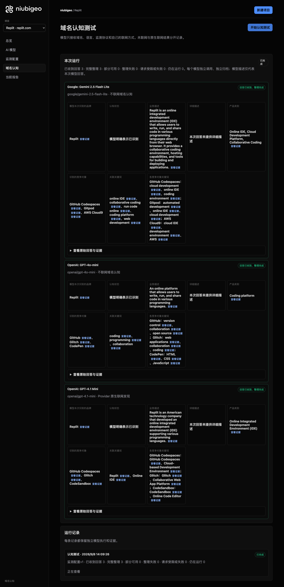
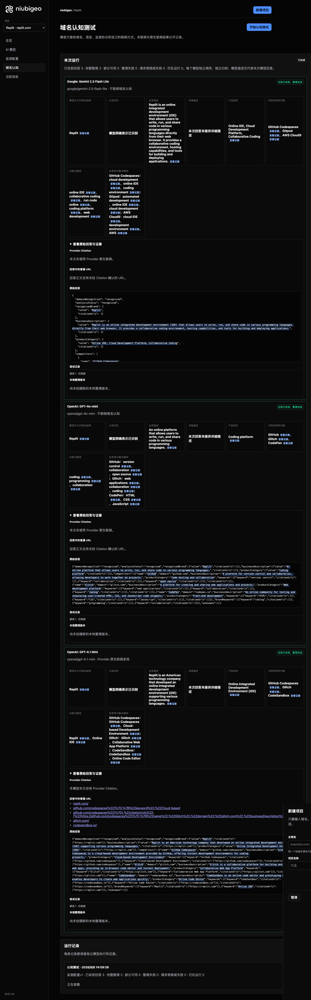
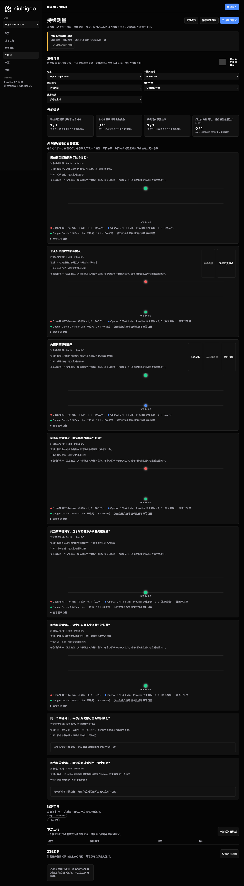

# R10 · replit.com

[简体中文](./README.zh-CN.md) · [All cases](../../README.md)

## Observed result

Models described a browser IDE; keyword results contain two first-place conflicts.

Initial D: 3/3 analyzable current answers. Measurement D: 3/3 analyzable first answers. K: 2/3 analyzable first answers. These are answer-coverage counts, not recognition rates or product metric denominators.

Execution status: **partial**.

**These metrics have consistency conflicts and are excluded from ranking comparisons.** Original values remain unchanged; no winner or tie is inferred.

- [firstMentionState · 177f67e8-6b8a-4a18-93df-23f4e591c93f](../../../docs/known-issues.md#conflict-177f67e8-6b8a-4a18-93df-23f4e591c93f-firstmentionstate)
- [firstRecommendationState · 177f67e8-6b8a-4a18-93df-23f4e591c93f](../../../docs/known-issues.md#conflict-177f67e8-6b8a-4a18-93df-23f4e591c93f-firstrecommendationstate)



R10 · replit.com · D · 3 archived attempts · openai/gpt-4o-mini (off), google/gemini-2.5-flash-lite (off), openai/gpt-4.1-mini (provider_native) · 2026-09-08T06:09:26.484Z to 2026-09-08T06:09:26.484Z. Original failures remain visible. Captured: 2026-09-08T07:19:05.322Z.

## Conditions

Input domain: replit.com. Answer language: en.

Protocols: D = domain-recognition/v1; K = keyword-discovery/v1.

D receives the domain, language, fixed protocol and model settings. K receives a frozen neutral keyword. Browsing categories are not sent to models.

- openai/gpt-4o-mini · off
- google/gemini-2.5-flash-lite · off
- openai/gpt-4.1-mini · provider_native

## Model observations

### Google: Gemini 2.5 Flash Lite

**Observed at:** 2026-09-08T06:09:26.484Z

domainRecognition: recognized · analysisStatus: recognized · localAnalysis: complete.

Attempt: d79c2a93-ae63-498f-9d8f-f70cb116a4d1 · completed · executionMode: unverified.

Brand: Replit

Business: Replit is an online integrated development environment (IDE) that allows users to write, run, and share code in various programming languages directly from their web browser. It provides a collaborative coding environment, hosting capabilities, and tools for building and deploying applications.

Original span: UTF-16 [188, 483) · [Full answer](#attempt-d79c2a93-ae63-498f-9d8f-f70cb116a4d1)

Category: Online IDE, Cloud Development Platform, Collaborative Coding

Brand keywords: online IDE, collaborative coding, run code online, coding platform, web development

Competitors named by this model:

- GitHub Codespaces · github.com: GitHub Codespaces is a cloud-based development environment that provides a full IDE experience directly in the browser or on a local machine. It integrates with GitHub repositories and offers pre-configured development environments.. Keywords: cloud development, online IDE, coding environment
- Gitpod · gitpod.io: Gitpod is an open-source online IDE that automates the provisioning of ready-to-code development environments. It integrates with Git repositories and allows developers to start coding in seconds.. Keywords: automated development, online IDE, cloud development
- AWS Cloud9 · aws.amazon.com/cloud9/: AWS Cloud9 is a cloud-based integrated development environment (IDE) that lets you write, run, and debug your code with just a browser. It provides a pre-configured cloud-based toolkit that runs on Amazon EC2 instances.. Keywords: cloud IDE, development environment, AWS

Uncertain: —


<a id="attempt-d79c2a93-ae63-498f-9d8f-f70cb116a4d1"></a>

<details><summary>Read the original answer</summary>

<pre>{
  "domainRecognition": "recognized",
  "analysisStatus": "recognized",
  "recognizedBrand": {
    "value": "Replit",
    "citationUrls": []
  },
  "businessDescription": {
    "value": "Replit is an online integrated development environment (IDE) that allows users to write, run, and share code in various programming languages directly from their web browser. It provides a collaborative coding environment, hosting capabilities, and tools for building and deploying applications.",
    "citationUrls": []
  },
  "productCategory": {
    "value": "Online IDE, Cloud Development Platform, Collaborative Coding",
    "citationUrls": []
  },
  "competitors": [
    {
      "name": "GitHub Codespaces",
      "domain": "github.com",
      "businessDescription": "GitHub Codespaces is a cloud-based development environment that provides a full IDE experience directly in the browser or on a local machine. It integrates with GitHub repositories and offers pre-configured development environments.",
      "productCategory": "Cloud IDE, Development Environment",
      "keywords": [
        {
          "keyword": "cloud development",
          "citationUrls": []
        },
        {
          "keyword": "online IDE",
          "citationUrls": []
        },
        {
          "keyword": "coding environment",
          "citationUrls": []
        }
      ],
      "citationUrls": []
    },
    {
      "name": "Gitpod",
      "domain": "gitpod.io",
      "businessDescription": "Gitpod is an open-source online IDE that automates the provisioning of ready-to-code development environments. It integrates with Git repositories and allows developers to start coding in seconds.",
      "productCategory": "Cloud IDE, Automated Development Environment",
      "keywords": [
        {
          "keyword": "automated development",
          "citationUrls": []
        },
        {
          "keyword": "online IDE",
          "citationUrls": []
        },
        {
          "keyword": "cloud development",
          "citationUrls": []
        }
      ],
      "citationUrls": []
    },
    {
      "name": "AWS Cloud9",
      "domain": "aws.amazon.com/cloud9/",
      "businessDescription": "AWS Cloud9 is a cloud-based integrated development environment (IDE) that lets you write, run, and debug your code with just a browser. It provides a pre-configured cloud-based toolkit that runs on Amazon EC2 instances.",
      "productCategory": "Cloud IDE, Integrated Development Environment",
      "keywords": [
        {
          "keyword": "cloud IDE",
          "citationUrls": []
        },
        {
          "keyword": "development environment",
          "citationUrls": []
        },
        {
          "keyword": "AWS",
          "citationUrls": []
        }
      ],
      "citationUrls": []
    }
  ],
  "brandKeywords": [
    {
      "keyword": "online IDE",
      "citationUrls": []
    },
    {
      "keyword": "collaborative coding",
      "citationUrls": []
    },
    {
      "keyword": "run code online",
      "citationUrls": []
    },
    {
      "keyword": "coding platform",
      "citationUrls": []
    },
    {
      "keyword": "web development",
      "citationUrls": []
    }
  ],
  "unknowns": []
}</pre>

</details>

SHA-256: `0c219ccab354e7749f5d404cd36cd75d217fed287c9db8bfbbfa6aef7cbc3d9f`

[Answer, field offsets and attempts](./public-evidence.json) · SHA-256: `0c219ccab354e7749f5d404cd36cd75d217fed287c9db8bfbbfa6aef7cbc3d9f`

<details><summary>Keyword provenance and original spans</summary>

| Owner | Keyword | Original text / UTF-16 span |
|---|---|---|
| Replit | online IDE | online IDE [1204, 1214) |
| Replit | collaborative coding | collaborative coding [377, 397) |
| Replit | run code online | run code online [3003, 3018) |
| Replit | coding platform | coding platform [3077, 3092) |
| Replit | web development | web development [3151, 3166) |
| GitHub Codespaces | cloud development | cloud development [1112, 1129) |
| GitHub Codespaces | online IDE | online IDE [1204, 1214) |
| GitHub Codespaces | coding environment | coding environment [391, 409) |
| Gitpod | automated development | automated development [1803, 1824) |
| Gitpod | online IDE | online IDE [1204, 1214) |
| Gitpod | cloud development | cloud development [1112, 1129) |
| AWS Cloud9 | cloud IDE | cloud IDE [2538, 2547) |
| AWS Cloud9 | development environment | development environment [219, 242) |
| AWS Cloud9 | AWS | AWS [2105, 2108) |

</details>

#### Provider citations

No sources of this type were archived for this attempt.

#### Search retrieval results

No sources of this type were archived for this attempt.

#### Links in the answer (not Provider citations)

No answer URLs were archived for this attempt.

### OpenAI: GPT-4o-mini

**Observed at:** 2026-09-08T06:09:26.484Z

domainRecognition: recognized · analysisStatus: recognized · localAnalysis: complete.

Attempt: 2ffd9249-554f-404e-8e64-d47ae11253e0 · completed · executionMode: unverified.

Brand: Replit

Business: An online platform that allows users to write, run, and share code in various programming languages.

Original span: UTF-16 [151, 251) · [Full answer](#attempt-2ffd9249-554f-404e-8e64-d47ae11253e0)

Category: Coding platform

Brand keywords: coding, programming, collaboration

Competitors named by this model:

- GitHub · github.com: A platform for version control and collaboration, allowing developers to work together on projects.. Keywords: version control, collaboration, open source
- Glitch · glitch.com: A platform for creating and sharing web applications and projects.. Keywords: web applications, collaboration, coding
- CodePen · codepen.io: An online community for testing and showcasing user-created HTML, CSS, and JavaScript code snippets.. Keywords: HTML, CSS, JavaScript

Uncertain: —


<a id="attempt-2ffd9249-554f-404e-8e64-d47ae11253e0"></a>

<details><summary>Read the original answer</summary>

<pre>{"domainRecognition":"recognized","analysisStatus":"recognized","recognizedBrand":{"value":"Replit","citationUrls":[]},"businessDescription":{"value":"An online platform that allows users to write, run, and share code in various programming languages.","citationUrls":[]},"productCategory":{"value":"Coding platform","citationUrls":[]},"competitors":[{"name":"GitHub","domain":"github.com","businessDescription":"A platform for version control and collaboration, allowing developers to work together on projects.","productCategory":"Code hosting and collaboration","keywords":[{"keyword":"version control","citationUrls":[]},{"keyword":"collaboration","citationUrls":[]},{"keyword":"open source","citationUrls":[]}],"citationUrls":[]},{"name":"Glitch","domain":"glitch.com","businessDescription":"A platform for creating and sharing web applications and projects.","productCategory":"Web development platform","keywords":[{"keyword":"web applications","citationUrls":[]},{"keyword":"collaboration","citationUrls":[]},{"keyword":"coding","citationUrls":[]}],"citationUrls":[]},{"name":"CodePen","domain":"codepen.io","businessDescription":"An online community for testing and showcasing user-created HTML, CSS, and JavaScript code snippets.","productCategory":"Front-end development","keywords":[{"keyword":"HTML","citationUrls":[]},{"keyword":"CSS","citationUrls":[]},{"keyword":"JavaScript","citationUrls":[]}],"citationUrls":[]}],"brandKeywords":[{"keyword":"coding","citationUrls":[]},{"keyword":"programming","citationUrls":[]},{"keyword":"collaboration","citationUrls":[]}],"unknowns":[]}</pre>

</details>

SHA-256: `9ef4b08af8726bb357bd15ca4fb48ec8618689a2f193fa0a68027352bd2862cd`

[Answer, field offsets and attempts](./public-evidence.json) · SHA-256: `9ef4b08af8726bb357bd15ca4fb48ec8618689a2f193fa0a68027352bd2862cd`

<details><summary>Keyword provenance and original spans</summary>

| Owner | Keyword | Original text / UTF-16 span |
|---|---|---|
| Replit | coding | coding [1029, 1035) |
| Replit | programming | programming [229, 240) |
| Replit | collaboration | collaboration [448, 461) |
| GitHub | version control | version control [428, 443) |
| GitHub | collaboration | collaboration [448, 461) |
| GitHub | open source | open source [683, 694) |
| Glitch | web applications | web applications [833, 849) |
| Glitch | collaboration | collaboration [448, 461) |
| Glitch | coding | coding [1029, 1035) |
| CodePen | HTML | HTML [1199, 1203) |
| CodePen | CSS | CSS [1205, 1208) |
| CodePen | JavaScript | JavaScript [1214, 1224) |

</details>

#### Provider citations

No sources of this type were archived for this attempt.

#### Search retrieval results

No sources of this type were archived for this attempt.

#### Links in the answer (not Provider citations)

No answer URLs were archived for this attempt.

### OpenAI: GPT-4.1 Mini

**Observed at:** 2026-09-08T06:09:26.484Z

domainRecognition: recognized · analysisStatus: recognized · localAnalysis: complete.

Attempt: a2e65acc-77ca-4287-af54-a9e6fc2618ea · completed · executionMode: native.

Brand: Replit

Business: Replit is an American technology company that developed an online integrated development environment (IDE) supporting various programming languages.

Original span: UTF-16 [171, 319) · [Full answer](#attempt-a2e65acc-77ca-4287-af54-a9e6fc2618ea)

Category: Online Integrated Development Environment (IDE)

Brand keywords: Replit, Online IDE

Competitors named by this model:

- GitHub Codespaces · github.com/codespaces: GitHub Codespaces is a cloud-based development environment provided by GitHub, offering instant development environments for coding projects.. Keywords: GitHub Codespaces, Cloud-based Development Environment
- Glitch · glitch.com: Glitch is a collaborative platform for building and sharing web apps, providing an in-browser code editor and instant deployment.. Keywords: Glitch, Collaborative Web App Platform
- CodeSandbox · codesandbox.io: CodeSandbox is an online code editor and prototyping tool that enables developers to create web applications quickly.. Keywords: CodeSandbox, Online Code Editor

Uncertain: —


<a id="attempt-a2e65acc-77ca-4287-af54-a9e6fc2618ea"></a>

<details><summary>Read the original answer</summary>

<pre>{"domainRecognition":"recognized","analysisStatus":"recognized","recognizedBrand":{"value":"Replit","citationUrls":["https://replit.com"]},"businessDescription":{"value":"Replit is an American technology company that developed an online integrated development environment (IDE) supporting various programming languages.","citationUrls":["https://replit.com"]},"productCategory":{"value":"Online Integrated Development Environment (IDE)","citationUrls":["https://replit.com"]},"competitors":[{"name":"GitHub Codespaces","domain":"github.com/codespaces","businessDescription":"GitHub Codespaces is a cloud-based development environment provided by GitHub, offering instant development environments for coding projects.","productCategory":"Cloud-based Development Environment","keywords":[{"keyword":"GitHub Codespaces","citationUrls":["https://github.com/codespaces"]},{"keyword":"Cloud-based Development Environment","citationUrls":["https://github.com/codespaces"]}],"citationUrls":["https://github.com/codespaces"]},{"name":"Glitch","domain":"glitch.com","businessDescription":"Glitch is a collaborative platform for building and sharing web apps, providing an in-browser code editor and instant deployment.","productCategory":"Collaborative Web App Platform","keywords":[{"keyword":"Glitch","citationUrls":["https://glitch.com"]},{"keyword":"Collaborative Web App Platform","citationUrls":["https://glitch.com"]}],"citationUrls":["https://glitch.com"]},{"name":"CodeSandbox","domain":"codesandbox.io","businessDescription":"CodeSandbox is an online code editor and prototyping tool that enables developers to create web applications quickly.","productCategory":"Online Code Editor","keywords":[{"keyword":"CodeSandbox","citationUrls":["https://codesandbox.io"]},{"keyword":"Online Code Editor","citationUrls":["https://codesandbox.io"]}],"citationUrls":["https://codesandbox.io"]}],"brandKeywords":[{"keyword":"Replit","citationUrls":["https://replit.com"]},{"keyword":"Online IDE","citationUrls":["https://replit.com"]}],"unknowns":[]}</pre>

</details>

SHA-256: `224f3c24f0a91ca2cd25a0684df5fa690601bd7a01066890a0d9a9f0df2d8724`

[Answer, field offsets and attempts](./public-evidence.json) · SHA-256: `224f3c24f0a91ca2cd25a0684df5fa690601bd7a01066890a0d9a9f0df2d8724`

<details><summary>Keyword provenance and original spans</summary>

| Owner | Keyword | Original text / UTF-16 span |
|---|---|---|
| Replit | Replit | Replit [92, 98) |
| Replit | Online IDE | Online IDE [1972, 1982) |
| GitHub Codespaces | GitHub Codespaces | GitHub Codespaces [500, 517) |
| GitHub Codespaces | Cloud-based Development Environment | Cloud-based Development Environment [737, 772) |
| Glitch | Glitch | Glitch [1026, 1032) |
| Glitch | Collaborative Web App Platform | Collaborative Web App Platform [1229, 1259) |
| CodeSandbox | CodeSandbox | CodeSandbox [1464, 1475) |
| CodeSandbox | Online Code Editor | Online Code Editor [1664, 1682) |

</details>

#### Provider citations

No sources of this type were archived for this attempt.

#### Search retrieval results

No sources of this type were archived for this attempt.

#### Links in the answer (not Provider citations)

- [https://replit.com/](<https://replit.com/>)
- [https://github.com/codespaces%22]%7D,%7B%22keyword%22:%22Cloud-based](<https://github.com/codespaces%22]%7D,%7B%22keyword%22:%22Cloud-based>)
- [https://github.com/codespaces%22]%7D],%22citationUrls%22:[%22https://github.com/codespaces%22]%7D,%7B%22name%22:%22Glitch%22,%22domain%22:%22glitch.com%22,%22businessDescription%22:%22Glitch](<https://github.com/codespaces%22]%7D],%22citationUrls%22:[%22https://github.com/codespaces%22]%7D,%7B%22name%22:%22Glitch%22,%22domain%22:%22glitch.com%22,%22businessDescription%22:%22Glitch>)
- [https://glitch.com/](<https://glitch.com/>)
- [https://codesandbox.io/](<https://codesandbox.io/>)

## Neutral keyword tests

online IDE

K valid counts analyzable first-attempt answers only, not product metric denominators. Inspect archived metric samples, included flags and judgments. A later successful retry does not replace this coverage count.

Selection records, exact quotes and exclusions are in the evidence file. Each answer observes the target and other entities under the same conditions; offline and online differences are not model rankings.

### online IDE · openai/gpt-4o-mini

keywordId: watch-keyword-d5dd24e84cf2cc4e4cb01f22 · runId: 6a903d55-4c70-4e36-85c0-7742811d3f39 · probeId: 177f67e8-6b8a-4a18-93df-23f4e591c93f

off · completed · firstAttemptId: 20f79db0-dfa8-4a4b-8044-3bbfe6447545

analysisStatus: completed · resultAttemptId: 20f79db0-dfa8-4a4b-8044-3bbfe6447545

- mentionJudgment: adjudicable
- recommendationJudgment: adjudicable

**This answer has conflicting unique-first judgments; do not use it for rankings.** [Evidence](../../../docs/known-issues.md)

- Replit: positive · mention: Replit is a popular online IDE that supports multiple programming languages. · recommendation: I recommend Replit for its user-friendly interface and collaborative features. · attemptId: 20f79db0-dfa8-4a4b-8044-3bbfe6447545
- CodeSandbox: positive · mention: CodeSandbox is another excellent online IDE for web development. · recommendation: CodeSandbox is highly recommended for its integration with GitHub and easy deployment. · attemptId: 20f79db0-dfa8-4a4b-8044-3bbfe6447545
- Glitch: mentioned · mention: Glitch allows you to create and share web applications easily. · recommendation: — · attemptId: 20f79db0-dfa8-4a4b-8044-3bbfe6447545
- Gitpod: mentioned · mention: Gitpod provides a cloud-based development environment. · recommendation: — · attemptId: 20f79db0-dfa8-4a4b-8044-3bbfe6447545

Uncertain: —

[Actual request and answer evidence](./public-evidence.json)

#### Attempt 20f79db0-dfa8-4a4b-8044-3bbfe6447545

completed · Observed at: 2026-09-08T06:09:51.117Z · First attempt

requestedSearch: off · used: false · executionMode: unverified

finish_reason: stop

<a id="attempt-20f79db0-dfa8-4a4b-8044-3bbfe6447545"></a>

<details><summary>Read the original answer</summary>

<pre>{"analysisStatus":"completed","mentions":[{"name":"Replit","domain":null,"recommendation":"positive","mentionQuote":"Replit is a popular online IDE that supports multiple programming languages.","recommendationQuote":"I recommend Replit for its user-friendly interface and collaborative features.","firstMentionOffset":0,"firstRecommendationOffset":0,"firstMentionState":"unique","firstRecommendationState":"unique"},{"name":"CodeSandbox","domain":null,"recommendation":"positive","mentionQuote":"CodeSandbox is another excellent online IDE for web development.","recommendationQuote":"CodeSandbox is highly recommended for its integration with GitHub and easy deployment.","firstMentionOffset":66,"firstRecommendationOffset":66,"firstMentionState":"unique","firstRecommendationState":"unique"},{"name":"Glitch","domain":null,"recommendation":"mentioned","mentionQuote":"Glitch allows you to create and share web applications easily.","recommendationQuote":null,"firstMentionOffset":134,"firstRecommendationOffset":null,"firstMentionState":"unique","firstRecommendationState":"none"},{"name":"Gitpod","domain":null,"recommendation":"mentioned","mentionQuote":"Gitpod provides a cloud-based development environment.","recommendationQuote":null,"firstMentionOffset":174,"firstRecommendationOffset":null,"firstMentionState":"unique","firstRecommendationState":"none"}],"unknowns":[]}</pre>

</details>

SHA-256: `277db6c41e6c3678239ab5ac84281507ecc43d8ad28444a9399364b564dd7e49`

#### Provider citations

No sources of this type were archived for this attempt.

#### Search retrieval results

No sources of this type were archived for this attempt.

#### Links in the answer (not Provider citations)

No answer URLs were archived for this attempt.

### online IDE · openai/gpt-4.1-mini

keywordId: watch-keyword-d5dd24e84cf2cc4e4cb01f22 · runId: 6a903d55-4c70-4e36-85c0-7742811d3f39 · probeId: 9e61a9be-8a5c-4c7e-a138-93197568c8eb

provider_native · failed · firstAttemptId: 53e4c750-3425-47aa-87c1-a07b110ab764

analysisStatus: analysis_failed · resultAttemptId: 53e4c750-3425-47aa-87c1-a07b110ab764

- mentionJudgment: unknown
- recommendationJudgment: unknown


Uncertain: Unterminated string in JSON at position 4201 (line 1 column 4202)

[Actual request and answer evidence](./public-evidence.json)

#### Attempt 53e4c750-3425-47aa-87c1-a07b110ab764

analysis_failed · Observed at: 2026-09-08T06:09:47.861Z · First attempt

requestedSearch: provider_native · used: true · executionMode: native

OpenRouter metadata confirmed provider-native web search.

Error: analysis_failed · Unterminated string in JSON at position 4201 (line 1 column 4202)

finish_reason: stop

<a id="attempt-53e4c750-3425-47aa-87c1-a07b110ab764"></a>

<details><summary>Read the original answer</summary>

<pre>{"analysisStatus":"completed","mentions":[{"name":"Online IDE","domain":"online-ide.com","recommendation":"positive","mentionQuote":"\"Online IDE is a web-based tool powered by ACE code editor.\"","recommendationQuote":"\"This tool can be used to learn, build, run, test your program.\"","firstMentionOffset":0,"firstRecommendationOffset":0,"firstMentionState":"unique","firstRecommendationState":"unique"},{"name":"Total.codes","domain":"total.codes","recommendation":"positive","mentionQuote":"\"A fast online IDE for popular languages with built-in AI help, instant launch, and zero friction.\"","recommendationQuote":"\"Start coding without registration fees, hidden charges, or forced verification friction.\"","firstMentionOffset":0,"firstRecommendationOffset":0,"firstMentionState":"unique","firstRecommendationState":"unique"},{"name":"OAHelper","domain":"oahelper.in","recommendation":"positive","mentionQuote":"\"OAHelper Online IDE is a free, browser-based code editor and compiler.\"","recommendationQuote":"\"Write and execute C++, Python, Java, JavaScript, SQL, PostgreSQL and Bash without installing anything.\"","firstMentionOffset":0,"firstRecommendationOffset":0,"firstMentionState":"unique","firstRecommendationState":"unique"},{"name":"Codeground AI","domain":"codeground.ai","recommendation":"positive","mentionQuote":"\"Codeground AI is the all-in-one developer platform.\"","recommendationQuote":"\"Spin up cloud workspaces, run code in 15+ languages, conduct secure technical interviews and use a complete developer toolbox — all from a single browser tab.\"","firstMentionOffset":0,"firstRecommendationOffset":0,"firstMentionState":"unique","firstRecommendationState":"unique"},{"name":"HashIDEA","domain":"hashideea.com","recommendation":"positive","mentionQuote":"\"HashIDEA is a free, open-source online code editor that runs entirely in your browser.\"","recommendationQuote":"\"Write React, Python, JavaScript, and TypeScript code with live preview, npm package support, and instant sharing via URL.\"","firstMentionOffset":0,"firstRecommendationOffset":0,"firstMentionState":"unique","firstRecommendationState":"unique"},{"name":"myCompiler","domain":"mycompiler.io","recommendation":"positive","mentionQuote":"\"myCompiler is an online IDE for C, C++, Java, Python, Go, NodeJS and other languages.\"","recommendationQuote":"\"Edit, compile and run code online with myCompiler. No setup needed.\"","firstMentionOffset":0,"firstRecommendationOffset":0,"firstMentionState":"unique","firstRecommendationState":"unique"},{"name":"PyTogether","domain":"pytogether.org","recommendation":"positive","mentionQuote":"\"PyTogether is a free &amp; open-source, zero-setup, real-time collaborative online Python IDE &amp; editor.\"","recommendationQuote":"\"Built for pair programming, interviews, learning, and teaching. Code, communicate, draw, and run Python directly in your browser.\"","firstMentionOffset":0,"firstRecommendationOffset":0,"firstMentionState":"unique","firstRecommendationState":"unique"},{"name":"pythoncompiler.io","domain":"pythoncompiler.io","recommendation":"positive","mentionQuote":"\"pythoncompiler.io is a free online Python IDE, code editor, and interactive notebook that runs entirely in your browser.\"","recommendationQuote":"\"Write Python, run it instantly, explore data with Pandas, compute with NumPy, visualize with Matplotlib, and share everything with a single link — all without installing a single package on your computer.\"","firstMentionOffset":0,"firstRecommendationOffset":0,"firstMentionState":"unique","firstRecommendationState":"unique"},{"name":"Picode","domain":"picode.bunnode.com","recommendation":"positive","mentionQuote":"\"Picode is the #1 online compiler for 20+ programming languages with integrated AI assistance.\"","recommendationQuote":"\"Run Python, JavaScript, C++, Rust, Go, Java, PHP, TypeScript, and more directly in your browser with zero installation required.\"","firstMentionOffset":0,"firstRecommendationOffset":0,"firstMentionState":"unique","firstRecommendationState":"unique"},{"name":"PyForm","domain":"pyform.dev","recommendation":"positive","mentionQuote":"\"PyForm runs entirely in your browser — no installs</pre>

</details>

SHA-256: `5beebf120a3c841717f51750d119e2a003a99f5a357fc73c95dd2eec3e5fcc7d`

#### Provider citations

No sources of this type were archived for this attempt.

#### Search retrieval results

No sources of this type were archived for this attempt.

#### Links in the answer (not Provider citations)

No answer URLs were archived for this attempt.

### online IDE · google/gemini-2.5-flash-lite

keywordId: watch-keyword-d5dd24e84cf2cc4e4cb01f22 · runId: 6a903d55-4c70-4e36-85c0-7742811d3f39 · probeId: 241399ec-02a4-4e09-b5ad-96aa438e534e

off · completed · firstAttemptId: 25f23ef4-e5f1-4297-a710-43d18eae76e2

analysisStatus: completed · resultAttemptId: 25f23ef4-e5f1-4297-a710-43d18eae76e2

- mentionJudgment: adjudicable
- recommendationJudgment: adjudicable

- online IDE: mentioned · mention: online IDE · recommendation: — · attemptId: 25f23ef4-e5f1-4297-a710-43d18eae76e2

Uncertain: —

[Actual request and answer evidence](./public-evidence.json)

#### Attempt 25f23ef4-e5f1-4297-a710-43d18eae76e2

completed · Observed at: 2026-09-08T06:09:43.961Z · First attempt

requestedSearch: off · used: false · executionMode: unverified

finish_reason: stop

<a id="attempt-25f23ef4-e5f1-4297-a710-43d18eae76e2"></a>

<details><summary>Read the original answer</summary>

<pre>{
  "analysisStatus": "completed",
  "mentions": [
    {
      "name": "online IDE",
      "domain": null,
      "recommendation": "mentioned",
      "mentionQuote": "online IDE",
      "recommendationQuote": null,
      "firstMentionOffset": 0,
      "firstRecommendationOffset": null,
      "firstMentionState": "unique",
      "firstRecommendationState": "none"
    }
  ],
  "unknowns": []
}</pre>

</details>

SHA-256: `4991b86a24c776eabfd66c04b8e2475653a59a0558c9a48599d228a0a0079679`

#### Provider citations

No sources of this type were archived for this attempt.

#### Search retrieval results

No sources of this type were archived for this attempt.

#### Links in the answer (not Provider citations)

No answer URLs were archived for this attempt.

## Repeated observations

1 archived measurement runs; this count does not imply all succeeded. Compare only identical model, language, search and fingerprint conditions. Short repeats do not establish a long-term trend or a causal effect.

- Run 6a903d55-4c70-4e36-85c0-7742811d3f39: partial

- D e9e4d405-77b2-4107-b4ac-9b5d367282f4 · openai/gpt-4o-mini · domainRecognition: recognized · analysisStatus: recognized · firstAttemptId: e9ec39c3-a3fe-4d9d-8011-b736b85bb8e2 · resultAttemptId: e9ec39c3-a3fe-4d9d-8011-b736b85bb8e2
- D 493aca38-32e3-40e8-afb1-757674f8dd6c · openai/gpt-4.1-mini · domainRecognition: recognized · analysisStatus: recognized · firstAttemptId: ebb330f9-e513-42e9-9f59-ca4adbcba9ca · resultAttemptId: ebb330f9-e513-42e9-9f59-ca4adbcba9ca
- D 6b6301f5-be52-4799-8890-06f6b0b8b139 · google/gemini-2.5-flash-lite · domainRecognition: recognized · analysisStatus: recognized · firstAttemptId: 89618a0f-152d-48b6-b168-3c492a31f219 · resultAttemptId: 89618a0f-152d-48b6-b168-3c492a31f219

## Product screenshots



R10 · replit.com · D · 3 archived attempts · openai/gpt-4o-mini (off), google/gemini-2.5-flash-lite (off), openai/gpt-4.1-mini (provider_native) · 2026-09-08T06:09:26.484Z to 2026-09-08T06:09:26.484Z. Original failures remain visible.

Captured: 2026-09-08T07:19:05.630Z.

<details><summary>Historical display: rankings were not validated</summary>

Rankings shown at capture time were not validated. The original image and hash are retained; the image cannot establish a winner.



R10 · replit.com · D/K · 6 archived attempts · openai/gpt-4o-mini (off), google/gemini-2.5-flash-lite (off), openai/gpt-4.1-mini (provider_native) · 2026-09-08T06:09:40.567Z to 2026-09-08T06:09:43.961Z. Original failures remain visible.

Captured: 2026-09-08T07:19:05.933Z.

</details>

## Inspect or remeasure

[Case configuration](./case.json) · [Evidence index](./evidence-index.json) · [Public evidence bundle](./public-evidence.json)

SHA-256: `76c8a46b2bf0ab55c44a80bb6c73d5f3ce4cd16094cfbc9091a92d801076a166`

Historical case cost (not this documentation update): USD 0.04524405 · 9 calls · 33778 Token.

[Export source](../../../examples/lib/export.mjs) · [Candidate provenance and unpublished status](../../../docs/releases/v0.2.0-rc.1.md)

```bash
npm run examples:plan -- --case R10
npm run examples:replay -- --case R10 --evidence examples/cases/R10/public-evidence.json
```

Remeasurement incurs costs and requires an isolated product service, a frozen plan and explicit live authorization. Reading and exporting do not call models.

## Limits and disclosure

This is a public-product observation. Inclusion does not imply a partnership or endorsement.

Model descriptions are not verified market facts. A returned source does not establish that its content is correct or caused a recommendation. Unknown, missing, analysis failure and request failure remain separate. Use the evidence to investigate descriptions or sources, not to assert optimization caused a difference.

- Run 6a903d55-4c70-4e36-85c0-7742811d3f39: partial
- Probe 9e61a9be-8a5c-4c7e-a138-93197568c8eb: failed; first attempt analysis_failed
- Probe 9e61a9be-8a5c-4c7e-a138-93197568c8eb: missing or failed analysis
- Attempt 53e4c750-3425-47aa-87c1-a07b110ab764: analysis_failed; Unterminated string in JSON at position 4201 (line 1 column 4202)
