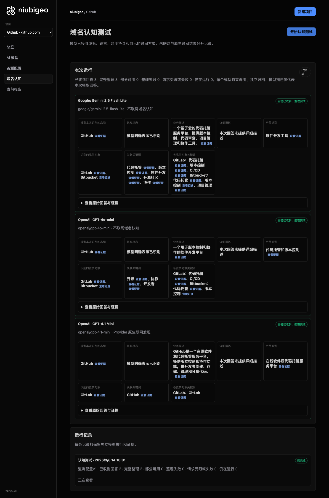
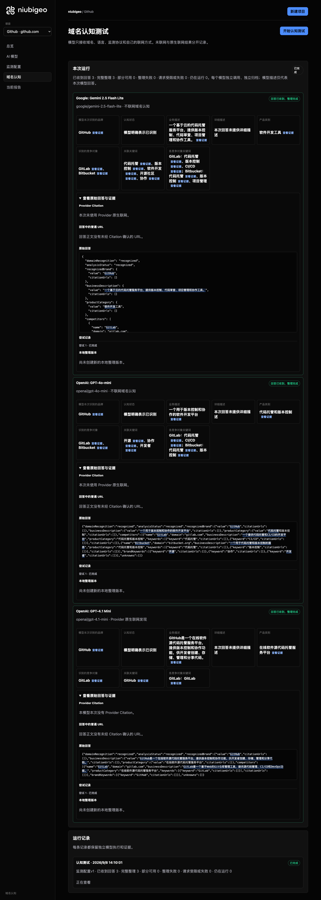
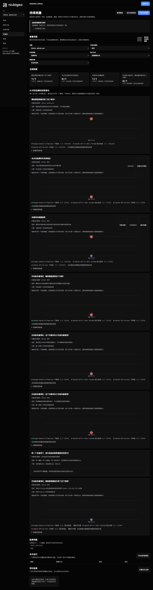

# R11 · github.com

[English](./README.md) · [全部案例](../../README.zh-CN.md)

## 本次实际结果

域名回答描述代码托管；“协作”回答的第一名字段冲突。

初始 D：3/3 条当前回答可分析；测量 D：3/3 条首次回答可分析；K：3/3 条首次回答可分析。这些是回答覆盖计数，不是认识率或产品指标分母。

执行状态: **执行完成**.

**该指标存在一致性冲突，暂不用于排名比较。** 下列唯一第一名字段仍保留原始值，不选择冠军，也不解释为并列。

- [firstMentionState · 3d3f3f2c-c458-4b4c-85d1-048ecd2bafdb](../../../docs/known-issues.md#conflict-3d3f3f2c-c458-4b4c-85d1-048ecd2bafdb-firstmentionstate)



R11 · github.com · D · 3 条归档尝试 · openai/gpt-4o-mini（off）、google/gemini-2.5-flash-lite（off）、openai/gpt-4.1-mini（provider_native） · 2026-09-08T06:10:01.788Z 至 2026-09-08T06:10:01.788Z。保留原始失败状态。 截图时间: 2026-09-08T07:19:06.381Z.

## 测试条件

输入域名: github.com. 回答语言: zh.

协议: D = domain-recognition/v1; K = keyword-discovery/v1.

D 只接收域名、语言、固定协议与模型配置。K 只接收已冻结的中性关键词。分类标签不发送给模型。

- openai/gpt-4o-mini · off
- google/gemini-2.5-flash-lite · off
- openai/gpt-4.1-mini · provider_native

## 各模型的描述

### Google: Gemini 2.5 Flash Lite

**运行时间:** 2026-09-08T06:10:01.788Z

domainRecognition: recognized · analysisStatus: recognized · localAnalysis: complete.

Attempt: 6e78161a-74b2-4f24-9181-f3a948627d97 · completed · executionMode: unverified.

品牌: GitHub

业务: 一个基于云的代码托管服务平台，提供版本控制、代码审查、项目管理和协作工具。

原文位置: UTF-16 [188, 225) · [打开完整回答](#attempt-6e78161a-74b2-4f24-9181-f3a948627d97)

类别: 软件开发工具

目标关键词: 代码托管, 版本控制, 软件开发, 开源社区, 协作

竞争对象:

- GitLab · gitlab.com: 一个提供软件开发生命周期中所有功能的集成平台，包括项目规划、代码管理、CI/CD、监控和安全。. 关键词: 代码托管, 版本控制, CI/CD
- Bitbucket · bitbucket.org: 一个由 Atlassian 提供的基于 Git 的代码托管服务，支持私有和公共仓库，并与 Jira 等其他 Atlassian 产品集成。. 关键词: 代码托管, 版本控制, 项目管理

无法确认: —


<a id="attempt-6e78161a-74b2-4f24-9181-f3a948627d97"></a>

<details><summary>查看模型原始回答</summary>

<pre>{
  "domainRecognition": "recognized",
  "analysisStatus": "recognized",
  "recognizedBrand": {
    "value": "GitHub",
    "citationUrls": []
  },
  "businessDescription": {
    "value": "一个基于云的代码托管服务平台，提供版本控制、代码审查、项目管理和协作工具。",
    "citationUrls": []
  },
  "productCategory": {
    "value": "软件开发工具",
    "citationUrls": []
  },
  "competitors": [
    {
      "name": "GitLab",
      "domain": "gitlab.com",
      "businessDescription": "一个提供软件开发生命周期中所有功能的集成平台，包括项目规划、代码管理、CI/CD、监控和安全。",
      "productCategory": "软件开发工具",
      "keywords": [
        {
          "keyword": "代码托管",
          "citationUrls": []
        },
        {
          "keyword": "版本控制",
          "citationUrls": []
        },
        {
          "keyword": "CI/CD",
          "citationUrls": []
        }
      ],
      "citationUrls": []
    },
    {
      "name": "Bitbucket",
      "domain": "bitbucket.org",
      "businessDescription": "一个由 Atlassian 提供的基于 Git 的代码托管服务，支持私有和公共仓库，并与 Jira 等其他 Atlassian 产品集成。",
      "productCategory": "软件开发工具",
      "keywords": [
        {
          "keyword": "代码托管",
          "citationUrls": []
        },
        {
          "keyword": "版本控制",
          "citationUrls": []
        },
        {
          "keyword": "项目管理",
          "citationUrls": []
        }
      ],
      "citationUrls": []
    }
  ],
  "brandKeywords": [
    {
      "keyword": "代码托管",
      "citationUrls": []
    },
    {
      "keyword": "版本控制",
      "citationUrls": []
    },
    {
      "keyword": "软件开发",
      "citationUrls": []
    },
    {
      "keyword": "开源社区",
      "citationUrls": []
    },
    {
      "keyword": "协作",
      "citationUrls": []
    }
  ],
  "unknowns": []
}</pre>

</details>

SHA-256: `1c52d159f46ec56a1561e467bfd226f60a76b72333afab1670b3a50005e62677`

[原始回答、字段位置与尝试记录](./public-evidence.json) · SHA-256: `1c52d159f46ec56a1561e467bfd226f60a76b72333afab1670b3a50005e62677`

<details><summary>关键词与原文位置</summary>

| 归属 | 关键词 | 原文 / UTF-16 位置 |
|---|---|---|
| GitHub | 代码托管 | 代码托管 [194, 198) |
| GitHub | 版本控制 | 版本控制 [205, 209) |
| GitHub | 软件开发 | 软件开发 [293, 297) |
| GitHub | 开源社区 | 开源社区 [1560, 1564) |
| GitHub | 协作 | 协作 [220, 222) |
| GitLab | 代码托管 | 代码托管 [194, 198) |
| GitLab | 版本控制 | 版本控制 [205, 209) |
| GitLab | CI/CD | CI/CD [474, 479) |
| Bitbucket | 代码托管 | 代码托管 [194, 198) |
| Bitbucket | 版本控制 | 版本控制 [205, 209) |
| Bitbucket | 项目管理 | 项目管理 [215, 219) |

</details>

#### Provider 引用

此 Attempt 未归档此类来源。

#### 搜索检索结果

此 Attempt 未归档此类来源。

#### 回答中的链接（非 Provider 引用）

此 Attempt 未归档正文 URL。

### OpenAI: GPT-4o-mini

**运行时间:** 2026-09-08T06:10:01.788Z

domainRecognition: recognized · analysisStatus: recognized · localAnalysis: complete.

Attempt: 4d7070e8-c3db-409c-a891-050834389a04 · completed · executionMode: unverified.

品牌: GitHub

业务: 一个用于版本控制和协作的软件开发平台

原文位置: UTF-16 [151, 169) · [打开完整回答](#attempt-4d7070e8-c3db-409c-a891-050834389a04)

类别: 代码托管和版本控制

目标关键词: 开源, 协作, 开发者

竞争对象:

- GitLab · gitlab.com: 一个提供代码托管和CI/CD的开发平台. 关键词: 代码托管, CI/CD
- Bitbucket · bitbucket.org: 一个用于代码托管和版本控制的服务. 关键词: 代码托管, 版本控制

无法确认: —


<a id="attempt-4d7070e8-c3db-409c-a891-050834389a04"></a>

<details><summary>查看模型原始回答</summary>

<pre>{"domainRecognition":"recognized","analysisStatus":"recognized","recognizedBrand":{"value":"GitHub","citationUrls":[]},"businessDescription":{"value":"一个用于版本控制和协作的软件开发平台","citationUrls":[]},"productCategory":{"value":"代码托管和版本控制","citationUrls":[]},"competitors":[{"name":"GitLab","domain":"gitlab.com","businessDescription":"一个提供代码托管和CI/CD的开发平台","productCategory":"代码托管和版本控制","keywords":[{"keyword":"代码托管","citationUrls":[]},{"keyword":"CI/CD","citationUrls":[]}],"citationUrls":[]},{"name":"Bitbucket","domain":"bitbucket.org","businessDescription":"一个用于代码托管和版本控制的服务","productCategory":"代码托管和版本控制","keywords":[{"keyword":"代码托管","citationUrls":[]},{"keyword":"版本控制","citationUrls":[]}],"citationUrls":[]}],"brandKeywords":[{"keyword":"开源","citationUrls":[]},{"keyword":"协作","citationUrls":[]},{"keyword":"开发者","citationUrls":[]}],"unknowns":[]}</pre>

</details>

SHA-256: `f8c475cef3c0cde920721a23d317af6925790303c574df74956699a391a9719d`

[原始回答、字段位置与尝试记录](./public-evidence.json) · SHA-256: `f8c475cef3c0cde920721a23d317af6925790303c574df74956699a391a9719d`

<details><summary>关键词与原文位置</summary>

| 归属 | 关键词 | 原文 / UTF-16 位置 |
|---|---|---|
| GitHub | 开源 | 开源 [735, 737) |
| GitHub | 协作 | 协作 [160, 162) |
| GitHub | 开发者 | 开发者 [805, 808) |
| GitLab | 代码托管 | 代码托管 [218, 222) |
| GitLab | CI/CD | CI/CD [334, 339) |
| Bitbucket | 代码托管 | 代码托管 [218, 222) |
| Bitbucket | 版本控制 | 版本控制 [155, 159) |

</details>

#### Provider 引用

此 Attempt 未归档此类来源。

#### 搜索检索结果

此 Attempt 未归档此类来源。

#### 回答中的链接（非 Provider 引用）

此 Attempt 未归档正文 URL。

### OpenAI: GPT-4.1 Mini

**运行时间:** 2026-09-08T06:10:01.788Z

domainRecognition: recognized · analysisStatus: recognized · localAnalysis: complete.

Attempt: b19ef1a0-d73b-4ae6-a730-d9b6ffd58cd0 · completed · executionMode: native.

品牌: GitHub

业务: GitHub是一个在线软件源代码托管服务平台，提供版本控制和协作功能，供开发者创建、存储、管理和分享代码。

原文位置: UTF-16 [151, 204) · [打开完整回答](#attempt-b19ef1a0-d73b-4ae6-a730-d9b6ffd58cd0)

类别: 在线软件源代码托管服务平台

目标关键词: GitHub

竞争对象:

- GitLab · gitlab.com: GitLab是一个基于Web的Git仓库管理工具，提供源代码管理、CI/CD和DevOps功能。. 关键词: GitLab

无法确认: —


<a id="attempt-b19ef1a0-d73b-4ae6-a730-d9b6ffd58cd0"></a>

<details><summary>查看模型原始回答</summary>

<pre>{"domainRecognition":"recognized","analysisStatus":"recognized","recognizedBrand":{"value":"GitHub","citationUrls":[]},"businessDescription":{"value":"GitHub是一个在线软件源代码托管服务平台，提供版本控制和协作功能，供开发者创建、存储、管理和分享代码。","citationUrls":[]},"productCategory":{"value":"在线软件源代码托管服务平台","citationUrls":[]},"competitors":[{"name":"GitLab","domain":"gitlab.com","businessDescription":"GitLab是一个基于Web的Git仓库管理工具，提供源代码管理、CI/CD和DevOps功能。","productCategory":"在线软件源代码托管服务平台","keywords":[{"keyword":"GitLab","citationUrls":[]}],"citationUrls":[]}],"brandKeywords":[{"keyword":"GitHub","citationUrls":[]}],"unknowns":[]}</pre>

</details>

SHA-256: `a3bc3c48cce79dec017a4c8436c0b79b5e2c2ad76e80ec456fbeb156f4168ae4`

[原始回答、字段位置与尝试记录](./public-evidence.json) · SHA-256: `a3bc3c48cce79dec017a4c8436c0b79b5e2c2ad76e80ec456fbeb156f4168ae4`

<details><summary>关键词与原文位置</summary>

| 归属 | 关键词 | 原文 / UTF-16 位置 |
|---|---|---|
| GitHub | GitHub | GitHub [92, 98) |
| GitLab | GitLab | GitLab [311, 317) |

</details>

#### Provider 引用

此 Attempt 未归档此类来源。

#### 搜索检索结果

此 Attempt 未归档此类来源。

#### 回答中的链接（非 Provider 引用）

此 Attempt 未归档正文 URL。

## 中性关键词测试

协作

K valid 仅指首次 Attempt 的回答可分析，不是产品指标分母。各指标使用归档统计点的 samples、included 和 judgment；后续成功重试不替换此覆盖计数。

筛选记录、原文位置和排除理由见证据文件。每个同条件回答同时观察目标和其他实体，不把离线与联网差异解释为模型优劣。

### 协作 · google/gemini-2.5-flash-lite

keywordId: watch-keyword-cc73f0095680242c2e350fa0 · runId: 86ca2562-66e4-41c6-aa14-7d9f8fa82838 · probeId: 868de90c-0e10-493d-b14f-58e00332ef8c

off · completed · firstAttemptId: 8c1f8b78-1921-458f-a724-bba1f027243a

analysisStatus: completed · resultAttemptId: 8c1f8b78-1921-458f-a724-bba1f027243a

- mentionJudgment: adjudicable
- recommendationJudgment: adjudicable

- 协作: mentioned · mention: 协作 · recommendation: — · attemptId: 8c1f8b78-1921-458f-a724-bba1f027243a

无法确认: —

[实际请求与原文证据](./public-evidence.json)

#### Attempt 8c1f8b78-1921-458f-a724-bba1f027243a

completed · 时间: 2026-09-08T06:10:18.897Z · 首次 Attempt

requestedSearch: off · used: false · executionMode: unverified

finish_reason: stop

<a id="attempt-8c1f8b78-1921-458f-a724-bba1f027243a"></a>

<details><summary>查看模型原始回答</summary>

<pre>{
  "analysisStatus": "completed",
  "mentions": [
    {
      "name": "协作",
      "domain": null,
      "recommendation": "mentioned",
      "mentionQuote": "协作",
      "recommendationQuote": null,
      "firstMentionOffset": 0,
      "firstRecommendationOffset": null,
      "firstMentionState": "unique",
      "firstRecommendationState": "none"
    }
  ],
  "unknowns": []
}</pre>

</details>

SHA-256: `620f0193b6aac7d5825e025528779c953ab7cb48f37268a6a868921521da28b1`

#### Provider 引用

此 Attempt 未归档此类来源。

#### 搜索检索结果

此 Attempt 未归档此类来源。

#### 回答中的链接（非 Provider 引用）

此 Attempt 未归档正文 URL。

### 协作 · openai/gpt-4.1-mini

keywordId: watch-keyword-cc73f0095680242c2e350fa0 · runId: 86ca2562-66e4-41c6-aa14-7d9f8fa82838 · probeId: 3d3f3f2c-c458-4b4c-85d1-048ecd2bafdb

provider_native · completed · firstAttemptId: 8ed46717-df44-46cb-a4a8-c0fd326720fb

analysisStatus: completed · resultAttemptId: 8ed46717-df44-46cb-a4a8-c0fd326720fb

- mentionJudgment: adjudicable
- recommendationJudgment: adjudicable

**本回答的唯一第一名判断存在冲突，不用于排名比较。** [冲突证据](../../../docs/known-issues.md)

- 彩漩PPT: mentioned · mention: 彩漩PPT ｜一站式 PPT 协作分享平台 · recommendation: 彩漩PPT ｜一站式 PPT 协作分享平台 · attemptId: 8ed46717-df44-46cb-a4a8-c0fd326720fb
- WPS协作: mentioned · mention: WPS协作 · recommendation: WPS协作 · attemptId: 8ed46717-df44-46cb-a4a8-c0fd326720fb
- Atlassian: mentioned · mention: Atlassian Cloud 平台 · recommendation: Atlassian Cloud 平台 · attemptId: 8ed46717-df44-46cb-a4a8-c0fd326720fb
- Boardmix博思白板: mentioned · mention: Boardmix博思白板 · recommendation: Boardmix博思白板 · attemptId: 8ed46717-df44-46cb-a4a8-c0fd326720fb
- Zoom Workplace: mentioned · mention: Zoom Workplace · recommendation: Zoom Workplace · attemptId: 8ed46717-df44-46cb-a4a8-c0fd326720fb
- CoDesign设计协作平台: mentioned · mention: CoDesign设计协作平台 · recommendation: CoDesign设计协作平台 · attemptId: 8ed46717-df44-46cb-a4a8-c0fd326720fb
- WorkCraft: mentioned · mention: WorkCraft · recommendation: WorkCraft · attemptId: 8ed46717-df44-46cb-a4a8-c0fd326720fb
- AceTeamwork: mentioned · mention: AceTeamwork · recommendation: AceTeamwork · attemptId: 8ed46717-df44-46cb-a4a8-c0fd326720fb
- FlowUs息流: mentioned · mention: FlowUs息流 · recommendation: FlowUs息流 · attemptId: 8ed46717-df44-46cb-a4a8-c0fd326720fb
- BeeWorks: mentioned · mention: BeeWorks 企业数字协同平台 · recommendation: BeeWorks 企业数字协同平台 · attemptId: 8ed46717-df44-46cb-a4a8-c0fd326720fb

无法确认: —

[实际请求与原文证据](./public-evidence.json)

#### Attempt 8ed46717-df44-46cb-a4a8-c0fd326720fb

completed · 时间: 2026-09-08T06:10:15.667Z · 首次 Attempt

requestedSearch: provider_native · used: true · executionMode: native

OpenRouter metadata confirmed provider-native web search.

finish_reason: stop

<a id="attempt-8ed46717-df44-46cb-a4a8-c0fd326720fb"></a>

<details><summary>查看模型原始回答</summary>

<pre>{"analysisStatus":"completed","mentions":[{"name":"彩漩PPT","domain":"caixuan.cc","recommendation":"mentioned","mentionQuote":"彩漩PPT ｜一站式 PPT 协作分享平台","recommendationQuote":"彩漩PPT ｜一站式 PPT 协作分享平台","firstMentionOffset":0,"firstRecommendationOffset":0,"firstMentionState":"unique","firstRecommendationState":"none"},{"name":"WPS协作","domain":"kimxz.com","recommendation":"mentioned","mentionQuote":"WPS协作","recommendationQuote":"WPS协作","firstMentionOffset":0,"firstRecommendationOffset":0,"firstMentionState":"unique","firstRecommendationState":"none"},{"name":"Atlassian","domain":"atlassian.com","recommendation":"mentioned","mentionQuote":"Atlassian Cloud 平台","recommendationQuote":"Atlassian Cloud 平台","firstMentionOffset":0,"firstRecommendationOffset":0,"firstMentionState":"unique","firstRecommendationState":"none"},{"name":"Boardmix博思白板","domain":"boardmix.cn","recommendation":"mentioned","mentionQuote":"Boardmix博思白板","recommendationQuote":"Boardmix博思白板","firstMentionOffset":0,"firstRecommendationOffset":0,"firstMentionState":"unique","firstRecommendationState":"none"},{"name":"Zoom Workplace","domain":"zoom.com","recommendation":"mentioned","mentionQuote":"Zoom Workplace","recommendationQuote":"Zoom Workplace","firstMentionOffset":0,"firstRecommendationOffset":0,"firstMentionState":"unique","firstRecommendationState":"none"},{"name":"CoDesign设计协作平台","domain":"cloud.tencent.com","recommendation":"mentioned","mentionQuote":"CoDesign设计协作平台","recommendationQuote":"CoDesign设计协作平台","firstMentionOffset":0,"firstRecommendationOffset":0,"firstMentionState":"unique","firstRecommendationState":"none"},{"name":"WorkCraft","domain":"work-craft.com","recommendation":"mentioned","mentionQuote":"WorkCraft","recommendationQuote":"WorkCraft","firstMentionOffset":0,"firstRecommendationOffset":0,"firstMentionState":"unique","firstRecommendationState":"none"},{"name":"AceTeamwork","domain":"aceteamwork.com","recommendation":"mentioned","mentionQuote":"AceTeamwork","recommendationQuote":"AceTeamwork","firstMentionOffset":0,"firstRecommendationOffset":0,"firstMentionState":"unique","firstRecommendationState":"none"},{"name":"FlowUs息流","domain":"flowus.cn","recommendation":"mentioned","mentionQuote":"FlowUs息流","recommendationQuote":"FlowUs息流","firstMentionOffset":0,"firstRecommendationOffset":0,"firstMentionState":"unique","firstRecommendationState":"none"},{"name":"BeeWorks","domain":"beeworks.cn","recommendation":"mentioned","mentionQuote":"BeeWorks 企业数字协同平台","recommendationQuote":"BeeWorks 企业数字协同平台","firstMentionOffset":0,"firstRecommendationOffset":0,"firstMentionState":"unique","firstRecommendationState":"none"}],"unknowns":[]}</pre>

</details>

SHA-256: `1e6976a2f9638897e1d470a21f1bf8ae353a1a289afecd78f68ab43b41cb9dc3`

#### Provider 引用

此 Attempt 未归档此类来源。

#### 搜索检索结果

此 Attempt 未归档此类来源。

#### 回答中的链接（非 Provider 引用）

此 Attempt 未归档正文 URL。

### 协作 · openai/gpt-4o-mini

keywordId: watch-keyword-cc73f0095680242c2e350fa0 · runId: 86ca2562-66e4-41c6-aa14-7d9f8fa82838 · probeId: 87dacc6c-d928-4662-a1e3-60a6f32cd5f9

off · completed · firstAttemptId: 226cdb7d-678b-4e73-bdb2-d4568823c68e

analysisStatus: completed · resultAttemptId: 226cdb7d-678b-4e73-bdb2-d4568823c68e

- mentionJudgment: adjudicable
- recommendationJudgment: adjudicable

- 协作工具: mentioned · mention: 在现代工作环境中，协作工具变得越来越重要。 · recommendation: — · attemptId: 226cdb7d-678b-4e73-bdb2-d4568823c68e

无法确认: —

[实际请求与原文证据](./public-evidence.json)

#### Attempt 226cdb7d-678b-4e73-bdb2-d4568823c68e

completed · 时间: 2026-09-08T06:10:13.200Z · 首次 Attempt

requestedSearch: off · used: false · executionMode: unverified

finish_reason: stop

<a id="attempt-226cdb7d-678b-4e73-bdb2-d4568823c68e"></a>

<details><summary>查看模型原始回答</summary>

<pre>{"analysisStatus":"completed","mentions":[{"name":"协作工具","domain":null,"recommendation":"mentioned","mentionQuote":"在现代工作环境中，协作工具变得越来越重要。","recommendationQuote":null,"firstMentionOffset":0,"firstRecommendationOffset":null,"firstMentionState":"unique","firstRecommendationState":"none"}],"unknowns":[]}</pre>

</details>

SHA-256: `d1ba83fd564a7485ce4dd258743b4020840d8ac27673dd1e1188e6fbabd49338`

#### Provider 引用

此 Attempt 未归档此类来源。

#### 搜索检索结果

此 Attempt 未归档此类来源。

#### 回答中的链接（非 Provider 引用）

此 Attempt 未归档正文 URL。

## 重复观察

1 次归档测量运行；数量不表示全部成功。只比较相同模型、语言、搜索与指纹条件。短期重复不代表长期趋势或因果效果。

- Run 86ca2562-66e4-41c6-aa14-7d9f8fa82838: completed

- D 271e557a-7d27-466b-a12a-18699e70b06d · google/gemini-2.5-flash-lite · domainRecognition: recognized · analysisStatus: recognized · firstAttemptId: c6aa5ab5-6b77-4ef4-a5fb-d5920d961ea0 · resultAttemptId: c6aa5ab5-6b77-4ef4-a5fb-d5920d961ea0
- D 5a1b1934-3c21-4db2-a8e7-eef7fd66c4a4 · openai/gpt-4.1-mini · domainRecognition: recognized · analysisStatus: recognized · firstAttemptId: 50b57c86-fad4-4a7f-9268-6130b04364e5 · resultAttemptId: 50b57c86-fad4-4a7f-9268-6130b04364e5
- D 65dc78bd-144f-4d31-a8d4-d0c425f34d37 · openai/gpt-4o-mini · domainRecognition: recognized · analysisStatus: recognized · firstAttemptId: 1582e7d6-9e31-4b00-9c67-c7bf1ef55bba · resultAttemptId: 1582e7d6-9e31-4b00-9c67-c7bf1ef55bba

## 产品截图



R11 · github.com · D · 3 条归档尝试 · openai/gpt-4o-mini（off）、google/gemini-2.5-flash-lite（off）、openai/gpt-4.1-mini（provider_native） · 2026-09-08T06:10:01.788Z 至 2026-09-08T06:10:01.788Z。保留原始失败状态。

截图时间: 2026-09-08T07:19:06.688Z.

<details><summary>历史页面：当时页面展示，排名未通过核验</summary>

当时页面展示，排名未通过核验。图片与原始 Hash 保留，不能据图确定第一名。



R11 · github.com · D/K · 6 条归档尝试 · openai/gpt-4o-mini（off）、google/gemini-2.5-flash-lite（off）、openai/gpt-4.1-mini（provider_native） · 2026-09-08T06:10:09.864Z 至 2026-09-08T06:10:13.200Z。保留原始失败状态。

截图时间: 2026-09-08T07:19:07.009Z.

</details>

## 复核与重新测量

[案例配置](./case.json) · [证据索引](./evidence-index.json) · [公开证据包](./public-evidence.json)

SHA-256: `7e50c79f64eb01b7c980d21385c55b761c10ee295bcdda7d93ace59b0db95f99`

历史案例费用（非本轮文档费用）: USD 0.04360795 · 9 次调用 · 32270 Token.

[导出源码](../../../examples/lib/export.mjs) · [候选版本与未发布状态](../../../docs/releases/v0.2.0-rc.1.md)

```bash
npm run examples:plan -- --case R11
npm run examples:replay -- --case R11 --evidence examples/cases/R11/public-evidence.json
```

重新测量会收费：必须使用独立产品服务、冻结计划和显式 live 授权。阅读或导出不调用模型。

## 限制与披露

仅作公开产品观察；收录不表示合作或背书关系。

模型描述不是已核实的市场事实。来源存在不证明页面内容正确，也不说明为何推荐。未知、缺失、解析失败与请求失败保持区分。可据此调查业务误述或来源内容，但不能断言差距由某次优化造成。

