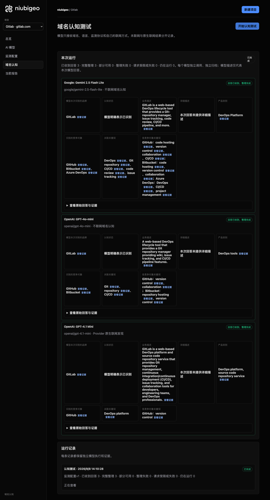
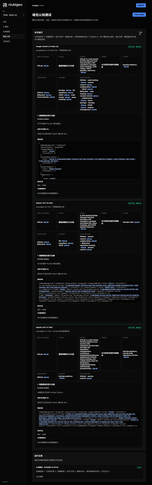
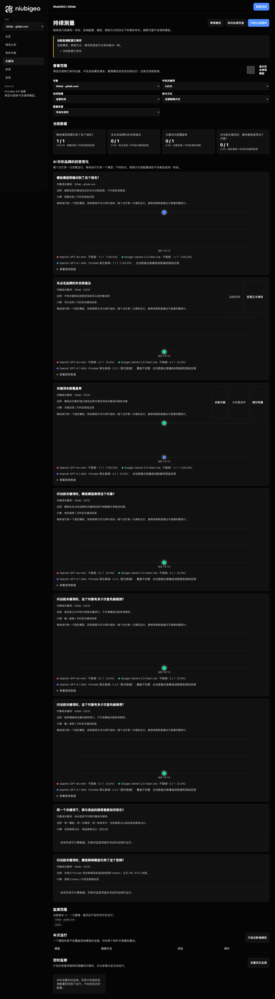

# R12 · gitlab.com

[简体中文](./README.zh-CN.md) · [All cases](../../README.md)

## Observed result

Models described DevOps; a keyword analysis failure is not a brand absence.

Initial D: 3/3 analyzable current answers. Measurement D: 3/3 analyzable first answers. K: 2/3 analyzable first answers. These are answer-coverage counts, not recognition rates or product metric denominators.

Execution status: **partial**.



R12 · gitlab.com · D · 3 archived attempts · openai/gpt-4o-mini (off), google/gemini-2.5-flash-lite (off), openai/gpt-4.1-mini (provider_native) · 2026-09-08T06:10:28.066Z to 2026-09-08T06:10:28.067Z. Original failures remain visible. Captured: 2026-09-08T07:19:07.453Z.

## Conditions

Input domain: gitlab.com. Answer language: en.

Protocols: D = domain-recognition/v1; K = keyword-discovery/v1.

D receives the domain, language, fixed protocol and model settings. K receives a frozen neutral keyword. Browsing categories are not sent to models.

- openai/gpt-4o-mini · off
- google/gemini-2.5-flash-lite · off
- openai/gpt-4.1-mini · provider_native

## Model observations

### Google: Gemini 2.5 Flash Lite

**Observed at:** 2026-09-08T06:10:28.066Z

domainRecognition: recognized · analysisStatus: recognized · localAnalysis: complete.

Attempt: 117e5884-d293-4889-86c8-14407772d2f2 · completed · executionMode: unverified.

Brand: GitLab

Business: GitLab is a web-based DevOps lifecycle tool that provides a Git-repository manager, issue tracking, code review, CI/CD pipeline, and more.

Original span: UTF-16 [188, 326) · [Full answer](#attempt-117e5884-d293-4889-86c8-14407772d2f2)

Category: DevOps Platform

Brand keywords: DevOps, Git repository, CI/CD, code review, issue tracking

Competitors named by this model:

- GitHub · github.com: GitHub is a web-based platform that provides version control using Git. It offers distributed version control, source code management, and collaboration features.. Keywords: code hosting, version control, collaboration, CI/CD
- Bitbucket · bitbucket.org: Bitbucket is a web-based version control repository hosting service. It offers Git and Mercurial revision control systems.. Keywords: code hosting, version control, collaboration
- Azure DevOps · azure.microsoft.com/en-us/products/devops/: Azure DevOps is a set of services that provides developers with a set of tools to plan, collaborate on code development, and build and deploy applications.. Keywords: DevOps, CI/CD, project management

Uncertain: —


<a id="attempt-117e5884-d293-4889-86c8-14407772d2f2"></a>

<details><summary>Read the original answer</summary>

<pre>{
  "domainRecognition": "recognized",
  "analysisStatus": "recognized",
  "recognizedBrand": {
    "value": "GitLab",
    "citationUrls": []
  },
  "businessDescription": {
    "value": "GitLab is a web-based DevOps lifecycle tool that provides a Git-repository manager, issue tracking, code review, CI/CD pipeline, and more.",
    "citationUrls": []
  },
  "productCategory": {
    "value": "DevOps Platform",
    "citationUrls": []
  },
  "competitors": [
    {
      "name": "GitHub",
      "domain": "github.com",
      "businessDescription": "GitHub is a web-based platform that provides version control using Git. It offers distributed version control, source code management, and collaboration features.",
      "productCategory": "Code Hosting and Collaboration",
      "keywords": [
        {
          "keyword": "code hosting",
          "citationUrls": []
        },
        {
          "keyword": "version control",
          "citationUrls": []
        },
        {
          "keyword": "collaboration",
          "citationUrls": []
        },
        {
          "keyword": "CI/CD",
          "citationUrls": []
        }
      ],
      "citationUrls": []
    },
    {
      "name": "Bitbucket",
      "domain": "bitbucket.org",
      "businessDescription": "Bitbucket is a web-based version control repository hosting service. It offers Git and Mercurial revision control systems.",
      "productCategory": "Code Hosting and Collaboration",
      "keywords": [
        {
          "keyword": "code hosting",
          "citationUrls": []
        },
        {
          "keyword": "version control",
          "citationUrls": []
        },
        {
          "keyword": "collaboration",
          "citationUrls": []
        }
      ],
      "citationUrls": []
    },
    {
      "name": "Azure DevOps",
      "domain": "azure.microsoft.com/en-us/products/devops/",
      "businessDescription": "Azure DevOps is a set of services that provides developers with a set of tools to plan, collaborate on code development, and build and deploy applications.",
      "productCategory": "DevOps Platform",
      "keywords": [
        {
          "keyword": "DevOps",
          "citationUrls": []
        },
        {
          "keyword": "CI/CD",
          "citationUrls": []
        },
        {
          "keyword": "project management",
          "citationUrls": []
        }
      ],
      "citationUrls": []
    }
  ],
  "brandKeywords": [
    {
      "keyword": "DevOps",
      "citationUrls": []
    },
    {
      "keyword": "Git repository",
      "citationUrls": []
    },
    {
      "keyword": "CI/CD",
      "citationUrls": []
    },
    {
      "keyword": "code review",
      "citationUrls": []
    },
    {
      "keyword": "issue tracking",
      "citationUrls": []
    }
  ],
  "unknowns": []
}</pre>

</details>

SHA-256: `cd79b1a867f6efcc634c2604e880fdf7bcadc0f94dcbb20b1f904cac3f5207e5`

[Answer, field offsets and attempts](./public-evidence.json) · SHA-256: `cd79b1a867f6efcc634c2604e880fdf7bcadc0f94dcbb20b1f904cac3f5207e5`

<details><summary>Keyword provenance and original spans</summary>

| Owner | Keyword | Original text / UTF-16 span |
|---|---|---|
| GitLab | DevOps | DevOps [210, 216) |
| GitLab | Git repository | Git repository [2541, 2555) |
| GitLab | CI/CD | CI/CD [301, 306) |
| GitLab | code review | code review [288, 299) |
| GitLab | issue tracking | issue tracking [272, 286) |
| GitHub | code hosting | code hosting [825, 837) |
| GitHub | version control | version control [594, 609) |
| GitHub | collaboration | collaboration [688, 701) |
| GitHub | CI/CD | CI/CD [301, 306) |
| Bitbucket | code hosting | code hosting [825, 837) |
| Bitbucket | version control | version control [594, 609) |
| Bitbucket | collaboration | collaboration [688, 701) |
| Azure DevOps | DevOps | DevOps [210, 216) |
| Azure DevOps | CI/CD | CI/CD [301, 306) |
| Azure DevOps | project management | project management [2326, 2344) |

</details>

#### Provider citations

No sources of this type were archived for this attempt.

#### Search retrieval results

No sources of this type were archived for this attempt.

#### Links in the answer (not Provider citations)

No answer URLs were archived for this attempt.

### OpenAI: GPT-4o-mini

**Observed at:** 2026-09-08T06:10:28.067Z

domainRecognition: recognized · analysisStatus: recognized · localAnalysis: complete.

Attempt: 1a7ff0be-30af-40d9-83c8-0ebaa342f9eb · completed · executionMode: unverified.

Brand: GitLab

Business: A web-based DevOps lifecycle tool that provides a Git repository manager providing wiki, issue tracking, and CI/CD pipeline features.

Original span: UTF-16 [151, 284) · [Full answer](#attempt-1a7ff0be-30af-40d9-83c8-0ebaa342f9eb)

Category: DevOps tools

Brand keywords: Git, repository, CI/CD

Competitors named by this model:

- GitHub · github.com: A web-based platform used for version control and collaboration.. Keywords: version control, collaboration
- Bitbucket · bitbucket.org: A web-based version control repository hosting service owned by Atlassian.. Keywords: repository hosting, version control

Uncertain: —


<a id="attempt-1a7ff0be-30af-40d9-83c8-0ebaa342f9eb"></a>

<details><summary>Read the original answer</summary>

<pre>{"domainRecognition":"recognized","analysisStatus":"recognized","recognizedBrand":{"value":"GitLab","citationUrls":[]},"businessDescription":{"value":"A web-based DevOps lifecycle tool that provides a Git repository manager providing wiki, issue tracking, and CI/CD pipeline features.","citationUrls":[]},"productCategory":{"value":"DevOps tools","citationUrls":[]},"competitors":[{"name":"GitHub","domain":"github.com","businessDescription":"A web-based platform used for version control and collaboration.","productCategory":"Version control and collaboration tools","keywords":[{"keyword":"version control","citationUrls":[]},{"keyword":"collaboration","citationUrls":[]}],"citationUrls":[]},{"name":"Bitbucket","domain":"bitbucket.org","businessDescription":"A web-based version control repository hosting service owned by Atlassian.","productCategory":"Version control and collaboration tools","keywords":[{"keyword":"repository hosting","citationUrls":[]},{"keyword":"version control","citationUrls":[]}],"citationUrls":[]}],"brandKeywords":[{"keyword":"Git","citationUrls":[]},{"keyword":"repository","citationUrls":[]},{"keyword":"CI/CD","citationUrls":[]}],"unknowns":[]}</pre>

</details>

SHA-256: `f9804742b80331055259516bae3481f932a3bf105df124b00f3b47c1ad39e479`

[Answer, field offsets and attempts](./public-evidence.json) · SHA-256: `f9804742b80331055259516bae3481f932a3bf105df124b00f3b47c1ad39e479`

<details><summary>Keyword provenance and original spans</summary>

| Owner | Keyword | Original text / UTF-16 span |
|---|---|---|
| GitLab | Git | Git [92, 95) |
| GitLab | repository | repository [205, 215) |
| GitLab | CI/CD | CI/CD [260, 265) |
| GitHub | version control | version control [473, 488) |
| GitHub | collaboration | collaboration [493, 506) |
| Bitbucket | repository hosting | repository hosting [791, 809) |
| Bitbucket | version control | version control [473, 488) |

</details>

#### Provider citations

No sources of this type were archived for this attempt.

#### Search retrieval results

No sources of this type were archived for this attempt.

#### Links in the answer (not Provider citations)

No answer URLs were archived for this attempt.

### OpenAI: GPT-4.1 Mini

**Observed at:** 2026-09-08T06:10:28.067Z

domainRecognition: recognized · analysisStatus: recognized · localAnalysis: complete.

Attempt: 9ebb6b95-1e1c-4b1d-9c4b-368c1b839592 · completed · executionMode: native.

Brand: GitLab

Business: GitLab is a web-based DevOps platform and source code repository service that provides Git repository management, continuous integration/continuous deployment (CI/CD), issue tracking, and collaboration tools for developers, engineering teams, and DevOps professionals.

Original span: UTF-16 [151, 419) · [Full answer](#attempt-9ebb6b95-1e1c-4b1d-9c4b-368c1b839592)

Category: DevOps platform, source code repository service

Brand keywords: DevOps platform

Competitors named by this model:

- GitHub · github.com: GitHub is a web-based platform for version control and collaboration, allowing developers to manage and store their code repositories.. Keywords: version control

Uncertain: —


<a id="attempt-9ebb6b95-1e1c-4b1d-9c4b-368c1b839592"></a>

<details><summary>Read the original answer</summary>

<pre>{"domainRecognition":"recognized","analysisStatus":"recognized","recognizedBrand":{"value":"GitLab","citationUrls":[]},"businessDescription":{"value":"GitLab is a web-based DevOps platform and source code repository service that provides Git repository management, continuous integration/continuous deployment (CI/CD), issue tracking, and collaboration tools for developers, engineering teams, and DevOps professionals.","citationUrls":[]},"productCategory":{"value":"DevOps platform, source code repository service","citationUrls":[]},"competitors":[{"name":"GitHub","domain":"github.com","businessDescription":"GitHub is a web-based platform for version control and collaboration, allowing developers to manage and store their code repositories.","productCategory":"DevOps platform, source code repository service","keywords":[{"keyword":"version control","citationUrls":[]}],"citationUrls":[]}],"brandKeywords":[{"keyword":"DevOps platform","citationUrls":[]}],"unknowns":[]}</pre>

</details>

SHA-256: `52ee74774d0f49faa47659d84217d1123dd348105b8d5c10289bac3621438dbc`

[Answer, field offsets and attempts](./public-evidence.json) · SHA-256: `52ee74774d0f49faa47659d84217d1123dd348105b8d5c10289bac3621438dbc`

<details><summary>Keyword provenance and original spans</summary>

| Owner | Keyword | Original text / UTF-16 span |
|---|---|---|
| GitLab | DevOps platform | DevOps platform [173, 188) |
| GitHub | version control | version control [648, 663) |

</details>

#### Provider citations

No sources of this type were archived for this attempt.

#### Search retrieval results

No sources of this type were archived for this attempt.

#### Links in the answer (not Provider citations)

No answer URLs were archived for this attempt.

## Neutral keyword tests

CI/CD

K valid counts analyzable first-attempt answers only, not product metric denominators. Inspect archived metric samples, included flags and judgments. A later successful retry does not replace this coverage count.

Selection records, exact quotes and exclusions are in the evidence file. Each answer observes the target and other entities under the same conditions; offline and online differences are not model rankings.

### CI/CD · openai/gpt-4o-mini

keywordId: watch-keyword-fced93b696574e0aacbe07da · runId: 39073d9f-d613-487c-aec6-10e1462ff4ce · probeId: 6bcf36ce-5518-42da-8fa7-859da4d090ea

off · completed · firstAttemptId: 8764f806-8df7-4be4-9616-b1f3620a7cd7

analysisStatus: completed · resultAttemptId: 8764f806-8df7-4be4-9616-b1f3620a7cd7

- mentionJudgment: adjudicable
- recommendationJudgment: adjudicable

- CI/CD: mentioned · mention: The term CI/CD refers to Continuous Integration and Continuous Deployment. · recommendation: — · attemptId: 8764f806-8df7-4be4-9616-b1f3620a7cd7

Uncertain: —

[Actual request and answer evidence](./public-evidence.json)

#### Attempt 8764f806-8df7-4be4-9616-b1f3620a7cd7

completed · Observed at: 2026-09-08T06:10:43.088Z · First attempt

requestedSearch: off · used: false · executionMode: unverified

finish_reason: stop

<a id="attempt-8764f806-8df7-4be4-9616-b1f3620a7cd7"></a>

<details><summary>Read the original answer</summary>

<pre>{"analysisStatus":"completed","mentions":[{"name":"CI/CD","domain":null,"recommendation":"mentioned","mentionQuote":"The term CI/CD refers to Continuous Integration and Continuous Deployment.","recommendationQuote":null,"firstMentionOffset":0,"firstRecommendationOffset":null,"firstMentionState":"unique","firstRecommendationState":"none"}],"unknowns":[]}</pre>

</details>

SHA-256: `7490e51af91a2c0879563396561337bb574a14eca873fbe41851ae7a1f567373`

#### Provider citations

No sources of this type were archived for this attempt.

#### Search retrieval results

No sources of this type were archived for this attempt.

#### Links in the answer (not Provider citations)

No answer URLs were archived for this attempt.

### CI/CD · google/gemini-2.5-flash-lite

keywordId: watch-keyword-fced93b696574e0aacbe07da · runId: 39073d9f-d613-487c-aec6-10e1462ff4ce · probeId: 5a16f31c-6d4a-4ebb-b0fd-25259787ffdf

off · completed · firstAttemptId: 11748ddf-eff4-46d2-8807-bb31ae52b351

analysisStatus: completed · resultAttemptId: 11748ddf-eff4-46d2-8807-bb31ae52b351

- mentionJudgment: adjudicable
- recommendationJudgment: adjudicable

- CI/CD: mentioned · mention: CI/CD · recommendation: — · attemptId: 11748ddf-eff4-46d2-8807-bb31ae52b351

Uncertain: —

[Actual request and answer evidence](./public-evidence.json)

#### Attempt 11748ddf-eff4-46d2-8807-bb31ae52b351

completed · Observed at: 2026-09-08T06:10:40.888Z · First attempt

requestedSearch: off · used: false · executionMode: unverified

finish_reason: stop

<a id="attempt-11748ddf-eff4-46d2-8807-bb31ae52b351"></a>

<details><summary>Read the original answer</summary>

<pre>{
  "analysisStatus": "completed",
  "mentions": [
    {
      "name": "CI/CD",
      "domain": null,
      "recommendation": "mentioned",
      "mentionQuote": "CI/CD",
      "recommendationQuote": null,
      "firstMentionOffset": 0,
      "firstRecommendationOffset": null,
      "firstMentionState": "unique",
      "firstRecommendationState": "none"
    }
  ],
  "unknowns": []
}</pre>

</details>

SHA-256: `81da1b1e5d3df2e008ae78fdb13dd40d370fed78d6605f68b74f986d6d59945a`

#### Provider citations

No sources of this type were archived for this attempt.

#### Search retrieval results

No sources of this type were archived for this attempt.

#### Links in the answer (not Provider citations)

No answer URLs were archived for this attempt.

### CI/CD · openai/gpt-4.1-mini

keywordId: watch-keyword-fced93b696574e0aacbe07da · runId: 39073d9f-d613-487c-aec6-10e1462ff4ce · probeId: 8fbf7e63-76e7-4e3e-a90a-fd8b6a79b448

provider_native · failed · firstAttemptId: eb5559f5-a715-4e52-910e-73ef3c9b2262

analysisStatus: analysis_failed · resultAttemptId: eb5559f5-a715-4e52-910e-73ef3c9b2262

- mentionJudgment: unknown
- recommendationJudgment: unknown


Uncertain: Expected ',' or '}' after property value in JSON at position 4301 (line 1 column 4302)

[Actual request and answer evidence](./public-evidence.json)

#### Attempt eb5559f5-a715-4e52-910e-73ef3c9b2262

analysis_failed · Observed at: 2026-09-08T06:10:46.039Z · First attempt

requestedSearch: provider_native · used: true · executionMode: native

OpenRouter metadata confirmed provider-native web search.

Error: analysis_failed · Expected ',' or '}' after property value in JSON at position 4301 (line 1 column 4302)

finish_reason: stop

<a id="attempt-eb5559f5-a715-4e52-910e-73ef3c9b2262"></a>

<details><summary>Read the original answer</summary>

<pre>{"analysisStatus":"completed","mentions":[{"name":"GitHub Actions","domain":"github.com","recommendation":"positive","mentionQuote":"GitHub Actions is GitHub's built-in CI/CD and workflow automation product for building, testing, and deploying code directly from a GitHub repository.","recommendationQuote":"GitHub Actions is GitHub's built-in CI/CD and workflow automation product for building, testing, and deploying code directly from a GitHub repository.","firstMentionOffset":0,"firstRecommendationOffset":0,"firstMentionState":"unique","firstRecommendationState":"unique"},{"name":"GitLab CI/CD","domain":"gitlab.com","recommendation":"positive","mentionQuote":"GitLab CI/CD provides an integrated solution within the GitLab platform, eliminating the need for separate third-party CI/CD tools." ,"recommendationQuote":"GitLab CI/CD provides an integrated solution within the GitLab platform, eliminating the need for separate third-party CI/CD tools." ,"firstMentionOffset":0,"firstRecommendationOffset":0,"firstMentionState":"unique","firstRecommendationState":"unique"},{"name":"Jenkins","domain":"jenkins.io","recommendation":"positive","mentionQuote":"Jenkins remains one of the most widely adopted CI/CD tools due to its open-source nature, extensive plugin library, and flexibility." ,"recommendationQuote":"Jenkins remains one of the most widely adopted CI/CD tools due to its open-source nature, extensive plugin library, and flexibility." ,"firstMentionOffset":0,"firstRecommendationOffset":0,"firstMentionState":"unique","firstRecommendationState":"unique"},{"name":"CircleCI","domain":"circleci.com","recommendation":"positive","mentionQuote":"CircleCI is a cloud-native CI/CD platform that offers fast parallel builds, Docker Layer Caching, and an Orbs ecosystem." ,"recommendationQuote":"CircleCI is a cloud-native CI/CD platform that offers fast parallel builds, Docker Layer Caching, and an Orbs ecosystem." ,"firstMentionOffset":0,"firstRecommendationOffset":0,"firstMentionState":"unique","firstRecommendationState":"unique"},{"name":"Azure DevOps","domain":"azure.microsoft.com","recommendation":"positive","mentionQuote":"Azure DevOps is a Microsoft platform that provides Pipelines, Boards, and Repos, making it best for Azure workloads and .NET teams." ,"recommendationQuote":"Azure DevOps is a Microsoft platform that provides Pipelines, Boards, and Repos, making it best for Azure workloads and .NET teams." ,"firstMentionOffset":0,"firstRecommendationOffset":0,"firstMentionState":"unique","firstRecommendationState":"unique"},{"name":"Argo CD","domain":"argoproj.github.io","recommendation":"positive","mentionQuote":"Argo CD is a GitOps continuous delivery tool for Kubernetes, offering declarative, Git-driven deployments." ,"recommendationQuote":"Argo CD is a GitOps continuous delivery tool for Kubernetes, offering declarative, Git-driven deployments." ,"firstMentionOffset":0,"firstRecommendationOffset":0,"firstMentionState":"unique","firstRecommendationState":"unique"},{"name":"Tekton","domain":"tekton.dev","recommendation":"positive","mentionQuote":"Tekton is a Kubernetes-native CI/CD framework that provides a set of shared, open-source components for building CI/CD systems." ,"recommendationQuote":"Tekton is a Kubernetes-native CI/CD framework that provides a set of shared, open-source components for building CI/CD systems." ,"firstMentionOffset":0,"firstRecommendationOffset":0,"firstMentionState":"unique","firstRecommendationState":"unique"},{"name":"Buildkite","domain":"buildkite.com","recommendation":"positive","mentionQuote":"Buildkite is a continuous integration and continuous delivery platform used in DevOps, founded in September 2013." ,"recommendationQuote":"Buildkite is a continuous integration and continuous delivery platform used in DevOps, founded in September 2013." ,"firstMentionOffset":0,"firstRecommendationOffset":0,"firstMentionState":"unique","firstRecommendationState":"unique"},{"name":"Travis CI","domain":"travis-ci.com","recommendation":"positive","mentionQuote":"Travis CI is a cloud-based CI for GitHub &amp; Bitbucket, offering easy YAML configuration." ,"recommendationQuote":"Travis CI is a cloud-based CI for GitHub &amp; Bitbucket, offering easy YAML configuration." ,"firstMentionOffset":0,"firstRecommendationOffset":0</pre>

</details>

SHA-256: `1a6ca71ca4b84f45eca03a42146ecdf1fbcdd06aef68f7194544142021a48460`

#### Provider citations

No sources of this type were archived for this attempt.

#### Search retrieval results

No sources of this type were archived for this attempt.

#### Links in the answer (not Provider citations)

No answer URLs were archived for this attempt.

## Repeated observations

1 archived measurement runs; this count does not imply all succeeded. Compare only identical model, language, search and fingerprint conditions. Short repeats do not establish a long-term trend or a causal effect.

- Run 39073d9f-d613-487c-aec6-10e1462ff4ce: partial

- D 07b80ef8-b197-41b2-abea-2a0245708e66 · openai/gpt-4o-mini · domainRecognition: recognized · analysisStatus: recognized · firstAttemptId: 68356c2a-1fa9-492b-b0cf-6a9bb59b8814 · resultAttemptId: 68356c2a-1fa9-492b-b0cf-6a9bb59b8814
- D 240f52ed-8570-4039-87bb-7e5820c3e212 · google/gemini-2.5-flash-lite · domainRecognition: recognized · analysisStatus: recognized · firstAttemptId: 7101ec47-b297-4511-81a6-18c6cc9bd85f · resultAttemptId: 7101ec47-b297-4511-81a6-18c6cc9bd85f
- D c6d0f21a-74ac-4bf4-b59b-36408a452d50 · openai/gpt-4.1-mini · domainRecognition: recognized · analysisStatus: recognized · firstAttemptId: eb71c1e9-31bd-488a-a125-009b8c426aa1 · resultAttemptId: eb71c1e9-31bd-488a-a125-009b8c426aa1

## Product screenshots



R12 · gitlab.com · D · 3 archived attempts · openai/gpt-4o-mini (off), google/gemini-2.5-flash-lite (off), openai/gpt-4.1-mini (provider_native) · 2026-09-08T06:10:28.066Z to 2026-09-08T06:10:28.067Z. Original failures remain visible.

Captured: 2026-09-08T07:19:07.770Z.



R12 · gitlab.com · D/K · 6 archived attempts · openai/gpt-4o-mini (off), google/gemini-2.5-flash-lite (off), openai/gpt-4.1-mini (provider_native) · 2026-09-08T06:10:38.157Z to 2026-09-08T06:10:46.039Z. Original failures remain visible.

Captured: 2026-09-08T07:19:08.100Z.

## Inspect or remeasure

[Case configuration](./case.json) · [Evidence index](./evidence-index.json) · [Public evidence bundle](./public-evidence.json)

SHA-256: `542feb5f0e82a0df70a06f656d18d1179cb8908c4e40801261586d552c44e096`

Historical case cost (not this documentation update): USD 0.04427615 · 9 calls · 32910 Token.

[Export source](../../../examples/lib/export.mjs) · [Candidate provenance and unpublished status](../../../docs/releases/v0.2.0-rc.1.md)

```bash
npm run examples:plan -- --case R12
npm run examples:replay -- --case R12 --evidence examples/cases/R12/public-evidence.json
```

Remeasurement incurs costs and requires an isolated product service, a frozen plan and explicit live authorization. Reading and exporting do not call models.

## Limits and disclosure

This is a public-product observation. Inclusion does not imply a partnership or endorsement.

Model descriptions are not verified market facts. A returned source does not establish that its content is correct or caused a recommendation. Unknown, missing, analysis failure and request failure remain separate. Use the evidence to investigate descriptions or sources, not to assert optimization caused a difference.

- Run 39073d9f-d613-487c-aec6-10e1462ff4ce: partial
- Probe 8fbf7e63-76e7-4e3e-a90a-fd8b6a79b448: failed; first attempt analysis_failed
- Probe 8fbf7e63-76e7-4e3e-a90a-fd8b6a79b448: missing or failed analysis
- Attempt eb5559f5-a715-4e52-910e-73ef3c9b2262: analysis_failed; Expected ',' or '}' after property value in JSON at position 4301 (line 1 column 4302)
