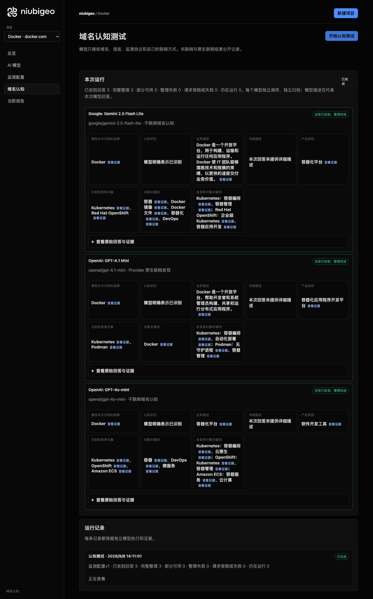
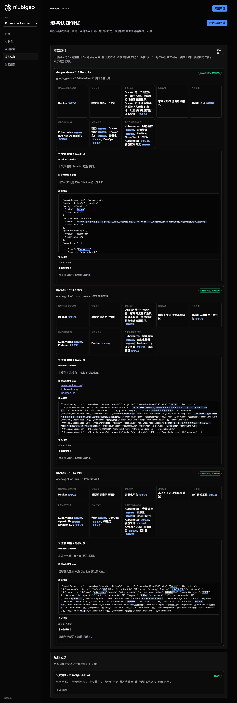
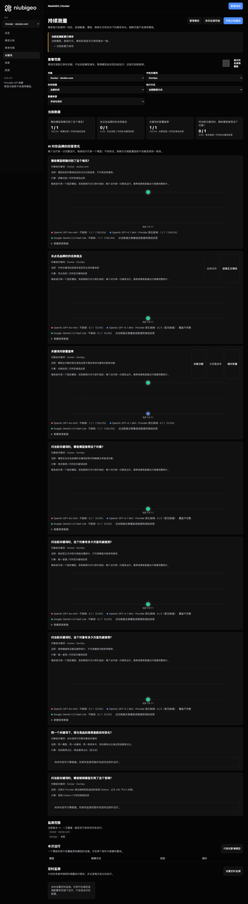

# R13 · docker.com

[简体中文](./README.zh-CN.md) · [All cases](../../README.md)

## Observed result

Models named Kubernetes and other objects; that does not verify a substitution relationship.

Initial D: 3/3 analyzable current answers. Measurement D: 3/3 analyzable first answers. K: 4/6 analyzable first answers. These are answer-coverage counts, not recognition rates or product metric denominators.

Execution status: **partial**.



R13 · docker.com · D · 3 archived attempts · openai/gpt-4o-mini (off), google/gemini-2.5-flash-lite (off), openai/gpt-4.1-mini (provider_native) · 2026-09-08T06:11:01.380Z to 2026-09-08T06:11:01.380Z. Original failures remain visible. Captured: 2026-09-08T07:19:08.659Z.

## Conditions

Input domain: docker.com. Answer language: zh.

Protocols: D = domain-recognition/v1; K = keyword-discovery/v1.

D receives the domain, language, fixed protocol and model settings. K receives a frozen neutral keyword. Browsing categories are not sent to models.

- openai/gpt-4o-mini · off
- google/gemini-2.5-flash-lite · off
- openai/gpt-4.1-mini · provider_native

## Model observations

### Google: Gemini 2.5 Flash Lite

**Observed at:** 2026-09-08T06:11:01.380Z

domainRecognition: recognized · analysisStatus: recognized · localAnalysis: complete.

Attempt: 4e0411c3-4bec-4314-9436-9cf36c7f6999 · completed · executionMode: unverified.

Brand: Docker

Business: Docker 是一个开放平台，用于构建、运输和运行任何应用程序。Docker 使 IT 团队能够摆脱技术和规模的束缚，以更快的速度交付业务价值。

Original span: UTF-16 [188, 260) · [Full answer](#attempt-4e0411c3-4bec-4314-9436-9cf36c7f6999)

Category: 容器化平台

Brand keywords: 容器, Docker 镜像, Docker 文件, 容器化, DevOps

Competitors named by this model:

- Kubernetes · kubernetes.io: Kubernetes 是一个开源系统，用于自动部署、扩展和管理容器化应用程序。. Keywords: 容器编排, 容器管理
- Red Hat OpenShift · redhat.com/en/technologies/openshift: Red Hat OpenShift 是一个企业级 Kubernetes 平台，用于构建、部署和管理容器化应用程序。. Keywords: 企业级 Kubernetes, 容器应用开发

Uncertain: —


<a id="attempt-4e0411c3-4bec-4314-9436-9cf36c7f6999"></a>

<details><summary>Read the original answer</summary>

<pre>{
  "domainRecognition": "recognized",
  "analysisStatus": "recognized",
  "recognizedBrand": {
    "value": "Docker",
    "citationUrls": []
  },
  "businessDescription": {
    "value": "Docker 是一个开放平台，用于构建、运输和运行任何应用程序。Docker 使 IT 团队能够摆脱技术和规模的束缚，以更快的速度交付业务价值。",
    "citationUrls": []
  },
  "productCategory": {
    "value": "容器化平台",
    "citationUrls": []
  },
  "competitors": [
    {
      "name": "Kubernetes",
      "domain": "kubernetes.io",
      "businessDescription": "Kubernetes 是一个开源系统，用于自动部署、扩展和管理容器化应用程序。",
      "productCategory": "容器编排",
      "keywords": [
        {
          "keyword": "容器编排",
          "citationUrls": []
        },
        {
          "keyword": "容器管理",
          "citationUrls": []
        }
      ],
      "citationUrls": []
    },
    {
      "name": "Red Hat OpenShift",
      "domain": "redhat.com/en/technologies/openshift",
      "businessDescription": "Red Hat OpenShift 是一个企业级 Kubernetes 平台，用于构建、部署和管理容器化应用程序。",
      "productCategory": "容器平台",
      "keywords": [
        {
          "keyword": "企业级 Kubernetes",
          "citationUrls": []
        },
        {
          "keyword": "容器应用开发",
          "citationUrls": []
        }
      ],
      "citationUrls": []
    }
  ],
  "brandKeywords": [
    {
      "keyword": "容器",
      "citationUrls": []
    },
    {
      "keyword": "Docker 镜像",
      "citationUrls": []
    },
    {
      "keyword": "Docker 文件",
      "citationUrls": []
    },
    {
      "keyword": "容器化",
      "citationUrls": []
    },
    {
      "keyword": "DevOps",
      "citationUrls": []
    }
  ],
  "unknowns": []
}</pre>

</details>

SHA-256: `3160327425883a0a1a97ec77cc0fdc4f624efc60da31c8b2dd8963e616a22ce0`

[Answer, field offsets and attempts](./public-evidence.json) · SHA-256: `3160327425883a0a1a97ec77cc0fdc4f624efc60da31c8b2dd8963e616a22ce0`

<details><summary>Keyword provenance and original spans</summary>

| Owner | Keyword | Original text / UTF-16 span |
|---|---|---|
| Docker | 容器 | 容器 [328, 330) |
| Docker | Docker 镜像 | Docker 镜像 [1333, 1342) |
| Docker | Docker 文件 | Docker 文件 [1401, 1410) |
| Docker | 容器化 | 容器化 [328, 331) |
| Docker | DevOps | DevOps [1531, 1537) |
| Kubernetes | 容器编排 | 容器编排 [548, 552) |
| Kubernetes | 容器管理 | 容器管理 [686, 690) |
| Red Hat OpenShift | 企业级 Kubernetes | 企业级 Kubernetes [921, 935) |
| Red Hat OpenShift | 容器应用开发 | 容器应用开发 [1134, 1140) |

</details>

#### Provider citations

No sources of this type were archived for this attempt.

#### Search retrieval results

No sources of this type were archived for this attempt.

#### Links in the answer (not Provider citations)

No answer URLs were archived for this attempt.

### OpenAI: GPT-4.1 Mini

**Observed at:** 2026-09-08T06:11:01.380Z

domainRecognition: recognized · analysisStatus: recognized · localAnalysis: complete.

Attempt: 19441436-4809-4a94-9cb7-ad4f634b4cc0 · completed · executionMode: native.

Brand: Docker

Business: Docker 是一个开放平台，帮助开发者和系统管理员构建、共享和运行分布式应用程序。

Original span: UTF-16 [175, 217) · [Full answer](#attempt-19441436-4809-4a94-9cb7-ad4f634b4cc0)

Category: 容器化应用程序开发平台

Brand keywords: Docker

Competitors named by this model:

- Kubernetes · kubernetes.io: Kubernetes 是一个开源的容器编排平台，用于自动化容器化应用程序的部署、扩展和管理。. Keywords: 容器编排, 自动化部署
- Podman · podman.io: Podman 是一个开源的容器管理工具，旨在提供与 Docker 相似的功能，但不需要守护进程。. Keywords: 无守护进程, 容器管理

Uncertain: —


<a id="attempt-19441436-4809-4a94-9cb7-ad4f634b4cc0"></a>

<details><summary>Read the original answer</summary>

<pre>{"domainRecognition":"recognized","analysisStatus":"recognized","recognizedBrand":{"value":"Docker","citationUrls":["https://www.docker.com"]},"businessDescription":{"value":"Docker 是一个开放平台，帮助开发者和系统管理员构建、共享和运行分布式应用程序。","citationUrls":["https://www.docker.com"]},"productCategory":{"value":"容器化应用程序开发平台","citationUrls":["https://www.docker.com"]},"competitors":[{"name":"Kubernetes","domain":"kubernetes.io","businessDescription":"Kubernetes 是一个开源的容器编排平台，用于自动化容器化应用程序的部署、扩展和管理。","productCategory":"容器编排平台","keywords":[{"keyword":"容器编排","citationUrls":["https://kubernetes.io"]},{"keyword":"自动化部署","citationUrls":["https://kubernetes.io"]}],"citationUrls":["https://kubernetes.io"]},{"name":"Podman","domain":"podman.io","businessDescription":"Podman 是一个开源的容器管理工具，旨在提供与 Docker 相似的功能，但不需要守护进程。","productCategory":"容器管理工具","keywords":[{"keyword":"无守护进程","citationUrls":["https://podman.io"]},{"keyword":"容器管理","citationUrls":["https://podman.io"]}],"citationUrls":["https://podman.io"]}],"brandKeywords":[{"keyword":"Docker","citationUrls":["https://www.docker.com"]}],"unknowns":[]}</pre>

</details>

SHA-256: `98e5bf50b91fdc7cc8c8b0e6b3dbf2f9b9003332b4bb282bbc896be9d42708ec`

[Answer, field offsets and attempts](./public-evidence.json) · SHA-256: `98e5bf50b91fdc7cc8c8b0e6b3dbf2f9b9003332b4bb282bbc896be9d42708ec`

<details><summary>Keyword provenance and original spans</summary>

| Owner | Keyword | Original text / UTF-16 span |
|---|---|---|
| Docker | Docker | Docker [92, 98) |
| Kubernetes | 容器编排 | 容器编排 [447, 451) |
| Kubernetes | 自动化部署 | 自动化部署 [589, 594) |
| Podman | 无守护进程 | 无守护进程 [843, 848) |
| Podman | 容器管理 | 容器管理 [755, 759) |

</details>

#### Provider citations

No sources of this type were archived for this attempt.

#### Search retrieval results

No sources of this type were archived for this attempt.

#### Links in the answer (not Provider citations)

- [https://www.docker.com/](<https://www.docker.com/>)
- [https://kubernetes.io/](<https://kubernetes.io/>)
- [https://podman.io/](<https://podman.io/>)

### OpenAI: GPT-4o-mini

**Observed at:** 2026-09-08T06:11:01.380Z

domainRecognition: recognized · analysisStatus: recognized · localAnalysis: complete.

Attempt: e92c2ad9-7fb1-4a7f-a6b1-aaee38e87655 · completed · executionMode: unverified.

Brand: Docker

Business: 容器化平台

Original span: UTF-16 [151, 156) · [Full answer](#attempt-e92c2ad9-7fb1-4a7f-a6b1-aaee38e87655)

Category: 软件开发工具

Brand keywords: 容器, DevOps, 微服务

Competitors named by this model:

- Kubernetes · kubernetes.io: 容器编排平台. Keywords: 容器编排, 云原生
- OpenShift · openshift.com: 企业级Kubernetes平台. Keywords: Kubernetes, 容器管理
- Amazon ECS · aws.amazon.com/ecs: AWS的容器服务. Keywords: 容器服务, 云计算

Uncertain: —


<a id="attempt-e92c2ad9-7fb1-4a7f-a6b1-aaee38e87655"></a>

<details><summary>Read the original answer</summary>

<pre>{"domainRecognition":"recognized","analysisStatus":"recognized","recognizedBrand":{"value":"Docker","citationUrls":[]},"businessDescription":{"value":"容器化平台","citationUrls":[]},"productCategory":{"value":"软件开发工具","citationUrls":[]},"competitors":[{"name":"Kubernetes","domain":"kubernetes.io","businessDescription":"容器编排平台","productCategory":"云计算工具","keywords":[{"keyword":"容器编排","citationUrls":[]},{"keyword":"云原生","citationUrls":[]}],"citationUrls":[]},{"name":"OpenShift","domain":"openshift.com","businessDescription":"企业级Kubernetes平台","productCategory":"云计算工具","keywords":[{"keyword":"Kubernetes","citationUrls":[]},{"keyword":"容器管理","citationUrls":[]}],"citationUrls":[]},{"name":"Amazon ECS","domain":"aws.amazon.com/ecs","businessDescription":"AWS的容器服务","productCategory":"云计算工具","keywords":[{"keyword":"容器服务","citationUrls":[]},{"keyword":"云计算","citationUrls":[]}],"citationUrls":[]}],"brandKeywords":[{"keyword":"容器","citationUrls":[]},{"keyword":"DevOps","citationUrls":[]},{"keyword":"微服务","citationUrls":[]}],"unknowns":[]}</pre>

</details>

SHA-256: `5b175c1da0398768d762657ed07bbcdcd7be4dfbb9c0e247a1f9b8e49283b92b`

[Answer, field offsets and attempts](./public-evidence.json) · SHA-256: `5b175c1da0398768d762657ed07bbcdcd7be4dfbb9c0e247a1f9b8e49283b92b`

<details><summary>Keyword provenance and original spans</summary>

| Owner | Keyword | Original text / UTF-16 span |
|---|---|---|
| Docker | 容器 | 容器 [151, 153) |
| Docker | DevOps | DevOps [958, 964) |
| Docker | 微服务 | 微服务 [997, 1000) |
| Kubernetes | 容器编排 | 容器编排 [316, 320) |
| Kubernetes | 云原生 | 云原生 [411, 414) |
| OpenShift | Kubernetes | Kubernetes [256, 266) |
| OpenShift | 容器管理 | 容器管理 [633, 637) |
| Amazon ECS | 容器服务 | 容器服务 [756, 760) |
| Amazon ECS | 云计算 | 云计算 [343, 346) |

</details>

#### Provider citations

No sources of this type were archived for this attempt.

#### Search retrieval results

No sources of this type were archived for this attempt.

#### Links in the answer (not Provider citations)

No answer URLs were archived for this attempt.

## Neutral keyword tests

DevOps, 容器

K valid counts analyzable first-attempt answers only, not product metric denominators. Inspect archived metric samples, included flags and judgments. A later successful retry does not replace this coverage count.

Selection records, exact quotes and exclusions are in the evidence file. Each answer observes the target and other entities under the same conditions; offline and online differences are not model rankings.

### DevOps · openai/gpt-4o-mini

keywordId: watch-keyword-04d6d57654698ad1078c6924 · runId: b5e7241e-e161-4a38-94a1-880f6c34ad15 · probeId: 5c2a2f72-8cc9-4c5d-b270-083272ebab2f

off · completed · firstAttemptId: b4c16224-25a3-4df4-b38a-44fb6766bdab

analysisStatus: completed · resultAttemptId: b4c16224-25a3-4df4-b38a-44fb6766bdab

- mentionJudgment: adjudicable
- recommendationJudgment: adjudicable

- DevOps: mentioned · mention: DevOps 是一种软件开发和 IT 运维的结合方法。 · recommendation: — · attemptId: b4c16224-25a3-4df4-b38a-44fb6766bdab

Uncertain: —

[Actual request and answer evidence](./public-evidence.json)

#### Attempt b4c16224-25a3-4df4-b38a-44fb6766bdab

completed · Observed at: 2026-09-08T06:11:13.602Z · First attempt

requestedSearch: off · used: false · executionMode: unverified

finish_reason: stop

<a id="attempt-b4c16224-25a3-4df4-b38a-44fb6766bdab"></a>

<details><summary>Read the original answer</summary>

<pre>{"analysisStatus":"completed","mentions":[{"name":"DevOps","domain":null,"recommendation":"mentioned","mentionQuote":"DevOps 是一种软件开发和 IT 运维的结合方法。","recommendationQuote":null,"firstMentionOffset":0,"firstRecommendationOffset":null,"firstMentionState":"unique","firstRecommendationState":"none"}],"unknowns":[]}</pre>

</details>

SHA-256: `cf968228adcb106455e997ee6c48d5f66761fac8e312669246b750a013812b8b`

#### Provider citations

No sources of this type were archived for this attempt.

#### Search retrieval results

No sources of this type were archived for this attempt.

#### Links in the answer (not Provider citations)

No answer URLs were archived for this attempt.

### 容器 · openai/gpt-4o-mini

keywordId: watch-keyword-7641ebaa10567dc6b1474a8a · runId: b5e7241e-e161-4a38-94a1-880f6c34ad15 · probeId: 91f00438-1a52-450f-9b4d-377683f0d422

off · completed · firstAttemptId: 46043f01-db76-4ff5-9fa6-90433b3e6a96

analysisStatus: completed · resultAttemptId: 46043f01-db76-4ff5-9fa6-90433b3e6a96

- mentionJudgment: adjudicable
- recommendationJudgment: adjudicable

- 容器: mentioned · mention: 容器是用于存储和运输物品的工具。 · recommendation: — · attemptId: 46043f01-db76-4ff5-9fa6-90433b3e6a96

Uncertain: —

[Actual request and answer evidence](./public-evidence.json)

#### Attempt 46043f01-db76-4ff5-9fa6-90433b3e6a96

completed · Observed at: 2026-09-08T06:11:22.512Z · First attempt

requestedSearch: off · used: false · executionMode: unverified

finish_reason: stop

<a id="attempt-46043f01-db76-4ff5-9fa6-90433b3e6a96"></a>

<details><summary>Read the original answer</summary>

<pre>{"analysisStatus":"completed","mentions":[{"name":"容器","domain":null,"recommendation":"mentioned","mentionQuote":"容器是用于存储和运输物品的工具。","recommendationQuote":null,"firstMentionOffset":0,"firstRecommendationOffset":null,"firstMentionState":"unique","firstRecommendationState":"none"}],"unknowns":[]}</pre>

</details>

SHA-256: `39d2132dc6d29bbc76aced0752ed057283633edcaff1cb9a355370cd164e6ed8`

#### Provider citations

No sources of this type were archived for this attempt.

#### Search retrieval results

No sources of this type were archived for this attempt.

#### Links in the answer (not Provider citations)

No answer URLs were archived for this attempt.

### DevOps · openai/gpt-4.1-mini

keywordId: watch-keyword-04d6d57654698ad1078c6924 · runId: b5e7241e-e161-4a38-94a1-880f6c34ad15 · probeId: ead36e66-c0a4-4b7f-bf7b-7191e5253567

provider_native · failed · firstAttemptId: a5cc719d-76c2-4851-9fe0-11a97a3fb16e

analysisStatus: analysis_failed · resultAttemptId: a5cc719d-76c2-4851-9fe0-11a97a3fb16e

- mentionJudgment: unknown
- recommendationJudgment: unknown


Uncertain: Unterminated string in JSON at position 2675 (line 1 column 2676)

[Actual request and answer evidence](./public-evidence.json)

#### Attempt a5cc719d-76c2-4851-9fe0-11a97a3fb16e

analysis_failed · Observed at: 2026-09-08T06:11:18.002Z · First attempt

requestedSearch: provider_native · used: true · executionMode: native

OpenRouter metadata confirmed provider-native web search.

Error: analysis_failed · Unterminated string in JSON at position 2675 (line 1 column 2676)

finish_reason: stop

<a id="attempt-a5cc719d-76c2-4851-9fe0-11a97a3fb16e"></a>

<details><summary>Read the original answer</summary>

<pre>{"analysisStatus":"completed","mentions":[{"name":"Git","domain":null,"recommendation":"positive","mentionQuote":"Git 是 DevOps 中最常用的工具，因其出色的分支和合并功能，使大型代码库的协作和复杂项目的版本管理变得可行。它是一个免费的开源版本控制系统，易于入门，性能优越。","recommendationQuote":"Git 是 DevOps 中最常用的工具，因其出色的分支和合并功能，使大型代码库的协作和复杂项目的版本管理变得可行。它是一个免费的开源版本控制系统，易于入门，性能优越。","firstMentionOffset":0,"firstRecommendationOffset":0,"firstMentionState":"unique","firstRecommendationState":"unique"},{"name":"GitHub","domain":null,"recommendation":"positive","mentionQuote":"GitHub 是开源代码的默认代码仓库，越来越多地成为私有代码的默认选择。它托管 Git 仓库，并添加了问题、拉取请求、用于 CI/CD 的 Actions、包注册表和用于 AI 协助的 Copilot。","recommendationQuote":"GitHub 是开源代码的默认代码仓库，越来越多地成为私有代码的默认选择。它托管 Git 仓库，并添加了问题、拉取请求、用于 CI/CD 的 Actions、包注册表和用于 AI 协助的 Copilot。","firstMentionOffset":0,"firstRecommendationOffset":0,"firstMentionState":"unique","firstRecommendationState":"unique"},{"name":"GitLab","domain":null,"recommendation":"positive","mentionQuote":"GitLab 是一个将源代码管理、CI/CD、容器注册表、安全扫描和问题跟踪集成在一个平台下的工具。","recommendationQuote":"GitLab 是一个将源代码管理、CI/CD、容器注册表、安全扫描和问题跟踪集成在一个平台下的工具。","firstMentionOffset":0,"firstRecommendationOffset":0,"firstMentionState":"unique","firstRecommendationState":"unique"},{"name":"Bitbucket","domain":null,"recommendation":"positive","mentionQuote":"Bitbucket 是 Atlassian 的代码托管服务，内置 Jira 集成和用于 CI/CD 的 Pipelines。","recommendationQuote":"Bitbucket 是 Atlassian 的代码托管服务，内置 Jira 集成和用于 CI/CD 的 Pipelines。","firstMentionOffset":0,"firstRecommendationOffset":0,"firstMentionState":"unique","firstRecommendationState":"unique"},{"name":"Azure DevOps","domain":"azure.microsoft.com","recommendation":"positive","mentionQuote":"Azure DevOps 提供一组现代开发服务，帮助团队更智能地规划、更好地协作，并更快地交付。","recommendationQuote":"Azure DevOps 提供一组现代开发服务，帮助团队更智能地规划、更好地协作，并更快地交付。","firstMentionOffset":0,"firstRecommendationOffset":0,"firstMentionState":"unique","firstRecommendationState":"unique"},{"name":"ONES","domain":"ones.com.cn","recommendation":"positive","mentionQuote":"ONES 是一款企业级 DevOps 平台，提供研发管理工具。","recommendationQuote":"ONES 是一款企业级 DevOps 平台，提供研发管理工具。","firstMentionOffset":0,"firstRecommendationOffset":0,"firstMentionState":"unique","firstRecommendationState":"unique"},{"name":"华为 DevCloud","domain":null,"recommendation":"positive","mentionQuote":"华为 DevCloud 是一款企业级 DevOps 平台，提供研发管理工具。","recommendationQuote":"华为 DevCloud 是一款企业级 DevOps 平台，提供研发管理工具。","firstMentionOffset":0,"firstRecommendationOffset":0,"firstMentionState":"unique","firstRecommendationState":"unique"},{"name":"阿里云效","domain":null,"recommendation":"positive","mentionQuote":"阿里云效 是一款企业级 DevOps 平台，提供研发管理工具。","recommendationQuote":"阿里云效 是一款企业级 DevOps 平台，提供研发管理工具。","firstMentionOffset":0,"firstRecommendationOffset":0,"first</pre>

</details>

SHA-256: `3635fc33213a73ee91eb610bc815158691c7509a2fba20a3d7722c0dee90aab2`

#### Provider citations

No sources of this type were archived for this attempt.

#### Search retrieval results

No sources of this type were archived for this attempt.

#### Links in the answer (not Provider citations)

No answer URLs were archived for this attempt.

### 容器 · openai/gpt-4.1-mini

keywordId: watch-keyword-7641ebaa10567dc6b1474a8a · runId: b5e7241e-e161-4a38-94a1-880f6c34ad15 · probeId: 51950b66-7fe5-4c7d-82ab-ca20994528bf

provider_native · failed · firstAttemptId: 6e08ea84-67fe-450d-ad37-2870f0871d54

analysisStatus: analysis_failed · resultAttemptId: 6e08ea84-67fe-450d-ad37-2870f0871d54

- mentionJudgment: unknown
- recommendationJudgment: unknown


Uncertain: Unterminated string in JSON at position 2241 (line 1 column 2242)

[Actual request and answer evidence](./public-evidence.json)

#### Attempt 6e08ea84-67fe-450d-ad37-2870f0871d54

analysis_failed · Observed at: 2026-09-08T06:11:28.287Z · First attempt

requestedSearch: provider_native · used: true · executionMode: native

OpenRouter metadata confirmed provider-native web search.

Error: analysis_failed · Unterminated string in JSON at position 2241 (line 1 column 2242)

finish_reason: stop

<a id="attempt-6e08ea84-67fe-450d-ad37-2870f0871d54"></a>

<details><summary>Read the original answer</summary>

<pre>{"analysisStatus":"completed","mentions":[{"name":"阿德利亚","domain":"www.maigoo.com","recommendation":"positive","mentionQuote":"阿德利亚 日本进口不锈钢泡酒罐玻璃罐 加厚酒坛子腌菜罐","recommendationQuote":"阿德利亚 日本进口不锈钢泡酒罐玻璃罐 加厚酒坛子腌菜罐","firstMentionOffset":0,"firstRecommendationOffset":0,"firstMentionState":"unique","firstRecommendationState":"unique"},{"name":"振兴","domain":"www.maigoo.com","recommendation":"positive","mentionQuote":"振兴 玻璃密封罐 透明储物罐 密封罐 罐子","recommendationQuote":"振兴 玻璃密封罐 透明储物罐 密封罐 罐子","firstMentionOffset":0,"firstRecommendationOffset":0,"firstMentionState":"unique","firstRecommendationState":"unique"},{"name":"居元素","domain":"www.maigoo.com","recommendation":"positive","mentionQuote":"居元素 玻璃密封罐 储物罐 密封罐 罐子","recommendationQuote":"居元素 玻璃密封罐 储物罐 密封罐 罐子","firstMentionOffset":0,"firstRecommendationOffset":0,"firstMentionState":"unique","firstRecommendationState":"unique"},{"name":"夸克","domain":"www.maigoo.com","recommendation":"positive","mentionQuote":"夸克 玻璃密封罐 储物罐 密封罐 罐子","recommendationQuote":"夸克 玻璃密封罐 储物罐 密封罐 罐子","firstMentionOffset":0,"firstRecommendationOffset":0,"firstMentionState":"unique","firstRecommendationState":"unique"},{"name":"益之源","domain":"www.maigoo.com","recommendation":"positive","mentionQuote":"益之源 玻璃密封罐 储物罐 密封罐 罐子","recommendationQuote":"益之源 玻璃密封罐 储物罐 密封罐 罐子","firstMentionOffset":0,"firstRecommendationOffset":0,"firstMentionState":"unique","firstRecommendationState":"unique"},{"name":"Lucky Lychee","domain":"www.maigoo.com","recommendation":"positive","mentionQuote":"Lucky Lychee 玻璃密封罐 储物罐 密封罐 罐子","recommendationQuote":"Lucky Lychee 玻璃密封罐 储物罐 密封罐 罐子","firstMentionOffset":0,"firstRecommendationOffset":0,"firstMentionState":"unique","firstRecommendationState":"unique"},{"name":"拜杰","domain":"www.maigoo.com","recommendation":"positive","mentionQuote":"拜杰 玻璃密封罐 储物罐 密封罐 罐子","recommendationQuote":"拜杰 玻璃密封罐 储物罐 密封罐 罐子","firstMentionOffset":0,"firstRecommendationOffset":0,"firstMentionState":"unique","firstRecommendationState":"unique"},{"name":"好管家","domain":"www.maigoo.com","recommendation":"positive","mentionQuote":"好管家 玻璃密封罐 储物罐 密封罐 罐子","recommendationQuote":"好管家 玻璃密封罐 储物罐 密封罐 罐子","firstMentionOffset":0,"firstRecommendationOffset":0,"firstMentionState":"unique","firstRecommendationState":"unique"},{"</pre>

</details>

SHA-256: `78136b28648dace3469dfc47958656b2a9e2df1a870dc69e43d8c6f0edf3ce15`

#### Provider citations

No sources of this type were archived for this attempt.

#### Search retrieval results

No sources of this type were archived for this attempt.

#### Links in the answer (not Provider citations)

No answer URLs were archived for this attempt.

### DevOps · google/gemini-2.5-flash-lite

keywordId: watch-keyword-04d6d57654698ad1078c6924 · runId: b5e7241e-e161-4a38-94a1-880f6c34ad15 · probeId: 4ea81f3f-0da6-4454-8a4c-0627c72bb76f

off · completed · firstAttemptId: a4bdb307-f74e-461c-b96b-ff49c9c82c44

analysisStatus: completed · resultAttemptId: a4bdb307-f74e-461c-b96b-ff49c9c82c44

- mentionJudgment: adjudicable
- recommendationJudgment: adjudicable

- DevOps: mentioned · mention: DevOps · recommendation: — · attemptId: a4bdb307-f74e-461c-b96b-ff49c9c82c44

Uncertain: —

[Actual request and answer evidence](./public-evidence.json)

#### Attempt a4bdb307-f74e-461c-b96b-ff49c9c82c44

completed · Observed at: 2026-09-08T06:11:20.864Z · First attempt

requestedSearch: off · used: false · executionMode: unverified

finish_reason: stop

<a id="attempt-a4bdb307-f74e-461c-b96b-ff49c9c82c44"></a>

<details><summary>Read the original answer</summary>

<pre>{
  "analysisStatus": "completed",
  "mentions": [
    {
      "name": "DevOps",
      "domain": null,
      "recommendation": "mentioned",
      "mentionQuote": "DevOps",
      "recommendationQuote": null,
      "firstMentionOffset": 0,
      "firstRecommendationOffset": null,
      "firstMentionState": "unique",
      "firstRecommendationState": "none"
    }
  ],
  "unknowns": []
}</pre>

</details>

SHA-256: `4478e7f16909f3d7edef992807283b37f60f7d686e567e330da7f22402e83b86`

#### Provider citations

No sources of this type were archived for this attempt.

#### Search retrieval results

No sources of this type were archived for this attempt.

#### Links in the answer (not Provider citations)

No answer URLs were archived for this attempt.

### 容器 · google/gemini-2.5-flash-lite

keywordId: watch-keyword-7641ebaa10567dc6b1474a8a · runId: b5e7241e-e161-4a38-94a1-880f6c34ad15 · probeId: fb0ba5c6-750e-4c03-a94e-a90b30fb5958

off · completed · firstAttemptId: 278af60a-e31b-407f-8df7-884fc1749033

analysisStatus: completed · resultAttemptId: 278af60a-e31b-407f-8df7-884fc1749033

- mentionJudgment: adjudicable
- recommendationJudgment: adjudicable

- 容器: mentioned · mention: 容器 · recommendation: — · attemptId: 278af60a-e31b-407f-8df7-884fc1749033

Uncertain: —

[Actual request and answer evidence](./public-evidence.json)

#### Attempt 278af60a-e31b-407f-8df7-884fc1749033

completed · Observed at: 2026-09-08T06:11:29.218Z · First attempt

requestedSearch: off · used: false · executionMode: unverified

finish_reason: stop

<a id="attempt-278af60a-e31b-407f-8df7-884fc1749033"></a>

<details><summary>Read the original answer</summary>

<pre>{
  "analysisStatus": "completed",
  "mentions": [
    {
      "name": "容器",
      "domain": null,
      "recommendation": "mentioned",
      "mentionQuote": "容器",
      "recommendationQuote": null,
      "firstMentionOffset": 0,
      "firstRecommendationOffset": null,
      "firstMentionState": "unique",
      "firstRecommendationState": "none"
    }
  ],
  "unknowns": []
}</pre>

</details>

SHA-256: `1e0961b0ba9dbb929d650e031fa20da20e9ba3f752babfc1815e70b68465f847`

#### Provider citations

No sources of this type were archived for this attempt.

#### Search retrieval results

No sources of this type were archived for this attempt.

#### Links in the answer (not Provider citations)

No answer URLs were archived for this attempt.

## Repeated observations

1 archived measurement runs; this count does not imply all succeeded. Compare only identical model, language, search and fingerprint conditions. Short repeats do not establish a long-term trend or a causal effect.

- Run b5e7241e-e161-4a38-94a1-880f6c34ad15: partial

- D d580a408-3120-469b-936d-4e15534521ec · openai/gpt-4o-mini · domainRecognition: recognized · analysisStatus: recognized · firstAttemptId: 8856b601-f1b0-4218-b9b4-058c2d97a7a7 · resultAttemptId: 8856b601-f1b0-4218-b9b4-058c2d97a7a7
- D e2296624-e036-42e7-b107-b5429c7cbdc8 · openai/gpt-4.1-mini · domainRecognition: recognized · analysisStatus: recognized · firstAttemptId: 66d3c4cc-0613-41ca-8595-cad3b6032e51 · resultAttemptId: 66d3c4cc-0613-41ca-8595-cad3b6032e51
- D d3efb013-fc0f-4464-99a4-ebcf777d3eb4 · google/gemini-2.5-flash-lite · domainRecognition: recognized · analysisStatus: recognized · firstAttemptId: 6ee82366-3ea6-4874-a7a6-cafd476f6e17 · resultAttemptId: 6ee82366-3ea6-4874-a7a6-cafd476f6e17

## Product screenshots



R13 · docker.com · D · 3 archived attempts · openai/gpt-4o-mini (off), google/gemini-2.5-flash-lite (off), openai/gpt-4.1-mini (provider_native) · 2026-09-08T06:11:01.380Z to 2026-09-08T06:11:01.380Z. Original failures remain visible.

Captured: 2026-09-08T07:19:09.027Z.



R13 · docker.com · D/K · 9 archived attempts · openai/gpt-4o-mini (off), google/gemini-2.5-flash-lite (off), openai/gpt-4.1-mini (provider_native) · 2026-09-08T06:11:11.513Z to 2026-09-08T06:11:29.218Z. Original failures remain visible.

Captured: 2026-09-08T07:19:09.466Z.

## Inspect or remeasure

[Case configuration](./case.json) · [Evidence index](./evidence-index.json) · [Public evidence bundle](./public-evidence.json)

SHA-256: `6af1c73432b8d45daabb0114b385f1b2bf519d1950fd666db29cb183e9ce932b`

Historical case cost (not this documentation update): USD 0.05971085 · 12 calls · 43331 Token.

[Export source](../../../examples/lib/export.mjs) · [Candidate provenance and unpublished status](../../../docs/releases/v0.2.0-rc.1.md)

```bash
npm run examples:plan -- --case R13
npm run examples:replay -- --case R13 --evidence examples/cases/R13/public-evidence.json
```

Remeasurement incurs costs and requires an isolated product service, a frozen plan and explicit live authorization. Reading and exporting do not call models.

## Limits and disclosure

This is a public-product observation. Inclusion does not imply a partnership or endorsement.

Model descriptions are not verified market facts. A returned source does not establish that its content is correct or caused a recommendation. Unknown, missing, analysis failure and request failure remain separate. Use the evidence to investigate descriptions or sources, not to assert optimization caused a difference.

- Run b5e7241e-e161-4a38-94a1-880f6c34ad15: partial
- Probe ead36e66-c0a4-4b7f-bf7b-7191e5253567: failed; first attempt analysis_failed
- Probe ead36e66-c0a4-4b7f-bf7b-7191e5253567: missing or failed analysis
- Probe 51950b66-7fe5-4c7d-82ab-ca20994528bf: failed; first attempt analysis_failed
- Probe 51950b66-7fe5-4c7d-82ab-ca20994528bf: missing or failed analysis
- Attempt a5cc719d-76c2-4851-9fe0-11a97a3fb16e: analysis_failed; Unterminated string in JSON at position 2675 (line 1 column 2676)
- Attempt 6e08ea84-67fe-450d-ad37-2870f0871d54: analysis_failed; Unterminated string in JSON at position 2241 (line 1 column 2242)
