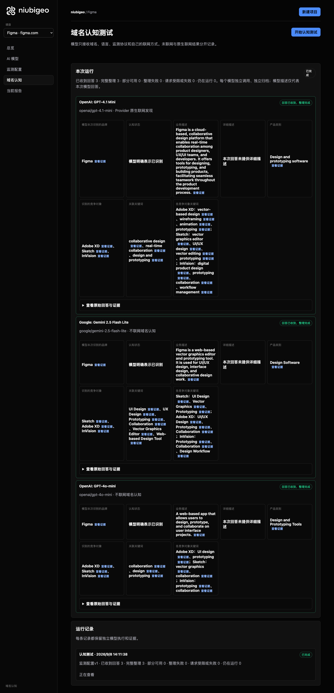
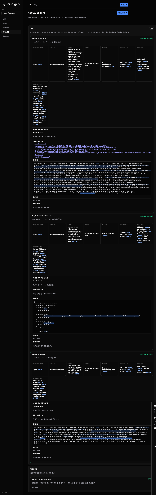
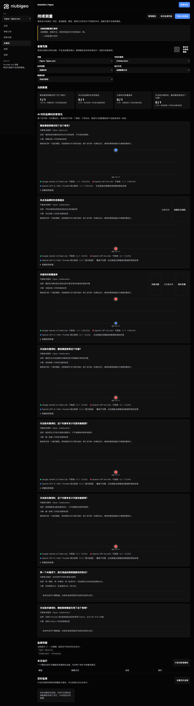

# R14 · figma.com

[简体中文](./README.zh-CN.md) · [All cases](../../README.md)

## Observed result

An online Prototyping answer explicitly recommended Figma; another keyword failed analysis.

Initial D: 3/3 analyzable current answers. Measurement D: 3/3 analyzable first answers. K: 5/6 analyzable first answers. These are answer-coverage counts, not recognition rates or product metric denominators.

Execution status: **partial**.



R14 · figma.com · D · 3 archived attempts · openai/gpt-4o-mini (off), google/gemini-2.5-flash-lite (off), openai/gpt-4.1-mini (provider_native) · 2026-09-08T06:11:38.793Z to 2026-09-08T06:11:38.793Z. Original failures remain visible. Captured: 2026-09-08T07:19:10.050Z.

## Conditions

Input domain: figma.com. Answer language: en.

Protocols: D = domain-recognition/v1; K = keyword-discovery/v1.

D receives the domain, language, fixed protocol and model settings. K receives a frozen neutral keyword. Browsing categories are not sent to models.

- openai/gpt-4o-mini · off
- google/gemini-2.5-flash-lite · off
- openai/gpt-4.1-mini · provider_native

## Model observations

### OpenAI: GPT-4.1 Mini

**Observed at:** 2026-09-08T06:11:38.793Z

domainRecognition: recognized · analysisStatus: recognized · localAnalysis: complete.

Attempt: 3a944943-ed8d-4f9a-b1dd-fd0f51837ffe · completed · executionMode: native.

Brand: Figma

Business: Figma is a cloud-based, collaborative design platform that enables real-time collaboration among product designers, UX/UI teams, and developers. It offers tools for designing, prototyping, and building products, facilitating seamless teamwork throughout the product development process.

Original span: UTF-16 [173, 459) · [Full answer](#attempt-3a944943-ed8d-4f9a-b1dd-fd0f51837ffe)

Category: Design and prototyping software

Brand keywords: collaborative design, real-time collaboration, design and prototyping

Competitors named by this model:

- Adobe XD · adobe.com/products/xd.html: Adobe XD is a vector-based design tool developed by Adobe for web and mobile applications, offering features for wireframing, animation, and prototyping.. Keywords: vector-based design, wireframing, animation, prototyping
- Sketch · sketch.com: Sketch is a vector graphics editor for macOS, primarily used for web and mobile UI/UX design, offering tools for vector editing, prototyping, and collaboration.. Keywords: vector graphics editor, UI/UX design, vector editing, prototyping
- InVision · invisionapp.com: InVision is a digital product design platform that provides tools for prototyping, collaboration, and workflow management, enabling teams to design and test user experiences.. Keywords: digital product design, prototyping, collaboration, workflow management

Uncertain: —


<a id="attempt-3a944943-ed8d-4f9a-b1dd-fd0f51837ffe"></a>

<details><summary>Read the original answer</summary>

<pre>{"domainRecognition":"recognized","analysisStatus":"recognized","recognizedBrand":{"value":"Figma","citationUrls":["https://www.figma.com"]},"businessDescription":{"value":"Figma is a cloud-based, collaborative design platform that enables real-time collaboration among product designers, UX/UI teams, and developers. It offers tools for designing, prototyping, and building products, facilitating seamless teamwork throughout the product development process.","citationUrls":["https://www.figma.com"]},"productCategory":{"value":"Design and prototyping software","citationUrls":["https://www.figma.com"]},"competitors":[{"name":"Adobe XD","domain":"adobe.com/products/xd.html","businessDescription":"Adobe XD is a vector-based design tool developed by Adobe for web and mobile applications, offering features for wireframing, animation, and prototyping.","productCategory":"Design and prototyping software","keywords":[{"keyword":"vector-based design","citationUrls":["https://www.adobe.com/products/xd.html"]},{"keyword":"wireframing","citationUrls":["https://www.adobe.com/products/xd.html"]},{"keyword":"animation","citationUrls":["https://www.adobe.com/products/xd.html"]},{"keyword":"prototyping","citationUrls":["https://www.adobe.com/products/xd.html"]}],"citationUrls":["https://www.adobe.com/products/xd.html"]},{"name":"Sketch","domain":"sketch.com","businessDescription":"Sketch is a vector graphics editor for macOS, primarily used for web and mobile UI/UX design, offering tools for vector editing, prototyping, and collaboration.","productCategory":"Design and prototyping software","keywords":[{"keyword":"vector graphics editor","citationUrls":["https://sketch.com"]},{"keyword":"UI/UX design","citationUrls":["https://sketch.com"]},{"keyword":"vector editing","citationUrls":["https://sketch.com"]},{"keyword":"prototyping","citationUrls":["https://sketch.com"]}],"citationUrls":["https://sketch.com"]},{"name":"InVision","domain":"invisionapp.com","businessDescription":"InVision is a digital product design platform that provides tools for prototyping, collaboration, and workflow management, enabling teams to design and test user experiences.","productCategory":"Design and prototyping software","keywords":[{"keyword":"digital product design","citationUrls":["https://www.invisionapp.com"]},{"keyword":"prototyping","citationUrls":["https://www.invisionapp.com"]},{"keyword":"collaboration","citationUrls":["https://www.invisionapp.com"]},{"keyword":"workflow management","citationUrls":["https://www.invisionapp.com"]}],"citationUrls":["https://www.invisionapp.com"]}],"brandKeywords":[{"keyword":"collaborative design","citationUrls":["https://www.figma.com"]},{"keyword":"real-time collaboration","citationUrls":["https://www.figma.com"]},{"keyword":"design and prototyping","citationUrls":["https://www.figma.com"]}],"unknowns":[]}</pre>

</details>

SHA-256: `b6d7488d7b962bddf6990bdc9a50db171bf6482b174cb78f42821e3e30924e48`

[Answer, field offsets and attempts](./public-evidence.json) · SHA-256: `b6d7488d7b962bddf6990bdc9a50db171bf6482b174cb78f42821e3e30924e48`

<details><summary>Keyword provenance and original spans</summary>

| Owner | Keyword | Original text / UTF-16 span |
|---|---|---|
| Figma | collaborative design | collaborative design [197, 217) |
| Figma | real-time collaboration | real-time collaboration [240, 263) |
| Figma | design and prototyping | design and prototyping [2777, 2799) |
| Adobe XD | vector-based design | vector-based design [715, 734) |
| Adobe XD | wireframing | wireframing [814, 825) |
| Adobe XD | animation | animation [827, 836) |
| Adobe XD | prototyping | prototyping [349, 360) |
| Sketch | vector graphics editor | vector graphics editor [1396, 1418) |
| Sketch | UI/UX design | UI/UX design [1464, 1476) |
| Sketch | vector editing | vector editing [1497, 1511) |
| Sketch | prototyping | prototyping [349, 360) |
| InVision | digital product design | digital product design [2004, 2026) |
| InVision | prototyping | prototyping [349, 360) |
| InVision | collaboration | collaboration [250, 263) |
| InVision | workflow management | workflow management [2092, 2111) |

</details>

#### Provider citations

No sources of this type were archived for this attempt.

#### Search retrieval results

No sources of this type were archived for this attempt.

#### Links in the answer (not Provider citations)

- [https://www.figma.com/](<https://www.figma.com/>)
- [https://www.adobe.com/products/xd.html%22]%7D,%7B%22keyword%22:%22wireframing%22,%22citationUrls%22:[%22https://www.adobe.com/products/xd.html%22]%7D,%7B%22keyword%22:%22animation%22,%22citationUrls%22:[%22https://www.adobe.com/products/xd.html%22]%7D,%7B%22keyword%22:%22prototyping%22,%22citationUrls%22:[%22https://www.adobe.com/products/xd.html%22]%7D],%22citationUrls%22:[%22https://www.adobe.com/products/xd.html%22]%7D,%7B%22name%22:%22Sketch%22,%22domain%22:%22sketch.com%22,%22businessDescription%22:%22Sketch](<https://www.adobe.com/products/xd.html%22]%7D,%7B%22keyword%22:%22wireframing%22,%22citationUrls%22:[%22https://www.adobe.com/products/xd.html%22]%7D,%7B%22keyword%22:%22animation%22,%22citationUrls%22:[%22https://www.adobe.com/products/xd.html%22]%7D,%7B%22keyword%22:%22prototyping%22,%22citationUrls%22:[%22https://www.adobe.com/products/xd.html%22]%7D],%22citationUrls%22:[%22https://www.adobe.com/products/xd.html%22]%7D,%7B%22name%22:%22Sketch%22,%22domain%22:%22sketch.com%22,%22businessDescription%22:%22Sketch>)
- [https://sketch.com/](<https://sketch.com/>)
- [https://www.invisionapp.com/](<https://www.invisionapp.com/>)

### Google: Gemini 2.5 Flash Lite

**Observed at:** 2026-09-08T06:11:38.793Z

domainRecognition: recognized · analysisStatus: recognized · localAnalysis: complete.

Attempt: 2523a3e6-06de-43ca-881f-ee79515e080a · completed · executionMode: unverified.

Brand: Figma

Business: Figma is a web-based vector graphics editor and prototyping tool. It is used for UI/UX design, interface design, and collaborative design work.

Original span: UTF-16 [187, 330) · [Full answer](#attempt-2523a3e6-06de-43ca-881f-ee79515e080a)

Category: Design Software

Brand keywords: UI Design, UX Design, Prototyping, Collaboration, Vector Graphics Editor, Web-based Design Tool

Competitors named by this model:

- Sketch · sketch.com: Sketch is a vector graphics editor for macOS, primarily used for user interface design. It is known for its focus on digital design workflows.. Keywords: UI Design, Vector Graphics, Prototyping
- Adobe XD · adobe.com/products/xd.html: Adobe XD is a UI/UX design and collaboration tool developed by Adobe. It allows for the design, prototyping, and sharing of user experiences.. Keywords: UI/UX Design, Prototyping, Collaboration
- InVision · invisionapp.com: InVision is a digital product design platform that offers tools for prototyping, collaboration, and design workflow management.. Keywords: Prototyping, Collaboration, Design Workflow

Uncertain: —


<a id="attempt-2523a3e6-06de-43ca-881f-ee79515e080a"></a>

<details><summary>Read the original answer</summary>

<pre>{
  "domainRecognition": "recognized",
  "analysisStatus": "recognized",
  "recognizedBrand": {
    "value": "Figma",
    "citationUrls": []
  },
  "businessDescription": {
    "value": "Figma is a web-based vector graphics editor and prototyping tool. It is used for UI/UX design, interface design, and collaborative design work.",
    "citationUrls": []
  },
  "productCategory": {
    "value": "Design Software",
    "citationUrls": []
  },
  "competitors": [
    {
      "name": "Sketch",
      "domain": "sketch.com",
      "businessDescription": "Sketch is a vector graphics editor for macOS, primarily used for user interface design. It is known for its focus on digital design workflows.",
      "productCategory": "Design Software",
      "keywords": [
        {
          "keyword": "UI Design",
          "citationUrls": []
        },
        {
          "keyword": "Vector Graphics",
          "citationUrls": []
        },
        {
          "keyword": "Prototyping",
          "citationUrls": []
        }
      ],
      "citationUrls": []
    },
    {
      "name": "Adobe XD",
      "domain": "adobe.com/products/xd.html",
      "businessDescription": "Adobe XD is a UI/UX design and collaboration tool developed by Adobe. It allows for the design, prototyping, and sharing of user experiences.",
      "productCategory": "Design Software",
      "keywords": [
        {
          "keyword": "UI/UX Design",
          "citationUrls": []
        },
        {
          "keyword": "Prototyping",
          "citationUrls": []
        },
        {
          "keyword": "Collaboration",
          "citationUrls": []
        }
      ],
      "citationUrls": []
    },
    {
      "name": "InVision",
      "domain": "invisionapp.com",
      "businessDescription": "InVision is a digital product design platform that offers tools for prototyping, collaboration, and design workflow management.",
      "productCategory": "Design Software",
      "keywords": [
        {
          "keyword": "Prototyping",
          "citationUrls": []
        },
        {
          "keyword": "Collaboration",
          "citationUrls": []
        },
        {
          "keyword": "Design Workflow",
          "citationUrls": []
        }
      ],
      "citationUrls": []
    }
  ],
  "brandKeywords": [
    {
      "keyword": "UI Design",
      "citationUrls": []
    },
    {
      "keyword": "UX Design",
      "citationUrls": []
    },
    {
      "keyword": "Prototyping",
      "citationUrls": []
    },
    {
      "keyword": "Collaboration",
      "citationUrls": []
    },
    {
      "keyword": "Vector Graphics Editor",
      "citationUrls": []
    },
    {
      "keyword": "Web-based Design Tool",
      "citationUrls": []
    }
  ],
  "unknowns": []
}</pre>

</details>

SHA-256: `d872ee5eddd822b8997db79e72696ad1e2ad56e9dc26160dc733094c8820de62`

[Answer, field offsets and attempts](./public-evidence.json) · SHA-256: `d872ee5eddd822b8997db79e72696ad1e2ad56e9dc26160dc733094c8820de62`

<details><summary>Keyword provenance and original spans</summary>

| Owner | Keyword | Original text / UTF-16 span |
|---|---|---|
| Figma | UI Design | UI Design [794, 803) |
| Figma | UX Design | UX Design [1413, 1422) |
| Figma | Prototyping | Prototyping [968, 979) |
| Figma | Collaboration | Collaboration [1583, 1596) |
| Figma | Vector Graphics Editor | Vector Graphics Editor [2601, 2623) |
| Figma | Web-based Design Tool | Web-based Design Tool [2682, 2703) |
| Sketch | UI Design | UI Design [794, 803) |
| Sketch | Vector Graphics | Vector Graphics [878, 893) |
| Sketch | Prototyping | Prototyping [968, 979) |
| Adobe XD | UI/UX Design | UI/UX Design [1410, 1422) |
| Adobe XD | Prototyping | Prototyping [968, 979) |
| Adobe XD | Collaboration | Collaboration [1583, 1596) |
| InVision | Prototyping | Prototyping [968, 979) |
| InVision | Collaboration | Collaboration [1583, 1596) |
| InVision | Design Workflow | Design Workflow [2176, 2191) |

</details>

#### Provider citations

No sources of this type were archived for this attempt.

#### Search retrieval results

No sources of this type were archived for this attempt.

#### Links in the answer (not Provider citations)

No answer URLs were archived for this attempt.

### OpenAI: GPT-4o-mini

**Observed at:** 2026-09-08T06:11:38.793Z

domainRecognition: recognized · analysisStatus: recognized · localAnalysis: complete.

Attempt: 3697a0a6-1d9a-40d6-ba2b-664cbb3dab55 · completed · executionMode: unverified.

Brand: Figma

Business: A web-based app that allows users to design, prototype, and collaborate on user interface projects.

Original span: UTF-16 [150, 249) · [Full answer](#attempt-3697a0a6-1d9a-40d6-ba2b-664cbb3dab55)

Category: Design and Prototyping Tools

Brand keywords: collaboration, design, prototyping

Competitors named by this model:

- Adobe XD · adobe.com/xd: A vector-based user experience design tool for web apps and mobile apps.. Keywords: UI design, prototyping
- Sketch · sketch.com: A digital design toolkit for macOS, primarily used for UI and UX design.. Keywords: vector graphics, collaboration
- InVision · invisionapp.com: A digital product design platform that helps teams create and collaborate on prototypes.. Keywords: prototyping, collaboration

Uncertain: —


<a id="attempt-3697a0a6-1d9a-40d6-ba2b-664cbb3dab55"></a>

<details><summary>Read the original answer</summary>

<pre>{"domainRecognition":"recognized","analysisStatus":"recognized","recognizedBrand":{"value":"Figma","citationUrls":[]},"businessDescription":{"value":"A web-based app that allows users to design, prototype, and collaborate on user interface projects.","citationUrls":[]},"productCategory":{"value":"Design and Prototyping Tools","citationUrls":[]},"competitors":[{"name":"Adobe XD","domain":"adobe.com/xd","businessDescription":"A vector-based user experience design tool for web apps and mobile apps.","productCategory":"Design and Prototyping Tools","keywords":[{"keyword":"UI design","citationUrls":[]},{"keyword":"prototyping","citationUrls":[]}],"citationUrls":[]},{"name":"Sketch","domain":"sketch.com","businessDescription":"A digital design toolkit for macOS, primarily used for UI and UX design.","productCategory":"Design and Prototyping Tools","keywords":[{"keyword":"vector graphics","citationUrls":[]},{"keyword":"collaboration","citationUrls":[]}],"citationUrls":[]},{"name":"InVision","domain":"invisionapp.com","businessDescription":"A digital product design platform that helps teams create and collaborate on prototypes.","productCategory":"Design and Prototyping Tools","keywords":[{"keyword":"prototyping","citationUrls":[]},{"keyword":"collaboration","citationUrls":[]}],"citationUrls":[]}],"brandKeywords":[{"keyword":"collaboration","citationUrls":[]},{"keyword":"design","citationUrls":[]},{"keyword":"prototyping","citationUrls":[]}],"unknowns":[]}</pre>

</details>

SHA-256: `ccab97db393233e4d406ceec584fd3bbedef4e5100129e17af50233611313209`

[Answer, field offsets and attempts](./public-evidence.json) · SHA-256: `ccab97db393233e4d406ceec584fd3bbedef4e5100129e17af50233611313209`

<details><summary>Keyword provenance and original spans</summary>

| Owner | Keyword | Original text / UTF-16 span |
|---|---|---|
| Figma | collaboration | collaboration [926, 939) |
| Figma | design | design [187, 193) |
| Figma | prototyping | prototyping [617, 628) |
| Adobe XD | UI design | UI design [575, 584) |
| Adobe XD | prototyping | prototyping [617, 628) |
| Sketch | vector graphics | vector graphics [878, 893) |
| Sketch | collaboration | collaboration [926, 939) |
| InVision | prototyping | prototyping [617, 628) |
| InVision | collaboration | collaboration [926, 939) |

</details>

#### Provider citations

No sources of this type were archived for this attempt.

#### Search retrieval results

No sources of this type were archived for this attempt.

#### Links in the answer (not Provider citations)

No answer URLs were archived for this attempt.

## Neutral keyword tests

Collaboration, Prototyping

K valid counts analyzable first-attempt answers only, not product metric denominators. Inspect archived metric samples, included flags and judgments. A later successful retry does not replace this coverage count.

Selection records, exact quotes and exclusions are in the evidence file. Each answer observes the target and other entities under the same conditions; offline and online differences are not model rankings.

### Collaboration · google/gemini-2.5-flash-lite

keywordId: watch-keyword-79970800254fe0aa9cf87b9b · runId: 89260215-d4e3-45b1-9deb-eba3c29509fe · probeId: 2d235b76-15e0-42fe-896a-c2c04748f75c

off · completed · firstAttemptId: 12e7f323-18c7-4ffb-ba87-24677168d85a

analysisStatus: completed · resultAttemptId: 12e7f323-18c7-4ffb-ba87-24677168d85a

- mentionJudgment: adjudicable
- recommendationJudgment: adjudicable

- Collaboration: mentioned · mention: Collaboration · recommendation: — · attemptId: 12e7f323-18c7-4ffb-ba87-24677168d85a

Uncertain: —

[Actual request and answer evidence](./public-evidence.json)

#### Attempt 12e7f323-18c7-4ffb-ba87-24677168d85a

completed · Observed at: 2026-09-08T06:11:58.409Z · First attempt

requestedSearch: off · used: false · executionMode: unverified

finish_reason: stop

<a id="attempt-12e7f323-18c7-4ffb-ba87-24677168d85a"></a>

<details><summary>Read the original answer</summary>

<pre>{
  "analysisStatus": "completed",
  "mentions": [
    {
      "name": "Collaboration",
      "domain": null,
      "recommendation": "mentioned",
      "mentionQuote": "Collaboration",
      "recommendationQuote": null,
      "firstMentionOffset": 0,
      "firstRecommendationOffset": null,
      "firstMentionState": "unique",
      "firstRecommendationState": "none"
    }
  ],
  "unknowns": []
}</pre>

</details>

SHA-256: `f82bea7987cd16247e906ebe1b9c34e1ca47ac78bc9d494f046997a581d6f86c`

#### Provider citations

No sources of this type were archived for this attempt.

#### Search retrieval results

No sources of this type were archived for this attempt.

#### Links in the answer (not Provider citations)

No answer URLs were archived for this attempt.

### Prototyping · google/gemini-2.5-flash-lite

keywordId: watch-keyword-b9d7a42a469b61ccb292c270 · runId: 89260215-d4e3-45b1-9deb-eba3c29509fe · probeId: aafca0fe-1746-45bf-992c-22854d0bfd4f

off · completed · firstAttemptId: b4553012-e21e-4e64-b341-28a1c4207e02

analysisStatus: completed · resultAttemptId: b4553012-e21e-4e64-b341-28a1c4207e02

- mentionJudgment: adjudicable
- recommendationJudgment: adjudicable

- Prototyping: mentioned · mention: Prototyping · recommendation: — · attemptId: b4553012-e21e-4e64-b341-28a1c4207e02

Uncertain: —

[Actual request and answer evidence](./public-evidence.json)

#### Attempt b4553012-e21e-4e64-b341-28a1c4207e02

completed · Observed at: 2026-09-08T06:12:08.648Z · First attempt

requestedSearch: off · used: false · executionMode: unverified

finish_reason: stop

<a id="attempt-b4553012-e21e-4e64-b341-28a1c4207e02"></a>

<details><summary>Read the original answer</summary>

<pre>{
  "analysisStatus": "completed",
  "mentions": [
    {
      "name": "Prototyping",
      "domain": null,
      "recommendation": "mentioned",
      "mentionQuote": "Prototyping",
      "recommendationQuote": null,
      "firstMentionOffset": 0,
      "firstRecommendationOffset": null,
      "firstMentionState": "unique",
      "firstRecommendationState": "none"
    }
  ],
  "unknowns": []
}</pre>

</details>

SHA-256: `8765d047d47c63e3614f1a87b0476c763217da04b84d19827e96a739091d2472`

#### Provider citations

No sources of this type were archived for this attempt.

#### Search retrieval results

No sources of this type were archived for this attempt.

#### Links in the answer (not Provider citations)

No answer URLs were archived for this attempt.

### Collaboration · openai/gpt-4o-mini

keywordId: watch-keyword-79970800254fe0aa9cf87b9b · runId: 89260215-d4e3-45b1-9deb-eba3c29509fe · probeId: 70a28837-4e06-4b99-be49-0f2dac81277c

off · completed · firstAttemptId: 8c0cedeb-7fc3-430f-b548-3a97a9234027

analysisStatus: completed · resultAttemptId: 8c0cedeb-7fc3-430f-b548-3a97a9234027

- mentionJudgment: adjudicable
- recommendationJudgment: adjudicable

- Collaboration: mentioned · mention: The concept of collaboration is essential in many fields. · recommendation: — · attemptId: 8c0cedeb-7fc3-430f-b548-3a97a9234027

Uncertain: —

[Actual request and answer evidence](./public-evidence.json)

#### Attempt 8c0cedeb-7fc3-430f-b548-3a97a9234027

completed · Observed at: 2026-09-08T06:12:01.429Z · First attempt

requestedSearch: off · used: false · executionMode: unverified

finish_reason: stop

<a id="attempt-8c0cedeb-7fc3-430f-b548-3a97a9234027"></a>

<details><summary>Read the original answer</summary>

<pre>{"analysisStatus":"completed","mentions":[{"name":"Collaboration","domain":null,"recommendation":"mentioned","mentionQuote":"The concept of collaboration is essential in many fields.","recommendationQuote":null,"firstMentionOffset":0,"firstRecommendationOffset":null,"firstMentionState":"unique","firstRecommendationState":"none"}],"unknowns":[]}</pre>

</details>

SHA-256: `45d0de1d7f4d3d93b08e9893f14789f1c138b2228f6809ea24355473c00a090d`

#### Provider citations

No sources of this type were archived for this attempt.

#### Search retrieval results

No sources of this type were archived for this attempt.

#### Links in the answer (not Provider citations)

No answer URLs were archived for this attempt.

### Prototyping · openai/gpt-4o-mini

keywordId: watch-keyword-b9d7a42a469b61ccb292c270 · runId: 89260215-d4e3-45b1-9deb-eba3c29509fe · probeId: cd20250a-ea05-4b37-bb4e-7d0029ba4cfe

off · completed · firstAttemptId: a317daa7-6736-4e46-80df-5a5e62ad621c

analysisStatus: completed · resultAttemptId: a317daa7-6736-4e46-80df-5a5e62ad621c

- mentionJudgment: adjudicable
- recommendationJudgment: adjudicable

- Prototyping: mentioned · mention: Prototyping is a crucial step in the product development process. · recommendation: — · attemptId: a317daa7-6736-4e46-80df-5a5e62ad621c

Uncertain: —

[Actual request and answer evidence](./public-evidence.json)

#### Attempt a317daa7-6736-4e46-80df-5a5e62ad621c

completed · Observed at: 2026-09-08T06:12:09.721Z · First attempt

requestedSearch: off · used: false · executionMode: unverified

finish_reason: stop

<a id="attempt-a317daa7-6736-4e46-80df-5a5e62ad621c"></a>

<details><summary>Read the original answer</summary>

<pre>{"analysisStatus":"completed","mentions":[{"name":"Prototyping","domain":null,"recommendation":"mentioned","mentionQuote":"Prototyping is a crucial step in the product development process.","recommendationQuote":null,"firstMentionOffset":0,"firstRecommendationOffset":null,"firstMentionState":"unique","firstRecommendationState":"none"}],"unknowns":[]}</pre>

</details>

SHA-256: `210565761e68f234868f47cc69ad80c2ca610f5021d20455e0c62e557a81b9e9`

#### Provider citations

No sources of this type were archived for this attempt.

#### Search retrieval results

No sources of this type were archived for this attempt.

#### Links in the answer (not Provider citations)

No answer URLs were archived for this attempt.

### Collaboration · openai/gpt-4.1-mini

keywordId: watch-keyword-79970800254fe0aa9cf87b9b · runId: 89260215-d4e3-45b1-9deb-eba3c29509fe · probeId: c984ff05-588a-44e8-be16-8dac5ea2bbb8

provider_native · failed · firstAttemptId: 0a83ebaf-4f6e-43d3-814b-39802bd145e4

analysisStatus: analysis_failed · resultAttemptId: 0a83ebaf-4f6e-43d3-814b-39802bd145e4

- mentionJudgment: unknown
- recommendationJudgment: unknown


Uncertain: Unterminated string in JSON at position 4170 (line 1 column 4171)

[Actual request and answer evidence](./public-evidence.json)

#### Attempt 0a83ebaf-4f6e-43d3-814b-39802bd145e4

analysis_failed · Observed at: 2026-09-08T06:11:55.821Z · First attempt

requestedSearch: provider_native · used: true · executionMode: native

OpenRouter metadata confirmed provider-native web search.

Error: analysis_failed · Unterminated string in JSON at position 4170 (line 1 column 4171)

finish_reason: stop

<a id="attempt-0a83ebaf-4f6e-43d3-814b-39802bd145e4"></a>

<details><summary>Read the original answer</summary>

<pre>{"analysisStatus":"completed","mentions":[{"name":"Nextcloud","domain":"nextcloud.com","recommendation":"uncertain","mentionQuote":"\"Nextcloud is a self-hosted open source content collaboration platform that provides the benefits of online collaboration without the compliance and security risks.\"","recommendationQuote":"\"Nextcloud is the most popular open source self-hosted content collaboration platform you can download.\"","firstMentionOffset":0,"firstRecommendationOffset":0,"firstMentionState":"unique","firstRecommendationState":"unique"},{"name":"Chanty","domain":"chanty.com","recommendation":"uncertain","mentionQuote":"\"Chanty is the most secure and easy to use platform for messaging, video calling, and task management.\"","recommendationQuote":"\"Over 75,000 companies use Chanty to be more productive.\"","firstMentionOffset":0,"firstRecommendationOffset":0,"firstMentionState":"unique","firstRecommendationState":"unique"},{"name":"ShareFile","domain":"sharefile.com","recommendation":"uncertain","mentionQuote":"\"ShareFile software brings secure file sharing, client collaboration, e-signature and automated workflows together in one secure, governed workspace.\"","recommendationQuote":"\"Serving 7M+ daily users\"","firstMentionOffset":0,"firstRecommendationOffset":0,"firstMentionState":"unique","firstRecommendationState":"unique"},{"name":"Moxn","domain":"moxn.dev","recommendation":"uncertain","mentionQuote":"\"Moxn is the collaboration workspace for AI-native teams.\"","recommendationQuote":"\"Sign up for a forever free account today.\"","firstMentionOffset":0,"firstRecommendationOffset":0,"firstMentionState":"unique","firstRecommendationState":"unique"},{"name":"Drovio","domain":"drovio.com","recommendation":"uncertain","mentionQuote":"\"Drovio offers the lowest latency experience.\"","recommendationQuote":"\"Get started for free Available for macOS, Windows and Linux\"","firstMentionOffset":0,"firstRecommendationOffset":0,"firstMentionState":"unique","firstRecommendationState":"unique"},{"name":"Surfly","domain":"surfly.com","recommendation":"uncertain","mentionQuote":"\"Surfly is the only real universal co-browsing solution that offers fine-tuned masking and redaction of any web element.\"","recommendationQuote":"\"Over 3,000+ organizations use Surfly to collaborate digitally with users, customers and prospects.\"","firstMentionOffset":0,"firstRecommendationOffset":0,"firstMentionState":"unique","firstRecommendationState":"unique"},{"name":"Kreatli","domain":"kreatli.com","recommendation":"uncertain","mentionQuote":"\"Kreatli is a Video Collaboration &amp; Review Platform that helps video teams manage production from brief to delivery in one workspace.\"","recommendationQuote":"\"Explore free — no card required\"","firstMentionOffset":0,"firstRecommendationOffset":0,"firstMentionState":"unique","firstRecommendationState":"unique"},{"name":"CoScreen","domain":"coscreen.co","recommendation":"uncertain","mentionQuote":"\"CoScreen is a game changer for remote work.\"","recommendationQuote":"\"Only available for macOS. Join our waitlist for Windows and Linux.\"","firstMentionOffset":0,"firstRecommendationOffset":0,"firstMentionState":"unique","firstRecommendationState":"unique"},{"name":"Atlassian","domain":"atlassian.com","recommendation":"uncertain","mentionQuote":"\"Atlassian offers collaboration software for software, IT and business teams.\"","recommendationQuote":"\"Everyone. Working on the right things. In Jira, teams and AI agents plan, execute, and deliver outcomes together.\"","firstMentionOffset":0,"firstRecommendationOffset":0,"firstMentionState":"unique","firstRecommendationState":"unique"},{"name":"Moot","domain":"moot.build","recommendation":"uncertain","mentionQuote":"\"Moot has everything your team needs to bring together people, tools, and work — all without juggling a million tools.\"","recommendationQuote":"\"Try Moot for free and discover a better way to work.\"","firstMentionOffset":0,"firstRecommendationOffset":0,"firstMentionState":"unique","firstRecommendationState":"unique"},{"name":"Replit","domain":"replit.com","recommendation":"uncertain","mentionQuote":"\"Replit</pre>

</details>

SHA-256: `0d3afeb376f699d9adf8d7cccc0aee8b36f899fc149561b4c917fa0bef91b6d3`

#### Provider citations

No sources of this type were archived for this attempt.

#### Search retrieval results

No sources of this type were archived for this attempt.

#### Links in the answer (not Provider citations)

No answer URLs were archived for this attempt.

### Prototyping · openai/gpt-4.1-mini

keywordId: watch-keyword-b9d7a42a469b61ccb292c270 · runId: 89260215-d4e3-45b1-9deb-eba3c29509fe · probeId: 85d63013-dee0-446d-9c9f-12e36fda9e9d

provider_native · completed · firstAttemptId: 2afd57bb-3566-40f2-b339-995bd17b3687

analysisStatus: completed · resultAttemptId: 2afd57bb-3566-40f2-b339-995bd17b3687

- mentionJudgment: adjudicable
- recommendationJudgment: adjudicable

- Figma: positive · mention: Figma’s prototyping tools make it easy to build and share high-fidelity, no-code, interactive prototypes. Design and prototype, all in Figma. · recommendation: Figma’s prototyping tools make it easy to build and share high-fidelity, no-code, interactive prototypes. Design and prototype, all in Figma. · attemptId: 2afd57bb-3566-40f2-b339-995bd17b3687

Uncertain: —

[Actual request and answer evidence](./public-evidence.json)

#### Attempt 2afd57bb-3566-40f2-b339-995bd17b3687

completed · Observed at: 2026-09-08T06:12:07.310Z · First attempt

requestedSearch: provider_native · used: true · executionMode: native

OpenRouter metadata confirmed provider-native web search.

finish_reason: stop

<a id="attempt-2afd57bb-3566-40f2-b339-995bd17b3687"></a>

<details><summary>Read the original answer</summary>

<pre>{"analysisStatus":"completed","mentions":[{"name":"Figma","domain":"figma.com","recommendation":"positive","mentionQuote":"Figma’s prototyping tools make it easy to build and share high-fidelity, no-code, interactive prototypes. Design and prototype, all in Figma.","recommendationQuote":"Figma’s prototyping tools make it easy to build and share high-fidelity, no-code, interactive prototypes. Design and prototype, all in Figma.","firstMentionOffset":0,"firstRecommendationOffset":0,"firstMentionState":"unique","firstRecommendationState":"unique"}],"unknowns":[]}</pre>

</details>

SHA-256: `4e07158df4d57d37984c3a44057115d9776918ea676119d2b42d276b3594a78a`

#### Provider citations

No sources of this type were archived for this attempt.

#### Search retrieval results

No sources of this type were archived for this attempt.

#### Links in the answer (not Provider citations)

No answer URLs were archived for this attempt.

## Repeated observations

1 archived measurement runs; this count does not imply all succeeded. Compare only identical model, language, search and fingerprint conditions. Short repeats do not establish a long-term trend or a causal effect.

- Run 89260215-d4e3-45b1-9deb-eba3c29509fe: partial

- D 3b9ce3b7-4fe3-4afe-a2b5-e6eca2d39923 · google/gemini-2.5-flash-lite · domainRecognition: recognized · analysisStatus: recognized · firstAttemptId: 1b13c397-c525-401a-a6ed-f5a12ae2c2f6 · resultAttemptId: 1b13c397-c525-401a-a6ed-f5a12ae2c2f6
- D 3b9ab782-6b5b-4ab0-837f-41daad16b583 · openai/gpt-4o-mini · domainRecognition: recognized · analysisStatus: recognized · firstAttemptId: 4002a24c-241c-41f3-bf3c-1a292e22f124 · resultAttemptId: 4002a24c-241c-41f3-bf3c-1a292e22f124
- D 7c607e03-6b22-4e65-a4f0-74aafcaa126a · openai/gpt-4.1-mini · domainRecognition: recognized · analysisStatus: recognized · firstAttemptId: 236ed60a-7ff1-4a4a-8db1-0ffd1d9db282 · resultAttemptId: 236ed60a-7ff1-4a4a-8db1-0ffd1d9db282

## Product screenshots



R14 · figma.com · D · 3 archived attempts · openai/gpt-4o-mini (off), google/gemini-2.5-flash-lite (off), openai/gpt-4.1-mini (provider_native) · 2026-09-08T06:11:38.793Z to 2026-09-08T06:11:38.793Z. Original failures remain visible.

Captured: 2026-09-08T07:19:10.330Z.



R14 · figma.com · D/K · 9 archived attempts · openai/gpt-4o-mini (off), google/gemini-2.5-flash-lite (off), openai/gpt-4.1-mini (provider_native) · 2026-09-08T06:11:49.898Z to 2026-09-08T06:12:07.310Z. Original failures remain visible.

Captured: 2026-09-08T07:19:10.645Z.

## Inspect or remeasure

[Case configuration](./case.json) · [Evidence index](./evidence-index.json) · [Public evidence bundle](./public-evidence.json)

SHA-256: `91fde00700f512df76ba38fdfcbe6eca409e1921788a9ddebad6cbdc67569f59`

Historical case cost (not this documentation update): USD 0.05953635 · 12 calls · 43536 Token.

[Export source](../../../examples/lib/export.mjs) · [Candidate provenance and unpublished status](../../../docs/releases/v0.2.0-rc.1.md)

```bash
npm run examples:plan -- --case R14
npm run examples:replay -- --case R14 --evidence examples/cases/R14/public-evidence.json
```

Remeasurement incurs costs and requires an isolated product service, a frozen plan and explicit live authorization. Reading and exporting do not call models.

## Limits and disclosure

This is a public-product observation. Inclusion does not imply a partnership or endorsement.

Model descriptions are not verified market facts. A returned source does not establish that its content is correct or caused a recommendation. Unknown, missing, analysis failure and request failure remain separate. Use the evidence to investigate descriptions or sources, not to assert optimization caused a difference.

- Run 89260215-d4e3-45b1-9deb-eba3c29509fe: partial
- Probe c984ff05-588a-44e8-be16-8dac5ea2bbb8: failed; first attempt analysis_failed
- Probe c984ff05-588a-44e8-be16-8dac5ea2bbb8: missing or failed analysis
- Attempt 0a83ebaf-4f6e-43d3-814b-39802bd145e4: analysis_failed; Unterminated string in JSON at position 4170 (line 1 column 4171)
