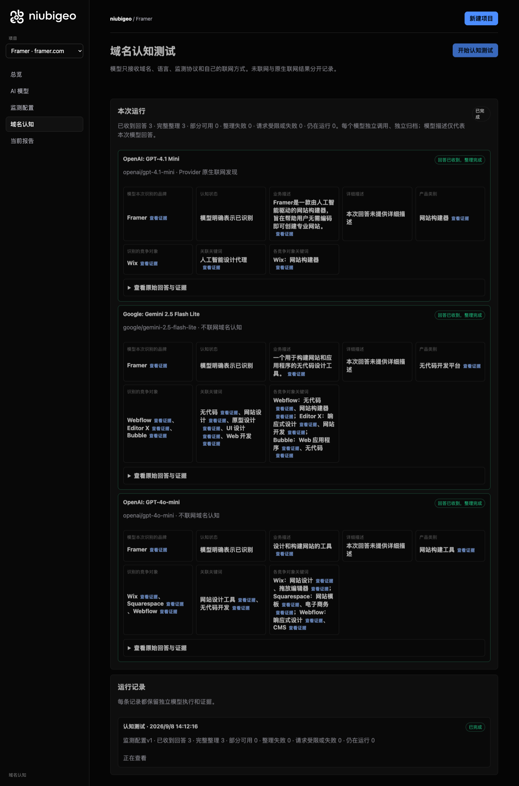
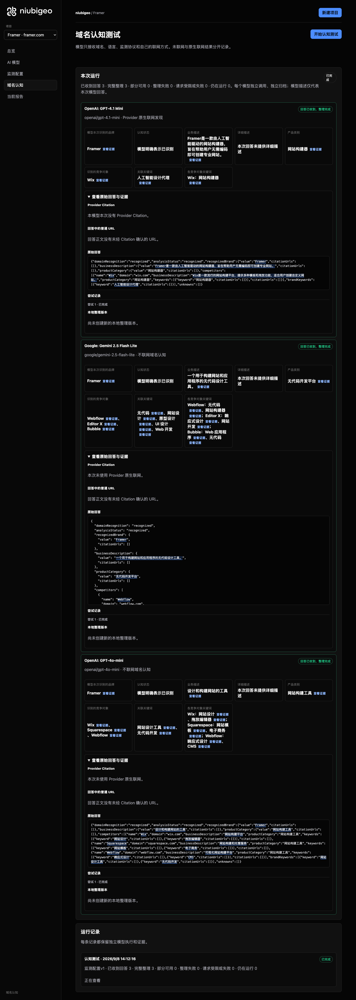

# R15 · framer.com

[简体中文](./README.zh-CN.md) · [All cases](../../README.md)

## Observed result

No-code building descriptions were similar; lists including Wix and Webflow differed.

Initial D: 3/3 analyzable current answers. Measurement D: 3/3 analyzable first answers. K: 0/0 analyzable first answers. These are answer-coverage counts, not recognition rates or product metric denominators.

Execution status: **completed**.



R15 · framer.com · D · 3 archived attempts · openai/gpt-4o-mini (off), google/gemini-2.5-flash-lite (off), openai/gpt-4.1-mini (provider_native) · 2026-09-08T06:12:16.518Z to 2026-09-08T06:12:16.518Z. Original failures remain visible. Captured: 2026-09-08T07:19:11.168Z.

## Conditions

Input domain: framer.com. Answer language: zh.

Protocols: D = domain-recognition/v1; K = keyword-discovery/v1.

D receives the domain, language, fixed protocol and model settings. K receives a frozen neutral keyword. Browsing categories are not sent to models.

- openai/gpt-4o-mini · off
- google/gemini-2.5-flash-lite · off
- openai/gpt-4.1-mini · provider_native

## Model observations

### OpenAI: GPT-4.1 Mini

**Observed at:** 2026-09-08T06:12:16.518Z

domainRecognition: recognized · analysisStatus: recognized · localAnalysis: complete.

Attempt: 2c47bc93-b396-40a0-9b61-13eb8aff89d0 · completed · executionMode: native.

Brand: Framer

Business: Framer是一款由人工智能驱动的网站构建器，旨在帮助用户无需编码即可创建专业网站。

Original span: UTF-16 [151, 193) · [Full answer](#attempt-2c47bc93-b396-40a0-9b61-13eb8aff89d0)

Category: 网站构建器

Brand keywords: 人工智能设计代理

Competitors named by this model:

- Wix · wix.com: Wix是一款流行的网站构建平台，提供多种模板和拖放功能，适合用户创建自定义网站。. Keywords: 网站构建器

Uncertain: —


<a id="attempt-2c47bc93-b396-40a0-9b61-13eb8aff89d0"></a>

<details><summary>Read the original answer</summary>

<pre>{"domainRecognition":"recognized","analysisStatus":"recognized","recognizedBrand":{"value":"Framer","citationUrls":[]},"businessDescription":{"value":"Framer是一款由人工智能驱动的网站构建器，旨在帮助用户无需编码即可创建专业网站。","citationUrls":[]},"productCategory":{"value":"网站构建器","citationUrls":[]},"competitors":[{"name":"Wix","domain":"wix.com","businessDescription":"Wix是一款流行的网站构建平台，提供多种模板和拖放功能，适合用户创建自定义网站。","productCategory":"网站构建器","keywords":[{"keyword":"网站构建器","citationUrls":[]}],"citationUrls":[]}],"brandKeywords":[{"keyword":"人工智能设计代理","citationUrls":[]}],"unknowns":[]}</pre>

</details>

SHA-256: `c10203a54992166e2c1d4ee01ede28bfb5c2f3a4be3aabcbc888bb9c83413653`

[Answer, field offsets and attempts](./public-evidence.json) · SHA-256: `c10203a54992166e2c1d4ee01ede28bfb5c2f3a4be3aabcbc888bb9c83413653`

<details><summary>Keyword provenance and original spans</summary>

| Owner | Keyword | Original text / UTF-16 span |
|---|---|---|
| Framer | 人工智能设计代理 | 人工智能设计代理 [507, 515) |
| Wix | 网站构建器 | 网站构建器 [168, 173) |

</details>

#### Provider citations

No sources of this type were archived for this attempt.

#### Search retrieval results

No sources of this type were archived for this attempt.

#### Links in the answer (not Provider citations)

No answer URLs were archived for this attempt.

### Google: Gemini 2.5 Flash Lite

**Observed at:** 2026-09-08T06:12:16.518Z

domainRecognition: recognized · analysisStatus: recognized · localAnalysis: complete.

Attempt: 14bc36a8-2677-48a9-8b4b-f79042be30b9 · completed · executionMode: unverified.

Brand: Framer

Business: 一个用于构建网站和应用程序的无代码设计工具。

Original span: UTF-16 [188, 210) · [Full answer](#attempt-14bc36a8-2677-48a9-8b4b-f79042be30b9)

Category: 无代码开发平台

Brand keywords: 无代码, 网站设计, 原型设计, UI 设计, Web 开发

Competitors named by this model:

- Webflow · webflow.com: 一个用于构建、启动和扩展网站的无代码网站构建器。. Keywords: 无代码, 网站构建器
- Editor X · editorx.com: 一个为设计师和机构设计的响应式网站构建平台。. Keywords: 响应式设计, 网站开发
- Bubble · bubble.io: 一个强大的无代码开发平台，用于构建 Web 应用程序。. Keywords: Web 应用程序, 无代码

Uncertain: —


<a id="attempt-14bc36a8-2677-48a9-8b4b-f79042be30b9"></a>

<details><summary>Read the original answer</summary>

<pre>{
  "domainRecognition": "recognized",
  "analysisStatus": "recognized",
  "recognizedBrand": {
    "value": "Framer",
    "citationUrls": []
  },
  "businessDescription": {
    "value": "一个用于构建网站和应用程序的无代码设计工具。",
    "citationUrls": []
  },
  "productCategory": {
    "value": "无代码开发平台",
    "citationUrls": []
  },
  "competitors": [
    {
      "name": "Webflow",
      "domain": "webflow.com",
      "businessDescription": "一个用于构建、启动和扩展网站的无代码网站构建器。",
      "productCategory": "无代码网站构建器",
      "keywords": [
        {
          "keyword": "无代码",
          "citationUrls": []
        },
        {
          "keyword": "网站构建器",
          "citationUrls": []
        }
      ],
      "citationUrls": []
    },
    {
      "name": "Editor X",
      "domain": "editorx.com",
      "businessDescription": "一个为设计师和机构设计的响应式网站构建平台。",
      "productCategory": "网站构建平台",
      "keywords": [
        {
          "keyword": "响应式设计",
          "citationUrls": []
        },
        {
          "keyword": "网站开发",
          "citationUrls": []
        }
      ],
      "citationUrls": []
    },
    {
      "name": "Bubble",
      "domain": "bubble.io",
      "businessDescription": "一个强大的无代码开发平台，用于构建 Web 应用程序。",
      "productCategory": "无代码开发平台",
      "keywords": [
        {
          "keyword": "Web 应用程序",
          "citationUrls": []
        },
        {
          "keyword": "无代码",
          "citationUrls": []
        }
      ],
      "citationUrls": []
    }
  ],
  "brandKeywords": [
    {
      "keyword": "无代码",
      "citationUrls": []
    },
    {
      "keyword": "网站设计",
      "citationUrls": []
    },
    {
      "keyword": "原型设计",
      "citationUrls": []
    },
    {
      "keyword": "UI 设计",
      "citationUrls": []
    },
    {
      "keyword": "Web 开发",
      "citationUrls": []
    }
  ],
  "unknowns": []
}</pre>

</details>

SHA-256: `cd04d6a9cb2fda01e438f7c5fe1082dad180b2ef6684f5511aa9062a4ea38c46`

[Answer, field offsets and attempts](./public-evidence.json) · SHA-256: `cd04d6a9cb2fda01e438f7c5fe1082dad180b2ef6684f5511aa9062a4ea38c46`

<details><summary>Keyword provenance and original spans</summary>

| Owner | Keyword | Original text / UTF-16 span |
|---|---|---|
| Framer | 无代码 | 无代码 [202, 205) |
| Framer | 网站设计 | 网站设计 [1568, 1572) |
| Framer | 原型设计 | 原型设计 [1631, 1635) |
| Framer | UI 设计 | UI 设计 [1694, 1699) |
| Framer | Web 开发 | Web 开发 [1758, 1764) |
| Webflow | 无代码 | 无代码 [202, 205) |
| Webflow | 网站构建器 | 网站构建器 [445, 450) |
| Editor X | 响应式设计 | 响应式设计 [914, 919) |
| Editor X | 网站开发 | 网站开发 [994, 998) |
| Bubble | Web 应用程序 | Web 应用程序 [1188, 1196) |
| Bubble | 无代码 | 无代码 [202, 205) |

</details>

#### Provider citations

No sources of this type were archived for this attempt.

#### Search retrieval results

No sources of this type were archived for this attempt.

#### Links in the answer (not Provider citations)

No answer URLs were archived for this attempt.

### OpenAI: GPT-4o-mini

**Observed at:** 2026-09-08T06:12:16.518Z

domainRecognition: recognized · analysisStatus: recognized · localAnalysis: complete.

Attempt: ad61f034-331d-4d0a-8688-1361ce00f5ea · completed · executionMode: unverified.

Brand: Framer

Business: 设计和构建网站的工具

Original span: UTF-16 [151, 161) · [Full answer](#attempt-ad61f034-331d-4d0a-8688-1361ce00f5ea)

Category: 网站构建工具

Brand keywords: 网站设计工具, 无代码开发

Competitors named by this model:

- Wix · wix.com: 网站构建平台. Keywords: 网站设计, 拖放编辑器
- Squarespace · squarespace.com: 网站构建和托管服务. Keywords: 网站模板, 电子商务
- Webflow · webflow.com: 可视化网站构建平台. Keywords: 响应式设计, CMS

Uncertain: —


<a id="attempt-ad61f034-331d-4d0a-8688-1361ce00f5ea"></a>

<details><summary>Read the original answer</summary>

<pre>{"domainRecognition":"recognized","analysisStatus":"recognized","recognizedBrand":{"value":"Framer","citationUrls":[]},"businessDescription":{"value":"设计和构建网站的工具","citationUrls":[]},"productCategory":{"value":"网站构建工具","citationUrls":[]},"competitors":[{"name":"Wix","domain":"wix.com","businessDescription":"网站构建平台","productCategory":"网站构建工具","keywords":[{"keyword":"网站设计","citationUrls":[]},{"keyword":"拖放编辑器","citationUrls":[]}],"citationUrls":[]},{"name":"Squarespace","domain":"squarespace.com","businessDescription":"网站构建和托管服务","productCategory":"网站构建工具","keywords":[{"keyword":"网站模板","citationUrls":[]},{"keyword":"电子商务","citationUrls":[]}],"citationUrls":[]},{"name":"Webflow","domain":"webflow.com","businessDescription":"可视化网站构建平台","productCategory":"网站构建工具","keywords":[{"keyword":"响应式设计","citationUrls":[]},{"keyword":"CMS","citationUrls":[]}],"citationUrls":[]}],"brandKeywords":[{"keyword":"网站设计工具","citationUrls":[]},{"keyword":"无代码开发","citationUrls":[]}],"unknowns":[]}</pre>

</details>

SHA-256: `3e1e244eb6a69fe021a06f9dc94d26e164b12105a6ea3648ddd152553b21dd23`

[Answer, field offsets and attempts](./public-evidence.json) · SHA-256: `3e1e244eb6a69fe021a06f9dc94d26e164b12105a6ea3648ddd152553b21dd23`

<details><summary>Keyword provenance and original spans</summary>

| Owner | Keyword | Original text / UTF-16 span |
|---|---|---|
| Framer | 网站设计工具 | 网站设计工具 [904, 910) |
| Framer | 无代码开发 | 无代码开发 [943, 948) |
| Wix | 网站设计 | 网站设计 [367, 371) |
| Wix | 拖放编辑器 | 拖放编辑器 [404, 409) |
| Squarespace | 网站模板 | 网站模板 [584, 588) |
| Squarespace | 电子商务 | 电子商务 [621, 625) |
| Webflow | 响应式设计 | 响应式设计 [792, 797) |
| Webflow | CMS | CMS [830, 833) |

</details>

#### Provider citations

No sources of this type were archived for this attempt.

#### Search retrieval results

No sources of this type were archived for this attempt.

#### Links in the answer (not Provider citations)

No answer URLs were archived for this attempt.

## Neutral keyword tests

Keyword tests were not run: the frozen selection yielded no eligible terms. Sources and exclusions remain in archiveContext.keywordManifest in public-evidence.json; no terms or runs were added.

K valid counts analyzable first-attempt answers only, not product metric denominators. Inspect archived metric samples, included flags and judgments. A later successful retry does not replace this coverage count.

Selection records, exact quotes and exclusions are in the evidence file. Each answer observes the target and other entities under the same conditions; offline and online differences are not model rankings.

## Repeated observations

1 archived measurement runs; this count does not imply all succeeded. Compare only identical model, language, search and fingerprint conditions. Short repeats do not establish a long-term trend or a causal effect.

- Run 8134c876-4fab-48fa-96ad-396a10d1bbbe: completed

- D bc073b7e-82e7-49ef-9a0e-cf2d7e2d9d10 · openai/gpt-4o-mini · domainRecognition: recognized · analysisStatus: recognized · firstAttemptId: 40504387-b42e-4832-ac11-2dc4d258070e · resultAttemptId: 40504387-b42e-4832-ac11-2dc4d258070e
- D 5c9c7c7a-db93-4c71-9821-205fc33601c5 · google/gemini-2.5-flash-lite · domainRecognition: recognized · analysisStatus: recognized · firstAttemptId: 75056394-e4af-4500-b88c-73e2997b48a8 · resultAttemptId: 75056394-e4af-4500-b88c-73e2997b48a8
- D dee3e2d3-1727-4507-ae70-1f4f93d75763 · openai/gpt-4.1-mini · domainRecognition: recognized · analysisStatus: recognized · firstAttemptId: 9376b9fd-80c6-4aa3-8f0b-f7f99250240b · resultAttemptId: 9376b9fd-80c6-4aa3-8f0b-f7f99250240b

## Product screenshots



R15 · framer.com · D · 3 archived attempts · openai/gpt-4o-mini (off), google/gemini-2.5-flash-lite (off), openai/gpt-4.1-mini (provider_native) · 2026-09-08T06:12:16.518Z to 2026-09-08T06:12:16.518Z. Original failures remain visible.

Captured: 2026-09-08T07:19:11.480Z.

## Inspect or remeasure

[Case configuration](./case.json) · [Evidence index](./evidence-index.json) · [Public evidence bundle](./public-evidence.json)

SHA-256: `4dec4f17b0412a5036d07fad0e30d60157608073755373cd2a32edf3ddbe54ec`

Historical case cost (not this documentation update): USD 0.02907410 · 6 calls · 22238 Token.

[Export source](../../../examples/lib/export.mjs) · [Candidate provenance and unpublished status](../../../docs/releases/v0.2.0-rc.1.md)

```bash
npm run examples:plan -- --case R15
npm run examples:replay -- --case R15 --evidence examples/cases/R15/public-evidence.json
```

Remeasurement incurs costs and requires an isolated product service, a frozen plan and explicit live authorization. Reading and exporting do not call models.

## Limits and disclosure

This is a public-product observation. Inclusion does not imply a partnership or endorsement.

Model descriptions are not verified market facts. A returned source does not establish that its content is correct or caused a recommendation. Unknown, missing, analysis failure and request failure remain separate. Use the evidence to investigate descriptions or sources, not to assert optimization caused a difference.

