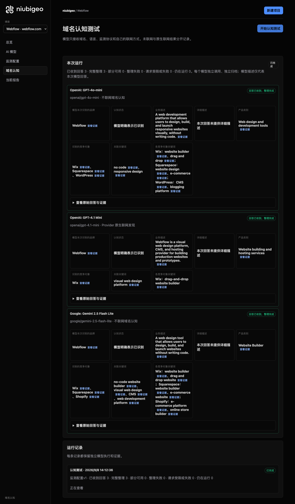
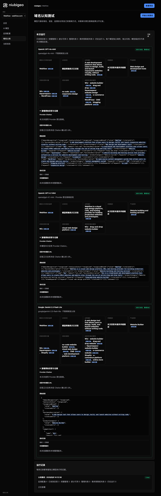

# R16 · webflow.com

[简体中文](./README.zh-CN.md) · [All cases](../../README.md)

## Observed result

Models described visual website building; one also explicitly described CMS and hosting.

Initial D: 3/3 analyzable current answers. Measurement D: 3/3 analyzable first answers. K: 0/0 analyzable first answers. These are answer-coverage counts, not recognition rates or product metric denominators.

Execution status: **completed**.



R16 · webflow.com · D · 3 archived attempts · openai/gpt-4o-mini (off), google/gemini-2.5-flash-lite (off), openai/gpt-4.1-mini (provider_native) · 2026-09-08T06:12:36.832Z to 2026-09-08T06:12:36.832Z. Original failures remain visible. Captured: 2026-09-08T07:19:11.943Z.

## Conditions

Input domain: webflow.com. Answer language: en.

Protocols: D = domain-recognition/v1; K = keyword-discovery/v1.

D receives the domain, language, fixed protocol and model settings. K receives a frozen neutral keyword. Browsing categories are not sent to models.

- openai/gpt-4o-mini · off
- google/gemini-2.5-flash-lite · off
- openai/gpt-4.1-mini · provider_native

## Model observations

### OpenAI: GPT-4o-mini

**Observed at:** 2026-09-08T06:12:36.832Z

domainRecognition: recognized · analysisStatus: recognized · localAnalysis: complete.

Attempt: 50b17ff7-8ab9-4c04-a54f-a784e8a31e4e · completed · executionMode: unverified.

Brand: Webflow

Business: A web development platform that allows users to design, build, and launch responsive websites visually, without writing code.

Original span: UTF-16 [152, 277) · [Full answer](#attempt-50b17ff7-8ab9-4c04-a54f-a784e8a31e4e)

Category: Web design and development tools

Brand keywords: no code, responsive design

Competitors named by this model:

- Wix · wix.com: A cloud-based web development platform that allows users to create HTML5 websites and mobile sites through the use of online drag and drop tools.. Keywords: website builder, drag and drop
- Squarespace · squarespace.com: A website building and hosting service that provides software as a service for website development and hosting.. Keywords: website design, e-commerce
- WordPress · wordpress.org: An open-source content management system that allows users to create and manage websites easily.. Keywords: CMS, blogging platform

Uncertain: —


<a id="attempt-50b17ff7-8ab9-4c04-a54f-a784e8a31e4e"></a>

<details><summary>Read the original answer</summary>

<pre>{"domainRecognition":"recognized","analysisStatus":"recognized","recognizedBrand":{"value":"Webflow","citationUrls":[]},"businessDescription":{"value":"A web development platform that allows users to design, build, and launch responsive websites visually, without writing code.","citationUrls":[]},"productCategory":{"value":"Web design and development tools","citationUrls":[]},"competitors":[{"name":"Wix","domain":"wix.com","businessDescription":"A cloud-based web development platform that allows users to create HTML5 websites and mobile sites through the use of online drag and drop tools.","productCategory":"Website builder","keywords":[{"keyword":"website builder","citationUrls":[]},{"keyword":"drag and drop","citationUrls":[]}],"citationUrls":[]},{"name":"Squarespace","domain":"squarespace.com","businessDescription":"A website building and hosting service that provides software as a service for website development and hosting.","productCategory":"Website builder","keywords":[{"keyword":"website design","citationUrls":[]},{"keyword":"e-commerce","citationUrls":[]}],"citationUrls":[]},{"name":"WordPress","domain":"wordpress.org","businessDescription":"An open-source content management system that allows users to create and manage websites easily.","productCategory":"Content management system","keywords":[{"keyword":"CMS","citationUrls":[]},{"keyword":"blogging platform","citationUrls":[]}],"citationUrls":[]}],"brandKeywords":[{"keyword":"no code","citationUrls":[]},{"keyword":"responsive design","citationUrls":[]}],"unknowns":[]}</pre>

</details>

SHA-256: `a1555796d6f93de6302e5df29928d765563fdcedce9112e6f56b8758e8a91582`

[Answer, field offsets and attempts](./public-evidence.json) · SHA-256: `a1555796d6f93de6302e5df29928d765563fdcedce9112e6f56b8758e8a91582`

<details><summary>Keyword provenance and original spans</summary>

| Owner | Keyword | Original text / UTF-16 span |
|---|---|---|
| Webflow | no code | no code [1462, 1469) |
| Webflow | responsive design | responsive design [1502, 1519) |
| Wix | website builder | website builder [657, 672) |
| Wix | drag and drop | drag and drop [575, 588) |
| Squarespace | website design | website design [1004, 1018) |
| Squarespace | e-commerce | e-commerce [1051, 1061) |
| WordPress | CMS | CMS [1338, 1341) |
| WordPress | blogging platform | blogging platform [1374, 1391) |

</details>

#### Provider citations

No sources of this type were archived for this attempt.

#### Search retrieval results

No sources of this type were archived for this attempt.

#### Links in the answer (not Provider citations)

No answer URLs were archived for this attempt.

### OpenAI: GPT-4.1 Mini

**Observed at:** 2026-09-08T06:12:36.832Z

domainRecognition: recognized · analysisStatus: recognized · localAnalysis: complete.

Attempt: b034bdf3-a2c9-4799-b843-4c0d8dfc03f3 · completed · executionMode: native.

Brand: Webflow

Business: Webflow is a visual web design platform, CMS, and hosting provider for building production websites and prototypes.

Original span: UTF-16 [152, 267) · [Full answer](#attempt-b034bdf3-a2c9-4799-b843-4c0d8dfc03f3)

Category: Website building and hosting services

Brand keywords: visual web design platform

Competitors named by this model:

- Wix · wix.com: Wix is a cloud-based web development platform that allows users to create HTML5 websites and mobile sites through the use of online drag and drop tools.. Keywords: drag-and-drop website builder

Uncertain: —


<a id="attempt-b034bdf3-a2c9-4799-b843-4c0d8dfc03f3"></a>

<details><summary>Read the original answer</summary>

<pre>{"domainRecognition":"recognized","analysisStatus":"recognized","recognizedBrand":{"value":"Webflow","citationUrls":[]},"businessDescription":{"value":"Webflow is a visual web design platform, CMS, and hosting provider for building production websites and prototypes.","citationUrls":[]},"productCategory":{"value":"Website building and hosting services","citationUrls":[]},"competitors":[{"name":"Wix","domain":"wix.com","businessDescription":"Wix is a cloud-based web development platform that allows users to create HTML5 websites and mobile sites through the use of online drag and drop tools.","productCategory":"Website building and hosting services","keywords":[{"keyword":"drag-and-drop website builder","citationUrls":[]}],"citationUrls":[]}],"brandKeywords":[{"keyword":"visual web design platform","citationUrls":[]}],"unknowns":[]}</pre>

</details>

SHA-256: `dafd88b8f6f36b9284d9d857d684eed77b2d1078fc9fd36ecf2ec72cec89a6bc`

[Answer, field offsets and attempts](./public-evidence.json) · SHA-256: `dafd88b8f6f36b9284d9d857d684eed77b2d1078fc9fd36ecf2ec72cec89a6bc`

<details><summary>Keyword provenance and original spans</summary>

| Owner | Keyword | Original text / UTF-16 span |
|---|---|---|
| Webflow | visual web design platform | visual web design platform [165, 191) |
| Wix | drag-and-drop website builder | drag-and-drop website builder [681, 710) |

</details>

#### Provider citations

No sources of this type were archived for this attempt.

#### Search retrieval results

No sources of this type were archived for this attempt.

#### Links in the answer (not Provider citations)

No answer URLs were archived for this attempt.

### Google: Gemini 2.5 Flash Lite

**Observed at:** 2026-09-08T06:12:36.832Z

domainRecognition: recognized · analysisStatus: recognized · localAnalysis: complete.

Attempt: 753a00ab-dd76-4fdd-a07c-c5ad4ebe2c4e · completed · executionMode: unverified.

Brand: Webflow

Business: A web design tool that allows users to design, build, and launch websites without writing code.

Original span: UTF-16 [189, 284) · [Full answer](#attempt-753a00ab-dd76-4fdd-a07c-c5ad4ebe2c4e)

Category: Website Builder

Brand keywords: no-code website builder, visual web design, CMS, web development platform

Competitors named by this model:

- Wix · wix.com: A cloud-based web development platform that allows users to create websites and mobile sites.. Keywords: website builder, drag and drop website
- Squarespace · squarespace.com: A website building and hosting company that provides freemium as its product.. Keywords: website builder, e-commerce website
- Shopify · shopify.com: An e-commerce platform that allows businesses to create and manage their online stores.. Keywords: e-commerce platform, online store builder

Uncertain: —


<a id="attempt-753a00ab-dd76-4fdd-a07c-c5ad4ebe2c4e"></a>

<details><summary>Read the original answer</summary>

<pre>{
  "domainRecognition": "recognized",
  "analysisStatus": "recognized",
  "recognizedBrand": {
    "value": "Webflow",
    "citationUrls": []
  },
  "businessDescription": {
    "value": "A web design tool that allows users to design, build, and launch websites without writing code.",
    "citationUrls": []
  },
  "productCategory": {
    "value": "Website Builder",
    "citationUrls": []
  },
  "competitors": [
    {
      "name": "Wix",
      "domain": "wix.com",
      "businessDescription": "A cloud-based web development platform that allows users to create websites and mobile sites.",
      "productCategory": "Website Builder",
      "keywords": [
        {
          "keyword": "website builder",
          "citationUrls": []
        },
        {
          "keyword": "drag and drop website",
          "citationUrls": []
        }
      ],
      "citationUrls": []
    },
    {
      "name": "Squarespace",
      "domain": "squarespace.com",
      "businessDescription": "A website building and hosting company that provides freemium as its product.",
      "productCategory": "Website Builder",
      "keywords": [
        {
          "keyword": "website builder",
          "citationUrls": []
        },
        {
          "keyword": "e-commerce website",
          "citationUrls": []
        }
      ],
      "citationUrls": []
    },
    {
      "name": "Shopify",
      "domain": "shopify.com",
      "businessDescription": "An e-commerce platform that allows businesses to create and manage their online stores.",
      "productCategory": "E-commerce Platform",
      "keywords": [
        {
          "keyword": "e-commerce platform",
          "citationUrls": []
        },
        {
          "keyword": "online store builder",
          "citationUrls": []
        }
      ],
      "citationUrls": []
    }
  ],
  "brandKeywords": [
    {
      "keyword": "no-code website builder",
      "citationUrls": []
    },
    {
      "keyword": "visual web design",
      "citationUrls": []
    },
    {
      "keyword": "CMS",
      "citationUrls": []
    },
    {
      "keyword": "web development platform",
      "citationUrls": []
    }
  ],
  "unknowns": []
}</pre>

</details>

SHA-256: `531cab7db880c8b1b4c952fe3bfd11ff11f511fe99e17a76737629fb3d2c9a36`

[Answer, field offsets and attempts](./public-evidence.json) · SHA-256: `531cab7db880c8b1b4c952fe3bfd11ff11f511fe99e17a76737629fb3d2c9a36`

<details><summary>Keyword provenance and original spans</summary>

| Owner | Keyword | Original text / UTF-16 span |
|---|---|---|
| Webflow | no-code website builder | no-code website builder [1882, 1905) |
| Webflow | visual web design | visual web design [1964, 1981) |
| Webflow | CMS | CMS [2040, 2043) |
| Webflow | web development platform | web development platform [515, 539) |
| Wix | website builder | website builder [693, 708) |
| Wix | drag and drop website | drag and drop website [783, 804) |
| Squarespace | website builder | website builder [693, 708) |
| Squarespace | e-commerce website | e-commerce website [1253, 1271) |
| Shopify | e-commerce platform | e-commerce platform [1449, 1468) |
| Shopify | online store builder | online store builder [1730, 1750) |

</details>

#### Provider citations

No sources of this type were archived for this attempt.

#### Search retrieval results

No sources of this type were archived for this attempt.

#### Links in the answer (not Provider citations)

No answer URLs were archived for this attempt.

## Neutral keyword tests

Keyword tests were not run: the frozen selection yielded no eligible terms. Sources and exclusions remain in archiveContext.keywordManifest in public-evidence.json; no terms or runs were added.

K valid counts analyzable first-attempt answers only, not product metric denominators. Inspect archived metric samples, included flags and judgments. A later successful retry does not replace this coverage count.

Selection records, exact quotes and exclusions are in the evidence file. Each answer observes the target and other entities under the same conditions; offline and online differences are not model rankings.

## Repeated observations

1 archived measurement runs; this count does not imply all succeeded. Compare only identical model, language, search and fingerprint conditions. Short repeats do not establish a long-term trend or a causal effect.

- Run 18b00c91-a08f-49eb-b708-6c93e6d8b03b: completed

- D 879484d7-0809-4c94-8088-ce664e047cbb · openai/gpt-4.1-mini · domainRecognition: recognized · analysisStatus: recognized · firstAttemptId: 4270150a-c7f3-41ef-b418-bdeaa97c2173 · resultAttemptId: 4270150a-c7f3-41ef-b418-bdeaa97c2173
- D 4d8069d4-9f98-4102-9b0e-6b467c7e2008 · openai/gpt-4o-mini · domainRecognition: recognized · analysisStatus: recognized · firstAttemptId: 2a14dd88-1baa-4aa3-98bd-824e01d1511c · resultAttemptId: 2a14dd88-1baa-4aa3-98bd-824e01d1511c
- D 2909de24-a85c-4acb-9672-9ecf8a3b5554 · google/gemini-2.5-flash-lite · domainRecognition: recognized · analysisStatus: recognized · firstAttemptId: 99c0cca5-4206-4528-89d3-323f63949572 · resultAttemptId: 99c0cca5-4206-4528-89d3-323f63949572

## Product screenshots



R16 · webflow.com · D · 3 archived attempts · openai/gpt-4o-mini (off), google/gemini-2.5-flash-lite (off), openai/gpt-4.1-mini (provider_native) · 2026-09-08T06:12:36.832Z to 2026-09-08T06:12:36.832Z. Original failures remain visible.

Captured: 2026-09-08T07:19:12.265Z.

## Inspect or remeasure

[Case configuration](./case.json) · [Evidence index](./evidence-index.json) · [Public evidence bundle](./public-evidence.json)

SHA-256: `99192a90fc7c9b69b91e32ad402852086d4b3a1a8eb3967321bd4ac3d0b212e0`

Historical case cost (not this documentation update): USD 0.02919860 · 6 calls · 22301 Token.

[Export source](../../../examples/lib/export.mjs) · [Candidate provenance and unpublished status](../../../docs/releases/v0.2.0-rc.1.md)

```bash
npm run examples:plan -- --case R16
npm run examples:replay -- --case R16 --evidence examples/cases/R16/public-evidence.json
```

Remeasurement incurs costs and requires an isolated product service, a frozen plan and explicit live authorization. Reading and exporting do not call models.

## Limits and disclosure

This is a public-product observation. Inclusion does not imply a partnership or endorsement.

Model descriptions are not verified market facts. A returned source does not establish that its content is correct or caused a recommendation. Unknown, missing, analysis failure and request failure remain separate. Use the evidence to investigate descriptions or sources, not to assert optimization caused a difference.

