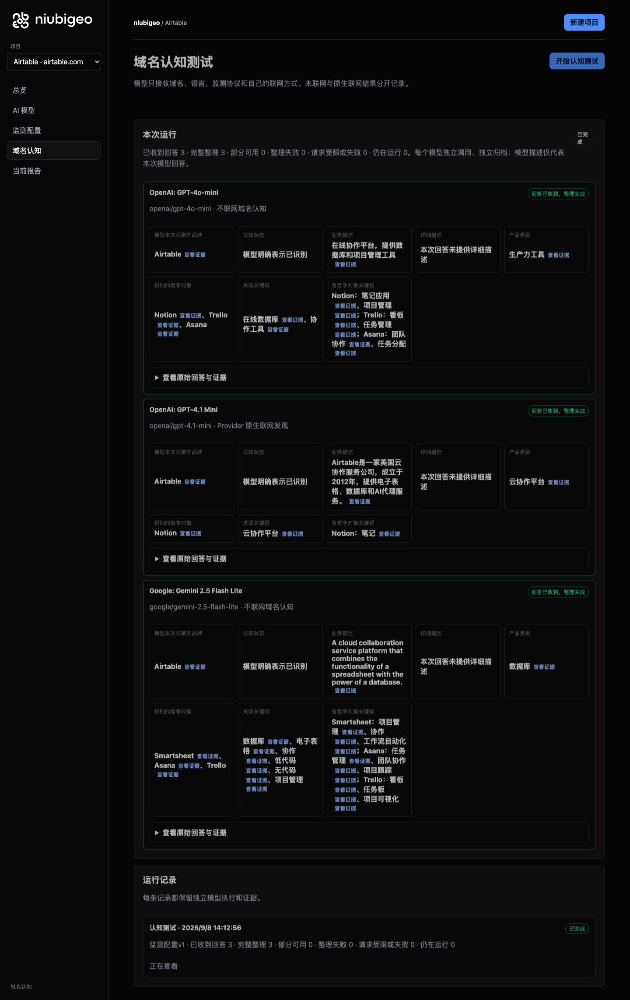
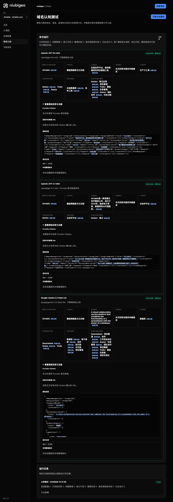

# R17 · airtable.com

[简体中文](./README.zh-CN.md) · [All cases](../../README.md)

## Observed result

Models emphasized databases, spreadsheets and collaboration; keyword tests were not run.

Initial D: 3/3 analyzable current answers. Measurement D: 3/3 analyzable first answers. K: 0/0 analyzable first answers. These are answer-coverage counts, not recognition rates or product metric denominators.

Execution status: **completed**.



R17 · airtable.com · D · 3 archived attempts · openai/gpt-4o-mini (off), google/gemini-2.5-flash-lite (off), openai/gpt-4.1-mini (provider_native) · 2026-09-08T06:12:56.169Z to 2026-09-08T06:12:56.169Z. Original failures remain visible. Captured: 2026-09-08T07:19:12.681Z.

## Conditions

Input domain: airtable.com. Answer language: zh.

Protocols: D = domain-recognition/v1; K = keyword-discovery/v1.

D receives the domain, language, fixed protocol and model settings. K receives a frozen neutral keyword. Browsing categories are not sent to models.

- openai/gpt-4o-mini · off
- google/gemini-2.5-flash-lite · off
- openai/gpt-4.1-mini · provider_native

## Model observations

### OpenAI: GPT-4o-mini

**Observed at:** 2026-09-08T06:12:56.169Z

domainRecognition: recognized · analysisStatus: recognized · localAnalysis: complete.

Attempt: 324f4acc-aa02-4417-a25b-965ee32558eb · completed · executionMode: unverified.

Brand: Airtable

Business: 在线协作平台，提供数据库和项目管理工具

Original span: UTF-16 [153, 172) · [Full answer](#attempt-324f4acc-aa02-4417-a25b-965ee32558eb)

Category: 生产力工具

Brand keywords: 在线数据库, 协作工具

Competitors named by this model:

- Notion · notion.so: 综合笔记和项目管理工具. Keywords: 笔记应用, 项目管理
- Trello · trello.com: 基于看板的项目管理工具. Keywords: 看板, 任务管理
- Asana · asana.com: 团队协作和任务管理工具. Keywords: 团队协作, 任务分配

Uncertain: —


<a id="attempt-324f4acc-aa02-4417-a25b-965ee32558eb"></a>

<details><summary>Read the original answer</summary>

<pre>{"domainRecognition":"recognized","analysisStatus":"recognized","recognizedBrand":{"value":"Airtable","citationUrls":[]},"businessDescription":{"value":"在线协作平台，提供数据库和项目管理工具","citationUrls":[]},"productCategory":{"value":"生产力工具","citationUrls":[]},"competitors":[{"name":"Notion","domain":"notion.so","businessDescription":"综合笔记和项目管理工具","productCategory":"生产力工具","keywords":[{"keyword":"笔记应用","citationUrls":[]},{"keyword":"项目管理","citationUrls":[]}],"citationUrls":[]},{"name":"Trello","domain":"trello.com","businessDescription":"基于看板的项目管理工具","productCategory":"生产力工具","keywords":[{"keyword":"看板","citationUrls":[]},{"keyword":"任务管理","citationUrls":[]}],"citationUrls":[]},{"name":"Asana","domain":"asana.com","businessDescription":"团队协作和任务管理工具","productCategory":"生产力工具","keywords":[{"keyword":"团队协作","citationUrls":[]},{"keyword":"任务分配","citationUrls":[]}],"citationUrls":[]}],"brandKeywords":[{"keyword":"在线数据库","citationUrls":[]},{"keyword":"协作工具","citationUrls":[]}],"unknowns":[]}</pre>

</details>

SHA-256: `ed1ba42a5836caa6b8292508dc65528b4e665c8892e02a185f524d0ed7f1568b`

[Answer, field offsets and attempts](./public-evidence.json) · SHA-256: `ed1ba42a5836caa6b8292508dc65528b4e665c8892e02a185f524d0ed7f1568b`

<details><summary>Keyword provenance and original spans</summary>

| Owner | Keyword | Original text / UTF-16 span |
|---|---|---|
| Airtable | 在线数据库 | 在线数据库 [908, 913) |
| Airtable | 协作工具 | 协作工具 [946, 950) |
| Notion | 笔记应用 | 笔记应用 [386, 390) |
| Notion | 项目管理 | 项目管理 [166, 170) |
| Trello | 看板 | 看板 [532, 534) |
| Trello | 任务管理 | 任务管理 [628, 632) |
| Asana | 团队协作 | 团队协作 [733, 737) |
| Asana | 任务分配 | 任务分配 [833, 837) |

</details>

#### Provider citations

No sources of this type were archived for this attempt.

#### Search retrieval results

No sources of this type were archived for this attempt.

#### Links in the answer (not Provider citations)

No answer URLs were archived for this attempt.

### OpenAI: GPT-4.1 Mini

**Observed at:** 2026-09-08T06:12:56.169Z

domainRecognition: recognized · analysisStatus: recognized · localAnalysis: complete.

Attempt: 1353a302-0aba-4114-a975-b43794aefd9b · completed · executionMode: native.

Brand: Airtable

Business: Airtable是一家美国云协作服务公司，成立于2012年，提供电子表格、数据库和AI代理服务。

Original span: UTF-16 [153, 201) · [Full answer](#attempt-1353a302-0aba-4114-a975-b43794aefd9b)

Category: 云协作平台

Brand keywords: 云协作平台

Competitors named by this model:

- Notion · notion.so: Notion是一款集笔记、任务管理和数据库功能于一体的协作工具。. Keywords: 笔记

Uncertain: —


<a id="attempt-1353a302-0aba-4114-a975-b43794aefd9b"></a>

<details><summary>Read the original answer</summary>

<pre>{"domainRecognition":"recognized","analysisStatus":"recognized","recognizedBrand":{"value":"Airtable","citationUrls":[]},"businessDescription":{"value":"Airtable是一家美国云协作服务公司，成立于2012年，提供电子表格、数据库和AI代理服务。","citationUrls":[]},"productCategory":{"value":"云协作平台","citationUrls":[]},"competitors":[{"name":"Notion","domain":"notion.so","businessDescription":"Notion是一款集笔记、任务管理和数据库功能于一体的协作工具。","productCategory":"协作工具","keywords":[{"keyword":"笔记","citationUrls":[]}],"citationUrls":[]}],"brandKeywords":[{"keyword":"云协作平台","citationUrls":[]}],"unknowns":[]}</pre>

</details>

SHA-256: `97e5d434b4d23de91db572c3d0abed211f07526c378757041ad181c1b655587c`

[Answer, field offsets and attempts](./public-evidence.json) · SHA-256: `97e5d434b4d23de91db572c3d0abed211f07526c378757041ad181c1b655587c`

<details><summary>Keyword provenance and original spans</summary>

| Owner | Keyword | Original text / UTF-16 span |
|---|---|---|
| Airtable | 云协作平台 | 云协作平台 [250, 255) |
| Notion | 笔记 | 笔记 [362, 364) |

</details>

#### Provider citations

No sources of this type were archived for this attempt.

#### Search retrieval results

No sources of this type were archived for this attempt.

#### Links in the answer (not Provider citations)

No answer URLs were archived for this attempt.

### Google: Gemini 2.5 Flash Lite

**Observed at:** 2026-09-08T06:12:56.169Z

domainRecognition: recognized · analysisStatus: recognized · localAnalysis: complete.

Attempt: 92d2298d-108f-498c-ac3b-18b616ce119c · completed · executionMode: unverified.

Brand: Airtable

Business: A cloud collaboration service platform that combines the functionality of a spreadsheet with the power of a database.

Original span: UTF-16 [190, 307) · [Full answer](#attempt-92d2298d-108f-498c-ac3b-18b616ce119c)

Category: 数据库

Brand keywords: 数据库, 电子表格, 协作, 低代码, 无代码, 项目管理

Competitors named by this model:

- Smartsheet · smartsheet.com: A work execution platform that helps teams organize, track, and manage their work.. Keywords: 项目管理, 协作, 工作流自动化
- Asana · asana.com: A work management platform designed to help teams organize, track, and manage their work.. Keywords: 任务管理, 团队协作, 项目跟踪
- Trello · trello.com: A visual collaboration tool that organizes your projects into boards.. Keywords: 看板, 任务板, 项目可视化

Uncertain: —


<a id="attempt-92d2298d-108f-498c-ac3b-18b616ce119c"></a>

<details><summary>Read the original answer</summary>

<pre>{
  "domainRecognition": "recognized",
  "analysisStatus": "recognized",
  "recognizedBrand": {
    "value": "Airtable",
    "citationUrls": []
  },
  "businessDescription": {
    "value": "A cloud collaboration service platform that combines the functionality of a spreadsheet with the power of a database.",
    "citationUrls": []
  },
  "productCategory": {
    "value": "数据库",
    "citationUrls": []
  },
  "competitors": [
    {
      "name": "Smartsheet",
      "domain": "smartsheet.com",
      "businessDescription": "A work execution platform that helps teams organize, track, and manage their work.",
      "productCategory": "项目管理软件",
      "keywords": [
        {
          "keyword": "项目管理",
          "citationUrls": []
        },
        {
          "keyword": "协作",
          "citationUrls": []
        },
        {
          "keyword": "工作流自动化",
          "citationUrls": []
        }
      ],
      "citationUrls": []
    },
    {
      "name": "Asana",
      "domain": "asana.com",
      "businessDescription": "A work management platform designed to help teams organize, track, and manage their work.",
      "productCategory": "项目管理软件",
      "keywords": [
        {
          "keyword": "任务管理",
          "citationUrls": []
        },
        {
          "keyword": "团队协作",
          "citationUrls": []
        },
        {
          "keyword": "项目跟踪",
          "citationUrls": []
        }
      ],
      "citationUrls": []
    },
    {
      "name": "Trello",
      "domain": "trello.com",
      "businessDescription": "A visual collaboration tool that organizes your projects into boards.",
      "productCategory": "项目管理软件",
      "keywords": [
        {
          "keyword": "看板",
          "citationUrls": []
        },
        {
          "keyword": "任务板",
          "citationUrls": []
        },
        {
          "keyword": "项目可视化",
          "citationUrls": []
        }
      ],
      "citationUrls": []
    }
  ],
  "brandKeywords": [
    {
      "keyword": "数据库",
      "citationUrls": []
    },
    {
      "keyword": "电子表格",
      "citationUrls": []
    },
    {
      "keyword": "协作",
      "citationUrls": []
    },
    {
      "keyword": "低代码",
      "citationUrls": []
    },
    {
      "keyword": "无代码",
      "citationUrls": []
    },
    {
      "keyword": "项目管理",
      "citationUrls": []
    }
  ],
  "unknowns": []
}</pre>

</details>

SHA-256: `0b1e7078d17d837f3956099c7261bb4b19bbc8ffafceb4d80f996b3f92b131ea`

[Answer, field offsets and attempts](./public-evidence.json) · SHA-256: `0b1e7078d17d837f3956099c7261bb4b19bbc8ffafceb4d80f996b3f92b131ea`

<details><summary>Keyword provenance and original spans</summary>

| Owner | Keyword | Original text / UTF-16 span |
|---|---|---|
| Airtable | 数据库 | 数据库 [375, 378) |
| Airtable | 电子表格 | 电子表格 [2058, 2062) |
| Airtable | 协作 | 协作 [777, 779) |
| Airtable | 低代码 | 低代码 [2182, 2185) |
| Airtable | 无代码 | 无代码 [2244, 2247) |
| Airtable | 项目管理 | 项目管理 [637, 641) |
| Smartsheet | 项目管理 | 项目管理 [637, 641) |
| Smartsheet | 协作 | 协作 [777, 779) |
| Smartsheet | 工作流自动化 | 工作流自动化 [854, 860) |
| Asana | 任务管理 | 任务管理 [1210, 1214) |
| Asana | 团队协作 | 团队协作 [1289, 1293) |
| Asana | 项目跟踪 | 项目跟踪 [1368, 1372) |
| Trello | 看板 | 看板 [1704, 1706) |
| Trello | 任务板 | 任务板 [1781, 1784) |
| Trello | 项目可视化 | 项目可视化 [1859, 1864) |

</details>

#### Provider citations

No sources of this type were archived for this attempt.

#### Search retrieval results

No sources of this type were archived for this attempt.

#### Links in the answer (not Provider citations)

No answer URLs were archived for this attempt.

## Neutral keyword tests

Keyword tests were not run: the frozen selection yielded no eligible terms. Sources and exclusions remain in archiveContext.keywordManifest in public-evidence.json; no terms or runs were added.

K valid counts analyzable first-attempt answers only, not product metric denominators. Inspect archived metric samples, included flags and judgments. A later successful retry does not replace this coverage count.

Selection records, exact quotes and exclusions are in the evidence file. Each answer observes the target and other entities under the same conditions; offline and online differences are not model rankings.

## Repeated observations

1 archived measurement runs; this count does not imply all succeeded. Compare only identical model, language, search and fingerprint conditions. Short repeats do not establish a long-term trend or a causal effect.

- Run 2760721f-9ff5-451a-9d5e-cfcb5c7c8fdc: completed

- D 24801b3e-e3fd-49ef-83ea-e59102c00b42 · openai/gpt-4o-mini · domainRecognition: recognized · analysisStatus: recognized · firstAttemptId: a81fed53-0f37-4bcd-a720-4dff69dd1562 · resultAttemptId: a81fed53-0f37-4bcd-a720-4dff69dd1562
- D 7dc1dec2-19df-4e0d-95cb-5bb516824044 · openai/gpt-4.1-mini · domainRecognition: recognized · analysisStatus: recognized · firstAttemptId: a35c2bfa-9c32-4882-be58-206537a7b42f · resultAttemptId: a35c2bfa-9c32-4882-be58-206537a7b42f
- D 40c7877b-45b1-43cc-bc43-8e2db618383c · google/gemini-2.5-flash-lite · domainRecognition: recognized · analysisStatus: recognized · firstAttemptId: 8dbc3871-ba8e-44e2-b7d6-90239a533a94 · resultAttemptId: 8dbc3871-ba8e-44e2-b7d6-90239a533a94

## Product screenshots



R17 · airtable.com · D · 3 archived attempts · openai/gpt-4o-mini (off), google/gemini-2.5-flash-lite (off), openai/gpt-4.1-mini (provider_native) · 2026-09-08T06:12:56.169Z to 2026-09-08T06:12:56.169Z. Original failures remain visible.

Captured: 2026-09-08T07:19:13.006Z.

## Inspect or remeasure

[Case configuration](./case.json) · [Evidence index](./evidence-index.json) · [Public evidence bundle](./public-evidence.json)

SHA-256: `4af51959fa3fb6755588fee59a7a59245fdf44cea05142a7bcc110b978e4481e`

Historical case cost (not this documentation update): USD 0.02904650 · 6 calls · 22361 Token.

[Export source](../../../examples/lib/export.mjs) · [Candidate provenance and unpublished status](../../../docs/releases/v0.2.0-rc.1.md)

```bash
npm run examples:plan -- --case R17
npm run examples:replay -- --case R17 --evidence examples/cases/R17/public-evidence.json
```

Remeasurement incurs costs and requires an isolated product service, a frozen plan and explicit live authorization. Reading and exporting do not call models.

## Limits and disclosure

This is a public-product observation. Inclusion does not imply a partnership or endorsement.

Model descriptions are not verified market facts. A returned source does not establish that its content is correct or caused a recommendation. Unknown, missing, analysis failure and request failure remain separate. Use the evidence to investigate descriptions or sources, not to assert optimization caused a difference.

