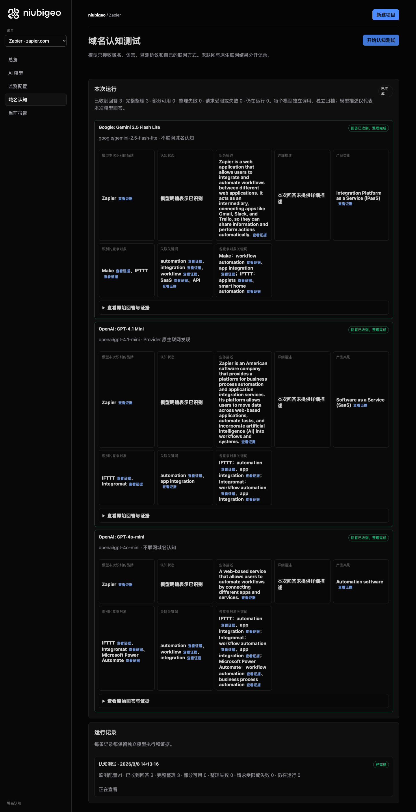
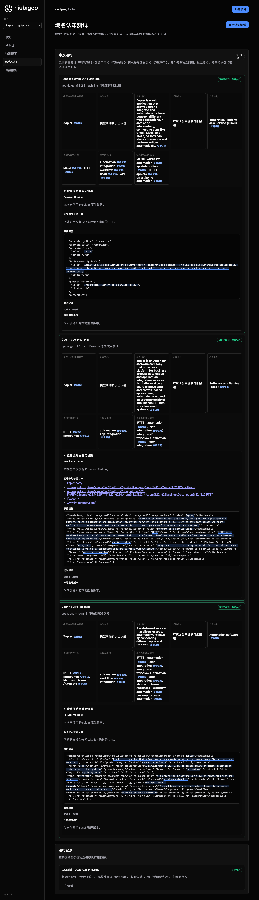
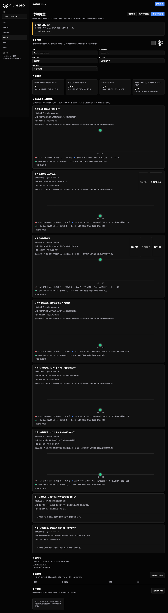

# R18 · zapier.com

[English](./README.md) · [全部案例](../../README.zh-CN.md)

## 本次实际结果

回答混用 Make 与 Integromat 等名称，不能直接视为不同公司。

初始 D：3/3 条当前回答可分析；测量 D：3/3 条首次回答可分析；K：4/6 条首次回答可分析。这些是回答覆盖计数，不是认识率或产品指标分母。

执行状态: **部分完成**.



R18 · zapier.com · D · 3 条归档尝试 · openai/gpt-4o-mini（off）、google/gemini-2.5-flash-lite（off）、openai/gpt-4.1-mini（provider_native） · 2026-09-08T06:13:16.526Z 至 2026-09-08T06:13:16.527Z。保留原始失败状态。 截图时间: 2026-09-08T07:19:13.545Z.

## 测试条件

输入域名: zapier.com. 回答语言: en.

协议: D = domain-recognition/v1; K = keyword-discovery/v1.

D 只接收域名、语言、固定协议与模型配置。K 只接收已冻结的中性关键词。分类标签不发送给模型。

- openai/gpt-4o-mini · off
- google/gemini-2.5-flash-lite · off
- openai/gpt-4.1-mini · provider_native

## 各模型的描述

### Google: Gemini 2.5 Flash Lite

**运行时间:** 2026-09-08T06:13:16.526Z

domainRecognition: recognized · analysisStatus: recognized · localAnalysis: complete.

Attempt: 55a4022c-aa87-4d79-ac0d-3710f7408000 · completed · executionMode: unverified.

品牌: Zapier

业务: Zapier is a web application that allows users to integrate and automate workflows between different web applications. It acts as an intermediary, connecting apps like Gmail, Slack, and Trello, so they can share information and perform actions automatically.

原文位置: UTF-16 [188, 445) · [打开完整回答](#attempt-55a4022c-aa87-4d79-ac0d-3710f7408000)

类别: Integration Platform as a Service (iPaaS)

目标关键词: automation, integration, workflow, SaaS, API

竞争对象:

- Make · make.com: Make (formerly Integromat) is a visual platform for connecting apps and automating workflows. It allows users to build complex automations with a drag-and-drop interface.. 关键词: workflow automation, app integration
- IFTTT · ifttt.com: IFTTT (If This Then That) is a service that connects various apps and devices, allowing users to create automated routines called 'applets'. It focuses on simpler, consumer-oriented automations.. 关键词: applets, smart home automation

无法确认: —


<a id="attempt-55a4022c-aa87-4d79-ac0d-3710f7408000"></a>

<details><summary>查看模型原始回答</summary>

<pre>{
  "domainRecognition": "recognized",
  "analysisStatus": "recognized",
  "recognizedBrand": {
    "value": "Zapier",
    "citationUrls": []
  },
  "businessDescription": {
    "value": "Zapier is a web application that allows users to integrate and automate workflows between different web applications. It acts as an intermediary, connecting apps like Gmail, Slack, and Trello, so they can share information and perform actions automatically.",
    "citationUrls": []
  },
  "productCategory": {
    "value": "Integration Platform as a Service (iPaaS)",
    "citationUrls": []
  },
  "competitors": [
    {
      "name": "Make",
      "domain": "make.com",
      "businessDescription": "Make (formerly Integromat) is a visual platform for connecting apps and automating workflows. It allows users to build complex automations with a drag-and-drop interface.",
      "productCategory": "Integration Platform as a Service (iPaaS)",
      "keywords": [
        {
          "keyword": "workflow automation",
          "citationUrls": []
        },
        {
          "keyword": "app integration",
          "citationUrls": []
        }
      ],
      "citationUrls": []
    },
    {
      "name": "IFTTT",
      "domain": "ifttt.com",
      "businessDescription": "IFTTT (If This Then That) is a service that connects various apps and devices, allowing users to create automated routines called 'applets'. It focuses on simpler, consumer-oriented automations.",
      "productCategory": "Automation Platform",
      "keywords": [
        {
          "keyword": "applets",
          "citationUrls": []
        },
        {
          "keyword": "smart home automation",
          "citationUrls": []
        }
      ],
      "citationUrls": []
    }
  ],
  "brandKeywords": [
    {
      "keyword": "automation",
      "citationUrls": []
    },
    {
      "keyword": "integration",
      "citationUrls": []
    },
    {
      "keyword": "workflow",
      "citationUrls": []
    },
    {
      "keyword": "SaaS",
      "citationUrls": []
    },
    {
      "keyword": "API",
      "citationUrls": []
    }
  ],
  "unknowns": []
}</pre>

</details>

SHA-256: `eca60d3058b54ebbcba1c7cfb3d0160feb0f7d91dde63bce79a2fa388245e4e6`

[原始回答、字段位置与尝试记录](./public-evidence.json) · SHA-256: `eca60d3058b54ebbcba1c7cfb3d0160feb0f7d91dde63bce79a2fa388245e4e6`

<details><summary>关键词与原文位置</summary>

| 归属 | 关键词 | 原文 / UTF-16 位置 |
|---|---|---|
| Zapier | automation | automation [817, 827) |
| Zapier | integration | integration [1083, 1094) |
| Zapier | workflow | workflow [260, 268) |
| Zapier | SaaS | SaaS [2003, 2007) |
| Zapier | API | API [2066, 2069) |
| Make | workflow automation | workflow automation [985, 1004) |
| Make | app integration | app integration [1079, 1094) |
| IFTTT | applets | applets [1396, 1403) |
| IFTTT | smart home automation | smart home automation [1644, 1665) |

</details>

#### Provider 引用

此 Attempt 未归档此类来源。

#### 搜索检索结果

此 Attempt 未归档此类来源。

#### 回答中的链接（非 Provider 引用）

此 Attempt 未归档正文 URL。

### OpenAI: GPT-4.1 Mini

**运行时间:** 2026-09-08T06:13:16.526Z

domainRecognition: recognized · analysisStatus: recognized · localAnalysis: complete.

Attempt: 22f27818-f27a-4b1d-bf61-3857b02ce56a · completed · executionMode: native.

品牌: Zapier

业务: Zapier is an American software company that provides a platform for business process automation and application integration services. Its platform allows users to move data across web-based applications, automate tasks, and incorporate artificial intelligence (AI) into workflows and systems.

原文位置: UTF-16 [171, 463) · [打开完整回答](#attempt-22f27818-f27a-4b1d-bf61-3857b02ce56a)

类别: Software as a Service (SaaS)

目标关键词: automation, app integration

竞争对象:

- IFTTT · ifttt.com: IFTTT is a web-based service that allows users to create chains of simple conditional statements, called applets, to automate tasks between various web applications.. 关键词: automation, app integration
- Integromat · integromat.com: Integromat is a visual integration platform that allows users to automate workflows by connecting apps and services without coding.. 关键词: workflow automation, app integration

无法确认: —


<a id="attempt-22f27818-f27a-4b1d-bf61-3857b02ce56a"></a>

<details><summary>查看模型原始回答</summary>

<pre>{"domainRecognition":"recognized","analysisStatus":"recognized","recognizedBrand":{"value":"Zapier","citationUrls":["https://zapier.com"]},"businessDescription":{"value":"Zapier is an American software company that provides a platform for business process automation and application integration services. Its platform allows users to move data across web-based applications, automate tasks, and incorporate artificial intelligence (AI) into workflows and systems.","citationUrls":["https://en.wikipedia.org/wiki/Zapier"]},"productCategory":{"value":"Software as a Service (SaaS)","citationUrls":["https://en.wikipedia.org/wiki/Zapier"]},"competitors":[{"name":"IFTTT","domain":"ifttt.com","businessDescription":"IFTTT is a web-based service that allows users to create chains of simple conditional statements, called applets, to automate tasks between various web applications.","productCategory":"Software as a Service (SaaS)","keywords":[{"keyword":"automation","citationUrls":["https://ifttt.com"]},{"keyword":"app integration","citationUrls":["https://ifttt.com"]}],"citationUrls":["https://ifttt.com"]},{"name":"Integromat","domain":"integromat.com","businessDescription":"Integromat is a visual integration platform that allows users to automate workflows by connecting apps and services without coding.","productCategory":"Software as a Service (SaaS)","keywords":[{"keyword":"workflow automation","citationUrls":["https://www.integromat.com"]},{"keyword":"app integration","citationUrls":["https://www.integromat.com"]}],"citationUrls":["https://www.integromat.com"]}],"brandKeywords":[{"keyword":"automation","citationUrls":["https://zapier.com"]},{"keyword":"app integration","citationUrls":["https://zapier.com"]}],"unknowns":[]}</pre>

</details>

SHA-256: `124746c3e5e96147a09bb19bba779493911ad5dbecf8022eeb7f74c64c8825e8`

[原始回答、字段位置与尝试记录](./public-evidence.json) · SHA-256: `124746c3e5e96147a09bb19bba779493911ad5dbecf8022eeb7f74c64c8825e8`

<details><summary>关键词与原文位置</summary>

| 归属 | 关键词 | 原文 / UTF-16 位置 |
|---|---|---|
| Zapier | automation | automation [256, 266) |
| Zapier | app integration | app integration [1014, 1029) |
| IFTTT | automation | automation [256, 266) |
| IFTTT | app integration | app integration [1014, 1029) |
| Integromat | workflow automation | workflow automation [1384, 1403) |
| Integromat | app integration | app integration [1014, 1029) |

</details>

#### Provider 引用

此 Attempt 未归档此类来源。

#### 搜索检索结果

此 Attempt 未归档此类来源。

#### 回答中的链接（非 Provider 引用）

- [https://zapier.com/](<https://zapier.com/>)
- [https://en.wikipedia.org/wiki/Zapier%22]%7D,%22productCategory%22:%7B%22value%22:%22Software](<https://en.wikipedia.org/wiki/Zapier%22]%7D,%22productCategory%22:%7B%22value%22:%22Software>)
- [https://en.wikipedia.org/wiki/Zapier%22]%7D,%22competitors%22:[%7B%22name%22:%22IFTTT%22,%22domain%22:%22ifttt.com%22,%22businessDescription%22:%22IFTTT](<https://en.wikipedia.org/wiki/Zapier%22]%7D,%22competitors%22:[%7B%22name%22:%22IFTTT%22,%22domain%22:%22ifttt.com%22,%22businessDescription%22:%22IFTTT>)
- [https://ifttt.com/](<https://ifttt.com/>)
- [https://www.integromat.com/](<https://www.integromat.com/>)

### OpenAI: GPT-4o-mini

**运行时间:** 2026-09-08T06:13:16.527Z

domainRecognition: recognized · analysisStatus: recognized · localAnalysis: complete.

Attempt: cd607e7c-26c5-4402-ba04-515497e702d4 · completed · executionMode: unverified.

品牌: Zapier

业务: A web-based service that allows users to automate workflows by connecting different apps and services.

原文位置: UTF-16 [151, 253) · [打开完整回答](#attempt-cd607e7c-26c5-4402-ba04-515497e702d4)

类别: Automation software

目标关键词: automation, workflow, integration

竞争对象:

- IFTTT · ifttt.com: A service that allows users to create chains of simple conditional statements, called applets.. 关键词: automation, app integration
- Integromat · integromat.com: A platform for automating workflows by connecting apps and services.. 关键词: workflow automation, app integration
- Microsoft Power Automate · powerautomate.microsoft.com: A cloud-based service that makes it easy to automate workflows across apps and services.. 关键词: workflow automation, business process automation

无法确认: —


<a id="attempt-cd607e7c-26c5-4402-ba04-515497e702d4"></a>

<details><summary>查看模型原始回答</summary>

<pre>{"domainRecognition":"recognized","analysisStatus":"recognized","recognizedBrand":{"value":"Zapier","citationUrls":[]},"businessDescription":{"value":"A web-based service that allows users to automate workflows by connecting different apps and services.","citationUrls":[]},"productCategory":{"value":"Automation software","citationUrls":[]},"competitors":[{"name":"IFTTT","domain":"ifttt.com","businessDescription":"A service that allows users to create chains of simple conditional statements, called applets.","productCategory":"Automation software","keywords":[{"keyword":"automation","citationUrls":[]},{"keyword":"app integration","citationUrls":[]}],"citationUrls":[]},{"name":"Integromat","domain":"integromat.com","businessDescription":"A platform for automating workflows by connecting apps and services.","productCategory":"Automation software","keywords":[{"keyword":"workflow automation","citationUrls":[]},{"keyword":"app integration","citationUrls":[]}],"citationUrls":[]},{"name":"Microsoft Power Automate","domain":"powerautomate.microsoft.com","businessDescription":"A cloud-based service that makes it easy to automate workflows across apps and services.","productCategory":"Automation software","keywords":[{"keyword":"workflow automation","citationUrls":[]},{"keyword":"business process automation","citationUrls":[]}],"citationUrls":[]}],"brandKeywords":[{"keyword":"automation","citationUrls":[]},{"keyword":"workflow","citationUrls":[]},{"keyword":"integration","citationUrls":[]}],"unknowns":[]}</pre>

</details>

SHA-256: `90c5042730e43a3f046e667549127ce8fd2e7feb034d71f910be621322a907ff`

[原始回答、字段位置与尝试记录](./public-evidence.json) · SHA-256: `90c5042730e43a3f046e667549127ce8fd2e7feb034d71f910be621322a907ff`

<details><summary>关键词与原文位置</summary>

| 归属 | 关键词 | 原文 / UTF-16 位置 |
|---|---|---|
| Zapier | automation | automation [577, 587) |
| Zapier | workflow | workflow [201, 209) |
| Zapier | integration | integration [624, 635) |
| IFTTT | automation | automation [577, 587) |
| IFTTT | app integration | app integration [620, 635) |
| Integromat | workflow automation | workflow automation [880, 899) |
| Integromat | app integration | app integration [620, 635) |
| Microsoft Power Automate | workflow automation | workflow automation [880, 899) |
| Microsoft Power Automate | business process automation | business process automation [1291, 1318) |

</details>

#### Provider 引用

此 Attempt 未归档此类来源。

#### 搜索检索结果

此 Attempt 未归档此类来源。

#### 回答中的链接（非 Provider 引用）

此 Attempt 未归档正文 URL。

## 中性关键词测试

automation, integration

K valid 仅指首次 Attempt 的回答可分析，不是产品指标分母。各指标使用归档统计点的 samples、included 和 judgment；后续成功重试不替换此覆盖计数。

筛选记录、原文位置和排除理由见证据文件。每个同条件回答同时观察目标和其他实体，不把离线与联网差异解释为模型优劣。

### automation · openai/gpt-4o-mini

keywordId: watch-keyword-33dcfa674a7389700800c20d · runId: ac8fd9c7-d96b-4578-b361-00b63eccf484 · probeId: d3d8a7a8-f655-42c4-a3ae-ecf2e5a42e83

off · completed · firstAttemptId: eef37679-688a-4667-8088-685e1bea61f6

analysisStatus: completed · resultAttemptId: eef37679-688a-4667-8088-685e1bea61f6

- mentionJudgment: adjudicable
- recommendationJudgment: adjudicable

- automation: mentioned · mention: The term 'automation' is widely used in various industries. · recommendation: — · attemptId: eef37679-688a-4667-8088-685e1bea61f6

无法确认: —

[实际请求与原文证据](./public-evidence.json)

#### Attempt eef37679-688a-4667-8088-685e1bea61f6

completed · 时间: 2026-09-08T06:13:35.917Z · 首次 Attempt

requestedSearch: off · used: false · executionMode: unverified

finish_reason: stop

<a id="attempt-eef37679-688a-4667-8088-685e1bea61f6"></a>

<details><summary>查看模型原始回答</summary>

<pre>{"analysisStatus":"completed","mentions":[{"name":"automation","domain":null,"recommendation":"mentioned","mentionQuote":"The term 'automation' is widely used in various industries.","recommendationQuote":null,"firstMentionOffset":0,"firstRecommendationOffset":null,"firstMentionState":"unique","firstRecommendationState":"none"}],"unknowns":[]}</pre>

</details>

SHA-256: `83a71585e8cb346b46cf060a92940418af00abacce041524f96b42ea5e3d388e`

#### Provider 引用

此 Attempt 未归档此类来源。

#### 搜索检索结果

此 Attempt 未归档此类来源。

#### 回答中的链接（非 Provider 引用）

此 Attempt 未归档正文 URL。

### integration · openai/gpt-4o-mini

keywordId: watch-keyword-67b9943dece707ff09f5f70f · runId: ac8fd9c7-d96b-4578-b361-00b63eccf484 · probeId: 32d56c66-7265-465f-a40e-cd77e7ef7940

off · completed · firstAttemptId: e39653d0-909c-4819-a688-666d25191641

analysisStatus: completed · resultAttemptId: e39653d0-909c-4819-a688-666d25191641

- mentionJudgment: adjudicable
- recommendationJudgment: adjudicable

- integration: mentioned · mention: The term 'integration' is often used in various contexts such as software, systems, and processes. · recommendation: — · attemptId: e39653d0-909c-4819-a688-666d25191641

无法确认: —

[实际请求与原文证据](./public-evidence.json)

#### Attempt e39653d0-909c-4819-a688-666d25191641

completed · 时间: 2026-09-08T06:13:46.892Z · 首次 Attempt

requestedSearch: off · used: false · executionMode: unverified

finish_reason: stop

<a id="attempt-e39653d0-909c-4819-a688-666d25191641"></a>

<details><summary>查看模型原始回答</summary>

<pre>{"analysisStatus":"completed","mentions":[{"name":"integration","domain":null,"recommendation":"mentioned","mentionQuote":"The term 'integration' is often used in various contexts such as software, systems, and processes.","recommendationQuote":null,"firstMentionOffset":0,"firstRecommendationOffset":null,"firstMentionState":"unique","firstRecommendationState":"none"}],"unknowns":[]}</pre>

</details>

SHA-256: `1712e6692215124415a54e3fa2517735e611b430320e79a064bb290788c0b8de`

#### Provider 引用

此 Attempt 未归档此类来源。

#### 搜索检索结果

此 Attempt 未归档此类来源。

#### 回答中的链接（非 Provider 引用）

此 Attempt 未归档正文 URL。

### automation · openai/gpt-4.1-mini

keywordId: watch-keyword-33dcfa674a7389700800c20d · runId: ac8fd9c7-d96b-4578-b361-00b63eccf484 · probeId: ca9cf7d9-d4d7-440e-a552-b4f448f283aa

provider_native · failed · firstAttemptId: d445de12-8685-46c7-9950-6b46af322259

analysisStatus: analysis_failed · resultAttemptId: d445de12-8685-46c7-9950-6b46af322259

- mentionJudgment: unknown
- recommendationJudgment: unknown


无法确认: Unterminated string in JSON at position 3795 (line 1 column 3796)

[实际请求与原文证据](./public-evidence.json)

#### Attempt d445de12-8685-46c7-9950-6b46af322259

analysis_failed · 时间: 2026-09-08T06:13:30.936Z · 首次 Attempt

requestedSearch: provider_native · used: true · executionMode: native

OpenRouter metadata confirmed provider-native web search.

错误: analysis_failed · Unterminated string in JSON at position 3795 (line 1 column 3796)

finish_reason: stop

<a id="attempt-d445de12-8685-46c7-9950-6b46af322259"></a>

<details><summary>查看模型原始回答</summary>

<pre>{"analysisStatus":"completed","mentions":[{"name":"Schneider Electric","domain":"www.3e-co.com","recommendation":"mentioned","mentionQuote":"\"SCHNEIDER ELECTRIC\"","recommendationQuote":"\"SCHNEIDER ELECTRIC\"","firstMentionOffset":0,"firstRecommendationOffset":0,"firstMentionState":"none","firstRecommendationState":"none"},{"name":"Mitsubishi Electric","domain":"www.3e-co.com","recommendation":"mentioned","mentionQuote":"\"MITSUBISHI ELECTRIC\"","recommendationQuote":"\"MITSUBISHI ELECTRIC\"","firstMentionOffset":0,"firstRecommendationOffset":0,"firstMentionState":"none","firstRecommendationState":"none"},{"name":"WAGO","domain":"www.3e-co.com","recommendation":"mentioned","mentionQuote":"\"WAGO\"","recommendationQuote":"\"WAGO\"","firstMentionOffset":0,"firstRecommendationOffset":0,"firstMentionState":"none","firstRecommendationState":"none"},{"name":"SMC","domain":"www.3e-co.com","recommendation":"mentioned","mentionQuote":"\"SMC\"","recommendationQuote":"\"SMC\"","firstMentionOffset":0,"firstRecommendationOffset":0,"firstMentionState":"none","firstRecommendationState":"none"},{"name":"Turck","domain":"www.3e-co.com","recommendation":"mentioned","mentionQuote":"\"TURCK\"","recommendationQuote":"\"TURCK\"","firstMentionOffset":0,"firstRecommendationOffset":0,"firstMentionState":"none","firstRecommendationState":"none"},{"name":"Zebra","domain":"www.3e-co.com","recommendation":"mentioned","mentionQuote":"\"ZEBRA\"","recommendationQuote":"\"ZEBRA\"","firstMentionOffset":0,"firstRecommendationOffset":0,"firstMentionState":"none","firstRecommendationState":"none"},{"name":"Cisco","domain":"www.3e-co.com","recommendation":"mentioned","mentionQuote":"\"Cisco - Industrial Switches\"","recommendationQuote":"\"Cisco - Industrial Switches\"","firstMentionOffset":0,"firstRecommendationOffset":0,"firstMentionState":"none","firstRecommendationState":"none"},{"name":"PULS","domain":"www.3e-co.com","recommendation":"mentioned","mentionQuote":"\"PULS - Power Supplies\"","recommendationQuote":"\"PULS - Power Supplies\"","firstMentionOffset":0,"firstRecommendationOffset":0,"firstMentionState":"none","firstRecommendationState":"none"},{"name":"Kepware","domain":"www.3e-co.com","recommendation":"mentioned","mentionQuote":"\"Kepware - Industrial Communications Software\"","recommendationQuote":"\"Kepware - Industrial Communications Software\"","firstMentionOffset":0,"firstRecommendationOffset":0,"firstMentionState":"none","firstRecommendationState":"none"},{"name":"Leuze","domain":"www.3e-co.com","recommendation":"mentioned","mentionQuote":"\"Leuze - Difficult and Specific Sensors Applications\"","recommendationQuote":"\"Leuze - Difficult and Specific Sensors Applications\"","firstMentionOffset":0,"firstRecommendationOffset":0,"firstMentionState":"none","firstRecommendationState":"none"},{"name":"Watlow","domain":"www.3e-co.com","recommendation":"mentioned","mentionQuote":"\"Watlow - Temperature Controls and Sensing\"","recommendationQuote":"\"Watlow - Temperature Controls and Sensing\"","firstMentionOffset":0,"firstRecommendationOffset":0,"firstMentionState":"none","firstRecommendationState":"none"},{"name":"Flowline","domain":"www.3e-co.com","recommendation":"mentioned","mentionQuote":"\"Flowline - Fluid Level Sensors\"","recommendationQuote":"\"Flowline - Fluid Level Sensors\"","firstMentionOffset":0,"firstRecommendationOffset":0,"firstMentionState":"none","firstRecommendationState":"none"},{"name":"Gems","domain":"www.3e-co.com","recommendation":"mentioned","mentionQuote":"\"Gems - Fluid Level Pressure, and Flow Sensors\"","recommendationQuote":"\"Gems - Fluid Level Pressure, and Flow Sensors\"","firstMentionOffset":0,"firstRecommendationOffset":0,"firstMentionState":"none","firstRecommendationState":"none"},{"name":"Carlo Gavazzi","domain</pre>

</details>

SHA-256: `e86574c47aa634f7e8333d1badb34b76bb45df0438616212c63378499a4dc492`

#### Provider 引用

此 Attempt 未归档此类来源。

#### 搜索检索结果

此 Attempt 未归档此类来源。

#### 回答中的链接（非 Provider 引用）

此 Attempt 未归档正文 URL。

### integration · openai/gpt-4.1-mini

keywordId: watch-keyword-67b9943dece707ff09f5f70f · runId: ac8fd9c7-d96b-4578-b361-00b63eccf484 · probeId: 2675b94d-ad33-4d43-81c6-4dad802ac103

provider_native · failed · firstAttemptId: 4d2a2ad2-facf-491b-8a2a-c9a43185cb0b

analysisStatus: analysis_failed · resultAttemptId: 4d2a2ad2-facf-491b-8a2a-c9a43185cb0b

- mentionJudgment: unknown
- recommendationJudgment: unknown


无法确认: Unterminated string in JSON at position 4859 (line 1 column 4860)

[实际请求与原文证据](./public-evidence.json)

#### Attempt 4d2a2ad2-facf-491b-8a2a-c9a43185cb0b

analysis_failed · 时间: 2026-09-08T06:13:44.200Z · 首次 Attempt

requestedSearch: provider_native · used: true · executionMode: native

OpenRouter metadata confirmed provider-native web search.

错误: analysis_failed · Unterminated string in JSON at position 4859 (line 1 column 4860)

finish_reason: stop

<a id="attempt-4d2a2ad2-facf-491b-8a2a-c9a43185cb0b"></a>

<details><summary>查看模型原始回答</summary>

<pre>{"analysisStatus":"completed","mentions":[{"name":"Optimizely Product Recommendations","domain":"optimizely.com","recommendation":"positive","mentionQuote":"Optimizely Product Recommendations lets the customer personalize each visitor’s online experience, one-to-one and in real time across all channels including but not limited to: online, mobile, email, in-store, call center, personalized catalogs, and print. Individuals see product suggestions, messages, promotions, images, and banners that are personally relevant to them.","recommendationQuote":"Optimizely Product Recommendations lets the customer personalize each visitor’s online experience, one-to-one and in real time across all channels including but not limited to: online, mobile, email, in-store, call center, personalized catalogs, and print. Individuals see product suggestions, messages, promotions, images, and banners that are personally relevant to them.","firstMentionOffset":0,"firstRecommendationOffset":0,"firstMentionState":"unique","firstRecommendationState":"unique"},{"name":"Kameleoon","domain":"kameleoon.com","recommendation":"positive","mentionQuote":"Kameleoon offers personalized product recommendations and merchandising solutions to enhance customer engagement and sales.","recommendationQuote":"Kameleoon offers personalized product recommendations and merchandising solutions to enhance customer engagement and sales.","firstMentionOffset":0,"firstRecommendationOffset":0,"firstMentionState":"unique","firstRecommendationState":"unique"},{"name":"ConvertFlow","domain":"convertflow.com","recommendation":"positive","mentionQuote":"ConvertFlow provides a Shopify app that delivers personalized product recommendations across various channels to boost conversions.","recommendationQuote":"ConvertFlow provides a Shopify app that delivers personalized product recommendations across various channels to boost conversions.","firstMentionOffset":0,"firstRecommendationOffset":0,"firstMentionState":"unique","firstRecommendationState":"unique"},{"name":"Integratt","domain":"integratt.com","recommendation":"positive","mentionQuote":"Integratt specializes in iPaaS and API management, offering integration solutions for various platforms.","recommendationQuote":"Integratt specializes in iPaaS and API management, offering integration solutions for various platforms.","firstMentionOffset":0,"firstRecommendationOffset":0,"firstMentionState":"unique","firstRecommendationState":"unique"},{"name":"API2Cart","domain":"api2cart.com","recommendation":"positive","mentionQuote":"API2Cart connects product recommendation engines with over 70 eCommerce systems, enabling real-time data synchronization.","recommendationQuote":"API2Cart connects product recommendation engines with over 70 eCommerce systems, enabling real-time data synchronization.","firstMentionOffset":0,"firstRecommendationOffset":0,"firstMentionState":"unique","firstRecommendationState":"unique"},{"name":"SmarterTools","domain":"smartertools.app","recommendation":"positive","mentionQuote":"SmarterTools offers AI-powered SaaS discovery to help users find the perfect tools for their needs.","recommendationQuote":"SmarterTools offers AI-powered SaaS discovery to help users find the perfect tools for their needs.","firstMentionOffset":0,"firstRecommendationOffset":0,"firstMentionState":"unique","firstRecommendationState":"unique"},{"name":"Junip","domain":"juniphq.com","recommendation":"positive","mentionQuote":"Junip provides integrations with core tools to enhance customer experience and streamline operations.","recommendationQuote":"Junip provides integrations with core tools to enhance customer experience and streamline operations.","firstMentionOffset":0,"firstRecommendationOffset":0,"firstMentionState":"unique","firstRecommendationState":"unique"},{"name":"ToolMatch","domain":"toolmatch.ai","recommendation":"positive","mentionQuote":"ToolMatch helps users find the perfect AI stack by providing curated recommendations and integration workflows.","recommendationQuote":"ToolMatch helps users find the perfect AI stack by providing curated recommendations and integration workflows.","firstMentionOffset":0,"firstRecommendationOffset":0,"firstMentionState":"unique","firstRecommendationState":"unique"},{"name":"MatchMyTool","domain":"matchmytool.com","recommendation":"positive","mentionQuote":"MatchMyTool offers AI-powered tool discovery and recommendations across various categories.","recommendationQuote":"MatchMyTool offers AI-powered tool discovery and recommendations across various categories.","firstMentionOffset":0,"firstRecommendationOffset":0,"firstMentionState":"unique","firstRecommendationState":"unique"},{"name":"Product Recommendations for WooCommerce","domain":"wordpress.org","recommendation":"positive","mentionQuote":"Product Recommendations for WooCommerce is a</pre>

</details>

SHA-256: `94ebd011a8ecb56b176ff66af4951886cf2e42e0803b7bdd3d0063ce9f7265df`

#### Provider 引用

此 Attempt 未归档此类来源。

#### 搜索检索结果

此 Attempt 未归档此类来源。

#### 回答中的链接（非 Provider 引用）

此 Attempt 未归档正文 URL。

### automation · google/gemini-2.5-flash-lite

keywordId: watch-keyword-33dcfa674a7389700800c20d · runId: ac8fd9c7-d96b-4578-b361-00b63eccf484 · probeId: bc6f4bf1-90d0-4036-ab65-df31943b7cd4

off · completed · firstAttemptId: ad4af40e-e470-40ce-bc09-6956924939f1

analysisStatus: completed · resultAttemptId: ad4af40e-e470-40ce-bc09-6956924939f1

- mentionJudgment: adjudicable
- recommendationJudgment: adjudicable

- automation: mentioned · mention: automation · recommendation: — · attemptId: ad4af40e-e470-40ce-bc09-6956924939f1

无法确认: —

[实际请求与原文证据](./public-evidence.json)

#### Attempt ad4af40e-e470-40ce-bc09-6956924939f1

completed · 时间: 2026-09-08T06:13:33.374Z · 首次 Attempt

requestedSearch: off · used: false · executionMode: unverified

finish_reason: stop

<a id="attempt-ad4af40e-e470-40ce-bc09-6956924939f1"></a>

<details><summary>查看模型原始回答</summary>

<pre>{
  "analysisStatus": "completed",
  "mentions": [
    {
      "name": "automation",
      "domain": null,
      "recommendation": "mentioned",
      "mentionQuote": "automation",
      "recommendationQuote": null,
      "firstMentionOffset": 0,
      "firstRecommendationOffset": null,
      "firstMentionState": "unique",
      "firstRecommendationState": "none"
    }
  ],
  "unknowns": []
}</pre>

</details>

SHA-256: `d305e1cce4075d5e11e248a04ef0e6de947e451b06e7dee05ae5af7ce446c7de`

#### Provider 引用

此 Attempt 未归档此类来源。

#### 搜索检索结果

此 Attempt 未归档此类来源。

#### 回答中的链接（非 Provider 引用）

此 Attempt 未归档正文 URL。

### integration · google/gemini-2.5-flash-lite

keywordId: watch-keyword-67b9943dece707ff09f5f70f · runId: ac8fd9c7-d96b-4578-b361-00b63eccf484 · probeId: 92345241-6e0f-4dac-992a-05476e1875c3

off · completed · firstAttemptId: 1bd4c23b-7903-4737-a8ab-3746ed02c9ec

analysisStatus: completed · resultAttemptId: 1bd4c23b-7903-4737-a8ab-3746ed02c9ec

- mentionJudgment: adjudicable
- recommendationJudgment: adjudicable

- integration: mentioned · mention: integration · recommendation: — · attemptId: 1bd4c23b-7903-4737-a8ab-3746ed02c9ec

无法确认: —

[实际请求与原文证据](./public-evidence.json)

#### Attempt 1bd4c23b-7903-4737-a8ab-3746ed02c9ec

completed · 时间: 2026-09-08T06:13:45.119Z · 首次 Attempt

requestedSearch: off · used: false · executionMode: unverified

finish_reason: stop

<a id="attempt-1bd4c23b-7903-4737-a8ab-3746ed02c9ec"></a>

<details><summary>查看模型原始回答</summary>

<pre>{
  "analysisStatus": "completed",
  "mentions": [
    {
      "name": "integration",
      "domain": null,
      "recommendation": "mentioned",
      "mentionQuote": "integration",
      "recommendationQuote": null,
      "firstMentionOffset": 0,
      "firstRecommendationOffset": null,
      "firstMentionState": "unique",
      "firstRecommendationState": "none"
    }
  ],
  "unknowns": []
}</pre>

</details>

SHA-256: `b5fd92f63a9db18305baf7b00c820bf4a8419a76871941de6e49b008e141ad1c`

#### Provider 引用

此 Attempt 未归档此类来源。

#### 搜索检索结果

此 Attempt 未归档此类来源。

#### 回答中的链接（非 Provider 引用）

此 Attempt 未归档正文 URL。

## 重复观察

1 次归档测量运行；数量不表示全部成功。只比较相同模型、语言、搜索与指纹条件。短期重复不代表长期趋势或因果效果。

- Run ac8fd9c7-d96b-4578-b361-00b63eccf484: partial

- D ce691796-869b-4346-bb78-cd6537436fea · openai/gpt-4o-mini · domainRecognition: recognized · analysisStatus: recognized · firstAttemptId: 2ad30928-3463-4d03-97eb-fcc0186abc9e · resultAttemptId: 2ad30928-3463-4d03-97eb-fcc0186abc9e
- D 656b477a-f058-4168-ba89-78171a69ebe8 · openai/gpt-4.1-mini · domainRecognition: recognized · analysisStatus: recognized · firstAttemptId: 5dceaadb-3a54-43e6-93f4-f8a011325ce8 · resultAttemptId: 5dceaadb-3a54-43e6-93f4-f8a011325ce8
- D 3cec7b5c-7593-447a-9a10-9f4500b9af23 · google/gemini-2.5-flash-lite · domainRecognition: recognized · analysisStatus: recognized · firstAttemptId: d485ccb4-19b0-4248-bc51-6beccbaf92ca · resultAttemptId: d485ccb4-19b0-4248-bc51-6beccbaf92ca

## 产品截图



R18 · zapier.com · D · 3 条归档尝试 · openai/gpt-4o-mini（off）、google/gemini-2.5-flash-lite（off）、openai/gpt-4.1-mini（provider_native） · 2026-09-08T06:13:16.526Z 至 2026-09-08T06:13:16.527Z。保留原始失败状态。

截图时间: 2026-09-08T07:19:13.858Z.



R18 · zapier.com · D/K · 9 条归档尝试 · openai/gpt-4o-mini（off）、google/gemini-2.5-flash-lite（off）、openai/gpt-4.1-mini（provider_native） · 2026-09-08T06:13:27.641Z 至 2026-09-08T06:13:45.119Z。保留原始失败状态。

截图时间: 2026-09-08T07:19:14.189Z.

## 复核与重新测量

[案例配置](./case.json) · [证据索引](./evidence-index.json) · [公开证据包](./public-evidence.json)

SHA-256: `d4e1c0940c5d095c747500b5ec080b6f2fd6439ecb882ec663bfc7bd2b271e5f`

历史案例费用（非本轮文档费用）: USD 0.05967020 · 12 次调用 · 43309 Token.

[导出源码](../../../examples/lib/export.mjs) · [候选版本与未发布状态](../../../docs/releases/v0.2.0-rc.1.md)

```bash
npm run examples:plan -- --case R18
npm run examples:replay -- --case R18 --evidence examples/cases/R18/public-evidence.json
```

重新测量会收费：必须使用独立产品服务、冻结计划和显式 live 授权。阅读或导出不调用模型。

## 限制与披露

仅作公开产品观察；收录不表示合作或背书关系。

模型描述不是已核实的市场事实。来源存在不证明页面内容正确，也不说明为何推荐。未知、缺失、解析失败与请求失败保持区分。可据此调查业务误述或来源内容，但不能断言差距由某次优化造成。

- Run ac8fd9c7-d96b-4578-b361-00b63eccf484: partial
- Probe ca9cf7d9-d4d7-440e-a552-b4f448f283aa: failed; first attempt analysis_failed
- Probe ca9cf7d9-d4d7-440e-a552-b4f448f283aa: missing or failed analysis
- Probe 2675b94d-ad33-4d43-81c6-4dad802ac103: failed; first attempt analysis_failed
- Probe 2675b94d-ad33-4d43-81c6-4dad802ac103: missing or failed analysis
- Attempt d445de12-8685-46c7-9950-6b46af322259: analysis_failed; Unterminated string in JSON at position 3795 (line 1 column 3796)
- Attempt 4d2a2ad2-facf-491b-8a2a-c9a43185cb0b: analysis_failed; Unterminated string in JSON at position 4859 (line 1 column 4860)
