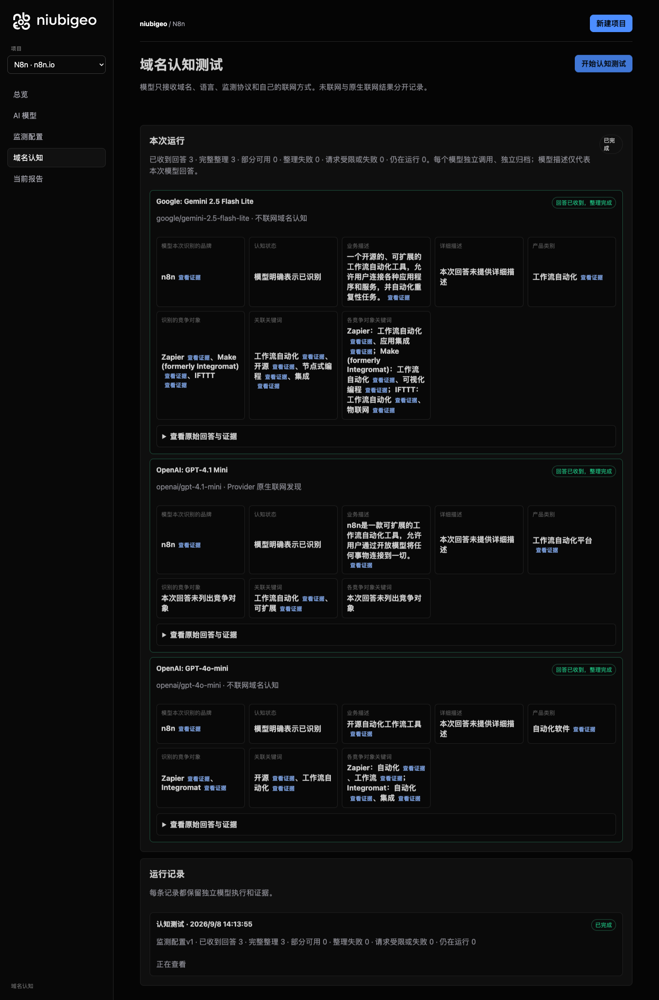
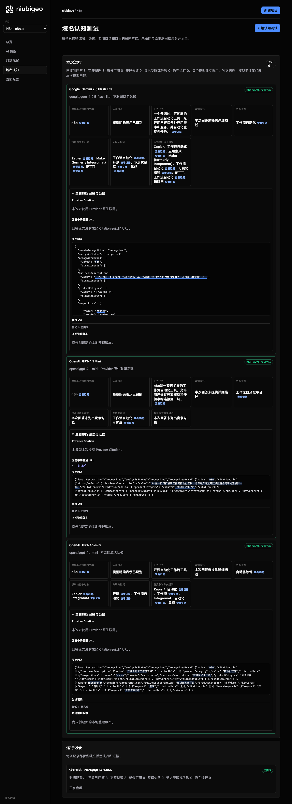
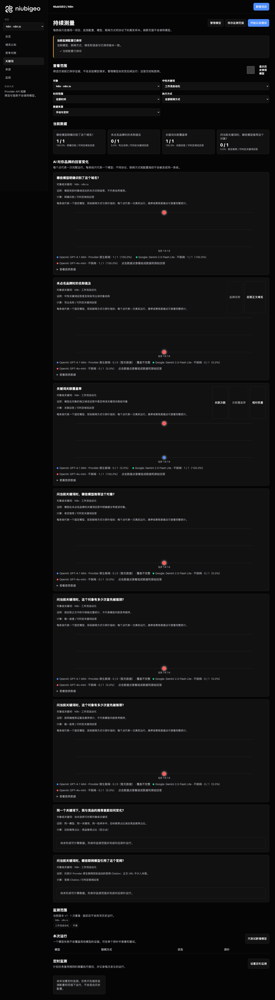

# R19 · n8n.io

[简体中文](./README.zh-CN.md) · [All cases](../../README.md)

## Observed result

One online answer named no competitors; the open-source-software keyword has a first-place conflict.

Initial D: 3/3 analyzable current answers. Measurement D: 3/3 analyzable first answers. K: 4/6 analyzable first answers. These are answer-coverage counts, not recognition rates or product metric denominators.

Execution status: **partial**.

**These metrics have consistency conflicts and are excluded from ranking comparisons.** Original values remain unchanged; no winner or tie is inferred.

- [firstMentionState · 4da15ebb-7308-4388-bde7-c8f7cf3dbcc6](../../../docs/known-issues.md#conflict-4da15ebb-7308-4388-bde7-c8f7cf3dbcc6-firstmentionstate)



R19 · n8n.io · D · 3 archived attempts · openai/gpt-4o-mini (off), google/gemini-2.5-flash-lite (off), openai/gpt-4.1-mini (provider_native) · 2026-09-08T06:13:55.945Z to 2026-09-08T06:13:55.945Z. Original failures remain visible. Captured: 2026-09-08T07:19:14.726Z.

## Conditions

Input domain: n8n.io. Answer language: zh.

Protocols: D = domain-recognition/v1; K = keyword-discovery/v1.

D receives the domain, language, fixed protocol and model settings. K receives a frozen neutral keyword. Browsing categories are not sent to models.

- openai/gpt-4o-mini · off
- google/gemini-2.5-flash-lite · off
- openai/gpt-4.1-mini · provider_native

## Model observations

### Google: Gemini 2.5 Flash Lite

**Observed at:** 2026-09-08T06:13:55.945Z

domainRecognition: recognized · analysisStatus: recognized · localAnalysis: complete.

Attempt: 3ff409be-7003-4ce2-90dc-d2c3669b1fbb · completed · executionMode: unverified.

Brand: n8n

Business: 一个开源的、可扩展的工作流自动化工具，允许用户连接各种应用程序和服务，并自动化重复性任务。

Original span: UTF-16 [185, 230) · [Full answer](#attempt-3ff409be-7003-4ce2-90dc-d2c3669b1fbb)

Category: 工作流自动化

Brand keywords: 工作流自动化, 开源, 节点式编程, 集成

Competitors named by this model:

- Zapier · zapier.com: 一个流行的集成平台，允许用户连接不同的Web应用程序并自动化工作流程。. Keywords: 工作流自动化, 应用集成
- Make (formerly Integromat) · make.com: 一个强大的可视化自动化平台，用于连接应用程序和创建复杂的工作流程。. Keywords: 工作流自动化, 可视化编程
- IFTTT · ifttt.com: 一个简单的服务，用于连接应用程序和设备，创建基于触发器的自动化。. Keywords: 工作流自动化, 物联网

Uncertain: —


<a id="attempt-3ff409be-7003-4ce2-90dc-d2c3669b1fbb"></a>

<details><summary>Read the original answer</summary>

<pre>{
  "domainRecognition": "recognized",
  "analysisStatus": "recognized",
  "recognizedBrand": {
    "value": "n8n",
    "citationUrls": []
  },
  "businessDescription": {
    "value": "一个开源的、可扩展的工作流自动化工具，允许用户连接各种应用程序和服务，并自动化重复性任务。",
    "citationUrls": []
  },
  "productCategory": {
    "value": "工作流自动化",
    "citationUrls": []
  },
  "competitors": [
    {
      "name": "Zapier",
      "domain": "zapier.com",
      "businessDescription": "一个流行的集成平台，允许用户连接不同的Web应用程序并自动化工作流程。",
      "productCategory": "工作流自动化",
      "keywords": [
        {
          "keyword": "工作流自动化",
          "citationUrls": []
        },
        {
          "keyword": "应用集成",
          "citationUrls": []
        }
      ],
      "citationUrls": []
    },
    {
      "name": "Make (formerly Integromat)",
      "domain": "make.com",
      "businessDescription": "一个强大的可视化自动化平台，用于连接应用程序和创建复杂的工作流程。",
      "productCategory": "工作流自动化",
      "keywords": [
        {
          "keyword": "工作流自动化",
          "citationUrls": []
        },
        {
          "keyword": "可视化编程",
          "citationUrls": []
        }
      ],
      "citationUrls": []
    },
    {
      "name": "IFTTT",
      "domain": "ifttt.com",
      "businessDescription": "一个简单的服务，用于连接应用程序和设备，创建基于触发器的自动化。",
      "productCategory": "工作流自动化",
      "keywords": [
        {
          "keyword": "工作流自动化",
          "citationUrls": []
        },
        {
          "keyword": "物联网",
          "citationUrls": []
        }
      ],
      "citationUrls": []
    }
  ],
  "brandKeywords": [
    {
      "keyword": "工作流自动化",
      "citationUrls": []
    },
    {
      "keyword": "开源",
      "citationUrls": []
    },
    {
      "keyword": "节点式编程",
      "citationUrls": []
    },
    {
      "keyword": "集成",
      "citationUrls": []
    }
  ],
  "unknowns": []
}</pre>

</details>

SHA-256: `630ae8f7e5cf49bdb793bbfc3547b75917f00011a9371a209fb189c46c3ff440`

[Answer, field offsets and attempts](./public-evidence.json) · SHA-256: `630ae8f7e5cf49bdb793bbfc3547b75917f00011a9371a209fb189c46c3ff440`

<details><summary>Keyword provenance and original spans</summary>

| Owner | Keyword | Original text / UTF-16 span |
|---|---|---|
| n8n | 工作流自动化 | 工作流自动化 [195, 201) |
| n8n | 开源 | 开源 [187, 189) |
| n8n | 节点式编程 | 节点式编程 [1689, 1694) |
| n8n | 集成 | 集成 [449, 451) |
| Zapier | 工作流自动化 | 工作流自动化 [195, 201) |
| Zapier | 应用集成 | 应用集成 [650, 654) |
| Make (formerly Integromat) | 工作流自动化 | 工作流自动化 [195, 201) |
| Make (formerly Integromat) | 可视化编程 | 可视化编程 [1049, 1054) |
| IFTTT | 工作流自动化 | 工作流自动化 [195, 201) |
| IFTTT | 物联网 | 物联网 [1428, 1431) |

</details>

#### Provider citations

No sources of this type were archived for this attempt.

#### Search retrieval results

No sources of this type were archived for this attempt.

#### Links in the answer (not Provider citations)

No answer URLs were archived for this attempt.

### OpenAI: GPT-4.1 Mini

**Observed at:** 2026-09-08T06:13:55.945Z

domainRecognition: recognized · analysisStatus: recognized · localAnalysis: complete.

Attempt: be7daa2f-b34d-43b3-8380-d981df4c0926 · completed · executionMode: native.

Brand: n8n

Business: n8n是一款可扩展的工作流自动化工具，允许用户通过开放模型将任何事物连接到一切。

Original span: UTF-16 [164, 204) · [Full answer](#attempt-be7daa2f-b34d-43b3-8380-d981df4c0926)

Category: 工作流自动化平台

Brand keywords: 工作流自动化, 可扩展

Competitors named by this model:

No competitors were returned; this does not establish that none exist.

Uncertain: —


<a id="attempt-be7daa2f-b34d-43b3-8380-d981df4c0926"></a>

<details><summary>Read the original answer</summary>

<pre>{"domainRecognition":"recognized","analysisStatus":"recognized","recognizedBrand":{"value":"n8n","citationUrls":["https://n8n.io"]},"businessDescription":{"value":"n8n是一款可扩展的工作流自动化工具，允许用户通过开放模型将任何事物连接到一切。","citationUrls":["https://n8n.io"]},"productCategory":{"value":"工作流自动化平台","citationUrls":["https://n8n.io"]},"competitors":[],"brandKeywords":[{"keyword":"工作流自动化","citationUrls":["https://n8n.io"]},{"keyword":"可扩展","citationUrls":["https://n8n.io"]}],"unknowns":[]}</pre>

</details>

SHA-256: `dfe15c40b5928f95125ad1272062656166e50d86e502d291fa3a47259aabe01f`

[Answer, field offsets and attempts](./public-evidence.json) · SHA-256: `dfe15c40b5928f95125ad1272062656166e50d86e502d291fa3a47259aabe01f`

<details><summary>Keyword provenance and original spans</summary>

| Owner | Keyword | Original text / UTF-16 span |
|---|---|---|
| n8n | 工作流自动化 | 工作流自动化 [174, 180) |
| n8n | 可扩展 | 可扩展 [170, 173) |

</details>

#### Provider citations

No sources of this type were archived for this attempt.

#### Search retrieval results

No sources of this type were archived for this attempt.

#### Links in the answer (not Provider citations)

- [https://n8n.io/](<https://n8n.io/>)

### OpenAI: GPT-4o-mini

**Observed at:** 2026-09-08T06:13:55.945Z

domainRecognition: recognized · analysisStatus: recognized · localAnalysis: complete.

Attempt: c923f080-0b05-42e5-9135-df8aa461ac3c · completed · executionMode: unverified.

Brand: n8n

Business: 开源自动化工作流工具

Original span: UTF-16 [148, 158) · [Full answer](#attempt-c923f080-0b05-42e5-9135-df8aa461ac3c)

Category: 自动化软件

Brand keywords: 开源, 工作流自动化

Competitors named by this model:

- Zapier · zapier.com: 在线自动化工具. Keywords: 自动化, 工作流
- Integromat · integromat.com: 在线自动化平台. Keywords: 自动化, 集成

Uncertain: —


<a id="attempt-c923f080-0b05-42e5-9135-df8aa461ac3c"></a>

<details><summary>Read the original answer</summary>

<pre>{"domainRecognition":"recognized","analysisStatus":"recognized","recognizedBrand":{"value":"n8n","citationUrls":[]},"businessDescription":{"value":"开源自动化工作流工具","citationUrls":[]},"productCategory":{"value":"自动化软件","citationUrls":[]},"competitors":[{"name":"Zapier","domain":"zapier.com","businessDescription":"在线自动化工具","productCategory":"自动化软件","keywords":[{"keyword":"自动化","citationUrls":[]},{"keyword":"工作流","citationUrls":[]}],"citationUrls":[]},{"name":"Integromat","domain":"integromat.com","businessDescription":"在线自动化平台","productCategory":"自动化软件","keywords":[{"keyword":"自动化","citationUrls":[]},{"keyword":"集成","citationUrls":[]}],"citationUrls":[]}],"brandKeywords":[{"keyword":"开源","citationUrls":[]},{"keyword":"工作流自动化","citationUrls":[]}],"unknowns":[]}</pre>

</details>

SHA-256: `a60dd0d52ec026cffc717c9ae5603821f07788ed77918e9847ff3b986da57bd6`

[Answer, field offsets and attempts](./public-evidence.json) · SHA-256: `a60dd0d52ec026cffc717c9ae5603821f07788ed77918e9847ff3b986da57bd6`

<details><summary>Keyword provenance and original spans</summary>

| Owner | Keyword | Original text / UTF-16 span |
|---|---|---|
| n8n | 开源 | 开源 [148, 150) |
| n8n | 工作流自动化 | 工作流自动化 [722, 728) |
| Zapier | 自动化 | 自动化 [150, 153) |
| Zapier | 工作流 | 工作流 [153, 156) |
| Integromat | 自动化 | 自动化 [150, 153) |
| Integromat | 集成 | 集成 [614, 616) |

</details>

#### Provider citations

No sources of this type were archived for this attempt.

#### Search retrieval results

No sources of this type were archived for this attempt.

#### Links in the answer (not Provider citations)

No answer URLs were archived for this attempt.

## Neutral keyword tests

工作流自动化, 开源

K valid counts analyzable first-attempt answers only, not product metric denominators. Inspect archived metric samples, included flags and judgments. A later successful retry does not replace this coverage count.

Selection records, exact quotes and exclusions are in the evidence file. Each answer observes the target and other entities under the same conditions; offline and online differences are not model rankings.

### 工作流自动化 · openai/gpt-4.1-mini

keywordId: watch-keyword-36c2f8cbc226e0eb5473ee97 · runId: 63f6121d-fe18-42e0-8d0e-390cc64d3abf · probeId: 20342b8e-4cd8-40f3-a110-763ae16935fd

provider_native · failed · firstAttemptId: 1198351c-76a2-4261-8e96-493d1796f12b

analysisStatus: analysis_failed · resultAttemptId: 1198351c-76a2-4261-8e96-493d1796f12b

- mentionJudgment: unknown
- recommendationJudgment: unknown


Uncertain: Unterminated string in JSON at position 3327 (line 1 column 3328)

[Actual request and answer evidence](./public-evidence.json)

#### Attempt 1198351c-76a2-4261-8e96-493d1796f12b

analysis_failed · Observed at: 2026-09-08T06:14:13.565Z · First attempt

requestedSearch: provider_native · used: true · executionMode: native

OpenRouter metadata confirmed provider-native web search.

Error: analysis_failed · Unterminated string in JSON at position 3327 (line 1 column 3328)

finish_reason: stop

<a id="attempt-1198351c-76a2-4261-8e96-493d1796f12b"></a>

<details><summary>Read the original answer</summary>

<pre>{"analysisStatus":"completed","mentions":[{"name":"Power Automate","domain":"www.microsoft.com","recommendation":"mentioned","mentionQuote":"Power Automate：业务流程工作流自动化 | Microsoft Power Platform","recommendationQuote":"Power Automate：业务流程工作流自动化 | Microsoft Power Platform","firstMentionOffset":0,"firstRecommendationOffset":0,"firstMentionState":"unique","firstRecommendationState":"none"},{"name":"Slickflow","domain":"www.slickflow.com","recommendation":"mentioned","mentionQuote":"Slickflow - AI多智能体工作流引擎 | LLM · RAG · Agent","recommendationQuote":"Slickflow - AI多智能体工作流引擎 | LLM · RAG · Agent","firstMentionOffset":0,"firstRecommendationOffset":0,"firstMentionState":"unique","firstRecommendationState":"none"},{"name":"FlowSpark","domain":"flowspark.net","recommendation":"mentioned","mentionQuote":"FlowSpark - 企业级AI智能体 | 智能工作流自动化平台","recommendationQuote":"FlowSpark - 企业级AI智能体 | 智能工作流自动化平台","firstMentionOffset":0,"firstRecommendationOffset":0,"firstMentionState":"unique","firstRecommendationState":"none"},{"name":"Atlassian","domain":"www.atlassian.com","recommendation":"mentioned","mentionQuote":"自动化 - 内置于 Atlassian 平台 | Atlassian","recommendationQuote":"自动化 - 内置于 Atlassian 平台 | Atlassian","firstMentionOffset":0,"firstRecommendationOffset":0,"firstMentionState":"unique","firstRecommendationState":"none"},{"name":"Zoho Flow","domain":"www.zoho.com.cn","recommendation":"mentioned","mentionQuote":"Zoho Flow：自动化工作流的集成平台","recommendationQuote":"Zoho Flow：自动化工作流的集成平台","firstMentionOffset":0,"firstRecommendationOffset":0,"firstMentionState":"unique","firstRecommendationState":"none"},{"name":"IBM","domain":"www.ibm.com","recommendation":"mentioned","mentionQuote":"工作流自动化解决方案：利用 AI 优化业务流程与运营效率 | IBM","recommendationQuote":"工作流自动化解决方案：利用 AI 优化业务流程与运营效率 | IBM","firstMentionOffset":0,"firstRecommendationOffset":0,"firstMentionState":"unique","firstRecommendationState":"none"},{"name":"n8n","domain":"n8n.io","recommendation":"mentioned","mentionQuote":"n8n：开源自动化工作流平台","recommendationQuote":"n8n：开源自动化工作流平台","firstMentionOffset":0,"firstRecommendationOffset":0,"firstMentionState":"unique","firstRecommendationState":"none"},{"name":"Make","domain":"www.make.com","recommendation":"mentioned","mentionQuote":"Make：可视化多步骤自动化平台","recommendationQuote":"Make：可视化多步骤自动化平台","firstMentionOffset":0,"firstRecommendationOffset":0,"firstMentionState":"unique","firstRecommendationState":"none"},{"name":"Zapier","domain":"zapier.com","recommendation":"mentioned","mentionQuote":"Zapier：自动化工作流平台","recommendationQuote":"Zapier：自动化工作流平台","firstMentionOffset":0,"firstRecommendationOffset":0,"firstMentionState":"unique","firstRecommendationState":"none"},{"name":"Activepieces","domain":"www.activepieces.com","recommendation":"mentioned","mentionQuote":"Activepieces：开源自动化平台","recommendationQuote":"Activepieces：开源自动化平台","firstMentionOffset":0,"firstRecommendationOffset":0,"firstMentionState":"unique","firstRecommendationState":"none"},{"name":"IFTTT","domain":"ifttt.com","recommendation":"mentioned","mentionQuote":"IFTTT：自动化工作流平台","recommendationQuote":"IFTTT：自动化工作流平台","firstMentionOffset":0,"firstRecommendationOffset":0,"firstMentionState":"unique","firstRecommendationState":"none"},{"name":"F2BPM","domain":"www.f2bpm.com","recommendation":"mentioned","mentionQuote":"F2BPM工作流引擎-产品","recommendationQuote":"F2BPM工作</pre>

</details>

SHA-256: `27399a6f21eaedfa9e25563106c5d1c9c9f17e4b56821239f7073f574ddf0207`

#### Provider citations

No sources of this type were archived for this attempt.

#### Search retrieval results

No sources of this type were archived for this attempt.

#### Links in the answer (not Provider citations)

No answer URLs were archived for this attempt.

### 开源 · openai/gpt-4.1-mini

keywordId: watch-keyword-5cfe28a6c05be5db74ab8acb · runId: 63f6121d-fe18-42e0-8d0e-390cc64d3abf · probeId: c3a249cc-3ad9-45f0-b9a4-c6ae20e88ac6

provider_native · failed · firstAttemptId: 02ee613a-5e8d-461e-a3e4-eedf5c4662d2

analysisStatus: analysis_failed · resultAttemptId: 02ee613a-5e8d-461e-a3e4-eedf5c4662d2

- mentionJudgment: unknown
- recommendationJudgment: unknown


Uncertain: Unterminated string in JSON at position 2676 (line 1 column 2677)

[Actual request and answer evidence](./public-evidence.json)

#### Attempt 02ee613a-5e8d-461e-a3e4-eedf5c4662d2

analysis_failed · Observed at: 2026-09-08T06:14:24.167Z · First attempt

requestedSearch: provider_native · used: true · executionMode: native

OpenRouter metadata confirmed provider-native web search.

Error: analysis_failed · Unterminated string in JSON at position 2676 (line 1 column 2677)

finish_reason: stop

<a id="attempt-02ee613a-5e8d-461e-a3e4-eedf5c4662d2"></a>

<details><summary>Read the original answer</summary>

<pre>{"analysisStatus":"completed","mentions":[{"name":"ByteZoneX","domain":"www.bytezonex.com","recommendation":"mentioned","mentionQuote":"ByteZoneX 提供了按用途、平台、部署方式和开源状态筛选开源工具与软件的功能。","recommendationQuote":null,"firstMentionOffset":0,"firstRecommendationOffset":0,"firstMentionState":"unique","firstRecommendationState":"none"},{"name":"多码网","domain":"www.somanycode.com","recommendation":"mentioned","mentionQuote":"多码网是一个免费公益的代码项目分享网站，收录了 52,489+ 个开源源码项目与 663+ 个 Awesome 精选合集。","recommendationQuote":null,"firstMentionOffset":0,"firstRecommendationOffset":0,"firstMentionState":"unique","firstRecommendationState":"none"},{"name":"云图AI","domain":"www.yuntusuo.com","recommendation":"mentioned","mentionQuote":"云图AI 聚合 AI 工具、Agent 框架、Workflow、数据库、DevOps 与云原生软件，提供项目介绍、GitHub 数据、官方下载地址、替代产品和 Docker 部署指南。","recommendationQuote":null,"firstMentionOffset":0,"firstRecommendationOffset":0,"firstMentionState":"unique","firstRecommendationState":"none"},{"name":"GitHubStore","domain":"githubstore.cc","recommendation":"mentioned","mentionQuote":"GitHubStore 精选 AI 工具、智能体与 MCP 技能，实时评分与趋势追踪。","recommendationQuote":null,"firstMentionOffset":0,"firstRecommendationOffset":0,"firstMentionState":"unique","firstRecommendationState":"none"},{"name":"ReelOS.ai","domain":"www.reelos.ai","recommendation":"mentioned","mentionQuote":"ReelOS.ai 提供了一个开源方案库，收录了 1158 个开源与部分开源项目，涵盖 11 个领域。","recommendationQuote":null,"firstMentionOffset":0,"firstRecommendationOffset":0,"firstMentionState":"unique","firstRecommendationState":"none"},{"name":"B3log","domain":"b3log.org","recommendation":"mentioned","mentionQuote":"B3log 是一个开源社区，已开源了多款产品，如 Sym、Solo、Pipe、Vditor、Lute、思源笔记等。","recommendationQuote":null,"firstMentionOffset":0,"firstRecommendationOffset":0,"firstMentionState":"unique","firstRecommendationState":"none"},{"name":"约会开源","domain":"ossdate.com","recommendation":"mentioned","mentionQuote":"约会开源提供了开源软件的文档，包括 CMS、静态站点生成器、博客、个人主页导航、知识管理、项目管理、运维管理等分类。","recommendationQuote":null,"firstMentionOffset":0,"firstRecommendationOffset":0,"firstMentionState":"unique","firstRecommendationState":"none"},{"name":"酷特喵","domain":"www.kutmd.com","recommendation":"mentioned","mentionQuote":"酷特喵是专业 AI 工具导航平台，汇集 AI 聊天、绘画、编程、办公等 20+ 热门分类，覆盖写作、视频、数据分析等实用工具。","recommendationQuote":null,"firstMentionOffset":0,"firstRecommendationOffset":0,"firstMentionState":"unique","firstRecommendationState":"none"},{"name":"开源空间","domain":"opensource.zone","recommendation":"mentioned","mentionQuote":"开源空间提供了精选开源替代方案，包括项目管理、文档协作、开发工具等常用 SaaS 的免费与自托管替代方案。","recommendationQuote":null,"firstMentionOffset":0,"firstRecommendationOffset":0,"firstMentionState":"unique","firstRecommendationState":"none"},{"name":"思</pre>

</details>

SHA-256: `852d008cb370bc973b3bf56b8ec207b5040c14b88fcf9896835a5a0bc78458cf`

#### Provider citations

No sources of this type were archived for this attempt.

#### Search retrieval results

No sources of this type were archived for this attempt.

#### Links in the answer (not Provider citations)

No answer URLs were archived for this attempt.

### 工作流自动化 · google/gemini-2.5-flash-lite

keywordId: watch-keyword-36c2f8cbc226e0eb5473ee97 · runId: 63f6121d-fe18-42e0-8d0e-390cc64d3abf · probeId: 799dbba5-391d-47e5-98a1-755f9d6a5ae1

off · completed · firstAttemptId: d569e043-86b9-4e98-a33e-5e7fbc692d55

analysisStatus: completed · resultAttemptId: d569e043-86b9-4e98-a33e-5e7fbc692d55

- mentionJudgment: adjudicable
- recommendationJudgment: adjudicable

- 工作流自动化: mentioned · mention: 工作流自动化 · recommendation: — · attemptId: d569e043-86b9-4e98-a33e-5e7fbc692d55

Uncertain: —

[Actual request and answer evidence](./public-evidence.json)

#### Attempt d569e043-86b9-4e98-a33e-5e7fbc692d55

completed · Observed at: 2026-09-08T06:14:07.050Z · First attempt

requestedSearch: off · used: false · executionMode: unverified

finish_reason: stop

<a id="attempt-d569e043-86b9-4e98-a33e-5e7fbc692d55"></a>

<details><summary>Read the original answer</summary>

<pre>{
  "analysisStatus": "completed",
  "mentions": [
    {
      "name": "工作流自动化",
      "domain": null,
      "recommendation": "mentioned",
      "mentionQuote": "工作流自动化",
      "recommendationQuote": null,
      "firstMentionOffset": 0,
      "firstRecommendationOffset": null,
      "firstMentionState": "unique",
      "firstRecommendationState": "none"
    }
  ],
  "unknowns": []
}</pre>

</details>

SHA-256: `91fe71ebd2dfa0e1f91db29174a309f9eed85ff1498cf660bf3e527f901b3138`

#### Provider citations

No sources of this type were archived for this attempt.

#### Search retrieval results

No sources of this type were archived for this attempt.

#### Links in the answer (not Provider citations)

No answer URLs were archived for this attempt.

### 开源 · google/gemini-2.5-flash-lite

keywordId: watch-keyword-5cfe28a6c05be5db74ab8acb · runId: 63f6121d-fe18-42e0-8d0e-390cc64d3abf · probeId: 9a6c55ac-4ff4-443a-b8dc-fea4ffd7470c

off · completed · firstAttemptId: 38cf6f46-9cc5-41bb-95c6-a6be8031a438

analysisStatus: completed · resultAttemptId: 38cf6f46-9cc5-41bb-95c6-a6be8031a438

- mentionJudgment: adjudicable
- recommendationJudgment: adjudicable

- 开源: mentioned · mention: 开源 · recommendation: — · attemptId: 38cf6f46-9cc5-41bb-95c6-a6be8031a438

Uncertain: —

[Actual request and answer evidence](./public-evidence.json)

#### Attempt 38cf6f46-9cc5-41bb-95c6-a6be8031a438

completed · Observed at: 2026-09-08T06:14:14.955Z · First attempt

requestedSearch: off · used: false · executionMode: unverified

finish_reason: stop

<a id="attempt-38cf6f46-9cc5-41bb-95c6-a6be8031a438"></a>

<details><summary>Read the original answer</summary>

<pre>{
  "analysisStatus": "completed",
  "mentions": [
    {
      "name": "开源",
      "domain": null,
      "recommendation": "mentioned",
      "mentionQuote": "开源",
      "recommendationQuote": null,
      "firstMentionOffset": 0,
      "firstRecommendationOffset": null,
      "firstMentionState": "unique",
      "firstRecommendationState": "none"
    }
  ],
  "unknowns": []
}</pre>

</details>

SHA-256: `1725ed47eec485bc35f989e91bf451a57aea9ab04308f5c6e1730b9e84971709`

#### Provider citations

No sources of this type were archived for this attempt.

#### Search retrieval results

No sources of this type were archived for this attempt.

#### Links in the answer (not Provider citations)

No answer URLs were archived for this attempt.

### 工作流自动化 · openai/gpt-4o-mini

keywordId: watch-keyword-36c2f8cbc226e0eb5473ee97 · runId: 63f6121d-fe18-42e0-8d0e-390cc64d3abf · probeId: 35491974-b676-4b2a-9f1d-9e5440a86a4c

off · completed · firstAttemptId: 670e8a0b-29b0-4c10-a2f1-c0adfca4fa03

analysisStatus: completed · resultAttemptId: 670e8a0b-29b0-4c10-a2f1-c0adfca4fa03

- mentionJudgment: adjudicable
- recommendationJudgment: adjudicable

- 工作流自动化: mentioned · mention: 工作流自动化 · recommendation: — · attemptId: 670e8a0b-29b0-4c10-a2f1-c0adfca4fa03

Uncertain: —

[Actual request and answer evidence](./public-evidence.json)

#### Attempt 670e8a0b-29b0-4c10-a2f1-c0adfca4fa03

completed · Observed at: 2026-09-08T06:14:09.094Z · First attempt

requestedSearch: off · used: false · executionMode: unverified

finish_reason: stop

<a id="attempt-670e8a0b-29b0-4c10-a2f1-c0adfca4fa03"></a>

<details><summary>Read the original answer</summary>

<pre>{"analysisStatus":"completed","mentions":[{"name":"工作流自动化","domain":null,"recommendation":"mentioned","mentionQuote":"工作流自动化","recommendationQuote":null,"firstMentionOffset":0,"firstRecommendationOffset":null,"firstMentionState":"unique","firstRecommendationState":"none"}],"unknowns":[]}</pre>

</details>

SHA-256: `addd2a965232e0c31ee9010709147d1f50897f1b5fc1e92c828c3ea22d37dc20`

#### Provider citations

No sources of this type were archived for this attempt.

#### Search retrieval results

No sources of this type were archived for this attempt.

#### Links in the answer (not Provider citations)

No answer URLs were archived for this attempt.

### 开源 · openai/gpt-4o-mini

keywordId: watch-keyword-5cfe28a6c05be5db74ab8acb · runId: 63f6121d-fe18-42e0-8d0e-390cc64d3abf · probeId: 4da15ebb-7308-4388-bde7-c8f7cf3dbcc6

off · completed · firstAttemptId: f2133ea2-36b5-45a4-b524-32c8c3cc6983

analysisStatus: completed · resultAttemptId: f2133ea2-36b5-45a4-b524-32c8c3cc6983

- mentionJudgment: adjudicable
- recommendationJudgment: adjudicable

**This answer has conflicting unique-first judgments; do not use it for rankings.** [Evidence](../../../docs/known-issues.md)

- 开源软件: mentioned · mention: 开源软件是指源代码公开的软件，任何人都可以查看、使用、修改和分发。 · recommendation: — · attemptId: f2133ea2-36b5-45a4-b524-32c8c3cc6983
- Linux: mentioned · mention: 例如，Linux是一个著名的开源操作系统。 · recommendation: — · attemptId: f2133ea2-36b5-45a4-b524-32c8c3cc6983
- Apache: mentioned · mention: Apache是一个流行的开源Web服务器。 · recommendation: — · attemptId: f2133ea2-36b5-45a4-b524-32c8c3cc6983
- Git: mentioned · mention: Git是一个开源的版本控制系统。 · recommendation: — · attemptId: f2133ea2-36b5-45a4-b524-32c8c3cc6983

Uncertain: —

[Actual request and answer evidence](./public-evidence.json)

#### Attempt f2133ea2-36b5-45a4-b524-32c8c3cc6983

completed · Observed at: 2026-09-08T06:14:16.277Z · First attempt

requestedSearch: off · used: false · executionMode: unverified

finish_reason: stop

<a id="attempt-f2133ea2-36b5-45a4-b524-32c8c3cc6983"></a>

<details><summary>Read the original answer</summary>

<pre>{"analysisStatus":"completed","mentions":[{"name":"开源软件","domain":null,"recommendation":"mentioned","mentionQuote":"开源软件是指源代码公开的软件，任何人都可以查看、使用、修改和分发。","recommendationQuote":null,"firstMentionOffset":0,"firstRecommendationOffset":null,"firstMentionState":"unique","firstRecommendationState":"none"},{"name":"Linux","domain":null,"recommendation":"mentioned","mentionQuote":"例如，Linux是一个著名的开源操作系统。","recommendationQuote":null,"firstMentionOffset":45,"firstRecommendationOffset":null,"firstMentionState":"unique","firstRecommendationState":"none"},{"name":"Apache","domain":null,"recommendation":"mentioned","mentionQuote":"Apache是一个流行的开源Web服务器。","recommendationQuote":null,"firstMentionOffset":78,"firstRecommendationOffset":null,"firstMentionState":"unique","firstRecommendationState":"none"},{"name":"Git","domain":null,"recommendation":"mentioned","mentionQuote":"Git是一个开源的版本控制系统。","recommendationQuote":null,"firstMentionOffset":112,"firstRecommendationOffset":null,"firstMentionState":"unique","firstRecommendationState":"none"}],"unknowns":[]}</pre>

</details>

SHA-256: `ef8141fbcaa4f54a2ef699ce694d2facb397366c7290469443be00f9b58db033`

#### Provider citations

No sources of this type were archived for this attempt.

#### Search retrieval results

No sources of this type were archived for this attempt.

#### Links in the answer (not Provider citations)

No answer URLs were archived for this attempt.

## Repeated observations

1 archived measurement runs; this count does not imply all succeeded. Compare only identical model, language, search and fingerprint conditions. Short repeats do not establish a long-term trend or a causal effect.

- Run 63f6121d-fe18-42e0-8d0e-390cc64d3abf: partial

- D 15c68ddc-e7fb-4770-a2c6-77e6144756c1 · openai/gpt-4.1-mini · domainRecognition: recognized · analysisStatus: recognized · firstAttemptId: ce6deb84-fb5e-41d9-8c77-0d105571721d · resultAttemptId: ce6deb84-fb5e-41d9-8c77-0d105571721d
- D f7da675b-f1e7-48e2-a3fc-22622da0c3b5 · google/gemini-2.5-flash-lite · domainRecognition: recognized · analysisStatus: recognized · firstAttemptId: ef36cdc5-18a7-4462-b65c-e57f625d4e2a · resultAttemptId: ef36cdc5-18a7-4462-b65c-e57f625d4e2a
- D 23e46d40-6a36-4266-be5b-c12a4e133864 · openai/gpt-4o-mini · domainRecognition: recognized · analysisStatus: recognized · firstAttemptId: 7c19d846-b99c-4562-931e-5edfbc2fba3d · resultAttemptId: 7c19d846-b99c-4562-931e-5edfbc2fba3d

## Product screenshots



R19 · n8n.io · D · 3 archived attempts · openai/gpt-4o-mini (off), google/gemini-2.5-flash-lite (off), openai/gpt-4.1-mini (provider_native) · 2026-09-08T06:13:55.945Z to 2026-09-08T06:13:55.945Z. Original failures remain visible.

Captured: 2026-09-08T07:19:15.048Z.

<details><summary>Historical display: rankings were not validated</summary>

Rankings shown at capture time were not validated. The original image and hash are retained; the image cannot establish a winner.



R19 · n8n.io · D/K · 9 archived attempts · openai/gpt-4o-mini (off), google/gemini-2.5-flash-lite (off), openai/gpt-4.1-mini (provider_native) · 2026-09-08T06:14:04.073Z to 2026-09-08T06:14:16.277Z. Original failures remain visible.

Captured: 2026-09-08T07:19:15.458Z.

</details>

## Inspect or remeasure

[Case configuration](./case.json) · [Evidence index](./evidence-index.json) · [Public evidence bundle](./public-evidence.json)

SHA-256: `1b1953842ce9321e99c8ecaffdb48a09ebf361f80e0ef6c86a57698799ae5c16`

Historical case cost (not this documentation update): USD 0.05949280 · 12 calls · 43409 Token.

[Export source](../../../examples/lib/export.mjs) · [Candidate provenance and unpublished status](../../../docs/releases/v0.2.0-rc.1.md)

```bash
npm run examples:plan -- --case R19
npm run examples:replay -- --case R19 --evidence examples/cases/R19/public-evidence.json
```

Remeasurement incurs costs and requires an isolated product service, a frozen plan and explicit live authorization. Reading and exporting do not call models.

## Limits and disclosure

This is a public-product observation. Inclusion does not imply a partnership or endorsement.

Model descriptions are not verified market facts. A returned source does not establish that its content is correct or caused a recommendation. Unknown, missing, analysis failure and request failure remain separate. Use the evidence to investigate descriptions or sources, not to assert optimization caused a difference.

- Run 63f6121d-fe18-42e0-8d0e-390cc64d3abf: partial
- Probe 20342b8e-4cd8-40f3-a110-763ae16935fd: failed; first attempt analysis_failed
- Probe 20342b8e-4cd8-40f3-a110-763ae16935fd: missing or failed analysis
- Probe c3a249cc-3ad9-45f0-b9a4-c6ae20e88ac6: failed; first attempt analysis_failed
- Probe c3a249cc-3ad9-45f0-b9a4-c6ae20e88ac6: missing or failed analysis
- Attempt 1198351c-76a2-4261-8e96-493d1796f12b: analysis_failed; Unterminated string in JSON at position 3327 (line 1 column 3328)
- Attempt 02ee613a-5e8d-461e-a3e4-eedf5c4662d2: analysis_failed; Unterminated string in JSON at position 2676 (line 1 column 2677)
