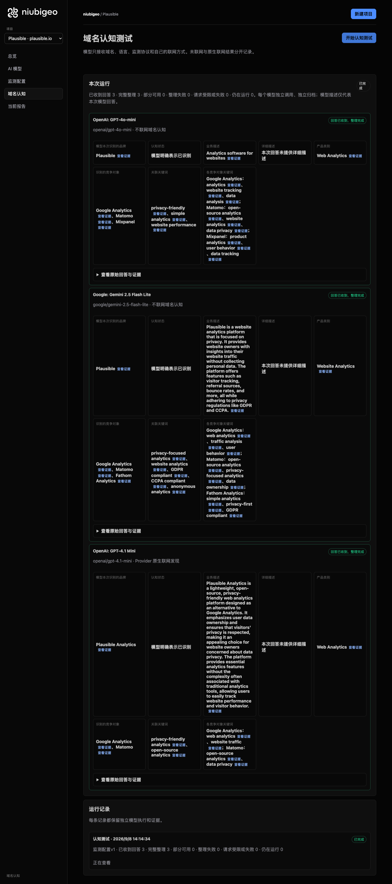
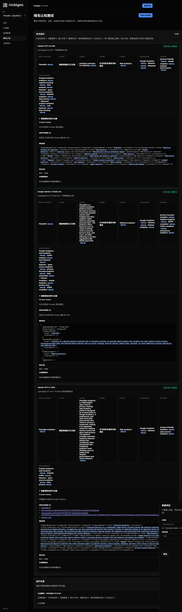

# R20 · plausible.io

[简体中文](./README.zh-CN.md) · [All cases](../../README.md)

## Observed result

Models emphasized privacy-focused analytics and all named Google Analytics and Matomo.

Initial D: 3/3 analyzable current answers. Measurement D: 3/3 analyzable first answers. K: 0/0 analyzable first answers. These are answer-coverage counts, not recognition rates or product metric denominators.

Execution status: **completed**.



R20 · plausible.io · D · 3 archived attempts · openai/gpt-4o-mini (off), google/gemini-2.5-flash-lite (off), openai/gpt-4.1-mini (provider_native) · 2026-09-08T06:14:34.368Z to 2026-09-08T06:14:34.368Z. Original failures remain visible. Captured: 2026-09-08T07:19:15.980Z.

## Conditions

Input domain: plausible.io. Answer language: en.

Protocols: D = domain-recognition/v1; K = keyword-discovery/v1.

D receives the domain, language, fixed protocol and model settings. K receives a frozen neutral keyword. Browsing categories are not sent to models.

- openai/gpt-4o-mini · off
- google/gemini-2.5-flash-lite · off
- openai/gpt-4.1-mini · provider_native

## Model observations

### OpenAI: GPT-4o-mini

**Observed at:** 2026-09-08T06:14:34.368Z

domainRecognition: recognized · analysisStatus: recognized · localAnalysis: complete.

Attempt: 52bbea89-792f-44ad-b9e0-d108786b298b · completed · executionMode: unverified.

Brand: Plausible

Business: Analytics software for websites

Original span: UTF-16 [154, 185) · [Full answer](#attempt-52bbea89-792f-44ad-b9e0-d108786b298b)

Category: Web Analytics

Brand keywords: privacy-friendly, simple analytics, website performance

Competitors named by this model:

- Google Analytics · analytics.google.com: Web analytics service offered by Google. Keywords: analytics, website tracking, data analysis
- Matomo · matomo.org: Open-source web analytics platform. Keywords: open-source analytics, website analytics, data privacy
- Mixpanel · mixpanel.com: Product analytics platform. Keywords: product analytics, user behavior, data tracking

Uncertain: —


<a id="attempt-52bbea89-792f-44ad-b9e0-d108786b298b"></a>

<details><summary>Read the original answer</summary>

<pre>{"domainRecognition":"recognized","analysisStatus":"recognized","recognizedBrand":{"value":"Plausible","citationUrls":[]},"businessDescription":{"value":"Analytics software for websites","citationUrls":[]},"productCategory":{"value":"Web Analytics","citationUrls":[]},"competitors":[{"name":"Google Analytics","domain":"analytics.google.com","businessDescription":"Web analytics service offered by Google","productCategory":"Web Analytics","keywords":[{"keyword":"analytics","citationUrls":[]},{"keyword":"website tracking","citationUrls":[]},{"keyword":"data analysis","citationUrls":[]}],"citationUrls":[]},{"name":"Matomo","domain":"matomo.org","businessDescription":"Open-source web analytics platform","productCategory":"Web Analytics","keywords":[{"keyword":"open-source analytics","citationUrls":[]},{"keyword":"website analytics","citationUrls":[]},{"keyword":"data privacy","citationUrls":[]}],"citationUrls":[]},{"name":"Mixpanel","domain":"mixpanel.com","businessDescription":"Product analytics platform","productCategory":"Web Analytics","keywords":[{"keyword":"product analytics","citationUrls":[]},{"keyword":"user behavior","citationUrls":[]},{"keyword":"data tracking","citationUrls":[]}],"citationUrls":[]}],"brandKeywords":[{"keyword":"privacy-friendly","citationUrls":[]},{"keyword":"simple analytics","citationUrls":[]},{"keyword":"website performance","citationUrls":[]}],"unknowns":[]}</pre>

</details>

SHA-256: `d8be819dd35e2f0be62cec97556ebb48a0069ec32d69b2b87f14cbffdf1379b9`

[Answer, field offsets and attempts](./public-evidence.json) · SHA-256: `d8be819dd35e2f0be62cec97556ebb48a0069ec32d69b2b87f14cbffdf1379b9`

<details><summary>Keyword provenance and original spans</summary>

| Owner | Keyword | Original text / UTF-16 span |
|---|---|---|
| Plausible | privacy-friendly | privacy-friendly [1254, 1270) |
| Plausible | simple analytics | simple analytics [1303, 1319) |
| Plausible | website performance | website performance [1352, 1371) |
| Google Analytics | analytics | analytics [320, 329) |
| Google Analytics | website tracking | website tracking [506, 522) |
| Google Analytics | data analysis | data analysis [555, 568) |
| Matomo | open-source analytics | open-source analytics [765, 786) |
| Matomo | website analytics | website analytics [819, 836) |
| Matomo | data privacy | data privacy [869, 881) |
| Mixpanel | product analytics | product analytics [1074, 1091) |
| Mixpanel | user behavior | user behavior [1124, 1137) |
| Mixpanel | data tracking | data tracking [1170, 1183) |

</details>

#### Provider citations

No sources of this type were archived for this attempt.

#### Search retrieval results

No sources of this type were archived for this attempt.

#### Links in the answer (not Provider citations)

No answer URLs were archived for this attempt.

### Google: Gemini 2.5 Flash Lite

**Observed at:** 2026-09-08T06:14:34.368Z

domainRecognition: recognized · analysisStatus: recognized · localAnalysis: complete.

Attempt: 28dec255-396b-48b2-a969-1e3f8a822fe0 · completed · executionMode: unverified.

Brand: Plausible

Business: Plausible is a website analytics platform that is focused on privacy. It provides website owners with insights into their website traffic without collecting personal data. The platform offers features such as visitor tracking, referral sources, bounce rates, and more, all while adhering to privacy regulations like GDPR and CCPA.

Original span: UTF-16 [191, 521) · [Full answer](#attempt-28dec255-396b-48b2-a969-1e3f8a822fe0)

Category: Website Analytics

Brand keywords: privacy-focused analytics, website analytics, GDPR compliant, CCPA compliant, anonymous analytics

Competitors named by this model:

- Google Analytics · analytics.google.com: Google Analytics is a web analytics service offered by Google that tracks and reports website traffic. It is widely used by businesses to understand user behavior on their websites.. Keywords: web analytics, traffic analysis, user behavior
- Matomo · matomo.org: Matomo (formerly Piwik) is an open-source web analytics platform that gives users full ownership of their data. It offers features similar to Google Analytics but with a strong emphasis on privacy and data control.. Keywords: open-source analytics, privacy-focused analytics, data ownership
- Fathom Analytics · usefathom.com: Fathom Analytics is a simple, privacy-first website analytics tool. It focuses on providing essential website metrics without tracking personal data, making it compliant with privacy regulations.. Keywords: simple analytics, privacy-first, GDPR compliant

Uncertain: —


<a id="attempt-28dec255-396b-48b2-a969-1e3f8a822fe0"></a>

<details><summary>Read the original answer</summary>

<pre>{
  "domainRecognition": "recognized",
  "analysisStatus": "recognized",
  "recognizedBrand": {
    "value": "Plausible",
    "citationUrls": []
  },
  "businessDescription": {
    "value": "Plausible is a website analytics platform that is focused on privacy. It provides website owners with insights into their website traffic without collecting personal data. The platform offers features such as visitor tracking, referral sources, bounce rates, and more, all while adhering to privacy regulations like GDPR and CCPA.",
    "citationUrls": []
  },
  "productCategory": {
    "value": "Website Analytics",
    "citationUrls": []
  },
  "competitors": [
    {
      "name": "Google Analytics",
      "domain": "analytics.google.com",
      "businessDescription": "Google Analytics is a web analytics service offered by Google that tracks and reports website traffic. It is widely used by businesses to understand user behavior on their websites.",
      "productCategory": "Website Analytics",
      "keywords": [
        {
          "keyword": "web analytics",
          "citationUrls": []
        },
        {
          "keyword": "traffic analysis",
          "citationUrls": []
        },
        {
          "keyword": "user behavior",
          "citationUrls": []
        }
      ],
      "citationUrls": []
    },
    {
      "name": "Matomo",
      "domain": "matomo.org",
      "businessDescription": "Matomo (formerly Piwik) is an open-source web analytics platform that gives users full ownership of their data. It offers features similar to Google Analytics but with a strong emphasis on privacy and data control.",
      "productCategory": "Website Analytics",
      "keywords": [
        {
          "keyword": "open-source analytics",
          "citationUrls": []
        },
        {
          "keyword": "privacy-focused analytics",
          "citationUrls": []
        },
        {
          "keyword": "data ownership",
          "citationUrls": []
        }
      ],
      "citationUrls": []
    },
    {
      "name": "Fathom Analytics",
      "domain": "usefathom.com",
      "businessDescription": "Fathom Analytics is a simple, privacy-first website analytics tool. It focuses on providing essential website metrics without tracking personal data, making it compliant with privacy regulations.",
      "productCategory": "Website Analytics",
      "keywords": [
        {
          "keyword": "simple analytics",
          "citationUrls": []
        },
        {
          "keyword": "privacy-first",
          "citationUrls": []
        },
        {
          "keyword": "GDPR compliant",
          "citationUrls": []
        }
      ],
      "citationUrls": []
    }
  ],
  "brandKeywords": [
    {
      "keyword": "privacy-focused analytics",
      "citationUrls": []
    },
    {
      "keyword": "website analytics",
      "citationUrls": []
    },
    {
      "keyword": "GDPR compliant",
      "citationUrls": []
    },
    {
      "keyword": "CCPA compliant",
      "citationUrls": []
    },
    {
      "keyword": "anonymous analytics",
      "citationUrls": []
    }
  ],
  "unknowns": []
}</pre>

</details>

SHA-256: `09367059b291895ac956b96c6c57f8eb72dfa12c365f6db97f1ef917b2b49e4e`

[Answer, field offsets and attempts](./public-evidence.json) · SHA-256: `09367059b291895ac956b96c6c57f8eb72dfa12c365f6db97f1ef917b2b49e4e`

<details><summary>Keyword provenance and original spans</summary>

| Owner | Keyword | Original text / UTF-16 span |
|---|---|---|
| Plausible | privacy-focused analytics | privacy-focused analytics [1824, 1849) |
| Plausible | website analytics | website analytics [206, 223) |
| Plausible | GDPR compliant | GDPR compliant [2599, 2613) |
| Plausible | CCPA compliant | CCPA compliant [2978, 2992) |
| Plausible | anonymous analytics | anonymous analytics [3051, 3070) |
| Google Analytics | web analytics | web analytics [788, 801) |
| Google Analytics | traffic analysis | traffic analysis [1136, 1152) |
| Google Analytics | user behavior | user behavior [915, 928) |
| Matomo | open-source analytics | open-source analytics [1728, 1749) |
| Matomo | privacy-focused analytics | privacy-focused analytics [1824, 1849) |
| Matomo | data ownership | data ownership [1924, 1938) |
| Fathom Analytics | simple analytics | simple analytics [2420, 2436) |
| Fathom Analytics | privacy-first | privacy-first [2154, 2167) |
| Fathom Analytics | GDPR compliant | GDPR compliant [2599, 2613) |

</details>

#### Provider citations

No sources of this type were archived for this attempt.

#### Search retrieval results

No sources of this type were archived for this attempt.

#### Links in the answer (not Provider citations)

No answer URLs were archived for this attempt.

### OpenAI: GPT-4.1 Mini

**Observed at:** 2026-09-08T06:14:34.368Z

domainRecognition: recognized · analysisStatus: recognized · localAnalysis: complete.

Attempt: cce2c8d3-fac5-4855-914b-df25bb864802 · completed · executionMode: native.

Brand: Plausible Analytics

Business: Plausible Analytics is a lightweight, open-source, privacy-friendly web analytics platform designed as an alternative to Google Analytics. It emphasizes user data ownership and ensures that visitors' privacy is respected, making it an appealing choice for website owners concerned about data privacy. The platform provides essential analytics features without the complexity often associated with traditional analytics tools, allowing users to easily track website performance and visitor behavior.

Original span: UTF-16 [186, 684) · [Full answer](#attempt-cce2c8d3-fac5-4855-914b-df25bb864802)

Category: Web Analytics

Brand keywords: privacy-friendly analytics, open-source analytics

Competitors named by this model:

- Google Analytics · analytics.google.com: Google Analytics is a web analytics service offered by Google that tracks and reports website traffic, providing detailed insights into user behavior and website performance.. Keywords: web analytics, website traffic
- Matomo · matomo.org: Matomo is an open-source web analytics platform that offers detailed reports on website visitors, search engines, keywords, and more, with a focus on data privacy and user control.. Keywords: open-source analytics, data privacy

Uncertain: —


<a id="attempt-cce2c8d3-fac5-4855-914b-df25bb864802"></a>

<details><summary>Read the original answer</summary>

<pre>{"domainRecognition":"recognized","analysisStatus":"recognized","recognizedBrand":{"value":"Plausible Analytics","citationUrls":["https://plausible.io"]},"businessDescription":{"value":"Plausible Analytics is a lightweight, open-source, privacy-friendly web analytics platform designed as an alternative to Google Analytics. It emphasizes user data ownership and ensures that visitors' privacy is respected, making it an appealing choice for website owners concerned about data privacy. The platform provides essential analytics features without the complexity often associated with traditional analytics tools, allowing users to easily track website performance and visitor behavior.","citationUrls":["https://plausible.io"]},"productCategory":{"value":"Web Analytics","citationUrls":["https://plausible.io"]},"competitors":[{"name":"Google Analytics","domain":"analytics.google.com","businessDescription":"Google Analytics is a web analytics service offered by Google that tracks and reports website traffic, providing detailed insights into user behavior and website performance.","productCategory":"Web Analytics","keywords":[{"keyword":"web analytics","citationUrls":["https://www.google.com/analytics"]},{"keyword":"website traffic","citationUrls":["https://www.google.com/analytics"]}],"citationUrls":["https://www.google.com/analytics"]},{"name":"Matomo","domain":"matomo.org","businessDescription":"Matomo is an open-source web analytics platform that offers detailed reports on website visitors, search engines, keywords, and more, with a focus on data privacy and user control.","productCategory":"Web Analytics","keywords":[{"keyword":"open-source analytics","citationUrls":["https://matomo.org"]},{"keyword":"data privacy","citationUrls":["https://matomo.org"]}],"citationUrls":["https://matomo.org"]}],"brandKeywords":[{"keyword":"privacy-friendly analytics","citationUrls":["https://plausible.io"]},{"keyword":"open-source analytics","citationUrls":["https://plausible.io"]}],"unknowns":[]}</pre>

</details>

SHA-256: `be551038ad2f1932349b0b4eb47a03e726fd11d2119e72e71ca2eed4ad8503f7`

[Answer, field offsets and attempts](./public-evidence.json) · SHA-256: `be551038ad2f1932349b0b4eb47a03e726fd11d2119e72e71ca2eed4ad8503f7`

<details><summary>Keyword provenance and original spans</summary>

| Owner | Keyword | Original text / UTF-16 span |
|---|---|---|
| Plausible Analytics | privacy-friendly analytics | privacy-friendly analytics [1845, 1871) |
| Plausible Analytics | open-source analytics | open-source analytics [1648, 1669) |
| Google Analytics | web analytics | web analytics [254, 267) |
| Google Analytics | website traffic | website traffic [994, 1009) |
| Matomo | open-source analytics | open-source analytics [1648, 1669) |
| Matomo | data privacy | data privacy [473, 485) |

</details>

#### Provider citations

No sources of this type were archived for this attempt.

#### Search retrieval results

No sources of this type were archived for this attempt.

#### Links in the answer (not Provider citations)

- [https://plausible.io/](<https://plausible.io/>)
- [https://www.google.com/analytics%22]%7D,%7B%22keyword%22:%22website](<https://www.google.com/analytics%22]%7D,%7B%22keyword%22:%22website>)
- [https://www.google.com/analytics%22]%7D],%22citationUrls%22:[%22https://www.google.com/analytics%22]%7D,%7B%22name%22:%22Matomo%22,%22domain%22:%22matomo.org%22,%22businessDescription%22:%22Matomo](<https://www.google.com/analytics%22]%7D],%22citationUrls%22:[%22https://www.google.com/analytics%22]%7D,%7B%22name%22:%22Matomo%22,%22domain%22:%22matomo.org%22,%22businessDescription%22:%22Matomo>)
- [https://matomo.org/](<https://matomo.org/>)

## Neutral keyword tests

Keyword tests were not run: the frozen selection yielded no eligible terms. Sources and exclusions remain in archiveContext.keywordManifest in public-evidence.json; no terms or runs were added.

K valid counts analyzable first-attempt answers only, not product metric denominators. Inspect archived metric samples, included flags and judgments. A later successful retry does not replace this coverage count.

Selection records, exact quotes and exclusions are in the evidence file. Each answer observes the target and other entities under the same conditions; offline and online differences are not model rankings.

## Repeated observations

1 archived measurement runs; this count does not imply all succeeded. Compare only identical model, language, search and fingerprint conditions. Short repeats do not establish a long-term trend or a causal effect.

- Run 0dd92e83-8635-44f7-bec7-cf4d1744453d: completed

- D 793af222-7603-437c-a3c7-d7dcfcc5b579 · openai/gpt-4o-mini · domainRecognition: recognized · analysisStatus: recognized · firstAttemptId: 843e6dd7-9b67-4c79-a09a-e7d81532bf3f · resultAttemptId: 843e6dd7-9b67-4c79-a09a-e7d81532bf3f
- D 928b878e-6822-4d31-a3bb-91bada8b1fe8 · openai/gpt-4.1-mini · domainRecognition: recognized · analysisStatus: recognized · firstAttemptId: 691c7814-40e7-4aeb-b5ee-5ec6af09d93e · resultAttemptId: 691c7814-40e7-4aeb-b5ee-5ec6af09d93e
- D f09d679f-4fc1-4584-8bf2-d347c39c590f · google/gemini-2.5-flash-lite · domainRecognition: recognized · analysisStatus: recognized · firstAttemptId: 591ae70d-565e-4ea9-bb2b-6a2b47841683 · resultAttemptId: 591ae70d-565e-4ea9-bb2b-6a2b47841683

## Product screenshots



R20 · plausible.io · D · 3 archived attempts · openai/gpt-4o-mini (off), google/gemini-2.5-flash-lite (off), openai/gpt-4.1-mini (provider_native) · 2026-09-08T06:14:34.368Z to 2026-09-08T06:14:34.368Z. Original failures remain visible.

Captured: 2026-09-08T07:19:16.324Z.

## Inspect or remeasure

[Case configuration](./case.json) · [Evidence index](./evidence-index.json) · [Public evidence bundle](./public-evidence.json)

SHA-256: `8a017ee7ea759751c671fcf60f8530aa3676235abe9867785dbc89bce990627c`

Historical case cost (not this documentation update): USD 0.02980790 · 6 calls · 22919 Token.

[Export source](../../../examples/lib/export.mjs) · [Candidate provenance and unpublished status](../../../docs/releases/v0.2.0-rc.1.md)

```bash
npm run examples:plan -- --case R20
npm run examples:replay -- --case R20 --evidence examples/cases/R20/public-evidence.json
```

Remeasurement incurs costs and requires an isolated product service, a frozen plan and explicit live authorization. Reading and exporting do not call models.

## Limits and disclosure

This is a public-product observation. Inclusion does not imply a partnership or endorsement.

Model descriptions are not verified market facts. A returned source does not establish that its content is correct or caused a recommendation. Unknown, missing, analysis failure and request failure remain separate. Use the evidence to investigate descriptions or sources, not to assert optimization caused a difference.

